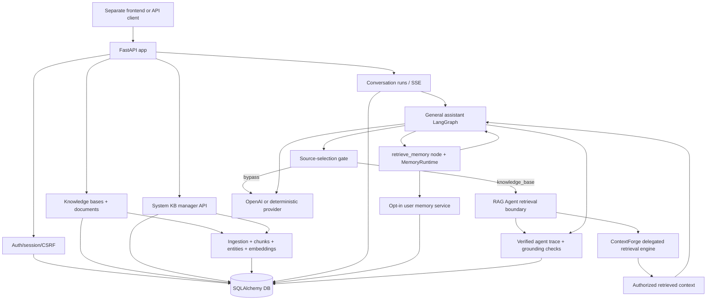

# my-agents

English | [한국어](./README.md)

`my-agents` is the backend for an AI chat product that answers with personal, group, and privileged system knowledge. The frontend lives in a separate repository; this repo focuses on product API boundaries for auth, permissions, knowledge bases, conversation runs, citations, and memory settings.

Start with [`docs/implementation-tracking.md`](./docs/implementation-tracking.md) for current status. Use [`ROADMAP.md`](./ROADMAP.md) for larger direction and backlog.

## What the product provides

- Email/password accounts, invitation-link signup, sessions, and gated guest access
- Personal knowledge bases, invite-based group knowledge bases, and root/system-managed project knowledge
- Document upload, ingestion, retrieval, and cited answers (PDF, Markdown, plain text, `.xlsx`, `.pptx`, `.docx`; legacy `.doc` is not supported yet)
- Server-owned conversation/run history and streaming responses
- OpenAI-backed responses can expose hosted web search for current or source-backed requests
- Permission flows for group members and publish requests
- User-controlled experimental long-term memory

## Product boundaries

- Personal knowledge and conversation history are user-owned by default.
- Group knowledge is available only to accepted invited members.
- System knowledge is public to authenticated chat retrieval, including guests; only
  `root`/`system` user types can manage it.
- `user_type` changes are operator-script-only via `scripts.set_user_type`; there is no
  public API route for role mutation. Auth responses omit `user_type` and
  `can_manage_system_knowledge` for normal users and guests, and only include them
  for root/system managers.
- Nickname is display metadata; email remains the login and invitation identifier. Invitees without an account use the token-proved email and choose only a nickname/password.
- Standard personal, group, and system knowledge bases are lifecycle-managed through the knowledge-base API by their authorized owners/managers. Hidden `team_upload_staging` KBs stay internal and cannot be renamed or deleted through the normal management flow.
- Document source lists stay lightweight. Use `GET /knowledge-bases/{knowledge_base_id}/documents/{document_id}/preview` when a UI needs the full Markdown/internal representation for a selected document.
- Publish request requesters can cancel pending requests as `cancelled` and request again. Deleting a publish request's source document or source knowledge base before approval moves the request to `withdrawn`. After approval, source deletion keeps the group-owned copy, and manager deletion of the approved group copy preserves request history while clearing `published_document_id` or `published_knowledge_base_id`.
- Whole-knowledge-base approval creates a group-owned KB copy for retrieval instead of authorizing the requester-owned source KB. Backfill old approved KB publication rows with `uv run python -m scripts.backfill_kb_publication_copies --dry-run` and then `--apply` after reviewing the summary.
- Long-term memory is disabled by default and can be enabled from experimental settings.
- Never commit real secrets. `.env` is local-only; `.env.example` contains safe placeholders.

## Architecture at a glance



This README intentionally stays high level. Detailed API contracts, migration notes, and operational procedures live under `docs/` and [`scripts/README.md`](./scripts/README.md).

## Run locally

Install dependencies and create local settings:

```bash
uv sync
cp .env.example .env
```

Use deterministic mode for credential-free tests and local smoke checks.

```bash
MY_AGENTS_RESPONSE_MODE=deterministic
```

Start the API:

```bash
uv run fastapi dev main.py
```

Fallback:

```bash
uv run uvicorn main:app --reload
```

OpenAPI is available from the running server at:

```text
http://127.0.0.1:8000/openapi.json
```

Optional internal timing metrics are available through Prometheus text exposition when
explicitly enabled:

```bash
MY_AGENTS_METRICS_ENABLED=true uv run fastapi dev main.py
curl http://127.0.0.1:8000/metrics
```

The metrics endpoint is a maintenance/quality-analysis surface, not a product API. It
records request, conversation-run, RAG Agent/ContextForge retrieval, embedding, reranker, and
assistant-graph timing histograms without using raw prompts, document text, user IDs, or
document IDs as labels. For local single-run RAG profiling, enable the Rich timing panel:

```bash
MY_AGENTS_DEBUG_RETRIEVAL_TIMING_LOGGING=true uv run fastapi dev main.py
```

That local-only debug output prints one human-readable ContextForge timing table per
retrieval attempt, including authorization count, planning, candidate gather, fusion,
reranking, context packing, total time, and redacted candidate counts. The
`candidate_gather.*` rows break the slow first-stage retrieval path down into existing
retrieval/embedding spans such as metadata matching, embedding calls, vector SQL, JSON
fallback scans, related expansion, and overview supplement work.

## Common checks

```bash
uv run pytest -q
uv run ruff check . --no-cache
uv run ruff format --check .
git diff --check
```

## Further reading

- Current implementation status: [`docs/implementation-tracking.md`](./docs/implementation-tracking.md)
- Product roadmap: [`ROADMAP.md`](./ROADMAP.md)
- Product docs: [`docs/product-chat-service/en/README.md`](./docs/product-chat-service/en/README.md)
- Knowledge lifecycle and publish-copy contract: [`docs/product-chat-service/en/24-knowledge-lifecycle-and-publish-copy-contract.md`](./docs/product-chat-service/en/24-knowledge-lifecycle-and-publish-copy-contract.md)
- Frontend demo runbook: [`docs/product-chat-service/en/10-frontend-demo-runbook.md`](./docs/product-chat-service/en/10-frontend-demo-runbook.md)
- Script commands: [`scripts/README.md`](./scripts/README.md)
- Ideas: [`docs/idea/`](./docs/idea/)
