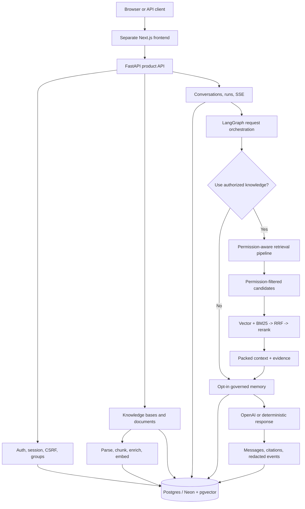

# my-agents

English | [한국어](./README.md)

**Permission-aware Agentic RAG Backend** — the backend for an AI chat product that retrieves personal documents, group-shared documents, and administrator-provided reference knowledge inside explicit authorization boundaries, then preserves citations and execution evidence.

[Live product demo](https://www.my-agents.dev) · [Frontend repository](https://github.com/heecheon92/my-agents-frontend) · [Implementation status](./docs/implementation-tracking.md) · [Roadmap](./ROADMAP.md)

> The live service is a controlled alpha for recruiters and a small group of testers. Signup and guest access may be restricted by operating policy; this is not a claim of production-ready SaaS.

## Three-minute overview

`my-agents` is more than a small RAG example. It connects the product flow required by a real application: **authentication → authorization → document ingestion → hybrid retrieval → LangGraph execution → SSE streaming → citation/audit persistence**.

| Question | This project's answer |
| --- | --- |
| What did I build? | A FastAPI + LangGraph backend that answers from personal documents, group-shared documents, and administrator-provided reference knowledge with citations |
| What made it difficult? | Permission boundaries that precede ranking, server-owned conversation state, ingestion, streaming, and operable observability |
| What did I verify? | An offline test suite, permission regressions, production smoke paths, and before/after ingestion and retrieval profiles |
| What is its current maturity? | A controlled alpha that demonstrates the core product loop; operational hardening and security review continue |

## Engineering highlights

- **Permission-first retrieval**: unauthorized chunks are excluded before ranking, graph expansion, and prompt construction.
- **Hybrid retrieval**: pgvector vector search and BM25 lexical search gather candidates independently, fuse them by stable chunk identifiers with RRF (`k=60`), then rerank and pack the context.
- **Inspectable orchestration**: a LangGraph state machine connects the decision to use authorized knowledge, retrieval, opt-in memory, and response composition as explicit stages.
- **Application-owned state**: the application database owns conversations, runs, messages, citations, and redacted events. Temporary LangGraph execution state is not treated as the source of truth for user-visible transcripts.
- **Streaming product contract**: SSE carries progress events, agent traces, answer deltas, and terminal status while the server persists the same run.
- **Offline-first verification**: deterministic test doubles can replace the LLM, embedding, and reranker boundaries, so the full test suite runs without API keys.

## Measured performance improvements

These are same-scenario **local profiles**, not public SLA claims. Each experiment started after profiling an unexpectedly slow path, and the search-result shape and document-processing quality checks remained the same before and after optimization.

| Area | Primary method | Before | After | Result |
| --- | --- | ---: | ---: | ---: |
| 195-page PDF ingestion, end to end | Run OpenAI metadata generation concurrently with embedding/indexing and skip an unnecessary parsing pass for native-text PDFs | 36.16s | 16.57s | about 54% faster |
| Hybrid retrieval candidate gathering | Defer large columns that ranking does not need and fetch full records only for the final top-k candidates | 31.42s | 1.84s | 94.1% faster |
| BM25 corpus/rank/hydration | Build the corpus from IDs and text instead of full ORM rows, then fetch only the BM25 top-k rows | 14.34s | 0.14s | 99.0% faster |

Ingestion now overlaps time spent waiting for an external API with local indexing work and avoids duplicate parsing when a PDF already exposes native text. Retrieval first reads only the data required for ranking, fetches full records after the top candidates are known, and removes duplicated SQL and embedding work. The [performance logs](./docs/performance/README.md) record the exact scenarios and remaining bottlenecks.

## Architecture



### Boundaries enforced during a request

1. The API layer validates session, CSRF, and group/knowledge-base access.
2. LangGraph orchestration decides whether the question requires authorized knowledge retrieval.
3. The retrieval service limits database queries to personal, group, and administrator-provided sources that the current user may access.
4. Vector, lexical, metadata, and structured-entity candidates pass through fusion, reranking, and context packing.
5. The answer, citations, compact agent trace, and redacted timing/events are persisted under the same run.

The production runtime consists of one assistant orchestration flow with a retrieval subworkflow. The words `agent` and `graph` describe control boundaries in the code; they do not imply that several autonomous specialists run as independent services.

## Product capabilities

- Email/password signup, verification, sessions, CSRF, password reset, and gated guest access
- Invite-based group membership, manager roster, and personal-to-group publish approval/copy workflows
- Personal, group, and administrator-provided reference knowledge bases with document-level authorization
- PDF, Markdown, plain text, `.xlsx`, `.pptx`, and `.docx` upload and ingestion
- A PyMuPDF fast path with pypdf, Docling, and Tesseract fallbacks
- pgvector + BM25 + RRF + deterministic or optional cross-encoder reranking
- Server-owned conversation/run history, SSE streaming, citations, and redacted agent events
- User-enabled experimental long-term memory with a governance lifecycle
- Prometheus timing metrics and local Rich retrieval/ingestion profilers

## Technology stack

| Area | Technology |
| --- | --- |
| API / application | Python 3.14, FastAPI, Pydantic |
| Agent / model | LangGraph, `langchain-openai`, `ChatOpenAI` |
| Persistence | SQLAlchemy, Alembic, PostgreSQL/Neon, pgvector |
| Retrieval | Vector search, BM25Okapi, RRF, optional BAAI cross-encoder |
| Document processing | PyMuPDF, pypdf, Docling, Tesseract, openpyxl, python-pptx |
| Streaming / observability | SSE, Prometheus metrics, redacted run events |
| Quality / delivery | pytest, Ruff, uv, Docker, Render |

## Repository map

The top-level packages are described by responsibility first so a new visitor can understand the boundaries before learning internal implementation names. Those names appear only in the code-navigation table below.

```text
my_agents/
├── api/                       # FastAPI routes and thin HTTP boundaries
├── agents/                    # LangGraph orchestration and retrieval workflows
├── auth/ and permissions/     # Session, CSRF, group/document authorization
├── knowledge/                 # Upload, parsing, ingestion, retrieval
├── conversations/             # Server-owned transcript/run models
├── memory/                    # Opt-in memory policy and database persistence
└── persistence/               # SQLAlchemy database boundary

tests/                         # Offline behavior and regression contracts
alembic/                       # PostgreSQL schema migrations
docs/                          # Architecture, operations, performance evidence
scripts/                       # Smoke, benchmark, migration, operator utilities
```

| Behavior to inspect | Code location |
| --- | --- |
| Decide whether a question needs knowledge retrieval and compose the response | `my_agents/agents/general_assistant/` |
| Define the input/output contract between the assistant and permission-aware retrieval | `my_agents/agents/rag_agent/` |
| Plan queries, fuse hybrid candidates, rerank, and pack context | `my_agents/agents/context_forge/` |

## Run locally

Prerequisites are [uv](https://docs.astral.sh/uv/) and Python 3.14.

```bash
uv sync
cp .env.example .env
MY_AGENTS_RESPONSE_MODE=deterministic uv run fastapi dev main.py
```

Run a credential-free smoke check in another terminal:

```bash
curl http://127.0.0.1:8000/health
curl -X POST http://127.0.0.1:8000/assistant/chat \
  -H 'Content-Type: application/json' \
  -d '{"message":"Plan my next backend milestone","history":[]}'
```

For real OpenAI responses, set `OPENAI_API_KEY` in `.env` and use `MY_AGENTS_RESPONSE_MODE=openai`. Application code uses the `langchain-openai` / `ChatOpenAI` boundary rather than direct provider calls.

OpenAPI is available from a running server at `http://127.0.0.1:8000/openapi.json`. See the [frontend demo runbook](./docs/product-chat-service/en/10-frontend-demo-runbook.md) for the full product flow and PostgreSQL setup.

## Verification

```bash
uv run pytest -q
uv run ruff check . --no-cache
uv run ruff format --check .
git diff --check
```

On 2026-08-05, the full suite on this checkout reports **464 passed, 2 skipped** without requiring real credentials.

## Security and privacy boundaries

- Real secrets and local databases are not committed. `.env.example` contains placeholders only.
- Public-release checks cover both the current tree and the full Git history; any exposed credential must be revoked and rotated even if its file was later deleted.
- Retrieval permissions are enforced in application/service code, not through prompt instructions.
- Metric labels and default agent events exclude raw prompts, document text, emails, and user/document IDs.
- System-knowledge management is limited to privileged administrative account types, with no public role-mutation API.
- The public demo assumes users will not upload sensitive, regulated, or irreplaceable documents.

## Current limitations and next steps

- This is a controlled alpha, not a broadly self-service production SaaS.
- The external ingestion worker uses database polling; durable queueing, supervision, and stale-job recovery need further work.
- Object storage for uploaded originals, document versioning/re-ingestion, and account deletion/export are not implemented yet.
- Cross-encoder cold starts and PDF processing latency remain constraints on small hosted instances.
- Shared rate limiting, production security review, and automated migration/smoke gates remain necessary.
- LangGraph Store-backed memory, HITL/resume checkpointers, non-RAG tools, and production multi-agent orchestration remain roadmap work.

## Selected documentation

- [Current implementation and verification status](./docs/implementation-tracking.md)
- [Permission-aware RAG design](./docs/product-chat-service/en/06-permission-aware-rag.md)
- [Assistant orchestration flow](./my_agents/agents/general_assistant/README.en.md)
- [Retrieval subworkflow and context assembly](./my_agents/agents/rag_agent/README.en.md)
- [Performance evidence](./docs/performance/README.md)
- [Production smoke evidence](./docs/product-chat-service/en/16-production-smoke-evidence-2026-06-06.md)

See [ROADMAP.md](./ROADMAP.md) for the larger direction and unfinished work, and [scripts/README.md](./scripts/README.md) for operational and migration commands.
