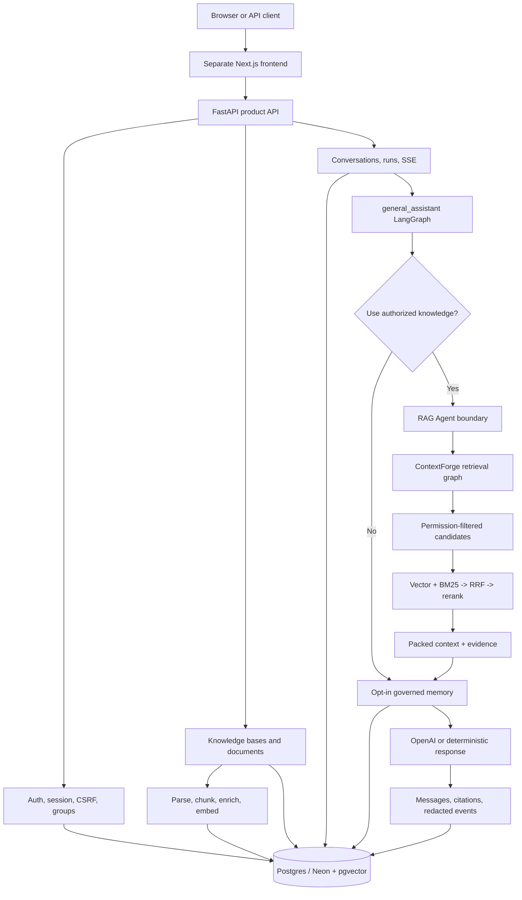

# my-agents

English | [한국어](./README.md)

**Permission-aware Agentic RAG Backend** — the backend for an AI chat product that retrieves personal, group, and system knowledge inside explicit authorization boundaries, then preserves citations and execution evidence.

[Live product demo](https://www.my-agents.dev) · [Frontend repository](https://github.com/heecheon92/my-agents-frontend) · [Implementation status](./docs/implementation-tracking.md) · [Roadmap](./ROADMAP.md)

> The live service is a controlled alpha for recruiters and a small group of testers. Signup and guest access may be restricted by operating policy; this is not a claim of production-ready SaaS.

## Three-minute overview

`my-agents` is more than a small RAG example. It connects the product flow required by a real application: **authentication → authorization → document ingestion → hybrid retrieval → LangGraph execution → SSE streaming → citation/audit persistence**.

| Question | This project's answer |
| --- | --- |
| What did I build? | A FastAPI + LangGraph backend that answers from personal, group, and system knowledge with citations |
| What made it difficult? | Permission boundaries that precede ranking, server-owned conversation state, ingestion, streaming, and operable observability |
| What did I verify? | An offline test suite, permission regressions, production smoke paths, and before/after ingestion and retrieval profiles |
| What is its current maturity? | A controlled alpha that demonstrates the core product loop; operational hardening and security review continue |

## Engineering highlights

- **Permission-first retrieval**: unauthorized chunks are excluded before ranking, graph expansion, and prompt construction.
- **Hybrid retrieval**: pgvector and request-local `BM25Okapi` candidates are gathered independently, fused by stable `chunk_id` with RRF (`k=60`), then reranked and packed.
- **Inspectable agent flow**: the `general_assistant` LangGraph connects a source-selection gate, RAG Agent, opt-in memory, and response nodes through explicit state.
- **Product-owned state**: the Product DB owns conversations, runs, messages, citations, and redacted events. LangGraph state is not treated as the source of truth for user-visible transcripts.
- **Streaming product contract**: SSE carries progress events, agent traces, answer deltas, and terminal status while the server persists the same run.
- **Offline-first verification**: deterministic provider, embedding, and reranker boundaries keep tests independent of API keys.

## Measured performance improvements

These are same-scenario **local profiles**, not public SLA claims. Retrieval shape or parser/chunk/entity quality guards stayed stable across each comparison.

| Area | Primary method | Before | After | Result |
| --- | --- | ---: | ---: | ---: |
| 195-page PDF ingestion, end to end | Overlap OpenAI metadata generation with embedding/indexing and skip `pypdf` pre-classification for native-text PDFs | 36.16s | 16.57s | about 54% faster |
| Hybrid retrieval candidate gathering | Defer unused embedding/full-document columns and use lightweight BM25 projection plus top-k hydration | 31.42s | 1.84s | 94.1% faster |
| BM25 corpus/rank/hydration | Replace full ORM rows with a `chunk_id`/text corpus and hydrate only BM25 top-k rows | 14.34s | 0.14s | 99.0% faster |

Ingestion improved by overlapping OpenAI metadata generation with indexing and lazily classifying native-text PDFs. Retrieval replaced a full-model corpus query with lightweight projection plus top-k hydration and removed duplicated SQL and embedding work. The [performance logs](./docs/performance/README.md) record the exact scenarios and remaining bottlenecks.

## Architecture



### Boundaries enforced during a request

1. The API layer validates session, CSRF, and group/knowledge-base access.
2. The assistant graph's source-selection gate decides whether private retrieval is necessary.
3. The RAG Agent calls ContextForge, while service-layer authorization limits the candidate sources.
4. Vector, lexical, metadata, and structured-entity candidates pass through fusion, reranking, and context packing.
5. The answer, citations, compact agent trace, and redacted timing/events are persisted under the same run.

Agent labels describe real implementation boundaries. The current production surface is one general assistant controller with an assistant-callable RAG Agent retrieval boundary; this repository does not pretend that multiple independent specialized agents ran.

## Product capabilities

- Email/password signup, verification, sessions, CSRF, password reset, and gated guest access
- Invite-based group membership, manager roster, and personal-to-group publish approval/copy workflows
- Personal, group, and root/system-managed knowledge bases with document-level authorization
- PDF, Markdown, plain text, `.xlsx`, `.pptx`, and `.docx` upload and ingestion
- A PyMuPDF fast path with pypdf, Docling, and Tesseract fallbacks
- pgvector + BM25 + RRF + deterministic or optional cross-encoder reranking
- Server-owned conversation/run history, SSE streaming, citations, and redacted agent events
- User-enabled experimental long-term memory with a governance lifecycle
- Prometheus timing metrics and local Rich retrieval/ingestion profilers

## Technology stack

| Area | Technology |
| --- | --- |
| API / application | Python 3.14, FastAPI, Pydantic |
| Agent / model | LangGraph, `langchain-openai`, `ChatOpenAI` |
| Persistence | SQLAlchemy, Alembic, PostgreSQL/Neon, pgvector |
| Retrieval | Vector search, BM25Okapi, RRF, optional BAAI cross-encoder |
| Document processing | PyMuPDF, pypdf, Docling, Tesseract, openpyxl, python-pptx |
| Streaming / observability | SSE, Prometheus metrics, redacted run events |
| Quality / delivery | pytest, Ruff, uv, Docker, Render |

## Repository map

```text
my_agents/
├── api/                       # FastAPI routes and thin HTTP boundaries
├── agents/
│   ├── general_assistant/     # Product assistant/controller LangGraph
│   ├── rag_agent/             # Assistant-callable retrieval contract
│   └── context_forge/         # Planning, fusion, reranking, context packing
├── auth/ and permissions/     # Session, CSRF, group/document authorization
├── knowledge/                 # Upload, parsing, ingestion, retrieval
├── conversations/             # Server-owned transcript/run models
├── memory/                    # Opt-in memory policy and Product DB scaffold
└── persistence/               # SQLAlchemy database boundary

tests/                         # Offline behavior and regression contracts
alembic/                       # PostgreSQL schema migrations
docs/                          # Architecture, operations, performance evidence
scripts/                       # Smoke, benchmark, migration, operator utilities
```

## Run locally

Prerequisites are [uv](https://docs.astral.sh/uv/) and Python 3.14.

```bash
uv sync
cp .env.example .env
MY_AGENTS_RESPONSE_MODE=deterministic uv run fastapi dev main.py
```

Run a credential-free smoke check in another terminal:

```bash
curl http://127.0.0.1:8000/health
curl -X POST http://127.0.0.1:8000/assistant/chat \
  -H 'Content-Type: application/json' \
  -d '{"message":"Plan my next backend milestone","history":[]}'
```

For real OpenAI responses, set `OPENAI_API_KEY` in `.env` and use `MY_AGENTS_RESPONSE_MODE=openai`. Application code uses the `langchain-openai` / `ChatOpenAI` boundary rather than direct provider calls.

OpenAPI is available from a running server at `http://127.0.0.1:8000/openapi.json`. See the [frontend demo runbook](./docs/product-chat-service/en/10-frontend-demo-runbook.md) for the full product flow and PostgreSQL setup.

## Verification

```bash
uv run pytest -q
uv run ruff check . --no-cache
uv run ruff format --check .
git diff --check
```

On 2026-08-05, the full suite on this checkout reports **464 passed, 2 skipped** without requiring real credentials.

## Security and privacy boundaries

- Real secrets and local databases are not committed. `.env.example` contains placeholders only.
- Before changing repository visibility, scan the full Git history rather than only the current tree; revoke and rotate any exposed credential even if its file was later deleted.
- Retrieval permissions are enforced in application/service code, not through prompt instructions.
- Metric labels and default agent events exclude raw prompts, document text, emails, and user/document IDs.
- System-knowledge management is limited to `root`/`system` user types, with no public role-mutation API.
- The public demo assumes users will not upload sensitive, regulated, or irreplaceable documents.

## Current limitations and next steps

- This is a controlled alpha, not a broadly self-service production SaaS.
- The external ingestion worker uses database polling; durable queueing, supervision, and stale-job recovery need further work.
- Object storage for uploaded originals, document versioning/re-ingestion, and account deletion/export are not implemented yet.
- Cross-encoder cold starts and PDF processing latency remain constraints on small hosted instances.
- Shared rate limiting, production security review, and automated migration/smoke gates remain necessary.
- LangGraph Store-backed memory, HITL/resume checkpointers, non-RAG tools, and production multi-agent orchestration remain roadmap work.

## Selected documentation

- [Current implementation and verification status](./docs/implementation-tracking.md)
- [Permission-aware RAG design](./docs/product-chat-service/en/06-permission-aware-rag.md)
- [General assistant graph](./my_agents/agents/general_assistant/README.en.md)
- [RAG Agent and ContextForge boundary](./my_agents/agents/rag_agent/README.en.md)
- [Performance evidence](./docs/performance/README.md)
- [Production smoke evidence](./docs/product-chat-service/en/16-production-smoke-evidence-2026-06-06.md)

See [ROADMAP.md](./ROADMAP.md) for the larger direction and unfinished work, and [scripts/README.md](./scripts/README.md) for operational and migration commands.
