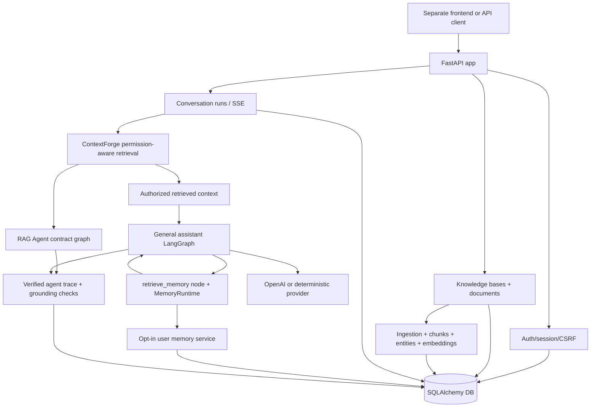

# my-agents

English | [한국어](./README.md)

`my-agents` is the backend for an AI chat product that answers with personal and group knowledge. The frontend lives in a separate repository; this repo focuses on product API boundaries for auth, permissions, knowledge bases, conversation runs, citations, and memory settings.

Start with [`docs/implementation-tracking.md`](./docs/implementation-tracking.md) for current status. Use [`ROADMAP.md`](./ROADMAP.md) for larger direction and backlog.

## What the product provides

- Email/password accounts, invitation-link signup, sessions, and gated guest access
- Personal knowledge bases and invite-based group knowledge bases
- Document upload, ingestion, retrieval, and cited answers
- Server-owned conversation/run history and streaming responses
- Permission flows for group members and publish requests
- User-controlled experimental long-term memory

## Product boundaries

- Personal knowledge and conversation history are user-owned by default.
- Group knowledge is available only to accepted invited members.
- Nickname is display metadata; email remains the login and invitation identifier. Invitees without an account use the token-proved email and choose only a nickname/password.
- Long-term memory is disabled by default and can be enabled from experimental settings.
- Never commit real secrets. `.env` is local-only; `.env.example` contains safe placeholders.

## Architecture at a glance



This README intentionally stays high level. Detailed API contracts, migration notes, and operational procedures live under `docs/` and [`scripts/README.md`](./scripts/README.md).

## Run locally

Install dependencies and create local settings:

```bash
uv sync
cp .env.example .env
```

Use deterministic mode for credential-free tests and local smoke checks.

```bash
MY_AGENTS_RESPONSE_MODE=deterministic
```

Start the API:

```bash
uv run fastapi dev main.py
```

Fallback:

```bash
uv run uvicorn main:app --reload
```

OpenAPI is available from the running server at:

```text
http://127.0.0.1:8000/openapi.json
```

## Common checks

```bash
uv run pytest -q
uv run ruff check . --no-cache
uv run ruff format --check .
git diff --check
```

## Further reading

- Current implementation status: [`docs/implementation-tracking.md`](./docs/implementation-tracking.md)
- Product roadmap: [`ROADMAP.md`](./ROADMAP.md)
- Product docs: [`docs/product-chat-service/en/README.md`](./docs/product-chat-service/en/README.md)
- Frontend demo runbook: [`docs/product-chat-service/en/10-frontend-demo-runbook.md`](./docs/product-chat-service/en/10-frontend-demo-runbook.md)
- Script commands: [`scripts/README.md`](./scripts/README.md)
- Ideas: [`docs/idea/`](./docs/idea/)
