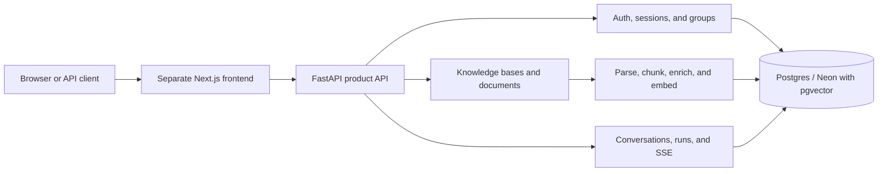
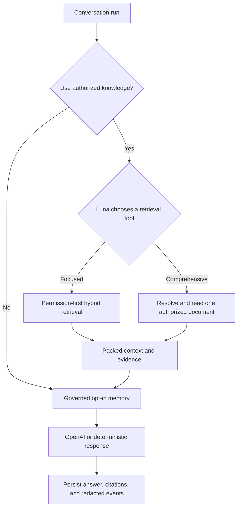

# my-agents

English | [한국어](./README.md)

**Permission-aware Agentic RAG Backend** — the backend for an AI chat product that retrieves personal documents, group-shared documents, and administrator-provided reference knowledge inside explicit authorization boundaries, then preserves user-visible citations and internal execution evidence.

[Live service](https://www.my-agents.dev) · [Frontend repository](https://github.com/heecheon92/my-agents-frontend) · [Implementation status](./docs/implementation-tracking.md) · [Roadmap](./ROADMAP.md)

> The service is deployed and running, but signup is not instant: new accounts are approved manually. Guest access is available without waiting for approval.

## Three-minute overview

`my-agents` is more than a small RAG example. It connects the product flow required by a real application: **authentication → authorization → document ingestion → hybrid retrieval → LangGraph execution → SSE streaming → citation/audit persistence**.

| Question | This project's answer |
| --- | --- |
| What did I build? | A FastAPI + LangGraph backend that answers from personal documents, group-shared documents, and ambient administrator-provided reference knowledge, with citations for user-visible sources |
| What made it difficult? | Permission boundaries that precede ranking, server-owned conversation state, ingestion, streaming, and operable observability |
| What did I verify? | An offline test suite, permission regressions, production smoke paths, and before/after ingestion and retrieval profiles |
| Where is it now? | The core product loop is deployed and running; operational hardening and security review continue |

## Engineering highlights

- **Permission-first retrieval**: unauthorized chunks are excluded before ranking, graph expansion, and prompt construction.
- **Hybrid retrieval**: pgvector vector search and BM25 lexical search gather candidates independently, fuse them by stable chunk identifiers with RRF (`k=60`), then rerank and pack the context.
- **Bounded full-document coverage**: a typed graph path handles only explicit whole-document tasks, resolves one authorized document, and distinguishes complete coverage from an honest first-range partial review.
- **Inspectable orchestration**: a LangGraph state machine connects the decision to use authorized knowledge, retrieval, opt-in memory, and response composition as explicit stages.
- **Application-owned state**: the application database owns conversations, runs, messages, citations, and redacted events. Temporary LangGraph execution state is not treated as the source of truth for user-visible transcripts.
- **Streaming product contract**: SSE carries progress events, agent traces, answer deltas, and terminal status while the server persists the same run.
- **Offline-first verification**: deterministic test doubles can replace the LLM, embedding, and reranker boundaries, so the full test suite runs without API keys.

## Measured performance improvements

These are same-scenario **local profiles**, not public SLA claims. Each experiment started after profiling an unexpectedly slow path, and the search-result shape and document-processing quality checks remained the same before and after optimization.

| Area | Primary method | Before | After | Result |
| --- | --- | ---: | ---: | ---: |
| 195-page PDF ingestion, end to end | Run OpenAI metadata generation concurrently with embedding/indexing and skip an unnecessary parsing pass for native-text PDFs | 36.16s | 16.57s | about 54% faster |
| Hybrid retrieval candidate gathering | Defer large columns that ranking does not need and fetch full records only for the final top-k candidates | 31.42s | 1.84s | 94.1% faster |
| BM25 corpus/rank/hydration | Build the corpus from IDs and text instead of full ORM rows, then fetch only the BM25 top-k rows | 14.34s | 0.14s | 99.0% faster |

Ingestion now overlaps time spent waiting for an external API with local indexing work and avoids duplicate parsing when a PDF already exposes native text. Retrieval first reads only the data required for ranking, fetches full records after the top candidates are known, and removes duplicated SQL and embedding work. The [performance logs](./docs/performance/README.md) record the exact scenarios and remaining bottlenecks.

## Architecture



Chat request orchestration is easier to read as a separate flow.



### Boundaries enforced during a request

1. The API layer validates session, CSRF, and group/knowledge-base access.
2. LangGraph orchestration decides whether the question requires authorized knowledge retrieval. After private-knowledge delegation, a fixed `gpt-5.6-luna` standard/low RAG planner chooses one typed tool: focused chunk search or comprehensive document read.
3. Focused questions use permission-first chunk retrieval. Explicit or clearly implied comprehensive tasks instead resolve exactly one user-controllable personal/group document; system knowledge is never a selectable full-document target. Luna chooses the tool while backend code enforces document identity, permissions, and limits.
4. The full-document path returns normalized extracted text completely only at or below its configured character threshold; larger files expose one bounded range and a mandatory partial-review disclosure.
5. The answer, citations, compact coverage metadata, agent trace, and redacted timing/events are persisted under the same run. Raw full-document text is not persisted in graph checkpoints or events.

Administrator-provided system knowledge is ambient model context, not a user-visible source.
Its provenance remains in internal audit records, while public run, event, and citation
responses omit its KB/document/chunk identifiers, filenames, snippets, and citations.

The production runtime consists of one assistant orchestration flow with a retrieval subworkflow. The words `agent` and `graph` describe control boundaries in the code; they do not imply that several autonomous specialists run as independent services.

## Product capabilities

- Email/password signup, verification, sessions, CSRF, password reset, and gated guest access
- Public `GET /auth/guest/policy` data for the deployed guest TTLs, usage limits, and code-delivery mode
- Invite-based group membership, manager roster, and personal-to-group publish approval/copy workflows
- Personal, group, and administrator-provided reference knowledge bases with document-level authorization
- PDF, Markdown, plain text, `.xlsx`, `.pptx`, and `.docx` upload and ingestion
- A PyMuPDF fast path with pypdf, Docling, and Tesseract fallbacks
- pgvector + BM25 + RRF + deterministic or optional cross-encoder reranking
- Explicit full-document review with complete/partial coverage disclosure and range-backed citations
- Server-owned conversation/run history, SSE streaming, conservative answer-supported `citations`, separately disclosed `consulted_sources`, human-readable document/knowledge-base citation metadata, and redacted agent events
- A stable `my-agents` assistant identity anchored to the canonical
  `https://my-agents.dev` domain, with changing product facts grounded in authorized context
- User-enabled experimental long-term memory with a governance lifecycle
- Prometheus timing metrics and local Rich retrieval/ingestion profilers

## Technology stack

| Area | Technology |
| --- | --- |
| API / application | Python 3.14, FastAPI, Pydantic |
| Agent / model | LangGraph, `langchain-openai`, `ChatOpenAI` |
| Persistence | SQLAlchemy, Alembic, PostgreSQL/Neon, pgvector |
| Retrieval | Vector search, BM25Okapi, RRF, optional BAAI cross-encoder |
| Document processing | PyMuPDF, pypdf, Docling, Tesseract, openpyxl, python-pptx |
| Streaming / observability | SSE, Prometheus metrics, redacted run events |
| Quality / delivery | pytest, Ruff, uv, Docker, Render |

## Repository map

The top-level packages are described by responsibility first so a new visitor can understand the boundaries before learning internal implementation names. Those names appear only in the code-navigation table below.

```text
my_agents/
├── api/                       # FastAPI routes and thin HTTP boundaries
├── agents/                    # LangGraph orchestration and retrieval workflows
├── auth/ and permissions/     # Session, CSRF, group/document authorization
├── knowledge/                 # Upload, parsing, ingestion, retrieval
├── conversations/             # Server-owned transcript/run models
├── memory/                    # Opt-in memory policy and database persistence
└── persistence/               # SQLAlchemy database boundary

tests/                         # Offline behavior and regression contracts
alembic/                       # PostgreSQL schema migrations
docs/                          # Architecture, operations, performance evidence
scripts/                       # Smoke, benchmark, migration, operator utilities
```

| Behavior to inspect | Code location |
| --- | --- |
| Decide whether a question needs knowledge retrieval and compose the response | `my_agents/agents/general_assistant/` |
| Define the input/output contract between the assistant and permission-aware retrieval | `my_agents/agents/rag_agent/` |
| Plan queries, fuse hybrid candidates, rerank, and pack context | `my_agents/agents/context_forge/` |

## Run locally

Prerequisites are [uv](https://docs.astral.sh/uv/) and Python 3.14.

```bash
uv sync
cp .env.example .env
MY_AGENTS_RESPONSE_MODE=deterministic uv run fastapi dev main.py
```

Run a credential-free smoke check in another terminal:

```bash
curl http://127.0.0.1:8000/health
curl -X POST http://127.0.0.1:8000/assistant/chat \
  -H 'Content-Type: application/json' \
  -d '{"message":"Plan my next backend milestone","history":[]}'
```

For real OpenAI responses, set `OPENAI_API_KEY` in `.env` and use `MY_AGENTS_RESPONSE_MODE=openai`. Ordinary responses use the `langchain-openai` / `ChatOpenAI` boundary. The optional temporary document workspace is the isolated exception: it uses a narrow OpenAI SDK adapter for Files, Containers, Hosted Shell, and Skills.

Registered-account run requests may optionally provide `reasoning_mode` (`standard` or `pro`) and `reasoning_effort` (`none`, `minimal`, `low`, `medium`, `high`, `xhigh`, or `max`). When omitted, mode is `standard` and effort comes from `MY_AGENTS_OPENAI_REASONING_EFFORT`. Even if a guest submits different values, the server fixes the run to `standard` and the environment default effort. `GET /capabilities/reasoning` reports the effective default and configured-model support. `pro` is accepted only for GPT-5.6 models. See the [run reasoning preference contract](./docs/product-chat-service/en/26-run-reasoning-preferences.md).

With `MY_AGENTS_DOCUMENT_WORKSPACE_ENABLED=true`, approved registered accounts can attach temporary files to a conversation, analyze them with GPT-5.6 Sol, and download certified spreadsheet, document, Markdown, and HTML outputs (`.xlsx`, `.csv`, `.tsv`, `.docx`, `.pptx`, `.pdf`, `.md`, `.markdown`, `.html`, `.htm`). Guests are ineligible and every upload requires explicit consent to transfer the file to OpenAI. File bytes are never stored in the Product DB; they remain only in expiring OpenAI `user_data` files and a network-disabled hosted container. See the [OpenAI document workspace design](./docs/product-chat-service/en/25-openai-document-workspace.md) for the full contract.

PostgreSQL deployments provision PostgresStore and PostgresSaver automatically as baseline LangGraph infrastructure. Store is a semantic projection of Product DB-governed memories; the per-user experimental setting controls consent and eligibility while Product DB rows continue to enforce status, sensitivity, provenance, and source staleness. PostgresSaver lets ambiguous document-grounded runs return `202 waiting_for_input`, survive a process restart, and resume after an authorized document selection. SQLite keeps Product DB recall and non-durable graph execution fallbacks. Run `uv run python -m scripts.langgraph_persistence setup` before serving PostgreSQL traffic and verify zero-drift memory reconciliation before enabling experimental memory for users.

Experimental memory currently recalls explicit memories and manually confirmed suggestions. Ordinary chat does not form memories automatically; the separate post-turn `memory_graph` extraction/update workflow remains planned.

Full-document retrieval activates for explicit or clearly implied comprehensive requests such as “review the entire document” and “review this document without missing anything.” In OpenAI mode the RAG Agent's Luna planner chooses the typed retrieval tool; deterministic mode and provider failures use the same contract's local fallback. `MY_AGENTS_FULL_DOCUMENT_MAX_CHARS=24000` controls complete one-call coverage; larger documents currently provide only the first `MY_AGENTS_FULL_DOCUMENT_RANGE_CHARS=12000` characters and return `mode=partial`. Exact filenames resolve automatically. Ambiguous references return at most five ranked authorized candidates, accept up to two bounded filename refinements on the same run, and expose broad browsing only after those attempts are exhausted.

The VS Code `FastAPI: uvicorn main:app (local pgvector)` profile runs its pre-launch migration with the interpreter selected by the Python extension. It does not depend on a shell command finding `uv` in a GUI-launched VS Code process, so select this repository's `.venv` interpreter before using the profile.

OpenAPI is available from a running server at `http://127.0.0.1:8000/openapi.json`. See the [frontend demo runbook](./docs/product-chat-service/en/10-frontend-demo-runbook.md) for the full product flow and PostgreSQL setup.

### Frontend API contracts

- HTTP and validation errors return a stable machine-readable `code` alongside the existing `detail`. UIs should localize from `code` and treat `detail` as diagnostic copy.
- `GET /conversations/{conversation_id}/runs/{run_id}/events` is a closed OpenAPI union discriminated by `event_type`. Persisted event types include `run_interrupted`, `run_resumed`, and redacted `full_document_read` metadata in addition to the existing run, retrieval, graph, workspace, answer, cancellation, and failure events.
- With checkpointer support enabled, run creation returns either `200 completed` or `202 waiting_for_input`. A waiting document-selection interaction is refresh-safe through the run detail/options endpoints and resumes through `/runs/{run_id}/resume` or `/resume/stream` without consuming another guest prompt. Resume SSE emits `run_resumed`, then real progress and answer deltas, including another `run_interrupted` after an unresolved refinement. Options include only user-controllable personal/group documents; ambient system knowledge is never selectable. New interactions use semantic `schema_version=2`; already-waiting V1 checkpoints remain resumable. See the [agent-to-frontend interaction contract](./docs/product-chat-service/en/27-agent-frontend-interaction-contract.md).
- Completed comprehensive-document runs add nullable `document_coverage` to sync, streamed, replay, and refreshed run responses. It reports `mode`, document metadata, `[start_offset, end_offset)`, and `total_chars`; it never exposes raw text or the internal continuation cursor. A partial answer also starts with a localized disclosure that it is not a complete-document review.
- `GET /capabilities/document-workspace` reports effective enablement, eligibility, accepted formats, limits, and retention. Attachments use `POST/GET/DELETE /conversations/{conversation_id}/attachments`; artifacts use `GET /conversations/{conversation_id}/artifacts` and their download URLs. A run's `attachment_ids` selects the files used for that execution.
- `GET /capabilities/reasoning` reports per-surface Pro support, the server-default effort, stable enums, and whether the current account may customize them. It intentionally omits raw provider model identifiers. Optional run/replay `reasoning_mode` and `reasoning_effort` values are persisted as effective run metadata and returned in responses and the `run_started` event.
- Completed runs may also return bounded `reasoning_summaries` for retrieval planning and answer synthesis. These model-authored explanations are nullable, stream separately through `reasoning_summary_delta`, persist as dedicated events for refresh/replay, and never replace the verified `agent_trace`, citations, or answer text.
- Ordinary OpenAI-backed answers use `ChatOpenAI.stream()` so LangGraph emits real provider chunks as multiple `answer_delta` events. The provider aggregates the same chunks for final persistence and keeps reasoning-summary blocks out of reply text. Deterministic fallback and comprehensive-document disclosure paths may still buffer by design.
- Persisted event payloads and `agent_trace` expose only fields accepted by event- and stage-specific allowlist schemas. `answer_delta`, `run_completed`, and `run_error` are stream-only SSE events and are not members of the persisted-event union.
- Each non-skipped `agent_trace` step now carries an optional versioned `operational_summary`: a closed semantic message key plus event-specific safe parameters. This application-verified channel is separate from model-authored `reasoning_summaries`. Unknown future summary versions are ignored without dropping the verified step.
- Conversation stream OpenAPI publishes the SSE-only `reasoning_summary_delta` payload through `text/event-stream.x-sse-events` on normal, resume, and replay routes. Deltas are not individually capped at 500 characters; the authoritative completed summary item is bounded before persistence.
- Async ingestion commits observable progress as `queued=0`, `claimed=1`, `chunking=15`, `embedding=45`, optional `indexing=70`, `entities=85`, `metadata=95`, and `completed=100`. These mark stages reached, not elapsed time.

## Verification

```bash
uv run pytest -q
uv run ruff check . --no-cache
uv run ruff format --check .
git diff --check
```

On 2026-08-25, the full offline suite on this checkout reports **534 passed, 2 skipped** without requiring real credentials. The gated PostgreSQL checkpoint restart smoke was separately verified against the local pgvector profile on 2026-08-17.

## Security and privacy boundaries

- Real secrets and local databases are not committed. `.env.example` contains placeholders only.
- Public-release checks cover both the current tree and the full Git history; any exposed credential must be revoked and rotated even if its file was later deleted.
- Retrieval permissions are enforced in application/service code, not through prompt instructions.
- Metric labels and default agent events exclude raw prompts, document text, emails, credentials, and provider traces. The event response boundary allowlists nested `agent_trace.evidence` fields as well.
- Full-document response composition revalidates and re-reads the authorized range inside the response node with tracing disabled. Checkpoints retain only IDs, offsets, compact retrieval snapshots, and coverage metadata.
- System-knowledge management is limited to privileged administrative account types, with no public role-mutation API.
- The service is publicly reachable, so it assumes users will not upload sensitive, regulated, or irreplaceable documents.

## Current limitations and next steps

- Signup is manually approved, so this is not a self-service product yet.
- The external ingestion worker uses database polling; durable queueing, supervision, and stale-job recovery need further work.
- Object storage for uploaded originals, document versioning/re-ingestion, and account deletion/export are not implemented yet.
- Cross-encoder cold starts and PDF processing latency remain constraints on small hosted instances.
- Full-document retrieval is semantic comprehensive-intent-only. Large documents currently stop after the first bounded range; automatic multi-range traversal/final synthesis, model-tokenizer-aware budgets, and provider usage measurements remain future work.
- The full-document graph bumps waiting-run compatibility to `general-assistant-checkpoint-v2`. Drain or cancel older waiting runs before rollout; an older graph version cannot resume and is failed safely by the version-mismatch path.
- Shared rate limiting, production security review, and automated migration/smoke gates remain necessary.
- Non-RAG tools, a background execution scheduler, and production multi-agent orchestration remain roadmap work. LangGraph persistence is implemented but remains opt-in until its Postgres setup and reconciliation checks are run.

## Selected documentation

- [Current implementation and verification status](./docs/implementation-tracking.md)
- [Documentation map and lifecycle](./docs/README.md)
- [Permission-aware RAG design](./docs/product-chat-service/en/06-permission-aware-rag.md)
- [Assistant orchestration flow](./my_agents/agents/general_assistant/README.en.md)
- [Retrieval subworkflow and context assembly](./my_agents/agents/rag_agent/README.en.md)
- [Performance evidence](./docs/performance/README.md)
- [Production smoke evidence](./docs/product-chat-service/en/16-production-smoke-evidence-2026-06-06.md)

See [ROADMAP.md](./ROADMAP.md) for the larger direction and unfinished work, and [scripts/README.md](./scripts/README.md) for operational and migration commands.
