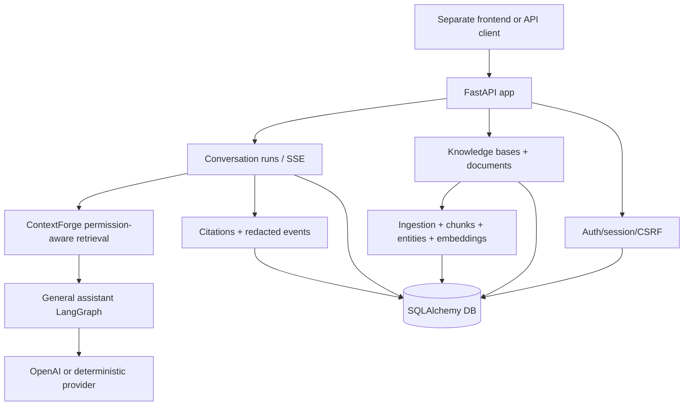

# my-agents

English | [한국어](./README.md)

`my-agents` is a backend-only FastAPI + LangGraph service for building a practical AI chat product surface. It keeps the frontend separate and focuses on API contracts, auth/session behavior, document knowledge workflows, conversation runs, retrieval, citations, and agent activity events.

For current project status, start with [`docs/implementation-tracking.md`](./docs/implementation-tracking.md). For the detailed backlog, use [`ROADMAP.md`](./ROADMAP.md).

## What is implemented

The current backend is a thin but working product slice:

- FastAPI app with health, auth, groups, documents, knowledge bases, conversations, runs, streaming, and event routes.
- LangGraph general assistant path with deterministic route classification and OpenAI-backed response generation by default.
- Deterministic offline/test mode for credential-free tests and smoke checks.
- First-party email/password auth, app-owned sessions, CSRF-aware logout, dev outbox, guest access, and signup disable switch.
- Group, document, knowledge-base, and permission foundations.
- KB-scoped document upload/creation, ingestion, extraction-run progress, chunks, entities, metadata profiles, embeddings, and pgvector-ready retrieval.
- ContextForge retrieval service for permission-aware RAG, structured entity retrieval, reranking seams, packed context, citations, and redacted retrieval evidence.
- Server-owned conversations, run history, SSE assistant text streaming, run replay/cancel paths, persisted citations, and frontend-safe activity events.

More detail lives in the docs instead of this README:

| Area | Detailed docs |
| --- | --- |
| Service/API split | [`docs/product-chat-service/en/01-service-foundation-scaffold.md`](./docs/product-chat-service/en/01-service-foundation-scaffold.md) |
| Auth and sessions | [`docs/product-chat-service/en/02-first-party-auth-sessions.md`](./docs/product-chat-service/en/02-first-party-auth-sessions.md) |
| Groups and permissions | [`docs/product-chat-service/en/03-group-document-permissions.md`](./docs/product-chat-service/en/03-group-document-permissions.md) |
| Conversations and runs | [`docs/product-chat-service/en/04-server-owned-conversations.md`](./docs/product-chat-service/en/04-server-owned-conversations.md) |
| Knowledge ingestion | [`docs/product-chat-service/en/05-knowledge-ingestion-extraction.md`](./docs/product-chat-service/en/05-knowledge-ingestion-extraction.md) |
| RAG and citations | [`docs/product-chat-service/en/06-permission-aware-rag.md`](./docs/product-chat-service/en/06-permission-aware-rag.md) |
| Observability/evals | [`docs/product-chat-service/en/07-agent-observability-evals.md`](./docs/product-chat-service/en/07-agent-observability-evals.md) |
| Postgres/Alembic/pgvector | [`docs/product-chat-service/en/08-postgres-alembic-neon.md`](./docs/product-chat-service/en/08-postgres-alembic-neon.md) |
| Streaming frontend contract | [`docs/product-chat-service/en/09-http-streaming-frontend-contract.md`](./docs/product-chat-service/en/09-http-streaming-frontend-contract.md) |
| Local frontend demo runbook | [`docs/product-chat-service/en/10-frontend-demo-runbook.md`](./docs/product-chat-service/en/10-frontend-demo-runbook.md) |
| V1 contract evidence map | [`docs/product-chat-service/en/11-v1-phase-0-contract-freeze-evidence-map.md`](./docs/product-chat-service/en/11-v1-phase-0-contract-freeze-evidence-map.md) |
| KB-first OpenAPI handoff | [`docs/product-chat-service/en/12-knowledge-base-path-openapi-handoff.md`](./docs/product-chat-service/en/12-knowledge-base-path-openapi-handoff.md) |
| Public demo readiness | [`docs/product-chat-service/en/12-public-demo-deployment-readiness.md`](./docs/product-chat-service/en/12-public-demo-deployment-readiness.md) |
| Hybrid retrieval reference | [`docs/product-chat-service/en/12-retrieval-agent-hybrid-reference.md`](./docs/product-chat-service/en/12-retrieval-agent-hybrid-reference.md) |
| Container deployment path | [`docs/product-chat-service/en/13-generic-container-deployment-path.md`](./docs/product-chat-service/en/13-generic-container-deployment-path.md) |
| Layout-aware RAG idea | [`docs/idea/layout-aware-ingestion-rag-agent.md`](./docs/idea/layout-aware-ingestion-rag-agent.md) |

## Boundaries

- This repository is backend-only. Frontend work belongs in a separate repository such as `~/Git/my-agents-frontend`.
- OpenAI is the planned LLM provider for production-surface behavior. Tests must stay offline by default.
- Route labels describe deterministic classification and capability metadata. They do not mean separate specialized agents are running yet.
- Learning-only graph experiments live under [`my_agents/simulated_agents/`](./my_agents/simulated_agents/) and are not production API/CLI surfaces.
- Do not commit real secrets. Local `.env` files are ignored; `.env.example` is safe placeholder documentation.

## Architecture at a glance



The service layer owns auth, permissions, source policy, persistence, retrieval boundaries, citations, and events. LangGraph is invoked inside that boundary to compose assistant replies.

## Setup

Install dependencies:

```bash
uv sync
```

Create local settings:

```bash
cp .env.example .env
```

Default local chat uses OpenAI-backed replies. Set a real key before using OpenAI mode:

```bash
MY_AGENTS_RESPONSE_MODE=openai
OPENAI_API_KEY=sk-your-project-key
MY_AGENTS_OPENAI_MODEL=gpt-5.5
```

For credential-free tests and local smoke checks:

```bash
MY_AGENTS_RESPONSE_MODE=deterministic
```

See [`.env.example`](./.env.example) for the full list of settings. See the [frontend demo runbook](./docs/product-chat-service/en/10-frontend-demo-runbook.md) for CORS, cookie, CSRF, dev outbox, seeded local data, and SSE/run-detail expectations.

Guest access is email-gated when enabled: public clients call `POST /auth/guest/request`
with an email and receive only `status=accepted`; the code is
stored as a hash and is never returned by the public API. Until email delivery is added,
operators can print a one-time code for a pending request with:

```bash
MY_AGENTS_GUEST_ACCESS_ENABLED=true uv run python -m scripts.issue_guest_access_code \
  --email guest@example.com
```

## Run locally

Start the API:

```bash
uv run fastapi dev main.py
```

Fallback:

```bash
uv run uvicorn main:app --reload
```

OpenAPI is available from the running server at:

```text
http://127.0.0.1:8000/openapi.json
```

Run the CLI chat loop without starting FastAPI:

```bash
uv run python -m my_agents.cli
```

## Common checks

```bash
uv run pytest -q
uv run ruff check . --no-cache
uv run ruff format --check .
git diff --check
```

Optional Postgres/pgvector local helper:

```bash
uv run python -m scripts.dev_pgvector up --migrate
set -a; source .env.pgvector.local; set +a
MY_AGENTS_RESPONSE_MODE=deterministic uv run uvicorn main:app --host 127.0.0.1 --port 8000
```

Detailed database guidance: [`docs/product-chat-service/en/08-postgres-alembic-neon.md`](./docs/product-chat-service/en/08-postgres-alembic-neon.md).

## Quick API smoke

Health:

```bash
curl http://127.0.0.1:8000/health
```

Legacy/dev assistant smoke endpoint:

```bash
curl -X POST http://127.0.0.1:8000/assistant/chat \
  -H 'Content-Type: application/json' \
  -d '{"message":"Help me study LangGraph routing","history":[]}'
```

Product clients should prefer the conversation-run endpoints over `/assistant/chat`. For the full local product flow, use:

```bash
uv run python -m scripts.local_demo_seed
uv run python -m scripts.local_demo_smoke --base-url http://127.0.0.1:8000
```

Details: [`docs/product-chat-service/en/10-frontend-demo-runbook.md`](./docs/product-chat-service/en/10-frontend-demo-runbook.md).

## Documentation map

- Product docs: [`docs/product-chat-service/en/README.md`](./docs/product-chat-service/en/README.md)
- Ideas: [`docs/idea/`](./docs/idea/)
- Learning notes: [`docs/learning/README.md`](./docs/learning/README.md)
- General assistant implementation: [`my_agents/agents/general_assistant/README.en.md`](./my_agents/agents/general_assistant/README.en.md)
- ContextForge retrieval boundary: [`my_agents/agents/context_forge/README.en.md`](./my_agents/agents/context_forge/README.en.md)

## Future direction

Near-term work is tracked in [`docs/implementation-tracking.md`](./docs/implementation-tracking.md) and [`ROADMAP.md`](./ROADMAP.md). Important future tracks include production parser providers, layout-aware ingestion artifacts, a graph/tool-based RAG agent, richer retrieval evals, stronger deployment hardening, and scoped instruction profiles.
