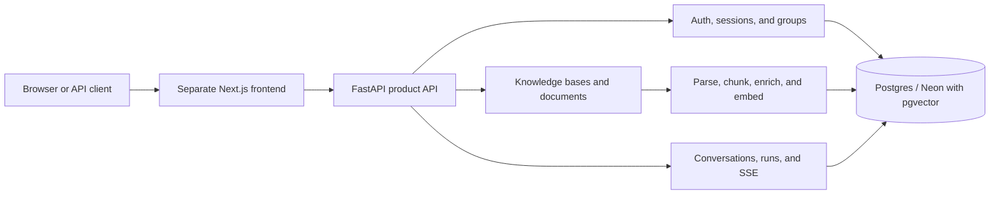
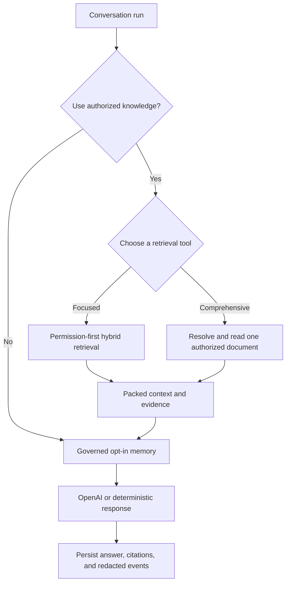

# my-agents

[English](./README.md) | 한국어

**Permission-aware Agentic RAG Backend** — 개인 문서, 그룹에 공유된 문서, 관리자가 등록한 공통 문서를 권한 경계 안에서만 검색하고, 사용자에게 보이는 인용과 내부 실행 기록을 함께 남기는 AI 채팅 서비스의 백엔드입니다.

[서비스 바로가기](https://www.my-agents.dev) · [프론트엔드 저장소](https://github.com/heecheon92/my-agents-frontend) · [구현 현황](./docs/implementation-tracking.md) · [로드맵](./ROADMAP.md)

> [!NOTE]
> 배포해서 운영 중이지만 가입은 직접 승인하고 있습니다. 승인을 기다리지 않고 둘러보려면 게스트로 접속하세요.

## 3분 요약

`my-agents`는 단순한 RAG 예제가 아닙니다. 실제 서비스에 필요한 **인증 → 권한 확인 → 문서 수집 → 하이브리드 검색 → LangGraph 실행 → SSE 스트리밍 → 인용·감사 기록 저장** 흐름을 하나의 백엔드로 이었습니다.

| 질문 | 답 |
| --- | --- |
| 무엇을 만들었나 | 개인 문서, 그룹 공유 문서, 관리자가 등록한 공통 문서를 근거로 답하고, 사용자에게 보이는 출처에만 인용을 붙이는 FastAPI + LangGraph 백엔드 |
| 무엇이 어려웠나 | 검색 품질보다 먼저 지켜야 하는 권한 경계, 서버가 소유하는 대화 상태, 문서 수집, 스트리밍, 운영에 실제로 쓸 수 있는 관측 지표 |
| 무엇을 검증했나 | API 키 없이 도는 테스트, 권한 회귀 테스트, 운영 환경 스모크, 수집·검색 성능의 전후 측정 |
| 지금 어디까지 왔나 | 핵심 흐름은 배포되어 동작하고, 부하 대응과 보안 점검을 계속 다듬고 있음 |

## 핵심 엔지니어링 포인트

- **권한을 가장 먼저 적용하는 검색**: 볼 수 없는 청크는 순위 계산, 그래프 확장, 프롬프트 구성에 들어가기 전에 걸러냅니다.
- **하이브리드 검색**: pgvector 벡터 검색과 BM25 키워드 검색이 각각 후보를 모으고, RRF(`k=60`)로 합친 뒤 재순위와 컨텍스트 구성을 거칩니다.
- **범위가 정해진 전체 문서 검토**: 전체 검토를 분명히 요청했을 때만 권한 있는 문서 하나를 읽고, 끝까지 읽은 검토와 앞부분만 읽은 부분 검토를 구분해 알립니다.
- **들여다볼 수 있는 오케스트레이션**: LangGraph 상태 머신이 문서 검색 여부 판단, 검색, 사용자가 켠 메모리, 답변 구성을 각각 눈에 보이는 단계로 연결합니다.
- **상태는 애플리케이션이 소유**: 대화, 실행, 메시지, 인용, 가려진 이벤트는 애플리케이션 데이터베이스에 저장합니다. LangGraph의 일시적인 실행 상태를 사용자 기록의 기준으로 삼지 않습니다.
- **스트리밍도 계약의 일부**: SSE로 진행 상황, 실행 흐름, 답변 조각, 완료·실패 상태를 내보내고 같은 내용을 서버에도 저장합니다.
- **키 없이 도는 검증**: LLM, 임베딩, 재순위 모델을 결정적인 테스트 대역으로 바꿀 수 있어 전체 테스트가 API 키 없이 돌아갑니다.

## 측정한 성능 개선

공개 SLA가 아니라, 같은 시나리오를 로컬에서 측정해 비교한 값입니다. 프로파일링으로 느린 구간을 찾은 뒤 손을 댔고, 최적화 전후로 검색 결과의 구성과 문서 처리 품질 검사는 똑같이 유지했습니다.

| 구간 | 바꾼 내용 | 이전 | 이후 | 결과 |
| --- | --- | ---: | ---: | ---: |
| 195쪽 PDF 수집 전체 | 메타데이터 생성과 임베딩·색인을 동시에 돌리고, 텍스트가 이미 있는 PDF는 사전 파싱을 생략 | 36.16s | 16.57s | 약 54% 단축 |
| 하이브리드 검색 후보 수집 | 순위 계산에 필요 없는 큰 컬럼은 나중에 읽고, 최종 상위 후보만 전체 레코드를 조회 | 31.42s | 1.84s | 94.1% 단축 |
| BM25 코퍼스 구성·순위·보강 | ORM 레코드 대신 ID와 본문만으로 코퍼스를 만들고, 상위 결과만 추가 조회 | 14.34s | 0.14s | 99.0% 단축 |

측정 조건과 남은 병목은 [성능 기록](./docs/performance/README.md)에 있습니다.

## 아키텍처

메시지 접수, 검색, 스트리밍, 저장과 재개를 단계별로 설명한 [서비스 흐름 문서](./docs/product-chat-service/38-message-to-answer-service-flow.ko.md)를 참고하세요.



채팅 요청 하나는 아래 흐름으로 처리됩니다.



### 요청 하나가 지키는 경계

1. API 계층이 세션, CSRF, 그룹과 지식 베이스 접근 권한을 확인합니다.
2. 오케스트레이션이 이 질문에 문서 검색이 필요한지 판단하고, 필요하면 범위를 좁힌 청크 검색과 전체 문서 읽기 중 하나를 고릅니다.
3. 어떤 문서를 읽을 수 있는지, 얼마나 읽을지는 모델이 아니라 백엔드 코드가 강제합니다. 전체 문서 읽기는 사용자가 고를 수 있는 개인·그룹 문서 하나로 제한합니다.
4. 큰 문서는 정해진 범위만 읽고, 부분 검토라는 안내를 답변에 반드시 붙입니다.
5. 답변, 인용, 검토 범위, 요약된 실행 흐름, 가려진 이벤트를 같은 실행 기록에 저장합니다. 문서 원문 전체는 checkpoint나 이벤트에 남기지 않습니다.

관리자가 등록한 공통 문서는 사용자에게 보이는 출처가 아니라 모델에 자동으로 붙는 배경 지식입니다. 출처는 내부 감사 기록에만 남기고, 공개 응답에서는 식별자, 파일명, 발췌, 인용을 모두 뺍니다.

운영 환경에서 도는 것은 어시스턴트 오케스트레이션 하나와 그 안의 검색 서브워크플로입니다. 코드의 `agent`와 `graph`는 제어 경계를 가리키는 이름일 뿐, 여러 에이전트가 독립된 서비스로 돈다는 뜻은 아닙니다.

## 주요 기능

- 이메일·비밀번호 가입과 인증, 세션, CSRF, 비밀번호 재설정, 승인을 거치는 게스트 접속
- 초대로만 맺어지는 그룹 멤버십, 개인 문서를 그룹에 공유 요청하고 승인하는 흐름
- 개인, 그룹, 관리자 공통 지식 베이스와 문서 단위 권한 관리
- PDF, Markdown, 일반 텍스트, `.xlsx`, `.pptx`, `.docx` 업로드와 수집 (PyMuPDF 우선, pypdf·Docling·Tesseract 순으로 대체)
- pgvector와 BM25를 RRF로 합친 하이브리드 검색과 기본 Jev rubric 재순위와 선택적 cross-encoder 대안
- 전체 문서 검토와 완전·부분 검토 안내, 범위 기반 인용
- 서버가 소유하는 대화·실행 기록, SSE 스트리밍, 답변을 뒷받침하는 인용, 가려진 에이전트 이벤트
- 사용자가 직접 켜는 실험적인 장기 메모리
- Prometheus 지표와 로컬 검색·수집 프로파일러

## 기술 스택

| 영역 | 기술 |
| --- | --- |
| API / 애플리케이션 | Python 3.14, FastAPI, Pydantic |
| 에이전트 / 모델 | LangGraph, `langchain-openai`, `ChatOpenAI` |
| 저장소 | SQLAlchemy, Alembic, PostgreSQL/Neon, pgvector |
| 검색 | 벡터 검색, BM25Okapi, RRF, Jev, 선택적 BAAI cross-encoder |
| 문서 처리 | PyMuPDF, pypdf, Docling, Tesseract, openpyxl, python-pptx |
| 스트리밍 / 관측 | SSE, Prometheus, 가려진 실행 이벤트 |
| 품질 / 배포 | pytest, Ruff, uv, Docker, Render |

## 프로젝트 구조

```text
my_agents/
├── api/                       # FastAPI routes and thin HTTP boundaries
├── agents/                    # LangGraph orchestration and retrieval workflows
├── auth/ and permissions/     # Session, CSRF, group/document authorization
├── knowledge/                 # Upload, parsing, ingestion, retrieval
├── conversations/             # Server-owned transcript/run models
├── memory/                    # Opt-in memory policy and database persistence
└── persistence/               # SQLAlchemy database boundary

tests/                         # Offline behavior and regression contracts
alembic/                       # Postgres schema migrations
docs/                          # Architecture, operations, performance evidence
scripts/                       # Smoke, benchmark, migration, operator utilities
```

| 확인하려는 동작 | 코드 위치 |
| --- | --- |
| 문서 검색 필요 여부 판단과 답변 구성 | `my_agents/agents/general_assistant/` |
| 어시스턴트와 권한 기반 검색 사이의 입출력 | `my_agents/agents/rag_agent/` |
| 질의 계획, 후보 결합, 재순위, 컨텍스트 구성 | `my_agents/agents/context_forge/` |

## 로컬에서 실행하기

[uv](https://docs.astral.sh/uv/)와 Python 3.14이 필요합니다. 아래 명령은 API 키 없이 동작합니다.

```bash
uv sync
cp .env.example .env
MY_AGENTS_RESPONSE_MODE=deterministic uv run fastapi dev main.py
curl http://127.0.0.1:8000/health   # 다른 터미널에서
```

실제 OpenAI 응답을 받으려면 `.env`에 `OPENAI_API_KEY`를 넣고 `MY_AGENTS_RESPONSE_MODE=openai`로 실행합니다. OpenAPI 문서는 `http://127.0.0.1:8000/openapi.json`에서 볼 수 있습니다.

- 프론트엔드와 PostgreSQL까지 붙여 실행하기: [프론트엔드 연동 실행 안내](./docs/product-chat-service/10-frontend-demo-runbook.ko.md)
- 환경 변수, 선택 기능, 운영 절차, 프론트엔드 계약: [런타임 설정과 프론트엔드 연동 참고](./docs/product-chat-service/34-runtime-and-integration-reference.ko.md)

운영자 가입 알림은 `uv run alembic upgrade head` 실행 후
`MY_AGENTS_REGISTRATION_NOTIFICATION_EMAIL`에 수신 주소를 설정하면 켜집니다. 미설정 또는 빈 값이면 꺼집니다.
일반·초대 계정 생성 및 게스트 코드 사용 시 알림을 큐에 저장하고 기존 SMTP/Resend로 전송합니다.
자세한 내용은 [가입 알림 계약](./docs/product-chat-service/02-first-party-auth-sessions.ko.md#운영자-가입-알림)을 참고하세요.

만료 게스트 정리는 별도 활성화하며 기본 유예 기간은 만료 후 24시간입니다. 최소 audit·이메일 이력을 남깁니다.
활성화 전 [정리 정책과 미리보기 명령](./docs/product-chat-service/39-expired-guest-cleanup.ko.md)을 확인하세요.

게스트 접근에도 고정된 `MY_AGENTS_GUEST_CLEANUP_EMAIL_HMAC_KEY`가 필요하며 이메일당 한 번의 체험만
허용합니다. 재로그인은 계정·할당량·만료를 유지하고 일반 회원 이메일은 일반 계정을 사용합니다. Migration `0039`와
[배포·초기화 안내](./docs/product-chat-service/40-guest-trial-abuse-protection.ko.md)를 확인하세요.

## 검증

```bash
uv run pytest -q
uv run ruff check . --no-cache
uv run ruff format --check .
git diff --check
```

2026-09-26 기준 전체 offline 테스트는 **624 passed, 14 skipped**이며 실제 자격 증명 없이 돌아갑니다.

## 보안과 개인정보 경계

- 실제 비밀 값과 로컬 데이터베이스는 커밋하지 않습니다. `.env.example`에는 자리 표시자만 둡니다.
- 공개 전 점검은 현재 트리와 Git 전체 이력을 함께 봅니다. 노출된 자격 증명은 파일을 지웠더라도 폐기하고 다시 발급합니다.
- 검색 권한은 프롬프트 지시가 아니라 애플리케이션 코드에서 강제합니다.
- 지표와 기본 이벤트에는 원본 프롬프트, 문서 본문, 이메일, 자격 증명, 모델 제공자 추적 정보를 넣지 않습니다.
- 공통 문서 관리는 별도의 관리자 계정 유형으로 제한하고, 역할을 바꾸는 공개 API는 두지 않습니다.
- 공개된 서비스이므로 민감하거나 규제 대상이거나 잃어버리면 곤란한 문서는 올리지 않는 것을 전제로 합니다.

## 지금의 한계와 다음 작업

- 가입을 직접 승인하는 방식이라 아직 셀프서비스 형태는 아닙니다.
- 수집 워커가 데이터베이스 폴링으로 동작합니다. 안정적인 큐, 워커 감시, 멈춘 작업 복구가 더 필요합니다.
- 업로드 원본용 오브젝트 스토리지, 문서 버전 관리와 재수집, 계정 삭제와 내보내기는 아직 없습니다.
- cross-encoder의 첫 로딩 지연과 작은 인스턴스에서의 PDF 처리 시간이 남아 있습니다.
- 큰 문서의 전체 검토는 현재 첫 범위에서 멈춥니다. 여러 범위를 이어 읽고 종합하는 기능은 후속 작업입니다.
- 여러 인스턴스가 공유하는 요청 제한, 운영 보안 점검, 마이그레이션·스모크 자동화가 필요합니다.
- 검색 외 도구, 백그라운드 실행 스케줄러, 여러 에이전트를 함께 운영하는 구성은 로드맵 단계입니다.

## 핵심 문서

- [구현과 검증 현황](./docs/implementation-tracking.md)
- [문서 지도와 lifecycle 규칙](./docs/README.md)
- [런타임 설정과 프론트엔드 연동 참고](./docs/product-chat-service/34-runtime-and-integration-reference.ko.md)
- [권한 기반 RAG 설계](./docs/product-chat-service/06-permission-aware-rag.ko.md)
- [어시스턴트 오케스트레이션 흐름](./my_agents/agents/general_assistant/README.ko.md)
- [검색 서브워크플로와 컨텍스트 구성](./my_agents/agents/rag_agent/README.ko.md)
- [성능 측정 기록](./docs/performance/README.md)
- [운영 환경 스모크 기록](./docs/product-chat-service/16-production-smoke-evidence-2026-06-06.md)
- [운영·마이그레이션 명령](./scripts/README.md)

더 큰 방향과 남은 일은 [ROADMAP.md](./ROADMAP.md)에 있습니다.

Reasoning effort 선택지(`none`부터 `max`)는 고정된 제품 계약입니다. 지원 모델은 `gpt-5.6-luna`, `gpt-6-luna`, `gpt-6-sol`, `gpt-5.6-sol`, `gpt-6.1-sol`, `gpt-6-astra`이며 모두 `my_agents/model_defaults.py`의 provider 권장값으로 시작한 application 기본값 `medium`을 사용합니다. `MY_AGENTS_OPENAI_MODEL`로 배포 fallback을 설정하고 backend를 재시작하세요. 기존 reasoning-effort 환경 변수 override는 무시합니다. 일반 계정은 run별 effort를 선택할 수 있고 guest는 standard mode와 선택된 모델 기본값을 사용합니다. `minimal`은 `low`로 변환하며 GPT-6.1 Sol과 Astra는 `none`도 run 저장과 provider 호출 전에 `low`로 변환합니다. [Reasoning 계약](./docs/product-chat-service/26-run-reasoning-preferences.ko.md)을 참고하세요.

일반 계정은 채팅 입력 영역이나 설정에서 assistant 모델을 선택할 수 있습니다.
`GET/PATCH /assistant/preferences`로 Product DB에 저장하며 `null`은
`MY_AGENTS_OPENAI_MODEL` 기본값으로 되돌립니다. Guest는 해당 환경 변수와 독립적인 `MY_AGENTS_GUEST_ASSISTANT_MODEL` (기본값 `gpt-6-luna`)을 사용합니다. 운영자만 바꿀 수 있으며 변경 후 재시작이 필요합니다.
Picker에는 `gpt-6.1-sol`, `gpt-6-luna`, `gpt-6-astra`만 제공합니다.
API는 `gpt-5.6-luna`, `gpt-5.6-sol`, `gpt-6-sol`도 받으며 노출하지 않는 지원 모델의 기존 선택과
배포 기본값도 그대로 유효합니다. `my_agents/model_defaults.py`의 application 기본 effort는 수정할 수 있으며
provider 권장값은 초기값입니다. GPT-6.1 Sol과 Astra는 지원하지 않는 `none`/`minimal`을 `low`로 바꿉니다.
일반 채팅/stream/replay는 저장된 선택을 사용하고 resume는 시작된 run의 고정 모델을 사용합니다.
Document workspace는 별도 모델 설정을 사용합니다. 기존 DB는 실행 전에 migration
`20260930_0036`를 적용하세요. [모델 선택 계약](./docs/product-chat-service/35-assistant-model-preferences.ko.md)을 참고하세요.

임시 document-workspace attachment는 정지 `.jpg`, `.jpeg`, `.png`, `.webp`, `.gif` 이미지도
분석할 수 있습니다. Backend가 실제 encoding/MIME를 검증하고 animation을 거부한 다음
이미지는 `input_image`, 문서는 `input_file`로 전달합니다. Consent, guest 차단, 용량/개수 제한,
expiry와 별도 workspace 모델은 유지합니다. Image는 분석 입력이며 다운로드 이미지 출력은 인증하지
않습니다. [Workspace 계약](./docs/product-chat-service/25-openai-document-workspace.ko.md)을 참고하세요.

## 대화 맥락 유지와 파일 재참조

고정된 메시지 6개 대신 공통 token 예산과 원문 참조가 있는 대화 요약을 사용합니다. 필요한 경우
답변 전에 오래된 대화를 정리하며 진행 상태를 표시합니다. Guest도 텍스트 대화의 맥락을 유지하지만
임시 workspace 파일과 재참조는 일반 계정만 사용할 수 있습니다.

`MY_AGENTS_SUMMARIZATION_MODEL`이 요약 모델 기본값(`gpt-6-luna`)을 정하며 일반 계정은
Settings에서 변경할 수 있습니다. 원본 파일은 기본 7일간 OpenAI에 보관합니다. 접수한 첨부는
보낸 메시지에 표시하고 입력 영역에서 제거합니다. 후속 질문에 정확한 원문이 필요하면 권한을 확인해
자동으로 다시 열고, 만료 후에는 대화에 남은 메모로 이전 논의를 기억할 수 있습니다. 파일 제거는
파생 메모를 지우고 대화 삭제는 원문 대화도 지웁니다. Provider 정리는 outbox로 재시도합니다.
기존 DB는 실행 전에 migration `20260930_0036`을 적용하고 graph V3 배포 전에 기존 대기 run을
완료·취소하세요. [맥락 유지 계약](./docs/product-chat-service/36-conversation-continuity.ko.md)을
참고하세요.

## 검색 근거 재순위

ContextForge의 기본값은 `MY_AGENTS_RERANKER_MODE=jev`이며 routing decision provider와
독립적입니다. 로컬에 `OPENROUTER_API_KEY`를 설정하면 질문과 길이를 제한한 권한 있는 문서
발췌를 Jev에 보내고, 합쳐진 후보의 순서를 바꾼 뒤 context를 구성합니다. 키 누락이나 어느
batch의 실패든 전체 원래 후보 순서를 유지합니다. `deterministic`, `cross_encoder` 대안도
유지하며 `MY_AGENTS_RESPONSE_MODE=deterministic`은 기본 Jev 경로를 오프라인으로 실행합니다.
기존 명시적 reranker 설정은 선택한 mode를 유지합니다. DB migration은 필요 없습니다.
[재순위 계약](./docs/product-chat-service/37-jev-evidence-reranking.ko.md)을 참고하세요.

Console에서 재순위 전후를 비교하려면 `MY_AGENTS_DEPLOYMENT_ENVIRONMENT=local`과
`MY_AGENTS_DEBUG_KNOWLEDGE_CONTEXT_LOGGING=true`를 사용합니다. 각 순서의 상위 10개 후보에
대해 rank, document/chunk 위치, RRF/reranker 점수와 짧은 발췌를 표시하며 Jev fallback도
구분합니다. Preview/production에서는 이 flag를 켜도 해당 표를 출력하지 않습니다.

[로컬 재순위 benchmark와 verdict](./docs/performance/reranking-benchmark-2026-10-02.ko.md)에 owner 비교와 실제 controlled component
54회 실행을 기록했습니다. 근거 순서/fact coverage, warm latency와 API-reported 비용을
측정하며 최종 답변 품질은 평가하지 않았습니다.
