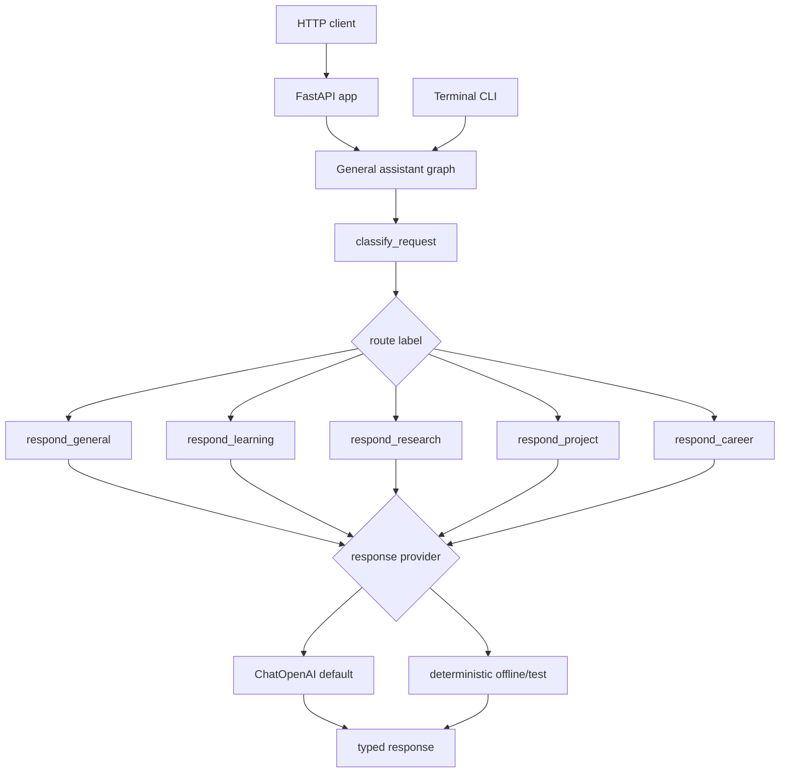
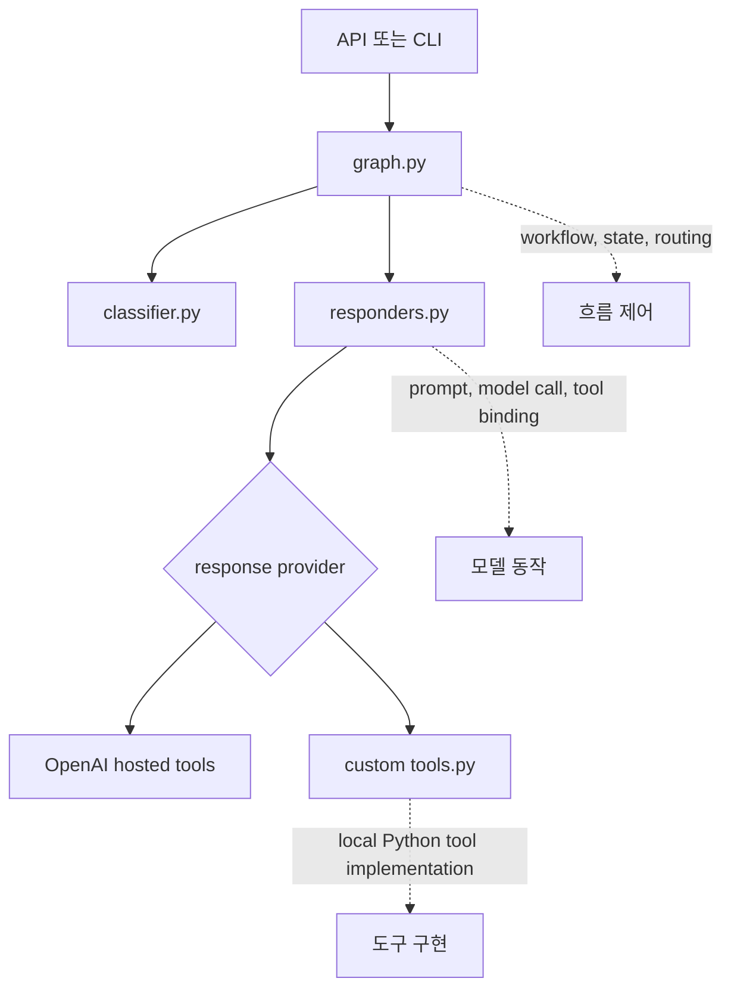

# my-agents

[English](./README.en.md) | 한국어

학습과 커리어 지원을 위한 백엔드 전용 FastAPI + LangGraph 어시스턴트/라우터 기반 프로젝트입니다.

## 목적과 v0 범위

`my-agents` v0는 OpenAI 기반 응답 생성을 기본으로 사용하는 개인 어시스턴트/라우터 백엔드 기반입니다. 현재 버전은 다음을 보여줍니다.

- 헬스 체크와 채팅 요청을 위한 FastAPI API 표면
- 명시적인 상태, 노드, `START`, `END`, 조건부 라우팅을 사용하는 실제 LangGraph `StateGraph`
- 향후 어시스턴트 범주를 위한 결정론적 라우트 라벨 분류
- 타입이 지정된 요청/응답 계약과 자동화된 테스트 대상

v0는 의도적으로 작게 유지합니다. 이 저장소는 백엔드 전용 학습용 산출물이며, 프론트엔드 애플리케이션이나 호스팅 서비스 설정이 아닙니다.

## 명시적인 v0 안내

v0의 기본 응답 모드는 OpenAI 기반입니다. 채팅 응답 생성을 실행하려면 `OPENAI_API_KEY`가 필요합니다. 테스트와 오프라인 확인을 위해 `MY_AGENTS_RESPONSE_MODE=deterministic` 모드는 계속 유지합니다.

분류는 계속 결정론적으로 수행되며, 선택한 OpenAI GPT 모델은 최종 응답 텍스트만 생성합니다. API 키 없이 실행해야 하는 경우에는 deterministic 모드로 전환합니다. v0의 라우트 라벨은 향후 범주를 위한 분류 정보일 뿐이며, 실제 전문 에이전트 실행이나 위임을 의미하지 않습니다.

## 프론트엔드 없음

이 저장소에는 프론트엔드 UI가 없습니다. v0 인터페이스는 FastAPI 백엔드 API와 로컬 명령줄 테스트/실행 워크플로입니다.

## 아키텍처 개요



현재 그래프는 `my_agents/agents/general_assistant/` 아래에 있으며 하나의 어시스턴트/라우터 흐름을 가집니다. 분류는 결정론적으로 수행됩니다. 응답 노드는 provider 인터페이스를 통해 라우트별 응답을 구성합니다. 기본값은 `langchain-openai`의 `ChatOpenAI`이며, 오프라인/테스트용으로 결정론적 템플릿 모드를 사용할 수 있습니다. 라우트별 응답 노드는 별도의 에이전트가 아닙니다.

## 그래프 흐름

1. API가 비어 있지 않은 `message`와 선택적 `history`를 포함한 채팅 요청을 받습니다.
2. FastAPI/Pydantic이 그래프 실행 전에 요청을 검증합니다.
3. API가 공개 JSON의 `message`/`history`를 LangChain messages로 변환하고, LangGraph 상태는 `messages`, 라우트 결정, 응답, 그래프 메타데이터를 저장합니다.
4. `classify_request`가 결정론적 규칙을 적용해 라우트 라벨과 설명을 반환합니다.
5. 조건부 그래프 엣지가 라우트 라벨에 맞는 응답 구성 노드를 선택합니다.
6. 선택된 response provider가 응답을 구성합니다.
7. 그래프가 `reply`, `route.label`, `route.explanation`, `handled_by`를 포함한 타입이 지정된 응답을 반환합니다.

`handled_by`는 단일 그래프 경로(`personal_assistant_graph`)를 식별합니다. 전문 에이전트를 식별하는 값이 아닙니다.

## 에이전트 구현 패턴

새 에이전트는 `my_agents/agents/<agent_name>/` 아래에 독립된 폴더로 추가합니다. 현재 예시는 [`my_agents/agents/general_assistant/`](./my_agents/agents/general_assistant/README.md)입니다.

권장 책임 분리는 다음과 같습니다.



원칙:

- `graph.py`는 workflow, state, node routing을 담당합니다.
- `classifier.py`는 사용자 입력을 route label로 분류합니다.
- `responders.py`는 prompt 구성, `ChatOpenAI` 호출, LLM tool binding을 담당합니다.
- OpenAI hosted tools(`web_search`, `file_search` 등)는 먼저 `responders.py`의 provider 경계에서 route-specific policy로 붙입니다.
- 직접 만든 Python tool은 별도 `tools.py`에 구현하고, `responders.py`에서 필요한 route에만 bind합니다.
- tool workflow가 여러 단계의 상태 전이, retry, interrupt, 별도 검증을 필요로 하면 그때 LangGraph node로 승격합니다.
- 각 에이전트 폴더에는 한국어 `README.md`와 영어 `README.en.md`를 함께 둡니다.

## 라우트 라벨

| 라우트 라벨 | v0 의미 | 예시 요청 문구 |
| --- | --- | --- |
| `general_assistant` | 일반 어시스턴트 요청 분류 | “Hello, what can you do?” |
| `learning_coach` | 학습 계획과 기술 개발 분류 | “Help me study LangGraph step by step.” |
| `research_helper` | 자료 탐색 또는 리서치 계획 분류 | “Find sources about FastAPI testing.” |
| `project_planner` | 프로젝트 계획, 마일스톤, 구현 순서 분류 | “Plan my next backend milestone.” |
| `career_helper` | 이력서, 리크루터 대상 문구, 커리어 자료 분류 | “Improve my resume bullet.” |

## 설정

uv로 의존성을 설치합니다.

```bash
uv sync
```

로컬에서 기본 OpenAI 응답 모드를 실행하려면 환경 설정 파일을 만듭니다.

```bash
cp .env.example .env
```

기본 `.env.example` 설정은 OpenAI 응답 모드를 사용하도록 되어 있습니다. 실제 실행 전에 `OPENAI_API_KEY` 줄의 주석을 해제하고 본인의 키로 바꿉니다.

```bash
MY_AGENTS_RESPONSE_MODE=openai
OPENAI_API_KEY=sk-your-project-key
MY_AGENTS_OPENAI_MODEL=gpt-5.5
```

선택적 튜닝 값은 다음과 같습니다.

```bash
MY_AGENTS_OPENAI_MAX_OUTPUT_TOKENS=1200
MY_AGENTS_OPENAI_TIMEOUT_SECONDS=30
# GPT-5 계열 튜닝, 선택 사항:
# MY_AGENTS_OPENAI_REASONING_EFFORT=low
# MY_AGENTS_OPENAI_VERBOSITY=low
```

`.env`와 `.env.*`는 git에서 제외됩니다. `.env.example`에는 실제 비밀값이 없으므로 커밋해도 안전합니다.

## 검사 실행

자동화된 테스트를 실행합니다.

```bash
uv run pytest
```

Ruff 검사를 실행합니다.

```bash
uv run ruff check .
```

## 로컬에서 API 실행

FastAPI 개발 서버를 시작합니다.

```bash
uv run fastapi dev main.py
```

FastAPI CLI를 사용할 수 없거나 동작이 바뀐 경우의 대안입니다.

```bash
uv run uvicorn main:app --reload
```

기본적으로 로컬 API는 `http://127.0.0.1:8000`에서 사용할 수 있습니다.

## 터미널에서 채팅하기

FastAPI 서버를 시작하지 않고 general assistant graph를 직접 실행할 수 있습니다.

```bash
uv run python -m my_agents.cli
```

그다음 터미널에서 메시지를 입력합니다.

```text
You: Help me study LangGraph
Assistant: Classified as route label `learning_coach`...
You: /exit
Goodbye.
```

터미널 채팅은 OpenAI 모드에서 LangGraph streaming을 사용해 토큰이 생성되는 대로 출력합니다. deterministic 모드에서는 같은 스트리밍 경로로 최종 그래프 업데이트를 출력합니다. 메시지 히스토리는 현재 프로세스 안에서만 유지되며 영속화하지 않습니다.

## API 예시

아래 응답 예시는 문서와 테스트에서 안정적으로 비교할 수 있도록 deterministic 모드 기준입니다. 기본 OpenAI 모드에서는 `reply` 문구가 모델 응답에 따라 달라질 수 있습니다.

### `GET /health`

요청:

```bash
curl http://127.0.0.1:8000/health
```

응답 예시:

```json
{
  "status": "ok",
  "service": "my-agents",
  "version": "0.1.0"
}
```

### `POST /assistant/chat`

요청:

```bash
curl -X POST http://127.0.0.1:8000/assistant/chat \
  -H 'Content-Type: application/json' \
  -d '{"message":"Help me study LangGraph routing","history":[]}'
```

응답 예시:

```json
{
  "reply": "Classified as route label `learning_coach`. A useful learning path is to define the concept, build a tiny example, then test it. This backend is running in deterministic response mode.",
  "route": {
    "label": "learning_coach",
    "explanation": "This request is about study planning, practice, or skill development."
  },
  "handled_by": "personal_assistant_graph"
}
```

이 요청은 `learning_coach` 라우트 라벨로 분류됩니다. 라벨은 메타데이터일 뿐이며, v0에서는 별도의 학습 기능이 실행되지 않습니다.

다른 요청 예시:

```bash
curl -X POST http://127.0.0.1:8000/assistant/chat \
  -H 'Content-Type: application/json' \
  -d '{"message":"Plan my next backend milestone","history":[]}'
```

응답 예시:

```json
{
  "reply": "Classified as route label `project_planner`. A useful planning pass is to name the goal, split the next milestone, and define verification evidence. This backend is running in deterministic response mode.",
  "route": {
    "label": "project_planner",
    "explanation": "This request is about planning project work, milestones, scope, or next steps."
  },
  "handled_by": "personal_assistant_graph"
}
```

이 요청은 `project_planner` 라우트 라벨로 분류됩니다. 라벨은 메타데이터일 뿐이며, v0에서는 별도의 계획 기능이 실행되지 않습니다.

## 요청 형태

```json
{
  "message": "Help me plan my LangGraph study project",
  "history": []
}
```

필드:

- `message`: 필수이며 비어 있지 않은 문자열입니다.
- `history`: 선택적 배열이며, 생략하면 `[]`가 기본값입니다.
- `history[].role`: `user` 또는 `assistant`입니다.
- `history[].content`: 비어 있지 않은 문자열입니다.

빈 메시지는 그래프 실행 전에 검증/클라이언트 오류를 반환해야 합니다.

## 응답 형태

```json
{
  "reply": "...",
  "route": {
    "label": "learning_coach",
    "explanation": "This request is about study planning and skill development."
  },
  "handled_by": "personal_assistant_graph"
}
```

필드:

- `reply`: 선택된 response provider가 구성한 응답 텍스트입니다.
- `route.label`: 지원되는 라우트 라벨 중 하나입니다.
- `route.explanation`: 분류에 대한 결정론적 설명입니다.
- `handled_by`: 단일 어시스턴트 그래프 경로를 나타내는 그래프 메타데이터입니다.

## OpenAI GPT variant 설정

OpenAI 모드는 LangChain의 전용 `langchain-openai` 통합 패키지와 `ChatOpenAI`를 사용합니다. 모델은 `MY_AGENTS_OPENAI_MODEL`로 선택하므로 코드 변경 없이 GPT variant를 바꿔볼 수 있습니다.

```bash
MY_AGENTS_RESPONSE_MODE=openai
OPENAI_API_KEY=sk-your-project-key
MY_AGENTS_OPENAI_MODEL=gpt-5.5
```

현재 기본 모델 slug는 `gpt-5.5`입니다. 다른 GPT variant를 선택하면 해당 값이 `ChatOpenAI`로 직접 전달됩니다.

## 향후 확장 방향

향후 버전은 이 기반 위에 다음을 추가할 수 있습니다.

- `previous_response_id` 또는 replayed response items를 통한 OpenAI 대화 상태 유지
- 영속적인 대화 thread 또는 checkpointer
- human-in-the-loop interrupt
- 기존 라우트 라벨 분류 체계 뒤에 실제 전문 어시스턴트 기능 추가
- 필요한 경우 별도 범위나 별도 저장소의 프론트엔드

전문 기능이 명시적으로 구현되기 전까지 v0 라우트 라벨은 결정론적 분류 정보로만 남습니다.
