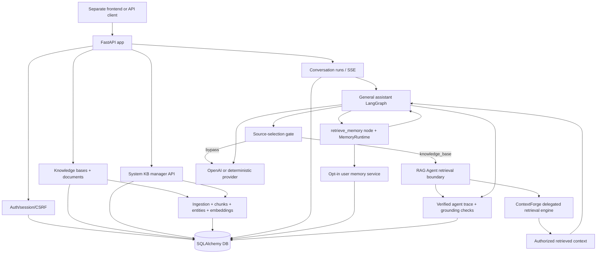

# my-agents

[English](./README.en.md) | 한국어

`my-agents`는 개인 지식, 그룹 지식, 권한이 있는 사용자가 관리하는 system knowledge를 바탕으로 답변하는 AI 채팅 제품의 backend입니다. 프론트엔드는 별도 저장소에서 다루고, 이 저장소는 인증, 권한, 지식 기반, 대화 실행, 출처, memory 설정 같은 product API boundary에 집중합니다.

현재 상태는 [`docs/implementation-tracking.md`](./docs/implementation-tracking.md)를 먼저 확인하세요. 큰 방향과 backlog는 [`ROADMAP.md`](./ROADMAP.md)에 있습니다.

## 제품이 제공하는 것

- Email/password 계정, 초대 링크 기반 가입, 세션, guest access gate
- 개인 지식 기반, 초대 기반 group 지식 기반, root/system 사용자가 관리하는 project knowledge
- 문서 업로드, 수집, 검색, 출처가 있는 답변 (PDF, Markdown, plain text, `.xlsx`, `.pptx`, `.docx`; legacy `.doc`는 아직 미지원)
- Server-owned conversation/run history와 streaming response
- OpenAI 기반 응답은 최신 정보나 출처 기반 요청에 hosted web search를 노출할 수 있음
- 그룹 멤버와 공개 요청을 관리하기 위한 권한 흐름
- 사용자가 실험적으로 켜고 끌 수 있는 long-term memory

## 제품 경계

- 개인 지식과 대화 기록은 기본적으로 사용자 소유입니다.
- 그룹 지식은 초대를 수락한 멤버에게만 열립니다.
- System knowledge는 guest를 포함한 authenticated chat retrieval에 공개되는
  project context이며, 관리는 `root`/`system` user type만 할 수 있습니다.
- `user_type` 변경은 `scripts.set_user_type` operator script로만 수행하며,
  공개 API에는 role mutation route를 두지 않습니다. Auth response는 normal user와
  guest에게 `user_type`, `can_manage_system_knowledge`를 생략하고 root/system manager에게만
  해당 값을 포함합니다.
- Nickname은 사람을 알아보기 위한 표시 이름이며, 로그인과 초대의 식별자는 email입니다. 계정이 없는 초대 수신자는 초대 token이 증명한 email을 그대로 사용하고 nickname/password만 정합니다.
- 표준 개인/그룹/system 지식 기반은 권한 있는 소유자/관리자가 knowledge-base API로 이름을 바꾸거나 삭제할 수 있습니다. 숨겨진 `team_upload_staging` KB는 내부 임시 저장소라서 일반 관리 흐름에서 이름 변경/삭제 대상이 아닙니다.
- 문서 목록 response는 가볍게 유지합니다. 선택한 문서의 Markdown/internal representation 전체가 필요한 UI는 `GET /knowledge-bases/{knowledge_base_id}/documents/{document_id}/preview`를 사용합니다.
- Publish request 작성자는 승인 전 요청을 `cancelled`로 취소할 수 있고, 다시 요청할 수 있습니다. 승인 전에 source document나 source knowledge base를 삭제하면 요청은 `withdrawn`으로 전환됩니다. 승인 후 source 삭제는 group-owned copy를 유지하고, group manager가 승인된 group copy를 삭제하면 publish request 이력은 남기되 `published_document_id` 또는 `published_knowledge_base_id`를 비웁니다.
- 전체 knowledge-base approval은 requester-owned source KB를 그대로 retrieval 권한으로 열지 않고 group-owned KB copy를 만듭니다. 과거 approved KB publication row는 `uv run python -m scripts.backfill_kb_publication_copies --dry-run` 결과를 검토한 뒤 `--apply`로 backfill합니다.
- Long-term memory는 기본적으로 꺼져 있고, 사용자가 실험 기능으로 직접 켤 수 있습니다.
- 실제 secret은 commit하지 않습니다. `.env`는 local only이고 `.env.example`은 안전한 placeholder입니다.

## 아키텍처 요약



기본 문서 검색은 권한 확인 후 vector 후보와 request-local `BM25Okapi` lexical 후보를
독립적으로 수집하고, 같은 `chunk_id`를 기준으로 Reciprocal Rank Fusion(RRF, `k=60`)합니다.
BM25 corpus는 기존 authorized chunk text로 만들기 때문에 별도 DB index/schema migration은
필요하지 않습니다. Metadata, structured entity, graph-expansion 후보도 같은 fusion 경계를
통과한 뒤 deterministic reranker 또는 optional cross-encoder와 context packing으로 이어집니다.

이 README는 전체 그림만 설명합니다. 세부 API contract, migration note, 운영 절차는 `docs/`와 [`scripts/README.md`](./scripts/README.md)에 둡니다.

## 로컬 실행

의존성 설치와 local 설정 파일 생성:

```bash
uv sync
cp .env.example .env
```

Credential 없는 test와 local smoke check에는 deterministic mode를 사용합니다.

```bash
MY_AGENTS_RESPONSE_MODE=deterministic
```

API 시작:

```bash
uv run fastapi dev main.py
```

Fallback:

```bash
uv run uvicorn main:app --reload
```

OpenAPI는 실행 중인 서버에서 확인할 수 있습니다.

```text
http://127.0.0.1:8000/openapi.json
```

선택적인 내부 timing metrics는 명시적으로 켰을 때만 Prometheus text 형식으로
노출됩니다.

```bash
MY_AGENTS_METRICS_ENABLED=true uv run fastapi dev main.py
curl http://127.0.0.1:8000/metrics
```

이 metrics endpoint는 product API가 아니라 유지보수/품질 분석용 surface입니다.
Request, conversation run, RAG Agent/ContextForge retrieval, embedding, reranker, assistant graph
timing histogram을 기록하며 raw prompt, 문서 본문, user ID, document ID를 metric label로
사용하지 않습니다.

Local에서 단일 RAG 실행이 어느 단계에서 느린지 보려면 Rich timing panel을 켭니다.

```bash
MY_AGENTS_DEBUG_RETRIEVAL_TIMING_LOGGING=true uv run fastapi dev main.py
```

이 debug 출력은 retrieval attempt마다 authorization count, planning, candidate gather,
fusion, reranking, context packing, total time, redacted candidate count를 사람이 읽기 쉬운
표로 출력하며 raw prompt나 문서 본문은 출력하지 않습니다. `candidate_gather.*` 행은
metadata match, embedding call, vector SQL, JSON fallback scan, related expansion,
overview supplement처럼 first-stage retrieval 내부에서 이미 계측하던 span을 함께 보여줍니다.

Local에서 단일 ingestion 실행이 어느 단계에서 느린지 보려면 ingestion Rich timing panel을
켭니다.

```bash
MY_AGENTS_DEBUG_INGESTION_TIMING_LOGGING=true uv run fastapi dev main.py
```

이 debug 출력은 upload parse와 extraction/indexing run마다 사람이 읽기 쉬운 timing 표를
출력합니다. Upload trace는 file read, parser dispatch, document persistence와 PDF validation,
checksum, classification, parser attempt, quality gate 같은 PDF subphase를 보여주고,
extraction trace는 stale artifact 정리, parse artifact lookup, chunking, chunk embedding,
entity extraction/upsert, chunk/index persistence, metadata generation/embedding, final commit을
보여줍니다. Suffix, source type, parser, byte/character/page count, PDF doc type,
chunk/entity/relationship count 같은 redacted metadata와 count만 출력하고 raw filename이나
문서 본문은 출력하지 않습니다.
OpenAI metadata generation이 켜져 있으면 metadata generation은 chunk embedding/indexing과
병렬로 실행됩니다. 따라서 ingestion timing phase는 span이며, 서로 겹칠 수 있어서
`total_ms`에 단순 합산되지 않습니다.

PDF 경로는 lazy classification을 사용합니다. 먼저 빠른 PyMuPDF text extractor를 실행하고
기존 quality gate를 통과하면 바로 수락합니다. PyMuPDF가 실패하거나 low-quality text를 만들면
그때 pypdf classification을 실행한 뒤 pypdf, Docling, Tesseract, legacy fallback 경로로
라우팅합니다.

Ingestion 최적화 전후를 반복 가능하게 비교하려면 local benchmark harness를 사용합니다.

```bash
uv run python scripts/measure_ingestion_performance.py \
  --scenario pdf \
  --repeat 3 \
  --output /tmp/my-agents-ingestion-pdf.json
```

이 benchmark는 격리된 SQLite DB와 deterministic embedding/metadata generation을 사용합니다.
Parse, persist, ingest, retrieval-smoke, total time, RSS delta, parser/source metadata,
chunk/entity/relationship count, redacted quality signature를 출력하므로 retrieval quality를
약화시키지 않고 ingestion 최적화 전후를 비교할 수 있습니다.

## 주요 검사

```bash
uv run pytest -q
uv run ruff check . --no-cache
uv run ruff format --check .
git diff --check
```

## 더 읽기

- 현재 구현 상태: [`docs/implementation-tracking.md`](./docs/implementation-tracking.md)
- Product roadmap: [`ROADMAP.md`](./ROADMAP.md)
- Product docs: [`docs/product-chat-service/ko/README.md`](./docs/product-chat-service/ko/README.md)
- 지식 관리 lifecycle/publish copy 계약: [`docs/product-chat-service/ko/24-knowledge-lifecycle-and-publish-copy-contract.md`](./docs/product-chat-service/ko/24-knowledge-lifecycle-and-publish-copy-contract.md)
- Frontend demo runbook: [`docs/product-chat-service/ko/10-frontend-demo-runbook.md`](./docs/product-chat-service/ko/10-frontend-demo-runbook.md)
- Script commands: [`scripts/README.md`](./scripts/README.md)
- Ideas: [`docs/idea/`](./docs/idea/)
