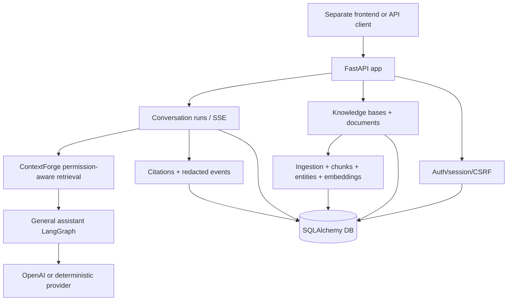

# my-agents

[English](./README.en.md) | 한국어

`my-agents`는 실용적인 AI 채팅 제품 표면을 만들기 위한 backend-only FastAPI + LangGraph 서비스입니다. 프론트엔드는 별도 저장소로 분리하고, 이 저장소는 API contract, auth/session, 문서 지식 workflow, conversation run, retrieval, citation, agent activity event에 집중합니다.

현재 프로젝트 상태는 [`docs/implementation-tracking.md`](./docs/implementation-tracking.md)에서 먼저 확인하세요. 상세 backlog는 [`ROADMAP.md`](./ROADMAP.md)에 있습니다.

## 구현된 내용

현재 backend는 얇지만 동작하는 제품 slice입니다.

- health, auth, groups, documents, knowledge bases, conversations, runs, streaming, events route를 제공하는 FastAPI app.
- deterministic route classification과 기본 OpenAI-backed response generation을 사용하는 LangGraph general assistant path.
- credential 없이 test/smoke check를 실행할 수 있는 deterministic offline/test mode.
- email/password auth, app-owned session, CSRF-aware logout, dev outbox, guest access, signup disable switch.
- group, document, knowledge-base, permission 기반.
- KB-scoped document upload/create, ingestion, extraction-run progress, chunk, entity, metadata profile, embedding, pgvector-ready retrieval.
- permission-aware RAG, structured entity retrieval, reranking seam, packed context, citation, redacted retrieval evidence를 담당하는 ContextForge retrieval service.
- server-owned conversation, run history, SSE assistant text streaming, run replay/cancel, persisted citation, frontend-safe activity event.

자세한 설명은 README 대신 docs에 둡니다.

| 영역 | 상세 문서 |
| --- | --- |
| Service/API split | [`docs/product-chat-service/ko/01-service-foundation-scaffold.md`](./docs/product-chat-service/ko/01-service-foundation-scaffold.md) |
| Auth/session | [`docs/product-chat-service/ko/02-first-party-auth-sessions.md`](./docs/product-chat-service/ko/02-first-party-auth-sessions.md) |
| Group/permission | [`docs/product-chat-service/ko/03-group-document-permissions.md`](./docs/product-chat-service/ko/03-group-document-permissions.md) |
| Conversation/run | [`docs/product-chat-service/ko/04-server-owned-conversations.md`](./docs/product-chat-service/ko/04-server-owned-conversations.md) |
| Knowledge ingestion | [`docs/product-chat-service/ko/05-knowledge-ingestion-extraction.md`](./docs/product-chat-service/ko/05-knowledge-ingestion-extraction.md) |
| RAG/citation | [`docs/product-chat-service/ko/06-permission-aware-rag.md`](./docs/product-chat-service/ko/06-permission-aware-rag.md) |
| Observability/eval | [`docs/product-chat-service/ko/07-agent-observability-evals.md`](./docs/product-chat-service/ko/07-agent-observability-evals.md) |
| Postgres/Alembic/pgvector | [`docs/product-chat-service/ko/08-postgres-alembic-neon.md`](./docs/product-chat-service/ko/08-postgres-alembic-neon.md) |
| Streaming frontend contract | [`docs/product-chat-service/ko/09-http-streaming-frontend-contract.md`](./docs/product-chat-service/ko/09-http-streaming-frontend-contract.md) |
| Local frontend demo runbook | [`docs/product-chat-service/ko/10-frontend-demo-runbook.md`](./docs/product-chat-service/ko/10-frontend-demo-runbook.md) |
| V1 contract evidence map | [`docs/product-chat-service/ko/11-v1-phase-0-contract-freeze-evidence-map.md`](./docs/product-chat-service/ko/11-v1-phase-0-contract-freeze-evidence-map.md) |
| KB-first OpenAPI handoff | [`docs/product-chat-service/ko/12-knowledge-base-path-openapi-handoff.md`](./docs/product-chat-service/ko/12-knowledge-base-path-openapi-handoff.md) |
| Public demo readiness | [`docs/product-chat-service/ko/12-public-demo-deployment-readiness.md`](./docs/product-chat-service/ko/12-public-demo-deployment-readiness.md) |
| Hybrid retrieval reference | [`docs/product-chat-service/ko/12-retrieval-agent-hybrid-reference.md`](./docs/product-chat-service/ko/12-retrieval-agent-hybrid-reference.md) |
| Container deployment path | [`docs/product-chat-service/ko/13-generic-container-deployment-path.md`](./docs/product-chat-service/ko/13-generic-container-deployment-path.md) |
| Script commands / 스크립트 명령 | [`scripts/README.md`](./scripts/README.md) |
| Layout-aware RAG idea | [`docs/idea/layout-aware-ingestion-rag-agent.md`](./docs/idea/layout-aware-ingestion-rag-agent.md) |

## 경계

- 이 저장소는 backend-only입니다. 프론트엔드 작업은 `~/Git/my-agents-frontend` 같은 별도 저장소에서 다룹니다.
- Production-surface 동작의 LLM provider는 OpenAI를 기준으로 합니다. Test는 기본적으로 offline이어야 합니다.
- Route label은 deterministic classification과 capability metadata를 설명합니다. 아직 별도 specialized agent가 실행된다는 뜻은 아닙니다.
- 학습용 graph experiment는 [`my_agents/simulated_agents/`](./my_agents/simulated_agents/) 아래에 있으며 production API/CLI surface가 아닙니다.
- 실제 secret을 commit하지 마세요. Local `.env` 파일은 git에서 무시하며, `.env.example`은 안전한 placeholder 문서입니다.

## 아키텍처 요약



Service layer가 auth, permission, source policy, persistence, retrieval boundary, citation, event를 소유합니다. LangGraph는 이 product boundary 안에서 assistant reply를 작성하는 데 사용됩니다.

## 설정

의존성 설치:

```bash
uv sync
```

Local 설정 파일 생성:

```bash
cp .env.example .env
```

기본 local chat은 OpenAI-backed reply를 사용합니다. OpenAI mode를 쓰려면 실제 key를 설정하세요.

```bash
MY_AGENTS_RESPONSE_MODE=openai
OPENAI_API_KEY=sk-your-project-key
MY_AGENTS_OPENAI_MODEL=gpt-5.5
```

Credential 없는 test와 local smoke check에는 deterministic mode를 사용합니다.

```bash
MY_AGENTS_RESPONSE_MODE=deterministic
```

전체 설정 목록은 [`.env.example`](./.env.example)을 확인하세요. CORS, cookie, CSRF, dev outbox, seeded local data, SSE/run-detail expectation은 [frontend demo runbook](./docs/product-chat-service/ko/10-frontend-demo-runbook.md)에 정리되어 있습니다.
중단된 대화 실행이 frontend에 계속 “작성 중”으로 남지 않도록 `MY_AGENTS_ACTIVE_RUN_STALE_AFTER_SECONDS` 기본값은 120초이며, hosted demo에서는 이 값을 짧게 유지하세요.

Guest access를 켜면 public client는 `POST /auth/guest/request`에 email을 보내고
`status=accepted`만 받습니다. 코드는 public API가 반환하지
않고 DB에는 hash만 저장합니다. Email delivery가 붙기 전까지 operator는 pending
request에 대해 다음 local script로 one-time code를 출력할 수 있습니다.

```bash
MY_AGENTS_GUEST_ACCESS_ENABLED=true uv run python -m scripts.issue_guest_access_code \
  --email guest@example.com
```

## 로컬 실행

API 시작:

```bash
uv run fastapi dev main.py
```

Fallback:

```bash
uv run uvicorn main:app --reload
```

실행 중인 서버의 OpenAPI 문서:

```text
http://127.0.0.1:8000/openapi.json
```

FastAPI 서버 없이 CLI chat loop 실행:

```bash
uv run python -m my_agents.cli
```

Hosted/demo 배포에서는 async document ingestion을 web process 밖에서 실행하세요.

```bash
MY_AGENTS_INGESTION_EXECUTION_MODE=external_worker uv run uvicorn main:app --host 0.0.0.0 --port 8000
uv run python -m my_agents.ingestion_worker
```

Backend restart 등으로 남은 active conversation run은 polling 또는 다음 prompt 전 cleanup에서 실패/취소
상태로 정리됩니다. Hosted/demo UX에서는 기본 120초를 사용하며 필요하면
`MY_AGENTS_ACTIVE_RUN_STALE_AFTER_SECONDS`로 조정하세요.

## 주요 검사

```bash
uv run pytest -q
uv run ruff check . --no-cache
uv run ruff format --check .
git diff --check
```

선택 사항: local Postgres/pgvector helper.

```bash
uv run python -m scripts.dev_pgvector up --migrate
set -a; source .env.pgvector.local; set +a
MY_AGENTS_RESPONSE_MODE=deterministic uv run uvicorn main:app --host 127.0.0.1 --port 8000
```

Database 상세 설명: [`docs/product-chat-service/ko/08-postgres-alembic-neon.md`](./docs/product-chat-service/ko/08-postgres-alembic-neon.md).

## 빠른 API smoke

Health:

```bash
curl http://127.0.0.1:8000/health
```

Legacy/dev assistant smoke endpoint:

```bash
curl -X POST http://127.0.0.1:8000/assistant/chat \
  -H 'Content-Type: application/json' \
  -d '{"message":"Help me study LangGraph routing","history":[]}'
```

제품 client는 `/assistant/chat`보다 conversation-run endpoint를 우선 사용해야 합니다. 전체 local product flow는 다음 helper를 사용하세요.

```bash
uv run python -m scripts.local_demo_seed
uv run python -m scripts.local_demo_smoke --base-url http://127.0.0.1:8000
```

자세한 내용: [`docs/product-chat-service/ko/10-frontend-demo-runbook.md`](./docs/product-chat-service/ko/10-frontend-demo-runbook.md).

## 문서 지도

- Product docs: [`docs/product-chat-service/ko/README.md`](./docs/product-chat-service/ko/README.md)
- Ideas: [`docs/idea/`](./docs/idea/)
- Learning notes: [`docs/learning/README.md`](./docs/learning/README.md)
- Script commands / 스크립트 명령: [`scripts/README.md`](./scripts/README.md)
- General assistant implementation: [`my_agents/agents/general_assistant/README.md`](./my_agents/agents/general_assistant/README.md)
- ContextForge retrieval boundary: [`my_agents/agents/context_forge/README.md`](./my_agents/agents/context_forge/README.md)

## 향후 방향

Near-term work는 [`docs/implementation-tracking.md`](./docs/implementation-tracking.md)와 [`ROADMAP.md`](./ROADMAP.md)에 기록합니다. 중요한 future track은 production parser provider, layout-aware ingestion artifact, graph/tool-based RAG agent, retrieval eval 강화, deployment hardening, scoped instruction profile입니다.
