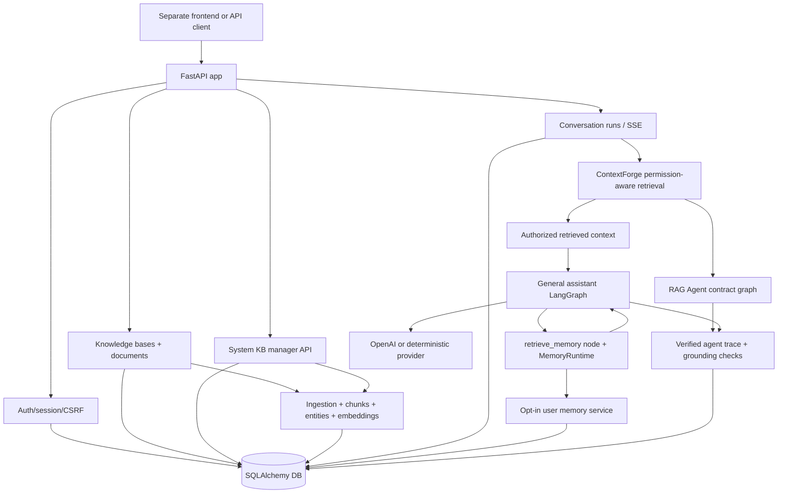

# my-agents

[English](./README.en.md) | 한국어

`my-agents`는 개인 지식, 그룹 지식, 권한이 있는 사용자가 관리하는 system knowledge를 바탕으로 답변하는 AI 채팅 제품의 backend입니다. 프론트엔드는 별도 저장소에서 다루고, 이 저장소는 인증, 권한, 지식 기반, 대화 실행, 출처, memory 설정 같은 product API boundary에 집중합니다.

현재 상태는 [`docs/implementation-tracking.md`](./docs/implementation-tracking.md)를 먼저 확인하세요. 큰 방향과 backlog는 [`ROADMAP.md`](./ROADMAP.md)에 있습니다.

## 제품이 제공하는 것

- Email/password 계정, 초대 링크 기반 가입, 세션, guest access gate
- 개인 지식 기반, 초대 기반 group 지식 기반, root/system 사용자가 관리하는 project knowledge
- 문서 업로드, 수집, 검색, 출처가 있는 답변
- Server-owned conversation/run history와 streaming response
- 그룹 멤버와 공개 요청을 관리하기 위한 권한 흐름
- 사용자가 실험적으로 켜고 끌 수 있는 long-term memory

## 제품 경계

- 개인 지식과 대화 기록은 기본적으로 사용자 소유입니다.
- 그룹 지식은 초대를 수락한 멤버에게만 열립니다.
- System knowledge는 guest를 포함한 authenticated chat retrieval에 공개되는
  project context이며, 관리는 `root`/`system` user type만 할 수 있습니다.
- `user_type` 변경은 `scripts.set_user_type` operator script로만 수행하며,
  공개 API에는 role mutation route를 두지 않습니다.
- Nickname은 사람을 알아보기 위한 표시 이름이며, 로그인과 초대의 식별자는 email입니다. 계정이 없는 초대 수신자는 초대 token이 증명한 email을 그대로 사용하고 nickname/password만 정합니다.
- Long-term memory는 기본적으로 꺼져 있고, 사용자가 실험 기능으로 직접 켤 수 있습니다.
- 실제 secret은 commit하지 않습니다. `.env`는 local only이고 `.env.example`은 안전한 placeholder입니다.

## 아키텍처 요약



이 README는 전체 그림만 설명합니다. 세부 API contract, migration note, 운영 절차는 `docs/`와 [`scripts/README.md`](./scripts/README.md)에 둡니다.

## 로컬 실행

의존성 설치와 local 설정 파일 생성:

```bash
uv sync
cp .env.example .env
```

Credential 없는 test와 local smoke check에는 deterministic mode를 사용합니다.

```bash
MY_AGENTS_RESPONSE_MODE=deterministic
```

API 시작:

```bash
uv run fastapi dev main.py
```

Fallback:

```bash
uv run uvicorn main:app --reload
```

OpenAPI는 실행 중인 서버에서 확인할 수 있습니다.

```text
http://127.0.0.1:8000/openapi.json
```

## 주요 검사

```bash
uv run pytest -q
uv run ruff check . --no-cache
uv run ruff format --check .
git diff --check
```

## 더 읽기

- 현재 구현 상태: [`docs/implementation-tracking.md`](./docs/implementation-tracking.md)
- Product roadmap: [`ROADMAP.md`](./ROADMAP.md)
- Product docs: [`docs/product-chat-service/ko/README.md`](./docs/product-chat-service/ko/README.md)
- Frontend demo runbook: [`docs/product-chat-service/ko/10-frontend-demo-runbook.md`](./docs/product-chat-service/ko/10-frontend-demo-runbook.md)
- Script commands: [`scripts/README.md`](./scripts/README.md)
- Ideas: [`docs/idea/`](./docs/idea/)
