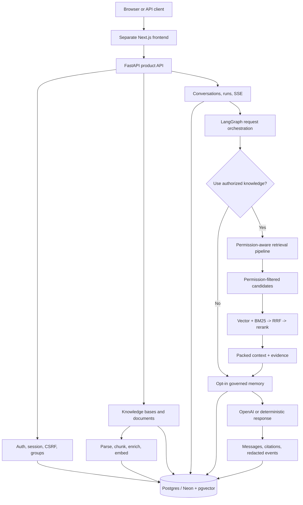

# my-agents

[English](./README.en.md) | 한국어

**Permission-aware Agentic RAG Backend** — 개인 문서, 그룹 공유 문서, 관리자가 제공한 공통 지식 문서를 권한 경계 안에서 검색하고, 출처와 실행 과정을 함께 남기는 AI 채팅 제품의 백엔드입니다.

[라이브 제품 데모](https://www.my-agents.dev) · [프론트엔드 저장소](https://github.com/heecheon92/my-agents-frontend) · [구현 현황](./docs/implementation-tracking.md) · [로드맵](./ROADMAP.md)

> 라이브 서비스는 채용 담당자와 소규모 테스터를 위한 controlled alpha입니다. 가입과 guest access는 운영 정책에 따라 제한될 수 있으며, production-ready SaaS를 의미하지 않습니다.

## 3분 요약

`my-agents`는 단순한 RAG 예제가 아니라, 실제 제품에서 필요한 **인증 → 권한 확인 → 문서 수집 → hybrid retrieval → LangGraph 실행 → SSE streaming → citation/audit 저장** 흐름을 한 백엔드에 연결한 프로젝트입니다.

| 질문 | 이 프로젝트의 답 |
| --- | --- |
| 무엇을 만들었나? | 개인 문서, 그룹 공유 문서, 관리자 제공 공통 지식 문서를 이용해 출처가 있는 답변을 생성하는 FastAPI + LangGraph 백엔드 |
| 무엇이 어려웠나? | 검색 품질보다 먼저 적용해야 하는 권한 경계, server-owned 대화 상태, 문서 ingestion, streaming, 운영 가능한 관측성 |
| 무엇을 직접 검증했나? | offline test suite, permission regression, production smoke, ingestion/retrieval before-after 성능 측정 |
| 현재 수준은? | 핵심 제품 흐름을 시연할 수 있는 controlled alpha; 운영 안정화와 보안 검토는 계속 진행 중 |

## 핵심 엔지니어링 포인트

- **Permission-first retrieval**: 권한 없는 chunk는 ranking, graph expansion, prompt 구성 전에 제외합니다.
- **Hybrid retrieval**: pgvector vector search와 BM25 lexical search에서 후보를 독립적으로 수집하고, 안정적인 chunk identifier 기준 RRF(`k=60`)로 결합한 뒤 reranking/context packing을 수행합니다.
- **Inspectable orchestration**: LangGraph state machine이 authorized knowledge 사용 여부 판단, retrieval, opt-in memory, response composition을 명시적인 단계로 연결합니다.
- **Application-owned state**: conversation, run, message, citation, redacted event는 application database가 소유합니다. LangGraph의 일시적인 실행 state를 사용자 transcript의 source of truth로 사용하지 않습니다.
- **Streaming product contract**: SSE로 진행 이벤트, agent trace, answer delta, 완료/실패 상태를 전달하고 같은 결과를 서버에 저장합니다.
- **Offline-first verification**: LLM, embedding, reranker를 deterministic test double로 교체할 수 있어 전체 테스트가 API key 없이 실행됩니다.

## 측정된 성능 개선

아래 수치는 공개 SLA가 아니라 동일 시나리오를 비교한 **local profile**입니다. 각 실험은 예상보다 느린 구간을 profiling으로 확인한 뒤 수행했으며, 최적화 전후에 검색 결과 구조와 문서 처리 품질 검사를 동일하게 유지했습니다.

| 영역 | 적용 방법 | Before | After | 결과 |
| --- | --- | ---: | ---: | ---: |
| 195-page PDF ingestion end-to-end | OpenAI metadata 생성과 embedding/indexing을 동시에 실행하고, native-text PDF의 불필요한 사전 parsing pass를 생략 | 36.16s | 16.57s | 약 54% 개선 |
| Hybrid retrieval candidate gathering | ranking에 필요하지 않은 큰 column의 조회를 미루고, 최종 top-k 후보의 전체 record만 가져오도록 변경 | 31.42s | 1.84s | 94.1% 개선 |
| BM25 corpus/rank/hydration | 모든 chunk의 전체 ORM row 대신 ID와 text만으로 corpus를 만들고, BM25 top-k row만 추가 조회 | 14.34s | 0.14s | 99.0% 개선 |

Ingestion은 외부 API 응답을 기다리는 시간과 local indexing 작업을 겹쳐 실행하고, 이미 text extraction이 가능한 PDF에는 중복 parsing을 피했습니다. Retrieval은 ranking에 필요한 최소 데이터만 먼저 읽고 상위 후보의 전체 record를 나중에 가져오도록 바꾸면서 중복 SQL/embedding 작업도 제거했습니다. 상세 측정 조건과 남은 병목은 [performance logs](./docs/performance/README.md)에 기록합니다.

## 아키텍처



### 요청 흐름에서 지키는 경계

1. API layer가 session, CSRF, group/knowledge-base access를 확인합니다.
2. LangGraph orchestration이 질문에 authorized knowledge 검색이 필요한지 결정합니다.
3. Retrieval service가 현재 사용자에게 허용된 개인, 그룹, 관리자 제공 source로 database query 범위를 제한합니다.
4. Vector, lexical, metadata, structured-entity 후보가 fusion/reranking/context packing을 통과합니다.
5. 답변과 citation, compact agent trace, redacted timing/event가 같은 run에 저장됩니다.

현재 production runtime은 하나의 assistant orchestration과 그 안에서 실행되는 retrieval subworkflow로 구성됩니다. `agent`와 `graph`라는 표현은 코드의 제어 경계를 설명하며, 여러 autonomous specialist가 독립 서비스로 실행된다는 의미는 아닙니다.

## 주요 기능

- Email/password signup, verification, session, CSRF, password reset, gated guest access
- 초대 기반 group membership, manager roster, personal-to-group publish approval/copy workflow
- 개인, 그룹, 관리자 제공 공통 knowledge base와 document-level authorization
- PDF, Markdown, plain text, `.xlsx`, `.pptx`, `.docx` upload/ingestion
- PyMuPDF fast path와 pypdf, Docling, Tesseract fallback
- pgvector + BM25 + RRF + deterministic/optional cross-encoder reranking
- Server-owned conversation/run history, SSE streaming, citations, redacted agent events
- 사용자가 직접 켜는 experimental long-term memory와 governance lifecycle
- Prometheus timing metrics와 local Rich retrieval/ingestion profiler

## 기술 스택

| 영역 | 기술 |
| --- | --- |
| API / application | Python 3.14, FastAPI, Pydantic |
| Agent / model | LangGraph, `langchain-openai`, `ChatOpenAI` |
| Persistence | SQLAlchemy, Alembic, PostgreSQL/Neon, pgvector |
| Retrieval | Vector search, BM25Okapi, RRF, optional BAAI cross-encoder |
| Document processing | PyMuPDF, pypdf, Docling, Tesseract, openpyxl, python-pptx |
| Streaming / observability | SSE, Prometheus metrics, redacted run events |
| Quality / delivery | pytest, Ruff, uv, Docker, Render |

## 프로젝트 구조

첫 방문자가 책임 경계를 먼저 이해할 수 있도록 상위 package를 기능 중심으로 정리했습니다. 내부 구현 이름은 아래의 코드 탐색 표에서만 사용합니다.

```text
my_agents/
├── api/                       # FastAPI routes and thin HTTP boundaries
├── agents/                    # LangGraph orchestration and retrieval workflows
├── auth/ and permissions/     # Session, CSRF, group/document authorization
├── knowledge/                 # Upload, parsing, ingestion, retrieval
├── conversations/             # Server-owned transcript/run models
├── memory/                    # Opt-in memory policy and database persistence
└── persistence/               # SQLAlchemy database boundary

tests/                         # Offline behavior and regression contracts
alembic/                       # Postgres schema migrations
docs/                          # Architecture, operations, performance evidence
scripts/                       # Smoke, benchmark, migration, operator utilities
```

| 확인하려는 동작 | 코드 위치 |
| --- | --- |
| 질문이 knowledge retrieval을 필요로 하는지 판단하고 답변을 구성하는 흐름 | `my_agents/agents/general_assistant/` |
| Assistant와 permission-aware retrieval 사이의 입력/출력 contract | `my_agents/agents/rag_agent/` |
| Query planning, hybrid candidate fusion, reranking, context packing | `my_agents/agents/context_forge/` |

## 로컬 실행

사전 요구사항은 [uv](https://docs.astral.sh/uv/)와 Python 3.14입니다.

```bash
uv sync
cp .env.example .env
MY_AGENTS_RESPONSE_MODE=deterministic uv run fastapi dev main.py
```

다른 터미널에서 credential 없는 smoke check를 실행합니다.

```bash
curl http://127.0.0.1:8000/health
curl -X POST http://127.0.0.1:8000/assistant/chat \
  -H 'Content-Type: application/json' \
  -d '{"message":"Plan my next backend milestone","history":[]}'
```

실제 OpenAI 응답을 사용하려면 `.env`에 `OPENAI_API_KEY`를 설정하고 `MY_AGENTS_RESPONSE_MODE=openai`를 사용합니다. Application code는 OpenAI를 직접 호출하지 않고 `langchain-openai` / `ChatOpenAI` 경계를 사용합니다.

OpenAPI는 실행 중인 서버의 `http://127.0.0.1:8000/openapi.json`에서 확인할 수 있습니다. 전체 product demo와 Postgres 설정은 [frontend demo runbook](./docs/product-chat-service/ko/10-frontend-demo-runbook.md)을 참고하세요.

## 검증

```bash
uv run pytest -q
uv run ruff check . --no-cache
uv run ruff format --check .
git diff --check
```

2026-08-05 현재 checkout에서 전체 test suite는 **464 passed, 2 skipped**이며 실제 credential을 요구하지 않습니다.

## 보안과 개인정보 경계

- 실제 secret과 local database는 commit하지 않습니다. `.env.example`에는 placeholder만 둡니다.
- Public-release 검사는 current tree와 Git 전체 history를 모두 대상으로 하며, 발견된 credential은 파일 삭제 여부와 관계없이 폐기·재발급하는 것을 원칙으로 합니다.
- Retrieval permission은 prompt 지시가 아니라 application/service layer에서 적용합니다.
- Metrics label과 기본 agent event에는 raw prompt, document text, email, user/document ID를 넣지 않습니다.
- System knowledge 관리 권한은 privileged administrative account type으로 제한하며 public role-mutation API를 제공하지 않습니다.
- 공개 데모에는 민감하거나 규제 대상이거나 대체 불가능한 문서를 업로드하지 않는 것을 전제로 합니다.

## 현재 한계와 다음 작업

- Controlled alpha이며 broad self-service production SaaS가 아닙니다.
- External ingestion worker는 DB polling 기반입니다. Durable queue, supervision, stale-job recovery가 더 필요합니다.
- Uploaded original을 위한 object storage, document versioning/re-ingestion, account deletion/export가 아직 없습니다.
- Cross-encoder cold start와 작은 hosted instance의 PDF processing latency가 남아 있습니다.
- Shared rate limiting, production security review, automated migration/smoke gate가 필요합니다.
- LangGraph Store 기반 memory runtime, HITL/resume checkpointer, non-RAG tools, production multi-agent orchestration은 roadmap 단계입니다.

## 핵심 문서

- [현재 구현과 검증 상태](./docs/implementation-tracking.md)
- [Permission-aware RAG 설계](./docs/product-chat-service/ko/06-permission-aware-rag.md)
- [Assistant orchestration flow](./my_agents/agents/general_assistant/README.md)
- [Retrieval subworkflow와 context assembly](./my_agents/agents/rag_agent/README.md)
- [성능 측정 기록](./docs/performance/README.md)
- [Production smoke evidence](./docs/product-chat-service/en/16-production-smoke-evidence-2026-06-06.md)

더 큰 방향과 미완료 항목은 [ROADMAP.md](./ROADMAP.md), 운영/마이그레이션 명령은 [scripts/README.md](./scripts/README.md)에서 확인할 수 있습니다.
