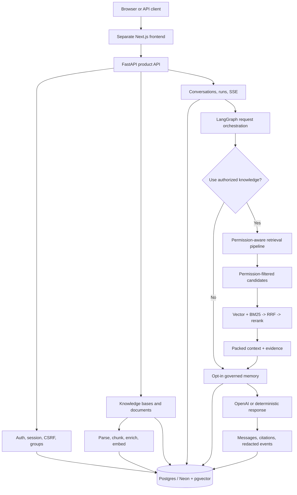

# my-agents

[English](./README.en.md) | 한국어

**Permission-aware Agentic RAG Backend** — 개인 문서, 그룹에 공유된 문서, 관리자가 등록한 공통 문서를 권한 경계 안에서만 검색하고, 사용자에게 보이는 인용과 내부 실행 기록을 남기는 AI 채팅 서비스의 백엔드입니다.

[서비스 바로가기](https://www.my-agents.dev) · [프론트엔드 저장소](https://github.com/heecheon92/my-agents-frontend) · [구현 현황](./docs/implementation-tracking.md) · [로드맵](./ROADMAP.md)

> 배포해서 운영 중이지만 누구나 즉시 가입할 수 있는 형태는 아닙니다. 가입은 직접 승인하고 있고, 승인을 기다리지 않고 둘러보려면 게스트로 접속하면 됩니다.

## 3분 요약

`my-agents`는 RAG 예제가 아니라, 실제 서비스에 필요한 **인증 → 권한 확인 → 문서 수집 → 하이브리드 검색 → LangGraph 실행 → SSE 스트리밍 → 인용·감사 기록 저장** 흐름을 하나의 백엔드로 이어 붙인 프로젝트입니다.

| 질문 | 이 프로젝트의 답 |
| --- | --- |
| 무엇을 만들었나 | 개인 문서, 그룹 공유 문서, 관리자가 등록한 ambient 공통 문서를 바탕으로 답하고, 사용자에게 보이는 출처에만 인용을 붙이는 FastAPI + LangGraph 백엔드 |
| 무엇이 어려웠나 | 검색 품질보다 먼저 지켜야 하는 권한 경계, 서버가 소유하는 대화 상태, 문서 수집, 스트리밍, 그리고 실제로 운영에 쓸 수 있는 관측 지표 |
| 무엇을 직접 검증했나 | 외부 키 없이 도는 테스트, 권한 회귀 테스트, 운영 환경 스모크, 수집·검색 전후 성능 측정 |
| 지금 어디까지 왔나 | 핵심 흐름은 배포해서 돌아가고 있고, 부하 대응과 보안 점검은 계속 다듬는 중 |

## 핵심 엔지니어링 포인트

- **권한을 가장 먼저 적용하는 검색**: 볼 수 없는 청크는 순위 계산, 그래프 확장, 프롬프트 구성에 들어가기 전에 걸러냅니다.
- **하이브리드 검색**: pgvector 벡터 검색과 BM25 키워드 검색이 각각 후보를 모으고, 청크 식별자를 기준으로 RRF(`k=60`)로 합친 뒤 재순위와 컨텍스트 구성을 거칩니다.
- **들여다볼 수 있는 오케스트레이션**: LangGraph 상태 머신이 권한 있는 문서를 쓸지 판단하는 단계, 검색, 사용자가 켠 메모리, 답변 구성을 각각 눈에 보이는 단계로 연결합니다.
- **상태는 애플리케이션이 소유**: 대화, 실행, 메시지, 인용, 가려진 이벤트는 애플리케이션 데이터베이스가 소유합니다. LangGraph의 일시적인 실행 상태를 사용자에게 보여줄 기록의 기준으로 삼지 않습니다.
- **스트리밍도 계약의 일부**: SSE로 진행 상황, 에이전트 실행 흐름, 답변 조각, 완료·실패 상태를 내보내고, 같은 내용을 서버에도 저장합니다.
- **키 없이 도는 검증**: LLM, 임베딩, 재순위 모델을 결정적인 테스트 대역으로 바꿔 끼울 수 있어서 전체 테스트가 API 키 없이 돌아갑니다.

## 측정한 성능 개선

아래 수치는 공개 SLA가 아니라, 같은 시나리오를 로컬에서 측정해 비교한 값입니다. 모두 프로파일링으로 예상보다 느린 구간을 확인한 뒤 손을 댔고, 최적화 전후로 검색 결과의 구성과 문서 처리 품질 검사는 똑같이 유지했습니다.

| 구간 | 무엇을 바꿨나 | 이전 | 이후 | 결과 |
| --- | --- | ---: | ---: | ---: |
| 195쪽 PDF 수집 전체 | OpenAI 메타데이터 생성과 임베딩·색인을 함께 돌리고, 텍스트가 이미 들어 있는 PDF에서 불필요한 사전 파싱을 생략 | 36.16s | 16.57s | 약 54% 단축 |
| 하이브리드 검색 후보 수집 | 순위 계산에 필요 없는 큰 컬럼은 나중에 읽고, 최종 상위 후보만 전체 레코드를 가져오도록 변경 | 31.42s | 1.84s | 94.1% 단축 |
| BM25 코퍼스 구성·순위·보강 | 모든 청크의 ORM 레코드 대신 ID와 본문만으로 코퍼스를 만들고, 상위 결과만 추가로 조회 | 14.34s | 0.14s | 99.0% 단축 |

문서 수집은 외부 API 응답을 기다리는 시간과 로컬 색인 작업을 겹쳐 돌리고, 이미 텍스트를 꺼낼 수 있는 PDF는 두 번 파싱하지 않습니다. 검색은 순위를 매기는 데 필요한 최소한만 먼저 읽고 상위 후보가 정해진 다음에 전체 레코드를 가져오도록 바꾸면서, 중복으로 돌던 SQL과 임베딩 작업도 함께 걷어냈습니다. 측정 조건과 아직 남은 병목은 [성능 기록](./docs/performance/README.md)에 정리해 두었습니다.

## 아키텍처



### 요청 하나가 지나가면서 지키는 경계

1. API 계층이 세션, CSRF, 그룹과 지식 베이스 접근 권한을 확인합니다.
2. LangGraph 오케스트레이션이 이 질문에 문서 검색이 필요한지 판단합니다.
3. 검색 서비스가 지금 이 사용자가 볼 수 있는 개인·그룹·관리자 제공 문서로만 조회 범위를 좁힙니다.
4. 벡터, 키워드, 메타데이터, 구조화된 엔티티 후보가 결합과 재순위, 컨텍스트 구성을 거칩니다.
5. 답변과 인용, 요약된 실행 흐름, 가려진 시간·이벤트 기록이 같은 실행에 함께 저장됩니다.

관리자가 제공한 system knowledge는 사용자에게 보이는 source가 아니라 ambient model
context입니다. 출처는 내부 audit record에 유지하되, public run/event/citation response에서는
KB/document/chunk ID, filename, snippet, citation을 생략합니다.

운영 환경에서 도는 것은 어시스턴트 오케스트레이션 하나와 그 안에서 실행되는 검색 서브워크플로입니다. 코드에 쓰인 `agent`와 `graph`는 제어 경계를 가리키는 이름이지, 여러 에이전트가 각각 독립된 서비스로 돌아간다는 뜻은 아닙니다.

## 주요 기능

- 이메일·비밀번호 가입, 이메일 인증, 세션, CSRF, 비밀번호 재설정, 승인을 거치는 게스트 접속
- 배포된 환경의 실제 게스트 유효 시간, 사용 한도, 코드 전달 방식을 알려 주는 공개 엔드포인트 `GET /auth/guest/policy`
- 초대로만 맺어지는 그룹 멤버십, 관리자 명단, 개인 문서를 그룹으로 공유 요청하고 승인·복사하는 흐름
- 개인, 그룹, 관리자 제공 지식 베이스와 문서 단위 권한 관리
- PDF, Markdown, 일반 텍스트, `.xlsx`, `.pptx`, `.docx` 업로드와 수집
- PyMuPDF를 먼저 시도하고 pypdf, Docling, Tesseract로 넘어가는 처리 경로
- pgvector와 BM25를 RRF로 합치고, 결정적 방식 또는 선택적 cross-encoder로 재순위
- 서버가 소유하는 대화·실행 기록, SSE 스트리밍, 인용, 가려진 에이전트 이벤트
- 공식 도메인 `https://my-agents.dev`에 연결된 일관된 `my-agents` 어시스턴트
  정체성과, 바뀔 수 있는 제품 정보를 권한이 확인된 context에 근거해 답하는 정책
- 사용자가 직접 켜는 실험적인 장기 메모리와 관리 절차
- Prometheus 지표와 로컬에서 쓰는 Rich 기반 검색·수집 프로파일러

## 기술 스택

| 영역 | 기술 |
| --- | --- |
| API / 애플리케이션 | Python 3.14, FastAPI, Pydantic |
| 에이전트 / 모델 | LangGraph, `langchain-openai`, `ChatOpenAI` |
| 저장소 | SQLAlchemy, Alembic, PostgreSQL/Neon, pgvector |
| 검색 | 벡터 검색, BM25Okapi, RRF, 선택적 BAAI cross-encoder |
| 문서 처리 | PyMuPDF, pypdf, Docling, Tesseract, openpyxl, python-pptx |
| 스트리밍 / 관측 | SSE, Prometheus, 가려진 실행 이벤트 |
| 품질 / 배포 | pytest, Ruff, uv, Docker, Render |

## 프로젝트 구조

처음 보는 사람이 내부 이름보다 책임 경계를 먼저 파악할 수 있도록 상위 패키지를 역할 중심으로 적었습니다. 내부 구현 이름은 아래 코드 위치 표에서만 씁니다.

```text
my_agents/
├── api/                       # FastAPI routes and thin HTTP boundaries
├── agents/                    # LangGraph orchestration and retrieval workflows
├── auth/ and permissions/     # Session, CSRF, group/document authorization
├── knowledge/                 # Upload, parsing, ingestion, retrieval
├── conversations/             # Server-owned transcript/run models
├── memory/                    # Opt-in memory policy and database persistence
└── persistence/               # SQLAlchemy database boundary

tests/                         # Offline behavior and regression contracts
alembic/                       # Postgres schema migrations
docs/                          # Architecture, operations, performance evidence
scripts/                       # Smoke, benchmark, migration, operator utilities
```

| 확인하려는 동작 | 코드 위치 |
| --- | --- |
| 질문에 문서 검색이 필요한지 판단하고 답변을 구성하는 흐름 | `my_agents/agents/general_assistant/` |
| 어시스턴트와 권한 기반 검색 사이에 오가는 입력과 출력 | `my_agents/agents/rag_agent/` |
| 질의 계획, 후보 결합, 재순위, 컨텍스트 구성 | `my_agents/agents/context_forge/` |

## 로컬에서 실행하기

[uv](https://docs.astral.sh/uv/)와 Python 3.14이 필요합니다.

```bash
uv sync
cp .env.example .env
MY_AGENTS_RESPONSE_MODE=deterministic uv run fastapi dev main.py
```

다른 터미널에서 키 없이 동작을 확인합니다.

```bash
curl http://127.0.0.1:8000/health
curl -X POST http://127.0.0.1:8000/assistant/chat \
  -H 'Content-Type: application/json' \
  -d '{"message":"Plan my next backend milestone","history":[]}'
```

실제 OpenAI 응답을 받으려면 `.env`에 `OPENAI_API_KEY`를 넣고 `MY_AGENTS_RESPONSE_MODE=openai`로 실행합니다. 일반 응답은 `langchain-openai`의 `ChatOpenAI` 경계를 거칩니다. 선택 기능인 임시 document workspace만 Files, Containers, Hosted Shell, Skills를 사용하기 위해 격리된 OpenAI SDK adapter를 사용합니다.

일반 계정의 run 요청은 선택적으로 `reasoning_mode`(`standard` 또는 `pro`)와 `reasoning_effort`(`none`, `minimal`, `low`, `medium`, `high`, `xhigh`, `max`)를 받을 수 있습니다. 생략하면 mode는 `standard`, effort는 `MY_AGENTS_OPENAI_REASONING_EFFORT`를 사용합니다. Guest가 값을 보내더라도 서버는 `standard`와 환경변수 기본 effort로 고정합니다. 실제 기본값과 model 지원 여부는 `GET /capabilities/reasoning`에서 확인할 수 있습니다. `pro`는 GPT-5.6 model에서만 허용됩니다. 세부 계약은 [run reasoning 설정 계약](./docs/product-chat-service/ko/26-run-reasoning-preferences.md)에 있습니다.

`MY_AGENTS_DOCUMENT_WORKSPACE_ENABLED=true`로 켜면 승인된 일반 계정은 대화에 임시 파일을 첨부해 GPT-5.6 Sol로 분석하고, 인증된 spreadsheet 결과(`.xlsx`, `.csv`, `.tsv`)를 내려받을 수 있습니다. Guest에는 열리지 않으며, 업로드마다 OpenAI 전송 동의가 필요합니다. 파일 본문은 Product DB에 저장하지 않고 OpenAI `user_data` file과 network-disabled hosted container에만 제한 시간 동안 둡니다. 세부 계약은 [OpenAI document workspace 설계](./docs/product-chat-service/ko/25-openai-document-workspace.md)를 봅니다.

LangGraph persistence는 PostgreSQL에서만 켜는 opt-in 기능입니다. `MY_AGENTS_CHECKPOINTER_ENABLED=true`이면 문서 범위가 모호한 run이 `202 waiting_for_input`으로 멈추고, process restart 뒤에도 사용자가 권한 있는 문서를 선택해 같은 run을 재개할 수 있습니다. `MY_AGENTS_MEMORY_STORE_ENABLED=true`이면 PostgresStore가 semantic memory candidate search를 담당하지만, consent/status/sensitivity/provenance/source staleness는 계속 Product DB row가 강제합니다. 두 flag를 켜기 전에 `uv run python -m scripts.langgraph_persistence setup`과 zero-drift memory reconciliation을 실행합니다.

VS Code의 `FastAPI: uvicorn main:app (local pgvector)` 프로필은 실행 전에 마이그레이션을 돌리는데, 이때 셸에서 `uv`를 찾는 대신 Python 확장이 선택한 인터프리터를 그대로 씁니다. GUI로 켠 VS Code의 `PATH`에 `uv`가 없어도 동작하도록 만든 구성이므로, 쓰기 전에 이 저장소의 `.venv` 인터프리터를 선택해 두세요.

OpenAPI 문서는 서버를 띄운 뒤 `http://127.0.0.1:8000/openapi.json`에서 볼 수 있습니다. 프론트엔드까지 붙여 전체 흐름을 돌려 보는 방법과 PostgreSQL 설정은 [프론트엔드 연동 실행 안내](./docs/product-chat-service/ko/10-frontend-demo-runbook.md)에 있습니다.

### 프론트엔드가 의존하는 계약

- HTTP·검증 오류는 기존 `detail`과 함께 기계가 읽을 수 있는 `code`를 반환합니다. UI는 `code`를 번역 키로 쓰고 `detail`은 진단용으로만 취급해야 합니다.
- `GET /conversations/{conversation_id}/runs/{run_id}/events`는 `event_type`으로 구분되는 닫힌 union입니다. 기존 run/retrieval/graph/workspace/answer/cancellation/failure 이벤트에 `run_interrupted`, `run_resumed`가 추가됩니다.
- Checkpointer가 켜져 있으면 run 생성은 `200 completed` 또는 `202 waiting_for_input`을 반환합니다. 대기 중인 document-selection interaction은 run detail/options endpoint에서 새로고침 후에도 복구되며, `/runs/{run_id}/resume` 또는 `/resume/stream`으로 재개해도 guest prompt를 추가 소비하지 않습니다. Option에는 사용자가 통제하는 personal/group document만 포함하고 ambient system knowledge는 자동 주입하되 선택 대상으로 노출하지 않습니다. Interaction과 resume payload는 protocol-neutral `schema_version=1`과 semantic `type`을 필수로 사용하며, 세부 규칙은 [agent와 frontend 사이의 interaction 계약](./docs/product-chat-service/ko/27-agent-frontend-interaction-contract.md)에 있습니다.
- `GET /capabilities/document-workspace`는 현재 enable/eligibility, 허용 형식, 제한, retention을 반환합니다. 첨부는 `POST/GET/DELETE /conversations/{conversation_id}/attachments`, 결과물은 `GET /conversations/{conversation_id}/artifacts`와 해당 download URL을 사용합니다. Run 요청의 `attachment_ids`가 실제 실행 대상을 고릅니다.
- `GET /capabilities/reasoning`은 surface별 Pro 지원 여부, server default effort, 허용 enum, guest customization 가능 여부를 반환하며 raw provider model identifier는 의도적으로 제외합니다. Run/replay 요청의 선택적 `reasoning_mode`와 `reasoning_effort`는 effective 값으로 run에 저장되고 응답 및 `run_started` event에 다시 제공됩니다.
- 저장된 이벤트의 payload와 `agent_trace`는 이벤트·단계별 허용 목록을 통과한 필드만 내보냅니다. `answer_delta`, `run_completed`, `run_error`는 스트리밍 전용이라 저장되는 이벤트 union에는 들어가지 않습니다.
- 비동기 수집 진행률은 `queued=0`, `claimed=1`, `chunking=15`, `embedding=45`, 선택적으로 `indexing=70`, `entities=85`, `metadata=95`, `completed=100`으로 저장되며 폴링 엔드포인트에서 읽을 수 있습니다. 시간이 아니라 단계 도달을 나타내는 값입니다.

## 검증

```bash
uv run pytest -q
uv run ruff check . --no-cache
uv run ruff format --check .
git diff --check
```

2026-08-17 기준 이 체크아웃의 전체 offline test는 **497 passed, 3 skipped**이며 실제 자격 증명이 없어도 돌아갑니다. Gated PostgreSQL checkpoint restart smoke도 local pgvector profile에서 통과합니다.

## 보안과 개인정보 경계

- 실제 비밀 값과 로컬 데이터베이스는 커밋하지 않습니다. `.env.example`에는 자리 표시자만 둡니다.
- 공개 전 점검은 현재 트리뿐 아니라 Git 전체 이력을 함께 봅니다. 노출된 자격 증명은 파일을 지웠더라도 폐기하고 다시 발급하는 것을 원칙으로 합니다.
- 검색 권한은 프롬프트 지시가 아니라 애플리케이션과 서비스 코드에서 강제합니다.
- 지표 라벨과 기본 이벤트에는 원본 프롬프트, 문서 본문, 이메일, 자격 증명, 모델 제공자 추적 정보를 넣지 않습니다. 이벤트 응답 경계는 중첩된 `agent_trace.evidence`까지 허용 목록으로 걸러냅니다.
- 공통 문서 관리 권한은 별도의 관리자 계정 유형으로 제한하며, 역할을 바꾸는 공개 API는 두지 않습니다.
- 공개된 서비스이므로, 민감하거나 규제 대상이거나 잃어버리면 곤란한 문서는 올리지 않는 것을 전제로 합니다.

## 지금의 한계와 다음 작업

- 가입을 직접 승인하는 방식이라 누구나 바로 쓰는 셀프서비스 형태는 아닙니다.
- 외부 수집 워커가 데이터베이스 폴링으로 동작합니다. 안정적인 큐, 워커 감시, 멈춘 작업 복구가 더 필요합니다.
- 업로드한 원본을 위한 오브젝트 스토리지, 문서 버전 관리와 재수집, 계정 삭제와 내보내기는 아직 없습니다.
- cross-encoder를 처음 띄울 때의 지연과, 작은 인스턴스에서의 PDF 처리 시간이 남아 있습니다.
- 여러 인스턴스에서 공유하는 요청 제한, 운영 보안 점검, 마이그레이션·스모크 자동화가 필요합니다.
- 검색 외 도구, background execution scheduler, 여러 에이전트를 운영에서 함께 돌리는 구성은 로드맵 단계입니다. LangGraph persistence는 구현되어 있지만 PostgreSQL setup/reconciliation 확인 전까지 opt-in으로 유지합니다.

## 핵심 문서

- [구현과 검증 현황](./docs/implementation-tracking.md)
- [권한 기반 RAG 설계](./docs/product-chat-service/ko/06-permission-aware-rag.md)
- [어시스턴트 오케스트레이션 흐름](./my_agents/agents/general_assistant/README.md)
- [검색 서브워크플로와 컨텍스트 구성](./my_agents/agents/rag_agent/README.md)
- [성능 측정 기록](./docs/performance/README.md)
- [운영 환경 스모크 기록](./docs/product-chat-service/en/16-production-smoke-evidence-2026-06-06.md)

더 큰 방향과 남은 일은 [ROADMAP.md](./ROADMAP.md)에, 운영과 마이그레이션 명령은 [scripts/README.md](./scripts/README.md)에 있습니다.
