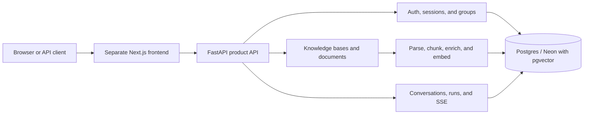
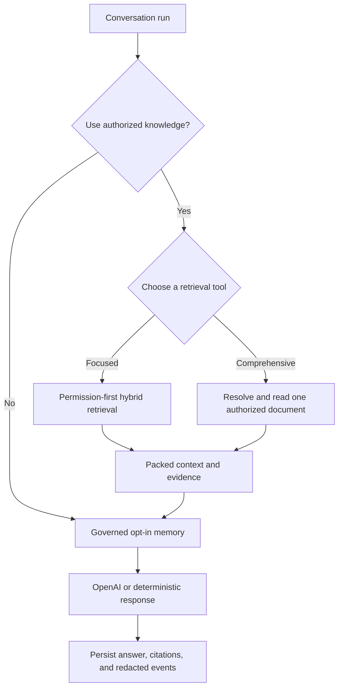

# my-agents

English | [한국어](./README.ko.md)

**Permission-aware Agentic RAG Backend** — the backend for an AI chat product that searches personal documents, group-shared documents, and administrator-provided reference knowledge only within explicit authorization boundaries, and records both user-visible citations and internal execution evidence.

[Live service](https://www.my-agents.dev) · [Frontend repository](https://github.com/heecheon92/my-agents-frontend) · [Implementation status](./docs/implementation-tracking.md) · [Roadmap](./ROADMAP.md)

> [!NOTE]
> The service is deployed and running, but new accounts are approved manually. Use guest access to look around without waiting for approval.

## Three-minute overview

`my-agents` is more than a RAG example. It connects the whole flow a real product needs in one backend: **authentication → authorization → document ingestion → hybrid retrieval → LangGraph execution → SSE streaming → citation/audit persistence**.

| Question | Answer |
| --- | --- |
| What did I build? | A FastAPI + LangGraph backend that answers from personal, group-shared, and administrator-provided documents, and cites only sources the user is allowed to see |
| What made it hard? | Permission boundaries that come before retrieval quality, server-owned conversation state, ingestion, streaming, and observability that is useful in production |
| What did I verify? | A key-free offline test suite, permission regressions, production smoke paths, and before/after ingestion and retrieval profiles |
| Where is it now? | The core flow is deployed and running; load handling and security review continue |

## Engineering highlights

- **Permission-first retrieval**: chunks the user cannot see are removed before ranking, graph expansion, and prompt construction.
- **Hybrid retrieval**: pgvector vector search and BM25 keyword search gather candidates independently, merge them with RRF (`k=60`), then rerank and pack the context.
- **Bounded full-document review**: only an explicit whole-document request reads one authorized document, and the answer says whether the review was complete or covered only the first range.
- **Inspectable orchestration**: a LangGraph state machine connects the retrieval decision, retrieval, opt-in memory, and response composition as visible stages.
- **Application-owned state**: the application database stores conversations, runs, messages, citations, and redacted events. Temporary LangGraph execution state is never the source of truth for what users see.
- **Streaming as a contract**: SSE carries progress, execution traces, answer deltas, and terminal status while the server persists the same run.
- **Key-free verification**: the LLM, embedding, and reranker boundaries accept deterministic test doubles, so the full suite runs without API keys.

## Measured performance improvements

These are same-scenario **local measurements**, not public SLA claims. Each change followed profiling of a slow path, and search-result shape and document-processing quality checks stayed the same before and after.

| Area | Change | Before | After | Result |
| --- | --- | ---: | ---: | ---: |
| 195-page PDF ingestion, end to end | Run metadata generation concurrently with embedding/indexing, and skip a redundant parse for native-text PDFs | 36.16s | 16.57s | about 54% faster |
| Hybrid retrieval candidate gathering | Defer large columns ranking does not need, and fetch full records only for the final top candidates | 31.42s | 1.84s | 94.1% faster |
| BM25 corpus/rank/hydration | Build the corpus from IDs and text instead of full ORM rows, then fetch only the top results | 14.34s | 0.14s | 99.0% faster |

The [performance logs](./docs/performance/README.md) record exact scenarios and remaining bottlenecks.

## Architecture

For an in-depth walkthrough of message admission, retrieval, streaming, persistence, and resume, see the [message-to-answer service flow](./docs/product-chat-service/38-message-to-answer-service-flow.md).


```mermaid
flowchart LR
    Client["Browser or API client"] --> Frontend["Separate Next.js frontend"]
    Frontend --> API["FastAPI product API"]
    API --> Auth["Auth, sessions, and groups"]
    API --> Knowledge["Knowledge bases and documents"]
    API --> Runs["Conversations, runs, and SSE"]
    Knowledge --> Ingestion["Parse, chunk, enrich, and embed"]
    Auth --> DB[("Postgres / Neon with pgvector")]
    Ingestion --> DB
    Runs --> DB
```

A single chat request follows this flow:


```mermaid
flowchart TD
    Run["Conversation run"] --> Gate{"Use authorized knowledge?"}
    Gate -->|No| Memory["Governed opt-in memory"]
    Gate -->|Yes| Choice{"Choose a retrieval tool"}
    Choice -->|Focused| Focused["Permission-first hybrid retrieval"]
    Choice -->|Comprehensive| Full["Resolve and read one authorized document"]
    Focused --> Context["Packed context and evidence"]
    Full --> Context
    Context --> Memory
    Memory --> Answer["OpenAI or deterministic response"]
    Answer --> Audit["Persist answer, citations, and redacted events"]
```

### Boundaries enforced during a request

1. The API layer validates the session, CSRF, and group/knowledge-base access.
2. Orchestration decides whether the question needs authorized knowledge and, if so, chooses between focused chunk search and a full-document read.
3. Backend code, not the model, decides which documents may be read and how much. A full-document read is limited to one user-selectable personal or group document.
4. Large documents are read only up to a fixed range, and the answer always carries a partial-review disclosure.
5. The answer, citations, coverage, summarized trace, and redacted events are stored under the same run. Raw full-document text is never kept in checkpoints or events.

Administrator-provided reference knowledge is background context added to the model automatically, not a user-visible source. Its provenance stays in internal audit records, and public responses omit its identifiers, filenames, snippets, and citations.

Production runs one assistant orchestration flow with a retrieval subworkflow. The words `agent` and `graph` name control boundaries in the code; they do not mean several agents run as independent services.

## Product capabilities

- Email/password signup and verification, sessions, CSRF, password reset, and approval-gated guest access
- Invite-only group membership and a personal-to-group sharing request and approval flow
- Personal, group, and administrator-provided knowledge bases with document-level permissions
- PDF, Markdown, plain text, `.xlsx`, `.pptx`, and `.docx` upload and ingestion (PyMuPDF first, with pypdf, Docling, and Tesseract fallbacks)
- Hybrid retrieval that merges pgvector and BM25 with RRF, with default Jev rubric reranking and an optional cross-encoder alternative
- Full-document review with complete/partial coverage disclosure and range-backed citations
- Server-owned conversation/run history, SSE streaming, answer-supporting citations, and redacted agent events
- User-enabled experimental long-term memory
- Prometheus metrics and local retrieval/ingestion profilers

## Technology stack

| Area | Technology |
| --- | --- |
| API / application | Python 3.14, FastAPI, Pydantic |
| Agent / model | LangGraph, `langchain-openai`, `ChatOpenAI` |
| Persistence | SQLAlchemy, Alembic, PostgreSQL/Neon, pgvector |
| Retrieval | Vector search, BM25Okapi, RRF, Jev, optional BAAI cross-encoder |
| Document processing | PyMuPDF, pypdf, Docling, Tesseract, openpyxl, python-pptx |
| Streaming / observability | SSE, Prometheus metrics, redacted run events |
| Quality / delivery | pytest, Ruff, uv, Docker, Render |

## Repository map

```text
my_agents/
├── api/                       # FastAPI routes and thin HTTP boundaries
├── agents/                    # LangGraph orchestration and retrieval workflows
├── auth/ and permissions/     # Session, CSRF, group/document authorization
├── knowledge/                 # Upload, parsing, ingestion, retrieval
├── conversations/             # Server-owned transcript/run models
├── memory/                    # Opt-in memory policy and database persistence
└── persistence/               # SQLAlchemy database boundary

tests/                         # Offline behavior and regression contracts
alembic/                       # PostgreSQL schema migrations
docs/                          # Architecture, operations, performance evidence
scripts/                       # Smoke, benchmark, migration, operator utilities
```

| Behavior to inspect | Code location |
| --- | --- |
| Decide whether a question needs retrieval and compose the response | `my_agents/agents/general_assistant/` |
| Input/output contract between the assistant and permission-aware retrieval | `my_agents/agents/rag_agent/` |
| Query planning, candidate fusion, reranking, and context packing | `my_agents/agents/context_forge/` |

## Run locally

Requires [uv](https://docs.astral.sh/uv/) and Python 3.14. These commands need no API keys.

```bash
uv sync
cp .env.example .env
MY_AGENTS_RESPONSE_MODE=deterministic uv run fastapi dev main.py
curl http://127.0.0.1:8000/health   # in another terminal
```

For real OpenAI responses, set `OPENAI_API_KEY` in `.env` and use `MY_AGENTS_RESPONSE_MODE=openai`. OpenAPI is served at `http://127.0.0.1:8000/openapi.json`.

- Run with the frontend and PostgreSQL: [frontend demo runbook](./docs/product-chat-service/10-frontend-demo-runbook.md)
- Environment variables, optional features, operator steps, and frontend contracts: [runtime and integration reference](./docs/product-chat-service/34-runtime-and-integration-reference.md)

Optional operator registration alerts: set `MY_AGENTS_REGISTRATION_NOTIFICATION_EMAIL` to your
operator inbox after running `uv run alembic upgrade head`. Unset or blank disables alerts.
The existing SMTP/Resend transport delivers queued notifications for regular/invited account
creation and guest code redemption. See the [notification contract](./docs/product-chat-service/02-first-party-auth-sessions.md#operator-registration-notifications).

Expired guest cleanup is opt-in, defaults to a 24-hour post-expiry grace period, and preserves
minimal audit/email history. Preview before enabling: [cleanup policy and commands](./docs/product-chat-service/39-expired-guest-cleanup.md).

Guest access now requires the stable `MY_AGENTS_GUEST_CLEANUP_EMAIL_HMAC_KEY` and permits one
trial per email. Re-login preserves the original account, quota, and expiry; registered emails
use regular accounts. Apply migration `0039` and follow the [rollout/reset guide](./docs/product-chat-service/40-guest-trial-abuse-protection.md).

## Verification

```bash
uv run pytest -q
uv run ruff check . --no-cache
uv run ruff format --check .
git diff --check
```

On 2026-09-26, the full offline suite reports **624 passed, 14 skipped** without real credentials.

## Security and privacy boundaries

- Real secrets and local databases are never committed. `.env.example` holds placeholders only.
- Public-release checks cover the current tree and the full Git history. An exposed credential is revoked and rotated even if its file was later deleted.
- Retrieval permissions are enforced in application code, not through prompt instructions.
- Metrics and default events exclude raw prompts, document text, emails, credentials, and provider traces.
- Reference-knowledge management is limited to privileged administrator account types, with no public role-change API.
- The service is publicly reachable, so it assumes users will not upload sensitive, regulated, or irreplaceable documents.

## Current limitations and next steps

- Signup is manually approved, so this is not yet a self-service product.
- The ingestion worker polls the database; durable queueing, supervision, and stale-job recovery still need work.
- Object storage for uploaded originals, document versioning/re-ingestion, and account deletion/export are not implemented yet.
- Cross-encoder cold starts and PDF processing time remain constraints on small instances.
- Full-document review of large documents currently stops after the first range; reading and synthesizing multiple ranges is future work.
- Shared rate limiting across instances, a production security review, and automated migration/smoke gates are still needed.
- Non-retrieval tools, a background execution scheduler, and production multi-agent orchestration remain roadmap work.

## Selected documentation

- [Implementation and verification status](./docs/implementation-tracking.md)
- [Documentation map and lifecycle](./docs/README.md)
- [Runtime and integration reference](./docs/product-chat-service/34-runtime-and-integration-reference.md)
- [Permission-aware RAG design](./docs/product-chat-service/06-permission-aware-rag.md)
- [Assistant orchestration flow](./my_agents/agents/general_assistant/README.md)
- [Retrieval subworkflow and context assembly](./my_agents/agents/rag_agent/README.md)
- [Performance evidence](./docs/performance/README.md)
- [Production smoke evidence](./docs/product-chat-service/16-production-smoke-evidence-2026-06-06.md)
- [Operational and migration commands](./scripts/README.md)

See [ROADMAP.md](./ROADMAP.md) for the larger direction and unfinished work.

Reasoning effort choices remain a frozen product contract (`none` through `max`). The supported models are `gpt-5.6-luna`, `gpt-6-luna`, `gpt-6-sol`, `gpt-5.6-sol`, `gpt-6.1-sol`, and `gpt-6-astra`; all currently use `medium` from `my_agents/model_defaults.py`. These editable application defaults are initially seeded from provider guidance. Set the deployment fallback with `MY_AGENTS_OPENAI_MODEL` and restart the backend. The retired reasoning-effort environment override is ignored. Registered users retain per-run choices; guests use standard mode and the selected model default. `minimal` resolves to `low`; GPT-6.1 Sol and Astra also resolve `none` to `low` before persistence and provider calls. See the [reasoning contract](./docs/product-chat-service/26-run-reasoning-preferences.md#frozen-public-effort-contract).

Registered users can select their assistant model in the chat composer or settings. The preference
is stored in Product DB through `GET/PATCH /assistant/preferences`; `null` resets it to
`MY_AGENTS_OPENAI_MODEL`. Guests use `MY_AGENTS_GUEST_ASSISTANT_MODEL` (default `gpt-6-luna`), independent of that environment variable. Only operators can change the guest model; restart after updating it. The picker offers `gpt-6.1-sol`, `gpt-6-luna`, and `gpt-6-astra`.
The API also accepts `gpt-5.6-luna`, `gpt-5.6-sol`, and `gpt-6-sol`; existing supported
preferences and deployment defaults remain valid when not advertised.
Application default efforts can be edited in `my_agents/model_defaults.py`; provider recommendations
are seeds, not enforced policy. GPT-6.1 Sol and Astra resolve unsupported `none`/`minimal` to `low`.
Ordinary chat, streaming, and replay use the saved preference; resume uses the admitted run's pinned
model. The document workspace uses its separate model setting. Apply migration `20260930_0036`
before starting an existing database. See the [model preference contract](./docs/product-chat-service/35-assistant-model-preferences.md).

Temporary document-workspace attachments also accept static `.jpg`, `.jpeg`, `.png`, `.webp`,
and `.gif` images for analysis. The backend validates encoding/MIME and rejects animation before
transfer, then sends image references as `input_image` alongside document `input_file` parts.
Consent, guest exclusion, limits, expiry, and the separately configured workspace model apply.
Image inputs are analysis-only; downloadable image outputs are not certified. See the
[workspace contract](./docs/product-chat-service/25-openai-document-workspace.md#image-attachments).

## Conversation continuity and file recall

Conversation history now uses a shared token budget and source-linked summaries instead of a
six-message cutoff. Compaction runs before answering when needed and appears as a visible activity.
Guests receive text continuity; temporary workspace files and file recall remain registered-only.

`MY_AGENTS_SUMMARIZATION_MODEL` seeds the summarization model (default `gpt-6-luna`); registered
users can change it in Settings. Original files stay at OpenAI for seven days by default. Accepted
attachments appear on the sent message and clear from the composer. Later exact questions reopen
authorized originals automatically; retained conversation notes can recall discussion after expiry.
File removal clears derived notes, while conversation removal also deletes its transcript. Provider
cleanup is retried through a durable outbox. Apply migration `20260930_0036` before startup, and
complete/cancel old waiting runs before deploying graph V3. See the
[continuity contract](./docs/product-chat-service/36-conversation-continuity.md).

## Evidence reranking

ContextForge defaults to `MY_AGENTS_RERANKER_MODE=jev`, independently of the routing
decision provider. Set `OPENROUTER_API_KEY` locally: Jev receives the query and bounded
authorized document excerpts, then reorders the fused shortlist before context packing.
Missing credentials or any failed batch preserve the entire original shortlist.
`deterministic` and `cross_encoder` remain selectable alternatives;
`MY_AGENTS_RESPONSE_MODE=deterministic` disables the default Jev path for offline tests.
Existing explicit reranker settings keep their selected mode. No database migration is needed.
See the [reranking contract](./docs/product-chat-service/37-jev-evidence-reranking.md).

For a readable before/after console comparison, enable
`MY_AGENTS_DEBUG_KNOWLEDGE_CONTEXT_LOGGING=true` with
`MY_AGENTS_DEPLOYMENT_ENVIRONMENT=local`. The table shows ranks, document/chunk locations,
RRF/reranker scores, and bounded excerpts for the top 10 of each order. It reports the effective
mode, including Jev fallback, and never prints in preview/production even with the flag enabled.

The [local reranking benchmark and verdict](./docs/performance/reranking-benchmark-2026-10-02.md) records the owner comparison and
54 controlled live component runs. It measures evidence ordering/fact coverage, warm latency,
and API-reported cost; final-response quality was not evaluated.
