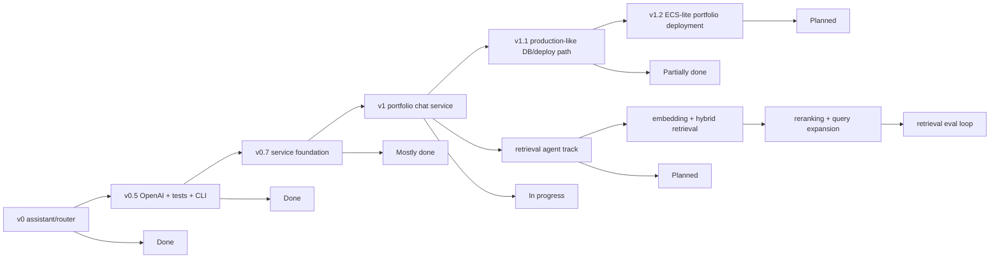

# ROADMAP — my-agents backend

This roadmap tracks the backend functionality needed for the portfolio chat service. It is based on the current codebase plus artifacts generated by the OMX deep-interview, plan, and ultragoal sessions.

For cross-machine handoff and the shortest answer to **"what should we do next?"**, start with [`docs/implementation-tracking.md`](./docs/implementation-tracking.md). This file is the companion detailed checklist/backlog; keep both files aligned when roadmap status changes.

## Status legend

- `[x]` Implemented and test-backed enough for the current thin slice.
- `[~]` Partial foundation exists, but it is not production-depth yet.
- `[ ]` Not implemented yet.
- `[later]` Intentionally deferred beyond the near-term backend roadmap.

## Product milestone summary

Current honest status:

> The project is a strong **v1-draft backend foundation**: auth, permissions, server-owned conversations, text/PDF/Markdown ingestion, permission-aware retrieval, citations, events, migrations, pgvector-backed Postgres retrieval with JSON fallback, and SSE assistant streaming exist as a thin end-to-end slice. It is not yet a production-ready v1 because broad production ingestion, retrieval-quality evals/reranking, background jobs, stronger deployment-grade auth hardening, and operations remain.

## 1. Backend foundation

- [x] Backend-only FastAPI app; no frontend files in this repo.
- [x] App factory and ASGI entrypoint: `my_agents/api/__init__.py`, `main.py`.
- [x] Health endpoint: `GET /health`.
- [x] Domain-oriented API files under `my_agents/api/`.
- [x] Domain folders for auth, groups, conversations, knowledge, permissions, persistence, and agent runtime.
- [x] Typed Pydantic request/response contracts.
- [x] Deterministic mode for tests and credential-free smoke checks.
- [x] OpenAI-backed default response mode through `langchain-openai` / `ChatOpenAI`.
- [x] Safe `.env.example` with no secrets.
- [x] Korean and English root READMEs.
- [x] Portfolio architecture docs under `docs/portfolio-chat-service/`.
- [x] Learning notes under `docs/learning/`.

## 2. Assistant / LangGraph foundation

- [x] General assistant graph under `my_agents/agents/general_assistant/`.
- [x] LangGraph `StateGraph` with explicit state and route nodes.
- [x] Deterministic route classification.
- [x] Route labels and capability metadata for current/future assistant behaviors.
- [x] OpenAI-backed reply generation behind a provider boundary.
- [x] Deterministic reply provider for offline tests.
- [x] Legacy/dev chat endpoint: `POST /assistant/chat`.
- [x] Terminal CLI chat.
- [x] CLI token streaming through LangGraph `graph.stream(...)`.
- [x] Product chat uses the graph inside conversation runs.
- [ ] LangGraph checkpointer-backed memory for durable thread state.
- [ ] Real tool/function capabilities exposed through the graph.
- [ ] Production multi-agent orchestration surface.
- [later] Additional specialized production agents beyond the current general assistant.

## 3. Auth and sessions

- [x] First-party email/password signup: `POST /auth/signup`.
- [x] Login with app-owned opaque session cookie: `POST /auth/login`.
- [x] Logout with CSRF proof: `POST /auth/logout`.
- [x] Current user endpoint: `GET /auth/me`.
- [x] Argon2 password hashing.
- [x] Server-side session table with hashed session tokens.
- [x] `Principal` contract for protected routes.
- [x] FastAPI auth dependencies.
- [x] Duplicate signup returns `409`.
- [x] Invalid login returns `401` and does not create an authenticated session.
- [x] Passwords and password hashes are not returned by API responses.
- [~] CSRF is currently used for logout; broader mutating endpoint CSRF policy should be revisited before public browser deployment.
- [x] Email verification flow: `POST /auth/verify-email`.
- [x] Password reset request/confirm flow with session revocation.
- [x] Local in-process abuse protection for signup, login, lifecycle-token guessing, and password reset attempts.
- [ ] Account deletion/export flow.
- [~] Shared/distributed rate limiting for multi-worker public deployment.
- [ ] OAuth account linking seam, e.g. Google/GitHub.
- [ ] Admin session revocation controls.
- [ ] MFA / passkeys.

## 4. Groups, membership, and authorization

- [x] Group creation and listing.
- [x] Group detail lookup with safe denial.
- [x] Add group members.
- [x] Update member roles.
- [x] Group owner/admin/member/viewer-style foundation.
- [x] Document-level permission model.
- [x] Deny-by-default authorization service.
- [x] Safe `403`/`404` denial behavior where appropriate.
- [x] Permission tests for owner/member/outsider cases.
- [~] Permission model is intentionally small and should be expanded only when product behavior requires it.
- [ ] Organization/workspace model beyond simple groups.
- [ ] Sharing links / invitations.
- [ ] Audit trail for permission changes.
- [ ] Rich RBAC/ABAC policy layer.

## 5. Documents and knowledge bases

- [x] Create/list/read documents.
- [x] Patch document permissions.
- [x] Create/list knowledge bases.
- [x] Personal and group knowledge-base scope foundation.
- [x] Link documents to knowledge bases.
- [x] Text document ingestion endpoint: `POST /documents/{document_id}/ingest`.
- [x] Extraction-run listing: `GET /documents/{document_id}/extraction-runs`.
- [x] Deterministic text chunking.
- [x] Deterministic embedding-like fixtures for tests/retrieval.
- [x] Entity extraction fixtures.
- [x] Entity mentions and co-occurrence relationships.
- [x] Extraction-run summaries.
- [x] Text ingestion still supports text already stored in the document.
- [x] Text-based upload API: `POST /documents/upload`.
- [x] Deterministic text-based PDF parser with metadata persistence and chunk page provenance.
- [x] UTF-8 Markdown and plain-text upload parser with metadata persistence.
- [ ] Production parsers for scanned/encrypted/compressed PDF, DOCX, web pages, CSV/JSON structure, etc.
- [ ] Object storage for uploaded source files.
- [ ] Reingestion/versioning policy.
- [ ] Ingestion failure recovery and partial-progress cleanup.
- [ ] Document deletion and cascading cleanup policy.

## 6. Retrieval, RAG, and citations

- [x] Permission-aware retrieval service.
- [x] Retrieval starts from authorized document chunks only.
- [x] Deterministic direct term matching over authorized chunks.
- [x] Entity/relationship expansion limited to authorized chunks.
- [x] Product conversation run composes authorized context into the answer.
- [x] Citations are persisted and returned in run responses.
- [x] Negative tests for permission leakage.
- [x] Redacted event payloads avoid raw private content.
- [x] Real embedding generation provider boundary.
- [x] JSON-backed semantic cosine ranking over authorized chunks as the first real-embedding slice.
- [x] pgvector schema columns and extension usage.
- [x] Permission-filtered SQL vector search before ranking enters app memory on Postgres, with JSON/SQLite fallback.
- [ ] Hybrid retrieval strategy: vector + keyword/full-text + graph/entity expansion, with tunable weights guided by [`docs/portfolio-chat-service/12-retrieval-agent-hybrid-reference.md`](./docs/portfolio-chat-service/12-retrieval-agent-hybrid-reference.md).
- [ ] Dedicated retrieval-agent/service boundary that owns query planning, retrieval routing, hybrid candidate generation, reranking, context packing, and retrieval observability before the general assistant composes an answer.
- [ ] Cross-encoder reranker stage over top-k authorized candidates after vector/full-text retrieval; keep it behind a provider/interface flag so local tests remain offline.
- [ ] Query expansion stage for synonyms/related concepts while preserving original user intent.
- [ ] HyDE-style hypothetical-document retrieval path for broad conceptual questions when normal hybrid search under-recovers.
- [ ] Retrieval-quality eval set with precision/recall-style fixtures and before/after comparison for hybrid, reranked, and HyDE paths.
- [ ] Citation UX metadata such as document title, offsets, page number, and source preview.
- [later] Neo4j/Graphiti or dedicated graph database if graph traversal becomes core product behavior.

## 7. Scoped instruction profiles

This is the product-facing equivalent of repo-local `AGENTS.md`: durable Markdown instructions that shape how the assistant and future agents should behave for a user, group, or conversation. See [`docs/idea/scoped-agent-instructions.md`](./docs/idea/scoped-agent-instructions.md) for the motivating product idea and terminology notes. These instructions guide tone, format, domain assumptions, and workflow, but they must never bypass authorization, reveal hidden prompts, override safety rules, or grant access to documents/tools.

- [ ] Instruction profile model with scoped ownership: `user`, `group`, and optionally `conversation`.
- [ ] Precedence contract: application/developer safety rules > group/workspace instructions > personal user instructions > conversation-local instructions > current user message.
- [ ] Group instructions override personal instructions when they conflict, while personal instructions can still fill in non-conflicting style preferences.
- [ ] Markdown instruction body with safe length limits, version metadata, creator/updater audit fields, and enabled/disabled status.
- [ ] API endpoints to read/update the current user's personal instructions.
- [ ] Group admin endpoints to read/update group/workspace instructions.
- [ ] Instruction assembler that produces an explicit ordered instruction stack for conversation runs and future retrieval-agent calls.
- [ ] Tests proving instruction precedence, group membership authorization, disabled-profile behavior, and prompt-injection resistance for attempts to override app safety or document permissions.
- [ ] Redacted observability event that records which instruction profile IDs/versions influenced a run without exposing private instruction text to unauthorized users.
- [ ] Frontend contract for editing personal and group/workspace instructions.

## 8. Conversations, runs, events, and streaming

- [x] Create/list/read server-owned conversations.
- [x] Add/list conversation messages.
- [x] Run a conversation through `POST /conversations/{conversation_id}/runs`.
- [x] Conversation runs use server-owned message history.
- [x] Run responses include `run_id`, `reply`, route, handler, and citations.
- [x] List run history.
- [x] Read completed run detail with persisted reply, route, and citations.
- [x] List redacted run events: `GET /conversations/{conversation_id}/runs/{run_id}/events`.
- [x] Failed graph invocation persists a failed run and safe failure event.
- [x] Event types cover user message storage, retrieval completion, graph invocation, and answer composition.
- [~] Run event vocabulary differs from the larger `.omx` contract; current implementation is a thin safe subset.
- [x] HTTP progress and assistant-text streaming response for frontend chat.
- [x] SSE transport endpoint: `POST /conversations/{id}/runs/stream`.
- [x] `answer_delta` SSE events for incremental assistant text.
- [ ] Background job queue for long-running runs/ingestion.
- [ ] Run cancellation.
- [ ] Run retry.
- [ ] Rich failed-run detail table/model.
- [ ] Polling-friendly run status transitions for pending/running/completed/failed.

## 9. Persistence, migrations, and database operations

- [x] SQLAlchemy database boundary.
- [x] Central model import helper.
- [x] Naming convention for migration-friendly constraints.
- [x] `MY_AGENTS_DATABASE_URL` setting.
- [x] Optional `MY_AGENTS_TEST_DATABASE_URL` setting.
- [x] Guarded `MY_AGENTS_AUTO_CREATE_TABLES` policy.
- [x] In-memory SQLite auto-create remains available for local/offline tests.
- [x] Alembic configuration.
- [x] Initial migration covering current service schema.
- [x] Postgres/Neon setup docs without secrets.
- [x] Optional external DB smoke test gated by `MY_AGENTS_TEST_DATABASE_URL`.
- [~] Postgres/Neon path is documented and migration-ready, but not continuously exercised unless a test DB is configured.
- [ ] Production deployment runbook.
- [ ] ECS-lite portfolio deployment path: FastAPI Docker image, ECR image publishing, ECS Fargate task/service, health check, and documented rollback to a previous image tag.
- [ ] Deployment environment strategy for AWS SSM Parameter Store or Secrets Manager without committing secrets.
- [ ] CI/CD image promotion gate: lint/test, build Docker image, push to ECR, update ECS service, then smoke `GET /health`.
- [ ] Backup/restore plan.
- [ ] Data retention and deletion policy.
- [x] Seed/demo data command for local SQLite V1 demos.
- [x] Backend-only V1 API smoke command for the seeded local demo path.
- [ ] Automated migration step in deployment pipeline.

## 10. Observability, evals, and safety

- [x] Agent activity event table.
- [x] Redacted event payloads for frontend-safe activity display.
- [x] Deterministic eval helper module for grounding, leakage, redaction, and latency budgets.
- [x] Tests for event ordering and redaction behavior.
- [x] Tests keep OpenAI calls offline/mocked by default.
- [~] Evals are deterministic fixtures, not a production evaluation platform.
- [ ] Structured application logging policy.
- [ ] Request IDs / correlation IDs.
- [ ] Metrics for latency, token usage, retrieval counts, failure rates.
- [ ] OpenTelemetry or equivalent tracing.
- [ ] Cost monitoring and quotas for OpenAI-backed paths.
- [ ] Production safety review for auth, permissions, logging, and prompts.

## 11. Frontend integration contract

This repo remains backend-only. Frontend work belongs in a separate repository.

- [x] Backend exposes REST endpoints a frontend can call.
- [x] Auth uses browser cookie sessions.
- [x] Login returns safe user data plus CSRF token.
- [x] Product demo flow is documented: auth -> group/doc -> ingest -> conversation run -> citations/events.
- [x] Frontend can use SSE progress and `answer_delta` streaming instead of waiting only for full run responses.
- [~] Frontend-facing signup/login response parser expectations are documented in README examples but not generated as a typed client.
- [x] Document exact frontend auth/session flow, including cookies and CSRF headers.
- [x] Add explicit-origin CORS configuration for credentialed frontend requests.
- [x] Add gated local auth dev outbox for deterministic frontend signup/verify demos.
- [x] Add local SQLite demo seed helper for verified user, text document, and extraction run.
- [x] Add backend-only V1 API smoke command for health, auth, ingest, SSE, citations, and events.
- [x] Add refresh-safe completed run detail for persisted citations/reply.
- [x] Add streaming contract for chat UX.
- [ ] Add OpenAPI/client generation workflow if useful.

## 12. Testing and quality gates

- [x] Offline default test suite.
- [x] Auth/session tests.
- [x] Permission tests.
- [x] Conversation/run tests.
- [x] Knowledge ingestion tests.
- [x] Permission-aware RAG tests.
- [x] Agent observability/eval tests.
- [x] Migration tests.
- [x] Settings/database initialization tests.
- [x] Ruff lint and format gates.
- [~] Optional Postgres/Neon test is skipped unless `MY_AGENTS_TEST_DATABASE_URL` is set.
- [x] Dedicated streaming endpoint tests.
- [x] Upload/parser tests for supported PDF, Markdown, and plain-text ingestion.
- [ ] Background job tests once queueing exists.
- [ ] Load/performance smoke tests for larger fixture data.
- [ ] Security regression tests for rate limits, CSRF coverage, and auth hardening.

## 13. Near-term recommended sequence

1. **Seeded frontend integration verification**
   - Confirm frontend uses product endpoints, not legacy `/assistant/chat`.
   - Verify seeded login, bodyless ingest, SSE, run-detail citations, and event trail against the separate frontend.
   - Keep signup/dev-outbox available for local account lifecycle smoke tests.

2. **Local debug/deploy ergonomics**
   - Use the local SQLite seed helper for stable portfolio demo data.
   - Write a deployment runbook: migrate DB, start app, smoke auth/conversation run.

3. **ECS-lite portfolio deployment pipeline**
   - Containerize the backend as a small FastAPI image suitable for ECS Fargate.
   - Publish immutable image tags to ECR from GitHub Actions after lint/test/build gates pass.
   - Run one backend ECS service/task behind a health-checked endpoint; keep the frontend deployed separately on Vercel/Netlify.
   - Store runtime configuration in SSM Parameter Store or Secrets Manager; keep `.env.example` as documentation only.
   - Document migration execution, smoke checks, and rollback by redeploying a previous image tag.
   - Keep Terraform/CDK optional until infrastructure-as-code itself becomes a portfolio goal.

4. **Production-ish auth hardening**
   - Promote local auth abuse protection to a shared limiter when deployment topology requires it.
   - Keep the offline/local auth email boundary testable.
   - Prepare real email-provider integration notes before public demo exposure.

5. **Scoped instruction profiles**
   - Add user and group/workspace instruction profiles as durable Markdown guidance for assistant and future agent behavior.
   - Enforce precedence explicitly: group/workspace instructions override personal instructions, but neither can override app safety, security, or document-permission rules.
   - Propagate the assembled instruction stack into conversation runs, retrieval-agent planning, and observability metadata.

6. **Real retrieval upgrade / retrieval-agent track**
   - Keep the embedding provider boundary and JSON-backed semantic ranking as the deterministic fallback.
   - Treat pgvector as the first-stage candidate retrieval accelerator on Postgres, not the final relevance judge.
   - Keep permission filtering before every retrieval/reranking step.
   - Promote retrieval into a dedicated retrieval-agent/service boundary once hybrid search needs more than a thin service call: vector + keyword/full-text + graph expansion, top-k candidate fusion, cross-encoder reranking, query expansion, HyDE, context packing, and retrieval eval reporting.
   - Add ANN/vector indexes only after the fixed production embedding dimensionality and backfill policy are settled.

7. **Production ingestion upgrade**
   - Add file upload and parser pipeline.
   - Move long ingestion to a background job model.
   - Store source provenance and parser errors safely.

## 14. Strict v1 phase gates

Phase 0 contract/evidence mapping is tracked in [`docs/portfolio-chat-service/11-v1-phase-0-contract-freeze-evidence-map.md`](./docs/portfolio-chat-service/11-v1-phase-0-contract-freeze-evidence-map.md). Use that map before starting the next strict v1 phase so backend evidence, frontend gates, docs evidence, owner repo, and known contract gaps stay aligned.

## 15. Definition of done for v1

The backend can be called v1 when all of the following are true:

- [ ] A separate frontend can complete signup/login and product conversation flows without using legacy `/assistant/chat`.
- [ ] Product chat supports streaming or an intentional polling UX with run status.
- [ ] Fresh Postgres/Neon database setup is migration-driven and documented end to end.
- [ ] Backend has a documented ECS-lite deployment path with Docker image build, ECR publish, ECS Fargate service update, health smoke, env/secret handling, migration step, and rollback note.
- [ ] Auth/session behavior is safe enough for a public portfolio demo, including rate limiting and clear cookie/CSRF handling.
- [ ] Permission-aware retrieval uses a real retrieval path, not only deterministic fixtures.
- [ ] Retrieval has a dedicated agent/service boundary with hybrid candidate generation, optional cross-encoder reranking, query expansion/HyDE seams, and retrieval-quality eval evidence.
- [ ] Scoped instruction profiles exist for users and groups/workspaces, with group-over-personal precedence and safe propagation into assistant/retrieval-agent runs.
- [x] Document ingestion supports realistic uploaded text-based file types: PDF with page provenance, Markdown, and plain text.
- [ ] Citations include enough provenance for users to trust the answer.
- [ ] Agent events are useful to the UI without exposing hidden chain-of-thought or unauthorized data.
- [ ] Tests pass offline by default.
- [ ] Optional Postgres/Neon smoke tests pass against a dedicated test database.
- [ ] Korean and English READMEs remain accurate.
- [ ] No real secrets are committed or printed.
