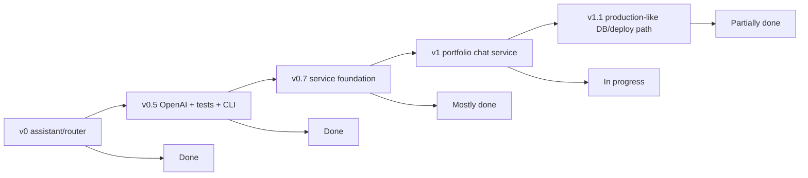

# ROADMAP — my-agents backend

This roadmap tracks the backend functionality needed for the portfolio chat service. It is based on the current codebase plus artifacts generated by the OMX deep-interview, plan, and ultragoal sessions.

## Status legend

- `[x]` Implemented and test-backed enough for the current thin slice.
- `[~]` Partial foundation exists, but it is not production-depth yet.
- `[ ]` Not implemented yet.
- `[later]` Intentionally deferred beyond the near-term backend roadmap.

## Product milestone summary

Current honest status:

> The project is a strong **v1-draft backend foundation**: auth, permissions, server-owned conversations, text ingestion, permission-aware retrieval, citations, events, and migrations exist as a thin end-to-end slice. It is not yet a production-ready v1 because streaming, production ingestion, real vector retrieval, background jobs, stronger auth hardening, and deployment operations remain.

## 1. Backend foundation

- [x] Backend-only FastAPI app; no frontend files in this repo.
- [x] App factory and ASGI entrypoint: `my_agents/api/__init__.py`, `main.py`.
- [x] Health endpoint: `GET /health`.
- [x] Domain-oriented API files under `my_agents/api/`.
- [x] Domain folders for auth, groups, conversations, knowledge, permissions, persistence, and agent runtime.
- [x] Typed Pydantic request/response contracts.
- [x] Deterministic mode for tests and credential-free smoke checks.
- [x] OpenAI-backed default response mode through `langchain-openai` / `ChatOpenAI`.
- [x] Safe `.env.example` with no secrets.
- [x] Korean and English root READMEs.
- [x] Portfolio architecture docs under `docs/portfolio-chat-service/`.
- [x] Learning notes under `docs/learning/`.

## 2. Assistant / LangGraph foundation

- [x] General assistant graph under `my_agents/agents/general_assistant/`.
- [x] LangGraph `StateGraph` with explicit state and route nodes.
- [x] Deterministic route classification.
- [x] Route labels and capability metadata for current/future assistant behaviors.
- [x] OpenAI-backed reply generation behind a provider boundary.
- [x] Deterministic reply provider for offline tests.
- [x] Legacy/dev chat endpoint: `POST /assistant/chat`.
- [x] Terminal CLI chat.
- [x] CLI token streaming through LangGraph `graph.stream(...)`.
- [~] Product chat uses the graph inside conversation runs.
- [ ] LangGraph checkpointer-backed memory for durable thread state.
- [ ] Real tool/function capabilities exposed through the graph.
- [ ] Production multi-agent orchestration surface.
- [later] Additional specialized production agents beyond the current general assistant.

## 3. Auth and sessions

- [x] First-party email/password signup: `POST /auth/signup`.
- [x] Login with app-owned opaque session cookie: `POST /auth/login`.
- [x] Logout with CSRF proof: `POST /auth/logout`.
- [x] Current user endpoint: `GET /auth/me`.
- [x] Argon2 password hashing.
- [x] Server-side session table with hashed session tokens.
- [x] `Principal` contract for protected routes.
- [x] FastAPI auth dependencies.
- [x] Duplicate signup returns `409`.
- [x] Invalid login returns `401` and does not create an authenticated session.
- [x] Passwords and password hashes are not returned by API responses.
- [~] CSRF is currently used for logout; broader mutating endpoint CSRF policy should be revisited before public browser deployment.
- [ ] Email verification flow.
- [ ] Password reset flow.
- [ ] Account deletion/export flow.
- [ ] Rate limiting / abuse protection for auth endpoints.
- [ ] OAuth account linking seam, e.g. Google/GitHub.
- [ ] Admin session revocation controls.
- [ ] MFA / passkeys.

## 4. Groups, membership, and authorization

- [x] Group creation and listing.
- [x] Group detail lookup with safe denial.
- [x] Add group members.
- [x] Update member roles.
- [x] Group owner/admin/member/viewer-style foundation.
- [x] Document-level permission model.
- [x] Deny-by-default authorization service.
- [x] Safe `403`/`404` denial behavior where appropriate.
- [x] Permission tests for owner/member/outsider cases.
- [~] Permission model is intentionally small and should be expanded only when product behavior requires it.
- [ ] Organization/workspace model beyond simple groups.
- [ ] Sharing links / invitations.
- [ ] Audit trail for permission changes.
- [ ] Rich RBAC/ABAC policy layer.

## 5. Documents and knowledge bases

- [x] Create/list/read documents.
- [x] Patch document permissions.
- [x] Create/list knowledge bases.
- [x] Personal and group knowledge-base scope foundation.
- [x] Link documents to knowledge bases.
- [x] Text document ingestion endpoint: `POST /documents/{document_id}/ingest`.
- [x] Extraction-run listing: `GET /documents/{document_id}/extraction-runs`.
- [x] Deterministic text chunking.
- [x] Deterministic embedding-like fixtures for tests/retrieval.
- [x] Entity extraction fixtures.
- [x] Entity mentions and co-occurrence relationships.
- [x] Extraction-run summaries.
- [~] Ingestion currently assumes text already stored in the document.
- [ ] File upload API.
- [ ] Production document parsers for PDF, Markdown, DOCX, web pages, etc.
- [ ] Object storage for uploaded source files.
- [ ] Reingestion/versioning policy.
- [ ] Ingestion failure recovery and partial-progress cleanup.
- [ ] Document deletion and cascading cleanup policy.

## 6. Retrieval, RAG, and citations

- [x] Permission-aware retrieval service.
- [x] Retrieval starts from authorized document chunks only.
- [x] Deterministic direct term matching over authorized chunks.
- [x] Entity/relationship expansion limited to authorized chunks.
- [x] Product conversation run composes authorized context into the answer.
- [x] Citations are persisted and returned in run responses.
- [x] Negative tests for permission leakage.
- [x] Redacted event payloads avoid raw private content.
- [~] Current retrieval is a deterministic local fixture, not real vector search.
- [ ] Real embedding generation provider boundary.
- [ ] pgvector schema columns and extension usage.
- [ ] Permission-filtered SQL vector search before ranking enters app memory.
- [ ] Hybrid retrieval strategy: vector + keyword + graph expansion.
- [ ] Retrieval-quality eval set.
- [ ] Citation UX metadata such as document title, offsets, page number, and source preview.
- [later] Neo4j/Graphiti or dedicated graph database if graph traversal becomes core product behavior.

## 7. Conversations, runs, events, and streaming

- [x] Create/list/read server-owned conversations.
- [x] Add/list conversation messages.
- [x] Run a conversation through `POST /conversations/{conversation_id}/runs`.
- [x] Conversation runs use server-owned message history.
- [x] Run responses include `run_id`, `reply`, route, handler, and citations.
- [x] List run history.
- [x] List redacted run events: `GET /conversations/{conversation_id}/runs/{run_id}/events`.
- [x] Failed graph invocation persists a failed run and safe failure event.
- [x] Event types cover user message storage, retrieval completion, graph invocation, and answer composition.
- [~] Run event vocabulary differs from the larger `.omx` contract; current implementation is a thin safe subset.
- [ ] HTTP streaming response for frontend chat.
- [ ] SSE or chunked transport endpoint, likely `/conversations/{id}/runs/stream` or `/runs/{id}/stream`.
- [ ] Background job queue for long-running runs/ingestion.
- [ ] Run cancellation.
- [ ] Run retry.
- [ ] Rich failed-run detail table/model.
- [ ] Polling-friendly run status transitions for pending/running/completed/failed.

## 8. Persistence, migrations, and database operations

- [x] SQLAlchemy database boundary.
- [x] Central model import helper.
- [x] Naming convention for migration-friendly constraints.
- [x] `MY_AGENTS_DATABASE_URL` setting.
- [x] Optional `MY_AGENTS_TEST_DATABASE_URL` setting.
- [x] Guarded `MY_AGENTS_AUTO_CREATE_TABLES` policy.
- [x] In-memory SQLite auto-create remains available for local/offline tests.
- [x] Alembic configuration.
- [x] Initial migration covering current service schema.
- [x] Postgres/Neon setup docs without secrets.
- [x] Optional external DB smoke test gated by `MY_AGENTS_TEST_DATABASE_URL`.
- [~] Postgres/Neon path is documented and migration-ready, but not continuously exercised unless a test DB is configured.
- [ ] Production deployment runbook.
- [ ] Backup/restore plan.
- [ ] Data retention and deletion policy.
- [ ] Seed/demo data command.
- [ ] Automated migration step in deployment pipeline.

## 9. Observability, evals, and safety

- [x] Agent activity event table.
- [x] Redacted event payloads for frontend-safe activity display.
- [x] Deterministic eval helper module for grounding, leakage, redaction, and latency budgets.
- [x] Tests for event ordering and redaction behavior.
- [x] Tests keep OpenAI calls offline/mocked by default.
- [~] Evals are deterministic fixtures, not a production evaluation platform.
- [ ] Structured application logging policy.
- [ ] Request IDs / correlation IDs.
- [ ] Metrics for latency, token usage, retrieval counts, failure rates.
- [ ] OpenTelemetry or equivalent tracing.
- [ ] Cost monitoring and quotas for OpenAI-backed paths.
- [ ] Production safety review for auth, permissions, logging, and prompts.

## 10. Frontend integration contract

This repo remains backend-only. Frontend work belongs in a separate repository.

- [x] Backend exposes REST endpoints a frontend can call.
- [x] Auth uses browser cookie sessions.
- [x] Login returns safe user data plus CSRF token.
- [x] Product demo flow is documented: auth -> group/doc -> ingest -> conversation run -> citations/events.
- [~] Frontend currently waits for full run responses because HTTP streaming is not implemented.
- [ ] Finalize frontend-facing signup/login response parser expectations.
- [ ] Document exact frontend auth/session flow, including cookies and CSRF headers.
- [ ] Add CORS configuration when a real frontend origin exists.
- [ ] Add streaming contract for chat UX.
- [ ] Add OpenAPI/client generation workflow if useful.

## 11. Testing and quality gates

- [x] Offline default test suite.
- [x] Auth/session tests.
- [x] Permission tests.
- [x] Conversation/run tests.
- [x] Knowledge ingestion tests.
- [x] Permission-aware RAG tests.
- [x] Agent observability/eval tests.
- [x] Migration tests.
- [x] Settings/database initialization tests.
- [x] Ruff lint and format gates.
- [~] Optional Postgres/Neon test is skipped unless `MY_AGENTS_TEST_DATABASE_URL` is set.
- [ ] Dedicated streaming endpoint tests once streaming exists.
- [ ] Upload/parser tests once file ingestion exists.
- [ ] Background job tests once queueing exists.
- [ ] Load/performance smoke tests for larger fixture data.
- [ ] Security regression tests for rate limits, CSRF coverage, and auth hardening.

## 12. Near-term recommended sequence

1. **Frontend contract stabilization**
   - Confirm frontend uses product endpoints, not legacy `/assistant/chat`.
   - Align signup/login parser shapes with backend contracts.
   - Document cookie + CSRF expectations.

2. **HTTP streaming for conversation runs**
   - Add a product-safe streaming endpoint.
   - Preserve server-owned conversation history and authorization checks.
   - Persist final messages, citations, and events after stream completion/failure.

3. **Local debug/deploy ergonomics**
   - Add a simple local SQLite-file debug recipe or helper script.
   - Add demo seed/reset commands if needed for portfolio demos.
   - Write a deployment runbook: migrate DB, start app, smoke auth/conversation run.

4. **Production-ish auth hardening**
   - Add rate limiting.
   - Decide whether email verification belongs before public demo.
   - Add password reset only when email delivery exists.

5. **Real retrieval upgrade**
   - Add embedding provider boundary.
   - Add pgvector schema and migrations only when real embedding retrieval is implemented.
   - Keep permission filtering inside query construction.

6. **Production ingestion upgrade**
   - Add file upload and parser pipeline.
   - Move long ingestion to a background job model.
   - Store source provenance and parser errors safely.

## 13. Definition of done for v1

The backend can be called v1 when all of the following are true:

- [ ] A separate frontend can complete signup/login and product conversation flows without using legacy `/assistant/chat`.
- [ ] Product chat supports streaming or an intentional polling UX with run status.
- [ ] Fresh Postgres/Neon database setup is migration-driven and documented end to end.
- [ ] Auth/session behavior is safe enough for a public portfolio demo, including rate limiting and clear cookie/CSRF handling.
- [ ] Permission-aware retrieval uses a real retrieval path, not only deterministic fixtures.
- [ ] Document ingestion supports at least one realistic uploaded file type.
- [ ] Citations include enough provenance for users to trust the answer.
- [ ] Agent events are useful to the UI without exposing hidden chain-of-thought or unauthorized data.
- [ ] Tests pass offline by default.
- [ ] Optional Postgres/Neon smoke tests pass against a dedicated test database.
- [ ] Korean and English READMEs remain accurate.
- [ ] No real secrets are committed or printed.
