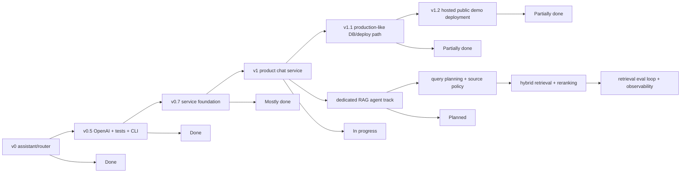

# ROADMAP — my-agents backend

This roadmap tracks the backend functionality needed for the product chat service. It is based on the current codebase plus artifacts generated by the OMX deep-interview, plan, and ultragoal sessions.

For cross-machine handoff and the shortest answer to **"what should we do next?"**, start with [`docs/implementation-tracking.md`](./docs/implementation-tracking.md). This file is the companion detailed checklist/backlog; keep both files aligned when roadmap status changes.

## Status legend

- `[x]` Implemented and test-backed enough for the current thin slice.
- `[~]` Partial foundation exists, but it is not production-depth yet.
- `[ ]` Not implemented yet.
- `[later]` Intentionally deferred beyond the near-term backend roadmap.

## Product milestone summary

Current honest status:

> The project is a strong **controlled-alpha product preview** after a fresh hosted deploy smoke: auth with required display nicknames, invite-only groups, manager-only rosters, personal/group knowledge bases, hidden group-upload staging, publish-request review, text/PDF/Markdown ingestion, permission-aware retrieval, citations, events, pgvector-backed Postgres retrieval with JSON fallback, SSE assistant streaming, Render backend deployment, Vercel frontend CI/CD, Neon Postgres, and Resend HTTP email through `my-agents.dev` exist as a coherent thin end-to-end slice. It is worth showing to trusted testers with alpha framing, but it is not production-ready because broad production ingestion performance, retrieval-quality evals/reranking, durable background queues, account/profile lifecycle, shared rate limits, stronger deployment-grade auth hardening, automated smoke/migration gates, and production security review remain.

## 1. Backend foundation

- [x] Backend-only FastAPI app; no frontend files in this repo.
- [x] App factory and ASGI entrypoint: `my_agents/api/__init__.py`, `main.py`.
- [x] Health endpoint: `GET /health`.
- [x] Domain-oriented API files under `my_agents/api/`.
- [x] Domain folders for auth, groups, conversations, knowledge, permissions, persistence, and agent runtime.
- [x] Typed Pydantic request/response contracts.
- [x] Deterministic mode for tests and credential-free smoke checks.
- [x] OpenAI-backed default response mode through `langchain-openai` / `ChatOpenAI`.
- [x] Safe `.env.example` with no secrets.
- [x] Korean and English root READMEs.
- [x] Product architecture docs under `docs/product-chat-service/en/`.
- [x] Learning notes under `docs/learning/`.

## 2. Assistant / LangGraph foundation

- [x] General assistant graph under `my_agents/agents/general_assistant/`.
- [x] LangGraph `StateGraph` with explicit state and route nodes.
- [x] Deterministic route classification.
- [x] Route labels and capability metadata for current/future assistant behaviors.
- [x] OpenAI-backed reply generation behind a provider boundary.
- [x] Deterministic reply provider for offline tests.
- [x] Legacy/dev chat endpoint: `POST /assistant/chat`.
- [x] Terminal CLI chat.
- [x] CLI token streaming through LangGraph `graph.stream(...)`.
- [x] Product chat uses the graph inside conversation runs.
- [x] Opt-in Product DB-backed long-term memory governance scaffold with settings, CRUD, suggest-confirm, provenance, staleness, and redacted run snapshots.
- [ ] LangGraph Store-backed memory runtime plus a separate `memory_graph` extraction/suggest-confirm workflow; Product DB remains the governance/audit ledger.
- [ ] Run-scoped LangGraph checkpointer for HITL/resume execution state after graph state is compact; do not use checkpointer as conversation history or long-term memory.
- [ ] Real tool/function capabilities exposed through the graph.
- [ ] Production multi-agent orchestration surface.
- [later] Additional specialized production agents beyond the current general assistant.

## 3. Auth and sessions

- [x] First-party email/password signup: `POST /auth/signup`.
- [x] Login with app-owned opaque session cookie: `POST /auth/login`.
- [x] Logout with CSRF proof: `POST /auth/logout`.
- [x] Current user endpoint: `GET /auth/me`.
- [x] Argon2 password hashing with runtime-tunable cost for constrained hosts.
- [x] Server-side session table with hashed session tokens.
- [x] `Principal` contract for protected routes.
- [x] FastAPI auth dependencies.
- [x] Duplicate signup returns `409`.
- [x] Invalid login returns `401` and does not create an authenticated session.
- [x] Passwords and password hashes are not returned by API responses.
- [~] CSRF is currently used for logout; broader mutating endpoint CSRF policy should be revisited before public browser deployment.
- [x] Email verification flow: `POST /auth/verify-email`.
- [x] Hosted Resend HTTP email delivery through verified `my-agents.dev` sender, with SMTP still available as an alternate transport.
- [x] Password reset request/confirm flow with session revocation.
- [x] Local in-process abuse protection for signup, login, lifecycle-token guessing, and password reset attempts.
- [ ] Account deletion/export flow.
- [~] Shared/distributed rate limiting for multi-worker public deployment.
- [ ] OAuth account linking seam, e.g. Google/GitHub.
- [ ] Admin session revocation controls.
- [ ] MFA / passkeys.

## 4. Groups, membership, and authorization

- [x] Group creation and listing.
- [x] Group detail lookup with safe denial.
- [x] Invite-only group membership lifecycle: owner/admin email invitations, opaque token acceptance, resend/cancel/update pending invitations, and no public user discovery.
- [x] Manager-only accepted-member roster with display-only duplicate-allowed nicknames and no member emails.
- [x] Non-creating member role updates for already-active members.
- [x] Group owner/admin/editor/viewer foundation.
- [x] Personal-to-group knowledge publish requests: create/list/approve/reject for whole personal KBs and single-document copy into group KBs.
- [x] Document-level permission model.
- [x] Deny-by-default authorization service.
- [x] Safe `403`/`404` denial behavior where appropriate.
- [x] Permission tests for owner/member/outsider cases.
- [~] Permission model is intentionally small and should be expanded only when product behavior requires it.
- [ ] Organization/workspace model beyond simple groups.
- [ ] Public sharing links beyond email invitations.
- [ ] Audit trail for permission changes.
- [ ] Rich RBAC/ABAC policy layer.

## 5. Documents and knowledge bases

- [x] Create/list/read documents.
- [x] Patch document permissions.
- [x] Create/list knowledge bases.
- [x] Personal and group knowledge-base scope foundation.
- [x] Hidden `team_upload_staging` KB purpose for private group-upload staging before approval.
- [x] Link documents to knowledge bases.
- [x] Text document ingestion endpoint: `POST /documents/{document_id}/ingest`.
- [x] Extraction-run listing: `GET /documents/{document_id}/extraction-runs`.
- [x] Additive async ingestion start: `POST /documents/{document_id}/ingest/async`.
- [x] Direct extraction-run polling: `GET /documents/{document_id}/extraction-runs/{run_id}`.
- [x] Deterministic text chunking.
- [x] Deterministic embedding-like fixtures for tests/retrieval.
- [x] Entity extraction fixtures.
- [x] Entity mentions and co-occurrence relationships.
- [x] Extraction-run summaries.
- [x] Text ingestion still supports text already stored in the document.
- [x] Text-based upload API: `POST /documents/upload`.
- [x] Deterministic text-based PDF parser with metadata persistence and chunk page provenance.
- [x] UTF-8 Markdown and plain-text upload parser with metadata persistence.
- [~] Production parser coverage now includes local DOCX Markdown/block artifacts, while scanned/encrypted/compressed PDFs, legacy `.doc`, web pages, CSV/JSON structure, and richer layout fidelity remain future work. See [`docs/idea/layout-aware-ingestion-rag-agent.md`](./docs/idea/layout-aware-ingestion-rag-agent.md) for the layout-aware parser artifact plan that feeds a future tool-using RAG Agent graph beyond the current contract graph.
- [~] Hosted PDF/Markdown ingestion works for supported text-based files and now has an external-worker execution mode; production-quality ingestion still needs deployment wiring, stale-run recovery, parser policy tuning, and larger/runtime-isolated resources.
- [ ] Object storage for uploaded source files.
- [ ] Reingestion/versioning policy.
- [~] Ingestion failure recovery stores failed run status and safe error; partial artifact cleanup remains minimal.
- [ ] Document deletion and cascading cleanup policy.

## 6. Retrieval, RAG, and citations

- [x] Permission-aware retrieval service.
- [x] Retrieval starts from authorized document chunks only.
- [x] Deterministic direct term matching over authorized chunks.
- [x] Entity/relationship expansion limited to authorized chunks.
- [x] Product conversation run composes authorized context into the answer.
- [x] Citations are persisted and returned in run responses.
- [x] Negative tests for permission leakage.
- [x] Redacted event payloads avoid raw private content.
- [x] Real embedding generation provider boundary.
- [x] JSON-backed semantic cosine ranking over authorized chunks as the first real-embedding slice.
- [x] pgvector schema columns and extension usage.
- [x] Permission-filtered SQL vector search before ranking enters app memory on Postgres, with JSON/SQLite fallback.
- [~] **ContextForge dedicated RAG agent milestone**: first-class document-grounded retrieval/service boundary exists under `my_agents/agents/context_forge/`. It owns deterministic query planning, source-boundary handoff, candidate fusion, deterministic or optional cross-encoder reranking, context packing, and redacted retrieval evidence before the general assistant composes an answer. OpenAI planning, graph/tool orchestration, layout-aware parser artifacts, and full hybrid production tuning remain follow-up work. See [`docs/idea/dedicated-rag-agent.md`](./docs/idea/dedicated-rag-agent.md) and [`docs/idea/layout-aware-ingestion-rag-agent.md`](./docs/idea/layout-aware-ingestion-rag-agent.md).
- [x] Agentic RAG V1 — RAG Agent contract surface: `my_agents/agents/rag_agent/` names ContextForge as the Retrieval Agent and adds a dedicated deterministic graph form plus planner/verifier coverage for compact localized ko/en trace stages without moving authorization/retrieval/provider work out of service layers.
- [x] Treat structured document questions as a production-level RAG requirement, not a demo nicety. Motivating case: a user uploads a PDF API reference and asks “list the API endpoints,” but generic vector/keyword retrieval misses chunks because the document lists `GET /...`, `POST /...`, etc. without saying “these are available endpoints.”
- [x] Ingestion-time structured/entity extraction for domain-shaped artifacts, starting with API docs: detect HTTP method/path patterns, OpenAPI-like tables, request/response sections, config keys, commands, error codes, database tables, and other enumerable entities with source page/chunk provenance.
- [x] Query-time intent routing for enumeration/structured extraction questions such as “list endpoints,” “show env vars,” “what commands are documented,” or “list error codes,” so the RAG agent can retrieve by extracted entity type rather than relying only on semantic similarity to the user wording.
- [ ] Structured retrieval/answer contracts for extracted entities, e.g. endpoint tables with method, path, summary, source document/page, confidence, and missing/ambiguous-source notes.
- [~] RAG source policy for unified `knowledge_base_selection` across authorized personal, published, and group KBs exists for the current product path; owner-private transcripts, membership-scoped group knowledge, hidden staging exclusion, and no source leakage are covered, while deletion/retention edge cases still need production hardening.
- [~] Hybrid retrieval strategy: vector + keyword/full-text + graph/entity/structured expansion with deterministic fusion is started; tunable weights and production full-text indexes remain guided by [`docs/product-chat-service/en/12-retrieval-agent-hybrid-reference.md`](./docs/product-chat-service/en/12-retrieval-agent-hybrid-reference.md).
- [~] Cross-encoder reranker stage over top-k authorized candidates after vector/full-text retrieval; the interface and `MY_AGENTS_RERANKER_MODE=cross_encoder` path exist, while production model packaging/latency evals remain follow-up work. Local tests stay offline through the deterministic default and fake-model unit coverage. On small hosted runtimes, switch to deterministic mode if memory/startup latency becomes unstable.
- [ ] **Critical next move — tokenizer-aware retrieval and embedding-index safety.** Keep `BAAI/bge-reranker-v2-m3` as the Korean/multilingual cross-encoder direction instead of the effective MS MARCO override; add query-aware reranker token windows so over-limit Korean/code chunks do not silently lose tail evidence; persist embedding provider/model/dimensions/encoding/index-version identity and exclude incompatible stored vectors even when dimensions match; add a re-embed/backfill decision for existing documents; and make final answer-context token usage observable while preserving the current character cap as a fallback. Require Korean, English, and code quality/latency fixtures before calling the milestone complete. See [`docs/learning/project-notes/tokenizer-consistency-audit-and-rag-index-safety.md`](./docs/learning/project-notes/tokenizer-consistency-audit-and-rag-index-safety.md).
- [ ] **Read-only full-document pull tool for comprehensive document tasks.**
  - **Intended usage:** expose a RAG Agent-owned tool to the general assistant only after one authorized document has been resolved and the user asks for whole-document coverage, such as summarizing the complete file, reviewing every section, extracting all requirements, or checking cross-section consistency. Normal fact lookup and section-specific questions should continue to use focused chunk retrieval.
  - **Tool and authorization contract:** the application supplies the authenticated principal, conversation, and selected knowledge-base scope through runtime context; the model must not provide or override `user_id`. The tool must reuse permission-first document filtering, treat returned document text as untrusted content, return full extracted text only below an explicit size/token threshold, and use bounded range/cursor reads for larger documents.
  - **Graph contract:** add an application-executed `assistant -> tool -> assistant` loop or equivalent typed graph node instead of treating the database read like an OpenAI-hosted provider tool. Preserve chunk/page/offset provenance in tool results so persisted citations can still identify precise supporting evidence.
  - **Non-goal:** do not replace default chunk retrieval, automatically inject every selected document, retain original upload bytes solely for this tool, or allow full-document reads to bypass clarification, authorization, context budgets, or source-selection policy.
  - **Expected outcome:** comprehensive-document requests should no longer miss relevant sections because of top-k, injected-chunk, or per-snippet limits, while ordinary RAG questions remain fast and focused. Users should receive answers that honestly distinguish complete-document coverage from partial retrieval and still include precise citations.
  - **Acceptance evidence:** cover owner/group/explicit-permission/system-KB authorization and denial, ambiguous-document clarification, small-document full reads, large-document continuation, prompt-injection containment, citation provenance, deterministic offline tool tests, and latency/token-budget comparisons against the existing chunk-only path.
- [ ] Query expansion stage for synonyms/related concepts while preserving original user intent.
- [ ] HyDE-style hypothetical-document retrieval path for broad conceptual questions when normal hybrid search under-recovers.
- [ ] Retrieval-quality eval set with precision/recall-style fixtures, expected source/chunk fixtures, and before/after comparison for hybrid, reranked, and HyDE paths.
- [~] RAG observability/debug surface for retrieved chunks, injected chunks, rejected chunks, score/source/reason metadata, and “why this source was used” explanations. ContextForge now emits redacted intent, candidate, injected, rejected, structured-entity, budget, source-count, and latency metadata; run responses/SSE/events also expose compact localized `agent_trace` steps. Richer UI/debug views remain.
- [ ] Citation UX metadata such as document title, offsets, page number, source preview, and confidence/source-audit metadata.
- [later] Neo4j/Graphiti or dedicated graph database if graph traversal becomes core product behavior.

## 7. Scoped instruction profiles

This is the product-facing equivalent of repo-local `AGENTS.md`: durable Markdown instructions that shape how the assistant and future agents should behave for a user, group, or conversation. See [`docs/idea/scoped-agent-instructions.md`](./docs/idea/scoped-agent-instructions.md) for the motivating product idea and terminology notes. These instructions guide tone, format, domain assumptions, and workflow, but they must never bypass authorization, reveal hidden prompts, override safety rules, or grant access to documents/tools.

- [ ] Instruction profile model with scoped ownership: `user`, `group`, and optionally `conversation`.
- [ ] Precedence contract: application/developer safety rules > group/workspace instructions > personal user instructions > conversation-local instructions > current user message.
- [ ] Group instructions override personal instructions when they conflict, while personal instructions can still fill in non-conflicting style preferences.
- [ ] Markdown instruction body with safe length limits, version metadata, creator/updater audit fields, and enabled/disabled status.
- [ ] API endpoints to read/update the current user's personal instructions.
- [ ] Group admin endpoints to read/update group/workspace instructions.
- [ ] Instruction assembler that produces an explicit ordered instruction stack for conversation runs and future retrieval-agent calls.
- [ ] Tests proving instruction precedence, group membership authorization, disabled-profile behavior, and prompt-injection resistance for attempts to override app safety or document permissions.
- [ ] Redacted observability event that records which instruction profile IDs/versions influenced a run without exposing private instruction text to unauthorized users.
- [ ] Frontend contract for editing personal and group/workspace instructions.

## 8. Conversations, runs, events, and streaming

- [x] Create/list/read server-owned conversations.
- [x] Add/list conversation messages.
- [x] Run a conversation through `POST /conversations/{conversation_id}/runs`.
- [x] Conversation runs use server-owned message history.
- [x] Run responses include `run_id`, `reply`, route, handler, and citations.
- [x] List run history.
- [x] Read completed run detail with persisted reply, route, and citations.
- [x] List redacted run events: `GET /conversations/{conversation_id}/runs/{run_id}/events`.
- [x] Failed graph invocation persists a failed run and safe failure event.
- [x] Event types cover user message storage, retrieval completion, graph invocation, and answer composition.
- [~] Run event vocabulary differs from the larger `.omx` contract; current implementation is a thin safe subset.
- [x] HTTP progress and assistant-text streaming response for frontend chat.
- [x] SSE transport endpoint: `POST /conversations/{id}/runs/stream`.
- [x] `answer_delta` SSE events for incremental assistant text.
- [~] Async ingestion runner supports local in-process threads and hosted external-worker mode; durable queue/backend-worker supervision and stale-run recovery remain future work.
- [x] Cooperative run cancellation: `POST /conversations/{conversation_id}/runs/{run_id}/cancel`, cancellation events, no partial assistant persistence, and stale cancelling cleanup.
- [ ] Run retry.
- [ ] Rich failed-run detail table/model.
- [x] Polling-friendly extraction-run status transitions for pending/running/completed/failed.

## 9. Persistence, migrations, and database operations

- [x] SQLAlchemy database boundary.
- [x] Central model import helper.
- [x] Naming convention for migration-friendly constraints.
- [x] `MY_AGENTS_DATABASE_URL` setting.
- [x] Optional `MY_AGENTS_TEST_DATABASE_URL` setting.
- [x] Guarded `MY_AGENTS_AUTO_CREATE_TABLES` policy.
- [x] In-memory SQLite auto-create remains available for local/offline tests.
- [x] Alembic configuration.
- [x] Initial migration covering current service schema.
- [x] Postgres/Neon setup docs without secrets.
- [x] Optional external DB smoke test gated by `MY_AGENTS_TEST_DATABASE_URL`.
- [x] Postgres/Neon path is deployed for the hosted demo and verified through redacted runtime diagnostics.
- [x] Basic production deployment runbook/docs exist, including Render migration and troubleshooting notes.
- [x] Basic hosted public demo deployment path: Render backend Docker deployment, Vercel frontend production branch deployment, Neon Postgres, Resend HTTP email, health/startup smoke, and documented rollback/migration notes.
- [~] Deployment environment strategy uses platform env vars today; a dedicated secret manager remains future work.
- [~] Basic CI/CD exists through Render/Vercel Git integration; stronger gates for migrations, tests, smoke checks, image promotion, and rollback automation remain future work.
- [ ] Backup/restore plan.
- [ ] Data retention and deletion policy.
- [x] Seed/demo data command for local SQLite V1 demos.
- [x] Backend-only V1 API smoke command for the seeded local demo path.
- [ ] Automated migration step in deployment pipeline.

## 10. Observability, evals, and safety

- [x] Agent activity event table.
- [x] Redacted event payloads for frontend-safe activity display.
- [x] Deterministic eval helper module for grounding, leakage, redaction, and latency budgets.
- [x] Tests for event ordering and redaction behavior.
- [x] Tests keep OpenAI calls offline/mocked by default.
- [~] Evals are deterministic fixtures, not a production evaluation platform.
- [~] Structured application logging policy; permanent redacted deployment diagnostics exist and should be tuned into the broader logging policy.
- [~] Request IDs / correlation IDs exist in deployment diagnostics but need a durable production logging policy.
- [x] Opt-in Prometheus timing metrics for internal maintenance/quality analysis: `/metrics`
  behind `MY_AGENTS_METRICS_ENABLED` with request, conversation-run, ContextForge,
  retrieval-phase, embedding, reranker, and graph histograms.
- [~] Broader production metrics for token usage, retrieval counts, failure rates,
  dashboards, and alerts remain follow-up work.
- [ ] Prometheus + Grafana operations stack for common backend metrics: latency,
  request volume, error rate, worker/ingestion health, queue/stale-run signals, and
  system/resource saturation.
- [ ] Langfuse or LangSmith LLM observability for provider latency, token/cost
  metrics, trace/eval datasets, prompt/version tracking, and retrieval/answer-quality
  review.
- [ ] Retrieval UX quality profiles: define Fast / Balanced / Thorough modes that map
  to retrieval budgets such as candidate/vector limit, structured lookup, reranking,
  injected chunk count, and context char budget. Preserve the current high-quality
  behavior as the benchmark before reducing recall for faster product UX.
- [ ] OpenTelemetry or equivalent tracing for per-request waterfalls/distributed tracing.
- [ ] Cost monitoring and quotas for OpenAI-backed paths.
- [ ] Production safety review for auth, permissions, logging, and prompts.

## 11. Frontend integration contract

This repo remains backend-only. Frontend work belongs in a separate repository.

- [x] Backend exposes REST endpoints a frontend can call.
- [x] Auth uses browser cookie sessions.
- [x] Login returns safe user data plus CSRF token.
- [x] Product demo flow is documented: auth -> group/doc -> ingest -> conversation run -> citations/events.
- [x] Frontend can use SSE progress and `answer_delta` streaming instead of waiting only for full run responses.
- [~] Frontend-facing signup/login response parser expectations are documented in README examples but not generated as a typed client.
- [x] Document exact frontend auth/session flow, including cookies and CSRF headers.
- [x] Add explicit-origin CORS configuration for credentialed frontend requests.
- [x] Add gated local auth dev outbox for deterministic frontend signup/verify demos.
- [x] Add local SQLite demo seed helper for verified user, text document, and extraction run.
- [x] Add backend-only V1 API smoke command for health, auth, ingest, SSE, citations, and events.
- [x] Add refresh-safe completed run detail for persisted citations/reply.
- [x] Add streaming contract for chat UX.
- [ ] Add OpenAPI/client generation workflow if useful.
- [x] Hosted frontend/backend auth verification path works after adding `/verify-email` and `/password-reset` frontend landing pages.

## 12. Testing and quality gates

- [x] Offline default test suite.
- [x] Auth/session tests.
- [x] Permission tests.
- [x] Conversation/run tests.
- [x] Knowledge ingestion tests.
- [x] Permission-aware RAG tests.
- [x] Agent observability/eval tests.
- [x] Migration tests.
- [x] Settings/database initialization tests.
- [x] Ruff lint and format gates.
- [~] Optional Postgres/Neon test is skipped unless `MY_AGENTS_TEST_DATABASE_URL` is set.
- [x] Dedicated streaming endpoint tests.
- [x] Upload/parser tests for supported PDF, Markdown, and plain-text ingestion.
- [x] Async ingestion progress/polling tests for both the local in-process runner and external-worker claim/process path.
- [x] Metrics endpoint/settings tests for opt-in exposure and timing histogram emission.
- [ ] Load/performance smoke tests for larger fixture data.
- [ ] Security regression tests for rate limits, CSRF coverage, and auth hardening.

## 13. Near-term recommended sequence

0. **Critical next move — tokenizer-aware retrieval and embedding-index safety**
   - Keep the committed `BAAI/bge-reranker-v2-m3` direction for Korean/multilingual reranking and remove the MS MARCO override from the intended runtime before evaluation.
   - Add Korean, English, and code retrieval fixtures, then record relevance, latency, memory, and reranker window/truncation evidence.
   - Add model-tokenizer-aware query/document windows so the reranker never silently discards relevant tail content from an over-limit pair.
   - Persist an embedding index identity covering provider, model, dimensions, encoding/preprocessing, and index version; retrieval must exclude incompatible stored vectors even when their lengths match.
   - Define the re-embed/backfill path for existing documents and metadata profiles before changing the active embedding configuration.
   - Add model-aware/provider-reported answer-context token usage while preserving redacted logs and the deterministic character cap as a fallback.
   - Stop when multilingual/code reranker fixtures preserve relevant evidence, the BAAI candidate has measured runtime evidence, incompatible embedding spaces cannot be compared, existing data has an explicit migration decision, and permission-first/offline tests remain green.
   - Use [`docs/learning/project-notes/tokenizer-consistency-audit-and-rag-index-safety.md`](./docs/learning/project-notes/tokenizer-consistency-audit-and-rag-index-safety.md) as the analysis and acceptance note.

1. **Internal performance / quality analysis baseline**
   - Enable `MY_AGENTS_METRICS_ENABLED=true` only in local, staging, or trusted internal runs.
   - Use `/metrics` to compare request, conversation, ContextForge, retrieval-phase, embedding, reranker, and graph p95 before changing retrieval behavior.
   - Keep labels redacted and low-cardinality; do not turn metrics into a frontend product API.
   - Design Fast / Balanced / Thorough retrieval profiles only after the current high-recall baseline has measured latency and quality evidence.
   - Follow up with Prometheus + Grafana for common backend operations metrics.
   - Evaluate Langfuse vs LangSmith for LLM-specific latency, token/cost, trace, eval, and prompt/version metrics.
   - Add OpenTelemetry traces only after aggregate latency shows where per-request waterfalls are needed.

2. **Controlled alpha deploy smoke and tester handoff**
   - Deploy backend and frontend together after the latest nickname, invite-only group, publish-review, and route-addressable Groups changes.
   - Run hosted smoke: signup with nickname -> email verification/approval as configured -> login -> group invitation/acceptance -> small document upload/ingest -> publish request review/approval -> cited group-knowledge chat.
   - Keep permanent redacted `DEPLOY_DIAG` logs available for hosted smoke/debug; tune noisy call sites only if needed.
   - Record smoke evidence and remaining risks in `docs/product-chat-service/en/15-deployment-troubleshooting-log.md` if anything new is found.
   - Invite only trusted testers at first, with explicit alpha framing and a warning against sensitive uploads.

3. **Hosted ingestion performance pass**
   - Treat Render free-tier PDF/Markdown ingestion slowness as a resource/process-isolation limitation, not a parser correctness bug.
   - Prefer small Markdown/plain-text/native-text PDFs for public demo.
   - Deploy `MY_AGENTS_INGESTION_EXECUTION_MODE=external_worker` with a separate `python -m my_agents.knowledge.ingestion_worker` process before trying large files in production.
   - Add stale-run recovery, worker health checks, and parser policy controls before treating ingestion as production-grade.
   - Consider disabling `MY_AGENTS_RERANKER_MODE=cross_encoder` on tiny hosts if memory pressure affects ingestion or startup.

4. **Deployment hardening**
   - Keep Render/Vercel/Neon/Resend as the current basic CI/CD demo path.
   - Add automated smoke checks, migration run evidence, rollback steps, and secret rotation notes before calling it production.
   - Keep AWS/ECS-lite as an optional future migration path, not the immediate next requirement.

5. **Production-ish auth hardening**
   - Promote local auth abuse protection to a shared limiter when deployment topology requires it.
   - Keep the offline/local auth email boundary testable.
   - Prepare real email-provider integration notes before public demo exposure.

6. **Scoped instruction profiles**
   - Add user and group/workspace instruction profiles as durable Markdown guidance for assistant and future agent behavior.
   - Enforce precedence explicitly: group/workspace instructions override personal instructions, but neither can override app safety, security, or document-permission rules.
   - Propagate the assembled instruction stack into conversation runs, retrieval-agent planning, and observability metadata.

7. **Real retrieval upgrade / retrieval-agent track**
   - Keep the embedding provider boundary and JSON-backed semantic ranking as the deterministic fallback.
   - Treat pgvector as the first-stage candidate retrieval accelerator on Postgres, not the final relevance judge.
   - Keep permission filtering before every retrieval/reranking step.
   - Promote retrieval into a dedicated retrieval-agent/service boundary once hybrid search needs more than a thin service call: vector + keyword/full-text + graph expansion, top-k candidate fusion, cross-encoder reranking, query expansion, HyDE, context packing, layout-aware section/table tools, and retrieval eval reporting.
   - Add the read-only full-document pull tool only after the custom application-tool execution loop exists; keep it limited to explicit comprehensive-document intent, one resolved authorized document, bounded full/range reads, and chunk/page/offset citation provenance.
   - Add ANN/vector indexes only after the fixed production embedding dimensionality and backfill policy are settled.

8. **Production ingestion upgrade**
   - Add file upload and parser pipeline, then evolve it toward the layout-aware artifact plan in [`docs/idea/layout-aware-ingestion-rag-agent.md`](./docs/idea/layout-aware-ingestion-rag-agent.md).
   - [done for local/demo] Move ingestion start to an additive in-process async runner with polling.
   - [done for hosted baseline] Add an external-worker execution mode that keeps ingestion work out of the web request process.
   - [future] Replace DB polling with a durable queue and add stale-run recovery for production workers.
   - Store source provenance and parser errors safely.

## 14. Strict v1 phase gates

Phase 0 contract/evidence mapping is tracked in [`docs/product-chat-service/en/11-v1-phase-0-contract-freeze-evidence-map.md`](./docs/product-chat-service/en/11-v1-phase-0-contract-freeze-evidence-map.md). Use that map before starting the next strict v1 phase so backend evidence, frontend gates, docs evidence, owner repo, and known contract gaps stay aligned.

## 15. Definition of done for v1

The backend can be called v1 when all of the following are true:

- [x] A separate frontend can complete hosted signup/email-verification/login against the backend without using legacy `/assistant/chat`; full hosted product conversation smoke should still be recorded after each deployment.
- [x] Product chat supports SSE streaming with run status, incremental `answer_delta` events, persisted run detail, events, and cooperative cancellation.
- [x] Fresh Postgres/Neon database setup is migration-driven and documented end to end; automated migration execution remains separate deployment hardening.
- [x] Backend has a documented basic hosted deployment path with Render Docker deploy, Vercel frontend CI/CD, Neon, Resend HTTP email, health smoke, env handling, and rollback/migration notes.
- [x] ECS-lite or other production-grade deployment automation remains explicitly optional future hardening, not a v1 blocker.
- [~] Auth/session behavior is safe enough for a narrow public demo: hosted signup/email verification/login works with local in-process abuse limits; shared rate limiting and deeper review remain.
- [x] Permission-aware retrieval uses a real retrieval path: pgvector SQL search on Postgres, JSON/SQLite fallback, lexical/entity/metadata candidates, ContextForge fusion, and authorization-first filtering.
- [~] Retrieval has a dedicated ContextForge service boundary with hybrid candidate generation and optional cross-encoder reranking. Query expansion, HyDE, production packaging, retrieval-quality eval evidence, and product-facing speed/quality profiles remain follow-up work.
- [ ] Scoped instruction profiles exist for users and groups/workspaces, with group-over-personal precedence and safe propagation into assistant/retrieval-agent runs.
- [x] Document ingestion supports realistic uploaded text-based file types: PDF with page provenance, Markdown, and plain text.
- [~] Citations include persisted document/chunk/snippet provenance and refresh-safe run detail; richer page/offset/source-preview/confidence metadata remains follow-up work.
- [x] Agent events are useful to the UI without exposing hidden chain-of-thought or unauthorized data; current events are redacted and covered by event/redaction tests.
- [x] Tests pass offline by default; latest full local backend verification should be read from `docs/implementation-tracking.md` before release decisions.
- [ ] Optional Postgres/Neon smoke tests pass against a dedicated test database.
- [x] Korean and English READMEs remain accurate for the current backend status and setup surface.
- [x] No real secrets are committed or printed; tracked secret-like matches are safe placeholders only.
