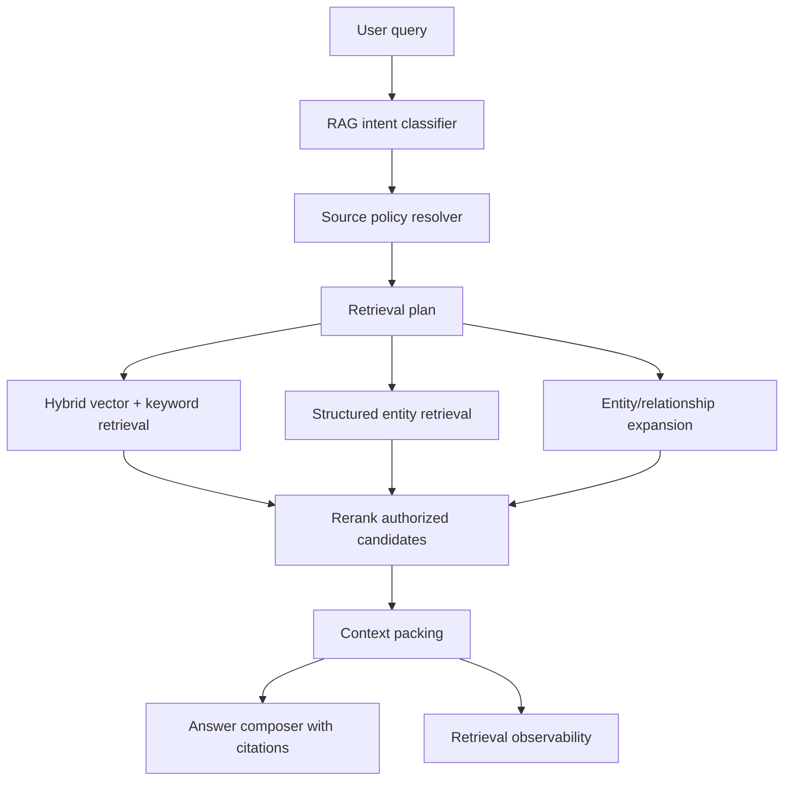

# Dedicated RAG Agent — implemented baseline

- Status: Shipped baseline; broader retrieval extensions remain deferred.
- Archive reconciliation: 2026-09-05. The controller/delegation split was recorded as implemented on 2026-06-16.
- Current behavior: [RAG Agent README](../../my_agents/agents/rag_agent/README.en.md) and
  [controller/RAG architecture](../product-chat-service/en/22-general-assistant-rag-agent-architecture-change-report.md).
- Canonical status: [implementation tracking](../implementation-tracking.md#shipped-and-completed-index).

## Delivered scope and evidence

`general_assistant` calls the production `rag_agent` runtime from its graph. RAG Agent owns
the focused/comprehensive tool choice and delegates focused retrieval to ContextForge;
RetrievalService retains authorization and bounded execution. The assistant composes the answer.
The Luna selector added later is bounded, with a deterministic/provider-failure fallback; it is
not an unrestricted autonomous retrieval loop.

Source evidence: `my_agents/agents/rag_agent/retrieval.py`, `tool_selection.py`, the general
assistant graph's `retrieve_rag_context` node, and ContextForge's retrieval graph.
Behavior tests include `tests/test_rag_agent_contracts.py`, `tests/test_rag_agent_tool_selection.py`,
and `tests/test_full_document_retrieval.py`. The September hotfix suite recorded 585 passed,
14 gated skips; those are historical results, not tests rerun for this documentation move.

## Remaining extensions are not marked complete

Iterative evidence-driven retrieval, adaptive surrounding-chunk expansion, automatic multi-range
synthesis, tokenizer/index-identity safety, original-file retention, and production layout-aware
parsing remain follow-up work in [the roadmap](../../ROADMAP.md#6-retrieval-rag-and-citations)
and [layout-aware ingestion idea](../idea/layout-aware-ingestion-rag-agent.md).
The responsibility list and conceptual flow below preserve the original ambition, not a claim
that every proposed capability shipped or every production quality target was verified.

## Historical idea and rationale

This note captures the product/architecture idea behind turning retrieval quality work into a dedicated RAG agent milestone.

## Historical implementation snapshot — 2026-06-16

As of 2026-06-16, this idea is implemented as a controller/delegation split:

- `general_assistant` remains the top-level assistant/controller graph and now invokes RAG retrieval inside the graph before memory/answer nodes.
- `rag_agent` is the assistant-facing RAG Agent boundary. It exposes the runtime retrieval seam and compact trace/grounding contract.
- `ContextForge` is the delegated permission-first retrieval engine behind the RAG Agent boundary. It plans retrieval, enforces source policy through RetrievalService, gathers authorized candidates, reranks/packs context, and emits redacted retrieval evidence.

The remaining future work in this note is the deeper tool-using RAG Agent graph where more retrieval roles become graph/tool nodes only after evals justify the extra orchestration.

## Core idea

Build a first-class **Dedicated RAG Agent** that owns the document-grounded retrieval boundary while the general assistant remains the top-level controller. The general assistant should be able to decide when it wants retrieval, then invoke the RAG Agent. The RAG Agent should plan retrieval, enforce source policy through delegated permission-first services, gather and pack context, expose citations, and explain retrieval behavior before final prose is produced.

This is the line between a demo document chatbot and a production-level knowledge assistant.

## Motivating failure

A user uploads a PDF API reference and asks:

```text
List the API endpoints in this document.
```

The document contains lines such as:

```text
GET /users
POST /auth/login
PATCH /projects/{id}
```

But it may not literally say:

```text
These are available endpoints.
```

A generic vector/keyword retriever can miss the relevant chunks because the query wording and document wording do not match. The document is not missing. The parser may not be broken. The retrieval plan is wrong for the user's intent.

## Responsibilities

The RAG agent should own:

1. **Query planning**
   - classify retrieval intent;
   - rewrite queries without losing user intent;
   - decide whether the task is semantic Q&A, overview, enumeration, comparison, or source lookup.

2. **Source policy**
   - unified `knowledge_base_selection` over every authorized standard KB;
   - personal KB retrieval;
   - group KB retrieval when the user is a current member;
   - owner-approved published personal KBs visible through group membership;
   - deleted-source behavior with no ghost knowledge.

3. **Candidate generation**
   - vector search;
   - keyword/full-text search;
   - entity/relationship expansion;
   - structured entity retrieval.

4. **Reranking and context packing**
   - rerank top-k authorized candidates;
   - choose what is actually injected into the LLM;
   - avoid overpacking noisy chunks;
   - preserve source/page/chunk provenance.

5. **Structured extraction and enumeration**
   - detect API endpoints, config keys, commands, error codes, database tables, metrics, and other enumerable entities during ingestion;
   - retrieve by entity type when the user asks list/extract/show questions;
   - return structured answer contracts when appropriate.

6. **Observability and evaluation**
   - log retrieved chunks;
   - log injected chunks;
   - log rejected chunks and reasons;
   - provide “why this source was used” metadata;
   - maintain golden retrieval-quality fixtures.

## Conceptual flow



## Example structured endpoint entity

```json
{
  "type": "api_endpoint",
  "method": "POST",
  "path": "/auth/login",
  "summary": "Authenticate a user and create a session.",
  "source_document_id": "doc_123",
  "source_chunk_id": "chunk_456",
  "source_page": 12,
  "confidence": "pattern+layout"
}
```

## Non-negotiable boundaries

The RAG agent must not bypass security or source rules.

- No unauthorized documents.
- No transcript leakage between users; chat transcripts are owner-private.
- No personal KB publication without owner approval.
- No ghost knowledge from deleted documents.
- Group knowledge is not implicit or mandatory; it is used through the same authorized source-selection contract as personal knowledge.

## Why this belongs as a milestone

Small retrieval patches can improve obvious cases, but they do not solve the architectural issue: production RAG needs a planning layer that understands document intent and source boundaries. API endpoint enumeration is the clearest example because the answer requires structured extraction, not just more semantic similarity.

The Dedicated RAG Agent milestone gives this work a product identity and a safe place to add evaluation, observability, and future retrieval strategies without overloading the general assistant path.
