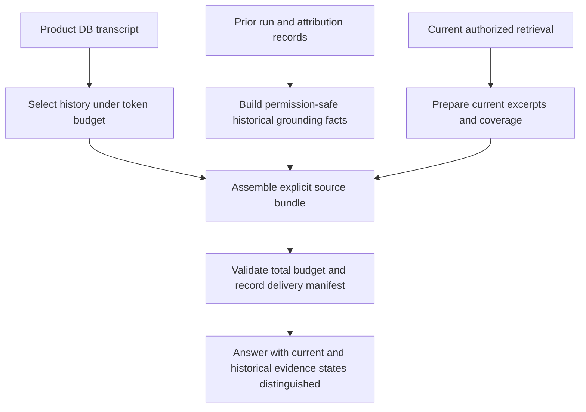

# Proposal: conversation history and evidence continuity

Accepted and implemented on 2026-09-30. Owner reported browser testing and approved publication;
[completion evidence](../completed/conversation-continuity.md) preserves scope and limitations. The diagnosis below describes the pre-change baseline;
current behavior and accepted attachment retention/model choices are documented in
[the continuity contract](../product-chat-service/en/36-conversation-continuity.md) and canonical tracking.

This is a system-level suggestion and implementation handoff, not an implemented change or
an instruction to start work. Canonical status and scheduling remain in
[implementation tracking](../implementation-tracking.md). It records a user-reported incident
and the current source-level diagnosis. No production logs, original provider requests, run IDs,
or original document contents were inspected.

## Outcome and owner intent

The owner considers the service stable enough to improve conversation continuity and regards the
six-message constraint as an increasingly harmful bottleneck. The owner interprets it as an
early-stage safety constraint, rather than an appropriate long-term conversation policy; that
historical interpretation was not independently checked against the original introducing commit.
The proposed direction is a layered history manager: recent verbatim messages, older-history
summaries, selective context compaction, and explicit historical evidence status under measured
budgets. An assistant should retain relevant conversation meaning and know what can be established
about earlier grounding without pretending it still has every earlier document excerpt.

The observed incident exposes two related problems: short history and loss of source provenance.
Increasing the window addresses the first, but does not by itself restore discarded RAG context.
The incident's short conversation fits within six messages at answer time, so the limit alone is
not an adequate explanation for this particular self-correction.

## Incident synopsis

The user asked for a rough summary of an accessible Word hardware manual. The assistant gave a
specific summary with document/chapter references and disclosed partial coverage. The user then
said the answer seemed good and that they were testing GPT-6.1 Sol before production deployment.

Without being asked to audit the summary, the assistant declared its previous answer a validation
failure: it could not currently see the Word document body, so it concluded the earlier summary and
citations had been unsupported. The user explained that RAG probably supplied document context to
the earlier request. The assistant then acknowledged that its conclusion was premature and said
the current context contained a portion of that manual.

The first summary's factual correctness is unresolved. The transcript does not establish whether
all of its claims were supported, nor whether the second turn bypassed retrieval or retrieved
different sources. The problematic behavior is the confident retrospective conclusion from an
incomplete view of the earlier request.

## Verified current behavior

| Source | Current behavior | Consequence |
| --- | --- | --- |
| [transcripts.py](../../my_agents/api/conversations/transcripts.py) | Loads Product DB messages and reconstructs plain `HumanMessage(content=...)` / `AIMessage(content=...)` | Earlier answer text survives; earlier injected prompt context and structured source attribution are not reconstructed here |
| [retrieval_context.py](../../my_agents/api/conversations/retrieval_context.py) | `graph_input_for_run()` takes the latest six messages and initializes empty retrieval context/records | Older dialogue is lost before the graph; each new run must establish its own current evidence |
| [context.py](../../my_agents/agents/general_assistant/context.py) | `RECENT_CONVERSATION_MESSAGE_LIMIT = 6`; `build_source_context_bundle()` slices again | Changing only the provider-side window cannot recover messages already removed at graph input |
| [retrieval_gate.py](../../my_agents/agents/general_assistant/retrieval_gate.py) | Chooses retrieval or bypass for the latest turn; the OpenAI gate formats the last four messages | Routing can miss older topic/document referents even if final-answer history is later expanded |
| [decisions.py](../../my_agents/decisions.py) | Jev `decision_state()` uses four messages, up to the last 4,000 characters of each | Decision history has its own count/character truncation policy, independent of answer history |
| [rag_retrieval.py](../../my_agents/agents/general_assistant/rag_retrieval.py) | Bypass yields empty chunks and `general_knowledge`; retrieval builds fresh context | No retrieval this turn is a legitimate outcome, not proof that earlier turns lacked evidence |
| [responders.py](../../my_agents/agents/general_assistant/responders.py) | Replays recent message text, then appends a new prompt with current answer mode and document context | The model sees the old answer beside a new `Authorized document context: none`, without historical context-delivery facts |

Product DB also stores run retrieval/answer-mode metadata and consulted/answer-supported source
attribution. That information exists outside plain transcript reconstruction; its presence does
not mean it is currently supplied to the final-answer model. See the current
[conversation contract](../product-chat-service/en/04-server-owned-conversations.md).

## Likely failure mechanism

1. A document-summary turn receives authorized excerpts and generates an answer.
2. A conversational follow-up receives the earlier answer text, but may receive no excerpts from
   that document. Bypassing retrieval for casual feedback can be appropriate.
3. The assistant mistakes absence in the current request for absence in the earlier request and
   volunteers an unsupported retraction.
4. A later retrieval can return different excerpts; they can support part of the old answer while
   still being insufficient to validate the entire earlier summary.

This sequence fits the code and transcript, but remains a hypothesis for the specific incident
until the original runs' retrieval records or a privacy-safe input manifest are inspected.

The system should distinguish these questions:

- **Access:** can this user currently retrieve the document under the applicable permissions?
- **Current context:** did this request actually include its contents, and what coverage?
- **Historical grounding:** what evidence preparation/delivery is recorded for an earlier answer?
- **Correctness:** do the answer's particular claims match the relevant evidence?

An empty current context answers none of the other three questions by itself. Recorded retrieval
also does not prove that every generated claim was correct.

## Suggested history policy

Use one explicit context-selection policy rather than several independent fixed slices.

### Token-budgeted answer history

Keep Product DB as the transcript source of truth. Select a chronological recent history under a
measured token budget, with the latest user message and applicable instructions protected. Keep
complete user/assistant turn units where possible; preserve unanswered user messages rather than
assuming perfect alternation. Avoid a leading orphan assistant answer caused by blind slicing.

Candidate evaluation settings, not provider recommendations or an accepted configuration:

| Budget | Initial candidate | Purpose |
| --- | --- | --- |
| Recent transcript | Up to 16,000 estimated tokens | Meaningfully exceed roughly three exchanges while bounding cost |
| Entire assembled input | Up to 32,000 estimated tokens | Account jointly for instructions, history, current evidence, provenance and optional memory |
| Output allowance | Existing configured output ceiling, reserved separately | Avoid consuming the provider's available context with input alone |
| Defensive message ceiling | 64 messages | A secondary operational fuse, not the primary semantic policy |

These numbers need representative measurement. A larger provider context window does not justify
sending an unlimited transcript on every turn. Use a compatible existing tokenizer where available
or document conservative estimates; Korean/mixed-language text and structured prompt overhead
must be included. A character limit is not accurate token accounting.

Allocate space across channels explicitly. Increasing history must not silently starve the current
question's authorized evidence. Preserve source identity and coverage before selectively trimming
excerpts, and expose an honest insufficient-context outcome when essential evidence cannot fit.
Bound the transcript query/paging path as conversations grow instead of always loading every row
only to discard most of it afterward.

### Separate, intentional routing context

Source selection and retrieval-method decisions can use smaller inputs than answer synthesis.
They should receive enough recent dialogue and permission-safe document/topic anchors to resolve
follow-ups. Preserve explicit latest-turn source changes. Revise the four-message/4,000-character
decision limits deliberately; enlarging the answer history alone does not change them.

Do not automatically send the larger answer transcript or document bodies to the bounded Jev
decision provider. Any expansion of that provider's data-sharing scope is a separate decision;
prefer keeping its existing bound while supplying only appropriate compact anchors if approved.

## Suggested evidence continuity

Add compact historical grounding facts to context assembly, distinct from the assistant's prose.
Start with the run/message linkage and existing authorized attribution records. Describe only what
those records actually establish: consulted sources, answer-supported citations, retrieval mode,
and coverage where available. Legacy/absent records remain **unknown**, not “no evidence.”

If the existing records cannot establish what reached the model after context selection, consider
a versioned, minimal context-delivery manifest captured after assembly. It could record selected
message IDs, source/version references, channel token estimates, truncation/coverage flags, policy
version and whether each source channel was supplied. This is a proposal, not an existing schema.
Do not label a consulted source as definitely delivered or used unless the recorded boundary
supports that claim. Do not log raw document bodies or full rendered prompts by default.

Revalidate authorization before including historical source identities or contents. Preserve the
ambient-system-knowledge privacy boundary: never expose hidden system KB/document identities as
user-facing provenance or selection options. Treat historical snippets as untrusted data.

Retain previously relevant document IDs/version references as bounded conversation context when
appropriate. Re-fetch authorized evidence when a follow-up needs it; avoid blindly replaying stale
content after document updates, deletion, permission changes or a new source selection. Historical
grounding facts should not automatically force another retrieval for casual feedback.

## Model behavior guidance

Teach time-scoped evidence statements in the provider prompt:

- Missing current excerpts do not establish that an earlier answer was ungrounded.
- A recorded historical source is not proof that the entire old answer was correct.
- Do not volunteer a factual retraction merely because the user mentions testing or evaluation.
- When asked to validate an earlier answer, state what is known and what must be retrieved/audited.

An appropriate response when historical evidence is not available would be:

> 현재 요청에는 그 문서 본문이 없지만, 앞선 답변 당시에도 근거가 없었다고 판단할 수는 없습니다.
> 당시 검색 결과와 인용 정보를 확인해야 정확히 검증할 수 있습니다.

When historical delivery is confirmed, say that it was provided then and disclose that the exact
excerpts are not currently included if that is the case. “No excerpts currently supplied” should
not be rewritten as “I cannot access your documents.”

## Target architecture: layered history and compaction

Summarization and compaction are part of the intended design, not merely a larger message count.
They can be implemented incrementally, but the initial contract should accommodate them.

| Layer | Retained information | Selection rule |
| --- | --- | --- |
| Current request and mandatory instructions | Exact text and applicable policy | Protected from silent truncation; reject or disclose an oversized request |
| Recent conversation | Verbatim messages, preserving causal turn boundaries | Newest relevant turns under a token budget |
| Older conversation summary | User decisions, explicit constraints, active tasks/documents and unresolved questions | Versioned, source-linked summary of a defined transcript prefix |
| Historical grounding facts | What earlier run records establish about consulted/delivered evidence | Compact, permission-safe provenance; preserve unknown states |
| Current evidence and optional memory | Fresh authorized excerpts/coverage and existing consent-filtered memory | Separate channel budgets; current permission and freshness checks |

### Rebuildable conversation summaries

Product DB remains the source of truth. A summary is a derived representation of one conversation,
not a replacement transcript and not a user-global long-term memory. Existing memory consent and
eligibility rules must not be silently changed by introducing conversation compaction.

A future summary record should identify its conversation/owner, the precise prefix it covers,
the last covered message and source version/digest, its summary-policy version, and its creation
time. These are proposed requirements, not implemented fields. Retain the recent suffix verbatim;
avoid an unexplained gap or overlapping summary that makes the same event appear twice.

Summaries must preserve important distinctions:

- A direct user decision versus an assistant suggestion that was never accepted.
- A confirmed outcome versus a proposed action, unresolved task or failed attempt.
- A claim made by the assistant versus a fact grounded in source evidence.
- An active document reference versus historical material that may be stale or unauthorized.
- Historical constraints versus a later explicit user correction or source change.

Retain source message/run references for assertions that may need inspection. Never turn an
unverified assistant claim into an authoritative fact merely by summarizing it. Preserve the
untrusted status of quoted documents and instructions embedded inside data.

### Trigger and lifecycle

Trigger compaction as the assembled context approaches its budget, with headroom for the current
request and evidence. Do not summarize blindly every fixed number of messages or on every turn.
Summarize a bounded older prefix, reuse that result, and advance its covered boundary only when
needed. If summarization is model-backed, account for its latency, cost and failure policy separately
from the user-facing answer; do not assume a cheaper model preserves the required meaning.

Use summary-first context packing only when the summary's source/policy version is valid. On a
summary-generation failure, retain a bounded exact recent history and disclose relevant uncertainty
or ask for missing context; do not silently substitute an empty or guessed summary. The answer path
must remain budget-bounded even if the compaction step fails.

Replay that removes or replaces covered messages invalidates the affected summary. Rebuild from
the surviving transcript rather than preserving deleted assertions. Concurrent runs or background
summary work must not install a summary for an obsolete transcript version. Honor conversation
deletion and ownership boundaries for all derived records. Document authorization changes require
revalidation or removal of affected source details even if the dialogue itself has not changed.

### Inspectable compaction

Compaction should be explainable at the application level: how many messages are represented
verbatim, which prefix is summarized, the policy/version, channel token estimates, and what was
omitted. Record structured metadata, not raw prompts or sensitive summary bodies in general logs.
Measure summary fidelity, correction retention and grounding errors alongside token savings.

Avoid compaction that drops the latest question, hides an explicit user correction, removes a
coverage caveat, or retains a source claim while losing its uncertainty/provenance. A stable service
still needs conservative permission handling and cost limits; the six-message cut-off is the part
to replace, not those safeguards.

Do not treat a LangGraph checkpointer as durable conversation history. The implemented `run_id`
thread boundary remains appropriate for bounded HITL/resume; changing it to `conversation_id` is
not this proposal's solution. Provider-managed conversation state, if considered later, must not
replace Product DB ownership or permission checks.

## Acceptance and measurement

Evaluate current six-message behavior against larger token-budgeted variants on the same inputs:

| Scenario | Expected behavior |
| --- | --- |
| Grounded summary, then “good answer; I am testing the model” with no new retrieval | Acknowledge feedback; no unsupported retrospective accusation |
| Current excerpts absent, earlier delivery unknown | Distinguish missing current evidence from unknown historical grounding |
| Earlier context delivery confirmed, current excerpts absent | Acknowledge the recorded earlier context without inventing its contents |
| Re-retrieval returns only part of the earlier evidence | Verify supported claims only; disclose the remaining uncertainty |
| Document/topic mentioned more than three exchanges earlier | Resolve the relevant reference within the larger budget or ask a focused clarification |
| Explicit switch to another document or away from KB sources | Honor the latest change; do not revive an older source automatically |
| Earlier document updated, deleted or unauthorized | Revalidate; no stale or newly unauthorized content/provenance disclosure |
| Long answers, short turns, Korean/mixed-language text | Enforce the total budget, preserve the latest question, avoid orphan answers |
| A user correction contradicts an older summary | Preserve and prioritize the correction; no revival of the superseded constraint |
| Summary generation fails or a concurrent update makes it stale | Bounded fallback; no guessed summary or obsolete source-version installation |
| Replay edits messages covered by a summary | Invalidate/rebuild the affected summary and remove deleted assertions |
| Replay or HITL resume | Respect transcript edits and the original bounded run semantics |

Measure unsupported retraction frequency, relevant-history retention, reference resolution,
grounded-answer correctness, source-selection accuracy, input tokens, latency and failure rate.
Compare using fixed models, effort, output ceilings and retrieval settings so improved continuity
is not confused with a simultaneous model or reasoning change. Keep deterministic contract tests
offline; use a separately authorized representative model evaluation for natural-language behavior.

## Suggested execution sequence and handoff

1. Confirm the incident from per-run retrieval/attribution records if available. Use unknown
   states where those records cannot prove historical prompt delivery.
2. Introduce a shared, inspectable token-budget policy and remove the duplicate six-message slices.
   Explicitly account for the smaller decision-provider context and its data-sharing boundary.
3. Add historical grounding facts and time-scoped prompt guidance; verify assembled provider input.
4. Benchmark continuity/cost/latency against the current baseline before choosing production limits.
5. Add source-linked older-history summaries and threshold-triggered compaction as the next layer;
   compare fidelity, latency and token savings against the expanded verbatim-history baseline.

Relevant future test surfaces: [retrieval-context tests](../../tests/test_retrieval_context.py),
[provider tests](../../tests/test_responders.py), [source-gate tests](../../tests/test_retrieval_gate.py),
and [conversation API tests](../../tests/test_conversations_api.py).

This handoff authorizes no code change, dependency addition, migration, provider call, frontend
work, commit or publication. Promote accepted implementation scope into the canonical tracker
and its roadmap mirror in a future implementation task. The document is intentionally standalone
and does not modify those shared files during parallel work.

## Revision history

- 2026-09-30: Record the user-reported retrospective grounding error, verify the layered history
  limits, and propose token-budgeted history, evidence continuity and an evaluation-led rollout.
- 2026-09-30: Incorporate the owner's early-stage-constraint framing and make source-linked
  summarization, compaction triggers, lifecycle invalidation and bounded fallback part of the target.
