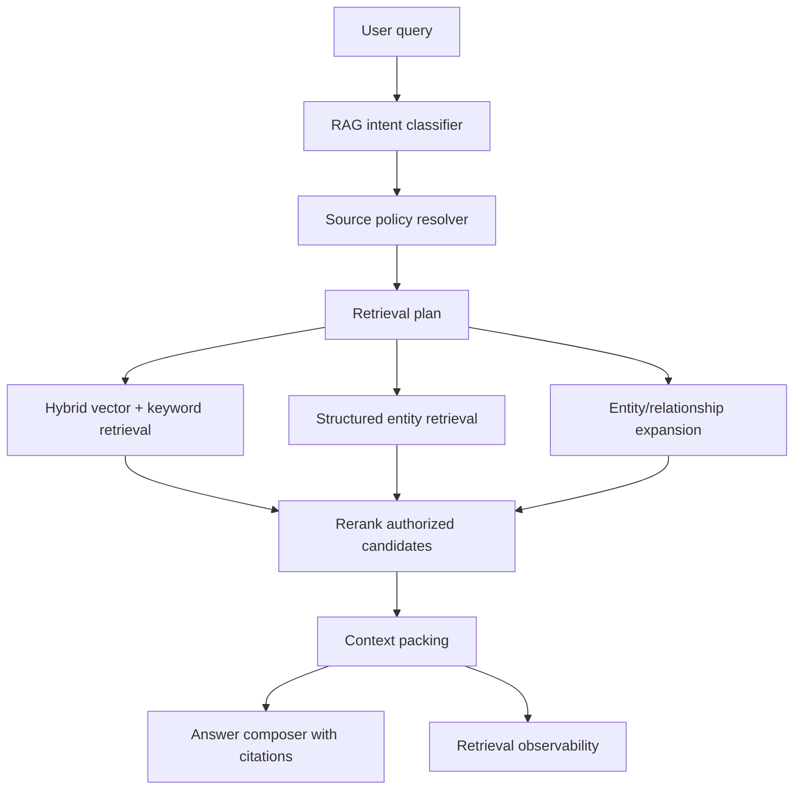

# Dedicated RAG Agent idea

This note captures the product/architecture idea behind turning retrieval quality work into a dedicated RAG agent milestone.

## Core idea

Build a first-class **Dedicated RAG Agent** that owns document-grounded answering. The general assistant should not be responsible for every retrieval decision. The RAG agent should plan retrieval, enforce source policy, gather and pack context, expose citations, and explain retrieval behavior before the general assistant or answer composer produces final prose.

This is the line between a demo document chatbot and a production-level knowledge assistant.

## Motivating failure

A user uploads a PDF API reference and asks:

```text
List the API endpoints in this document.
```

The document contains lines such as:

```text
GET /users
POST /auth/login
PATCH /projects/{id}
```

But it may not literally say:

```text
These are available endpoints.
```

A generic vector/keyword retriever can miss the relevant chunks because the query wording and document wording do not match. The document is not missing. The parser may not be broken. The retrieval plan is wrong for the user's intent.

## Responsibilities

The RAG agent should own:

1. **Query planning**
   - classify retrieval intent;
   - rewrite queries without losing user intent;
   - decide whether the task is semantic Q&A, overview, enumeration, comparison, or source lookup.

2. **Source policy**
   - personal KB retrieval;
   - mandatory group KB retrieval;
   - approved published personal KBs in group context;
   - optional personal KB attachment inside group chat;
   - deleted-source behavior with no ghost knowledge.

3. **Candidate generation**
   - vector search;
   - keyword/full-text search;
   - entity/relationship expansion;
   - structured entity retrieval.

4. **Reranking and context packing**
   - rerank top-k authorized candidates;
   - choose what is actually injected into the LLM;
   - avoid overpacking noisy chunks;
   - preserve source/page/chunk provenance.

5. **Structured extraction and enumeration**
   - detect API endpoints, config keys, commands, error codes, database tables, metrics, and other enumerable entities during ingestion;
   - retrieve by entity type when the user asks list/extract/show questions;
   - return structured answer contracts when appropriate.

6. **Observability and evaluation**
   - log retrieved chunks;
   - log injected chunks;
   - log rejected chunks and reasons;
   - provide “why this source was used” metadata;
   - maintain golden retrieval-quality fixtures.

## Conceptual flow



## Example structured endpoint entity

```json
{
  "type": "api_endpoint",
  "method": "POST",
  "path": "/auth/login",
  "summary": "Authenticate a user and create a session.",
  "source_document_id": "doc_123",
  "source_chunk_id": "chunk_456",
  "source_page": 12,
  "confidence": "pattern+layout"
}
```

## Non-negotiable boundaries

The RAG agent must not bypass security or source rules.

- No unauthorized documents.
- No transcript leakage between group members.
- No personal KB publication without owner approval.
- No ghost knowledge from deleted documents.
- Mandatory group KB retrieval stays mandatory in group chat.
- Optional personal KB attachment stays private to that user's group-chat run.

## Why this belongs as a milestone

Small retrieval patches can improve obvious cases, but they do not solve the architectural issue: production RAG needs a planning layer that understands document intent and source boundaries. API endpoint enumeration is the clearest example because the answer requires structured extraction, not just more semantic similarity.

The Dedicated RAG Agent milestone gives this work a product identity and a safe place to add evaluation, observability, and future retrieval strategies without overloading the general assistant path.
