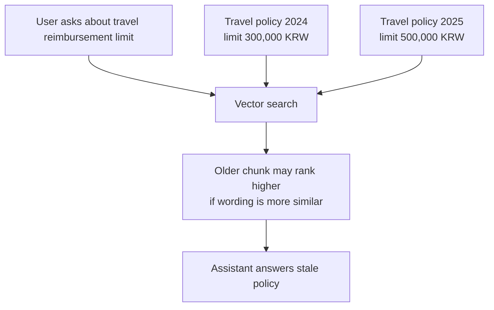
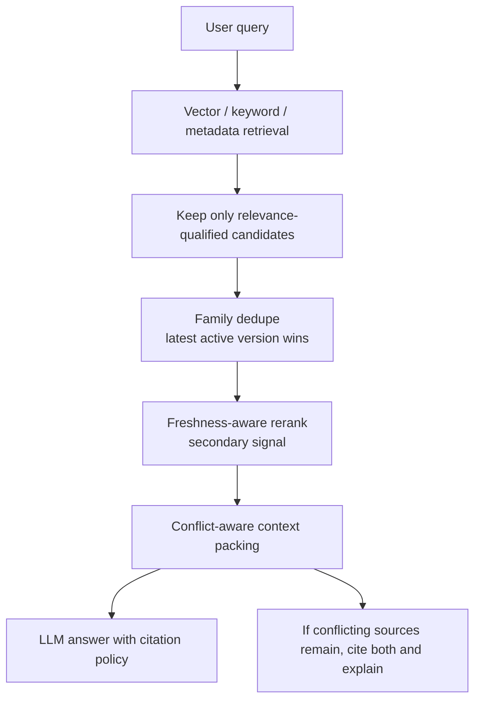

# Knowledge freshness and conflict resolution idea

This note captures the 2026-06-09 side discussion about whether `my-agents` should detect stale knowledge when multiple knowledge-base documents contain similar but conflicting content.

## Short answer

The current retrieval path has **recency-aware ordering in a few places**, but it does **not** have a real knowledge freshness or conflict-resolution layer.

Today, vector/keyword retrieval can still return an older document if its wording is more similar to the user query. Upload time can influence ordering or fallback behavior, but there is no explicit policy that says:

```text
if two sources conflict, prefer the newer effective source
```

A future implementation should treat freshness as metadata and policy, not as something vector search can infer by itself.

## Current implementation snapshot

Current code already gives the service a few building blocks:

- `DocumentModel.created_at` exists and records when a document row was created.
- Retrieval rows are commonly ordered by `DocumentModel.created_at.desc()` as a secondary ordering signal.
- Broad personal-document fallback can return recent authorized chunks when exact retrieval finds nothing.
- Metadata/profile retrieval can tie-break by document creation time.

But this is not enough for conflict handling:

- there is no `source_published_at` or `effective_at` field;
- there is no document `family`, `version`, or `status` such as `active` / `deprecated`;
- there is no `supersedes_document_id` / `replaces` relationship;
- there is no conflict detector that compares new uploads against existing KB material;
- the answer layer does not warn users when retrieved sources disagree.

## Why vector search alone is insufficient

A common first RAG mental model is:

```text
Document 2024
Document 2025
    ↓
Vector search
    ↓
Most similar chunks
    ↓
LLM answer
```

The problem is that vector search knows semantic similarity, not knowledge freshness. If an older policy uses wording closer to the user's question, that older chunk can rank above a newer policy even when the newer policy should be authoritative.



## Summary of the ChatGPT discussion

The external conversation proposed five common patterns.

### 1. Add freshness metadata and rerank

Store metadata such as upload date, creation date, source publication date, and version. After initial retrieval, combine semantic relevance with a freshness score:

```text
final_score = semantic_score * 0.8 + freshness_score * 0.2
```

This is easy to implement, but it should be a secondary signal. Freshness should not blindly override relevance, because not every domain needs newer sources to win.

### 2. Introduce document families

For repeated versions of the same source, store a stable family key:

```text
family = employee_handbook
version = 3
```

If retrieval returns `v1`, `v2`, and `v3` from the same family, keep only the latest active version before context packing.

This is the strongest near-term pattern for internal KBs because many conflicts are really version conflicts inside the same document family.

### 3. Add active/deprecated status

Give documents or document versions a lifecycle state:

```text
active
deprecated
archived
```

Retrieval can filter to active sources by default. For company policy documents, this is often more reliable than pure time decay because stale policies should not be retrieved at all unless the user explicitly asks for historical material.

### 4. Detect conflicts at ingestion time

When a new document is uploaded, compare it against similar existing documents. If it appears to revise existing facts, mark older documents deprecated or create a relationship such as:

```text
new_document REPLACES old_document
```

This becomes especially natural in a GraphRAG-style model:

```text
Doc v1 <-REPLACED_BY- Doc v2 <-REPLACED_BY- Doc v3
```

Then a retrieval hit on `v1` can be promoted to `v3` before answering.

### 5. Use time decay carefully

A simple time-decay formula can reduce older document scores:

```text
time_decay = exp(-days_old / 365)
score = similarity * time_decay
```

This should only be a supporting heuristic. Some older sources remain authoritative for years, while some recent uploads may be drafts or duplicates.

## Recommended direction for `my-agents`

For the current KB level, the most valuable first layer is:

```text
family + version + status
```

This likely solves most stale-policy problems without requiring full automatic contradiction detection.

Recommended metadata:

```text
documents
- uploaded_at / created_at          # current row creation time already exists
- source_published_at nullable      # when the source says it was published
- effective_at nullable             # when this policy/version becomes valid
- family_key nullable               # e.g. employee_handbook, travel_policy
- version_label nullable            # e.g. v3, 2025, rev-4
- version_number nullable           # sortable numeric version when known
- freshness_status                  # active, deprecated, archived, draft
- supersedes_document_id nullable   # direct replacement pointer
```

For chunks, retrieval should retain enough inherited metadata to reason about freshness without joining too much at answer time.

## Proposed retrieval pipeline



Important rule: freshness should run **after** a relevance gate. A recent but irrelevant document should not beat an older but directly relevant document.

## Conflict-aware answer behavior

When two retrieved sources disagree and the system cannot confidently collapse them into one latest source, the assistant should not hide the conflict. It should say something like:

```text
I found conflicting sources. The newer active document says X, while an older deprecated document says Y. I will treat the newer active document as authoritative unless you want historical context.
```

This requires the retrieval context to include freshness metadata and status in the source payload passed to the graph/provider prompt.

## Phased implementation sketch

### Phase 1: Manual freshness metadata

- Add document-level fields for `family_key`, `version_label`, `version_number`, `freshness_status`, `source_published_at`, `effective_at`, and `supersedes_document_id`.
- Default existing documents to `active` with null family/version fields.
- Add admin/API paths later for users to mark documents deprecated or assign family/version metadata.

### Phase 2: Retrieval-time family filtering

- After retrieval, group candidates by `family_key`.
- If multiple active versions from the same family appear, keep the newest by `version_number`, `effective_at`, then `source_published_at`, then `created_at`.
- If only deprecated candidates exist, keep them only when no active candidate in that family is available or when the user asks for historical sources.

### Phase 3: Conflict-aware context packing

- If candidates from different families make incompatible claims, include both but mark the conflict.
- Add source metadata to the graph input so the response can explain which source is newer or active.
- Add tests that two similar chunks with conflicting facts produce a conflict-aware retrieval payload.

### Phase 4: Ingestion-time replacement suggestions

- On upload, compare the new document with existing documents in the same KB.
- Suggest likely family/version/status updates instead of silently changing old documents.
- Later, allow a user-approved or admin-approved `REPLACES` relationship.

## Product policy questions

- Should freshness metadata be user-managed first, or should the system infer it from filenames and document text?
- Should deprecated documents be excluded by default, or included with a lower score and warning?
- Should historical questions such as “what was the 2024 policy?” bypass active-only filtering?
- Should family/version metadata live at the document level only, or also at section/chunk level for documents that contain multiple policies?
- For team KBs, who is allowed to mark a document deprecated or replace an existing source?

## Non-goals for the first pass

- Do not use pure time decay as the only freshness policy.
- Do not let upload time masquerade as source publication or effective date.
- Do not automatically delete old documents when a new document appears.
- Do not silently hide conflicts that cannot be confidently resolved.
- Do not make the LLM guess which source is authoritative without retrieval metadata.

## Practical first milestone

A good first implementation milestone would be:

1. Add document freshness metadata fields.
2. Add active/deprecated filtering in retrieval.
3. Add family/version dedupe after candidate retrieval.
4. Pass freshness metadata into citations/debug retrieval payloads.
5. Add tests with two conflicting policy documents where the newer active document wins.

This is enough to prevent the most common failure: answering from an old policy simply because its chunk had a slightly higher vector similarity.
