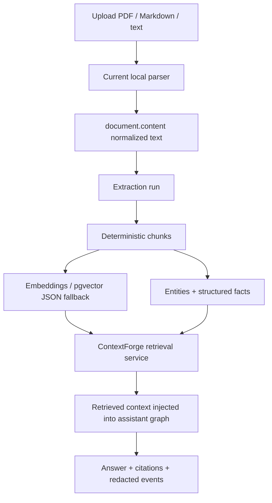
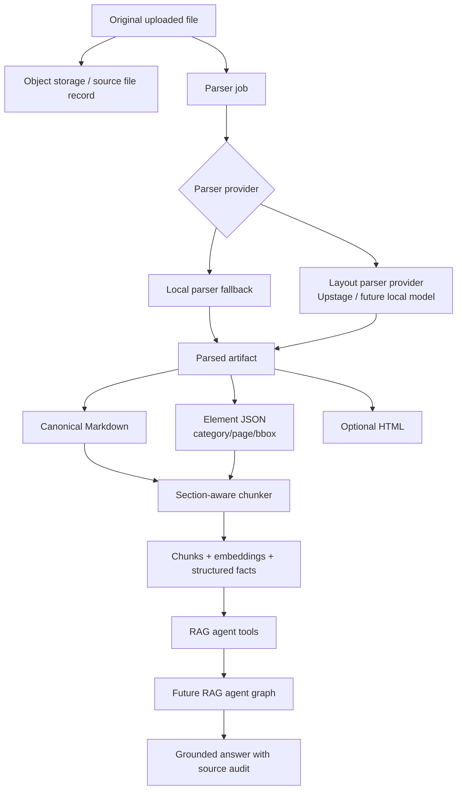
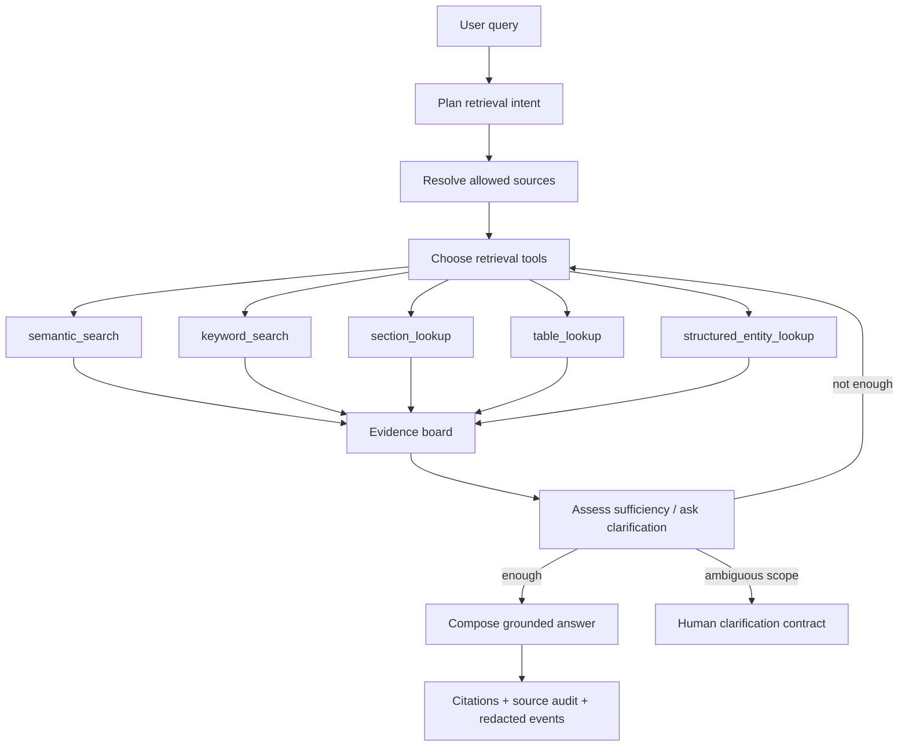

# Layout-aware ingestion for the future RAG agent

This note captures the product and architecture idea for using a document layout parser, such as Upstage Document Parse, as an ingestion-stage upgrade that feeds the future RAG agent graph.

## Core idea

The service should eventually treat a user upload as a **source artifact**, not as the only text representation used for retrieval.

A production ingestion path should preserve the original file, parse it into layout-aware machine-readable artifacts, then ingest those artifacts into retrieval storage:

```text
Original upload
→ layout parser
→ structured Markdown / HTML / layout element JSON
→ section-aware chunks with page + element provenance
→ embeddings + structured facts + metadata profile
→ RAG agent tools retrieve, inspect, rerank, and answer with citations
```

Markdown is a good canonical text surface for chunking, but it should not be the only stored parser output. The parsed layout element JSON is needed for page coordinates, table/figure/caption relationships, source previews, and trustworthy citation UX.

## Why this matters

The current backend already has a dedicated RAG service boundary through `ContextForge`, but the ingestion path is still mostly text-centric. That is enough for a product V1 slice, but production RAG quality depends on preserving document structure before retrieval starts.

Layout parsing helps when documents contain:

- headings and nested sections;
- tables split across pages;
- figures, captions, charts, and equations;
- headers, footers, footnotes, and indexes;
- scanned or image-heavy pages;
- forms, reports, contracts, manuals, API references, and Korean/English mixed layouts.

Without layout-aware parsing, chunking can cut through the middle of a section or flatten tables into noisy text. The future RAG agent can reason better only if its retrieval tools expose meaningful document units.

## Current state

Today the implemented flow is approximately:



This gives a working permission-aware RAG slice, including citations, events, structured entity retrieval, metadata profiles, pgvector-backed search on Postgres, and deterministic fallbacks for tests.

The missing production-depth piece is a durable parsed-document artifact layer that preserves layout and lets the future RAG agent retrieve at section/table/figure granularity.

## Target architecture



The important separation is:

- **source file**: original user upload, kept for audit/reparse/download;
- **parse artifact**: Markdown/HTML/elements produced by a parser provider;
- **retrieval units**: chunks, entities, table rows, figure captions, metadata profiles, and embeddings derived from the artifact;
- **RAG agent tools**: permission-filtered operations that inspect and retrieve those units.

## Parser provider boundary

Add a provider interface before adopting any specific vendor deeply:

```python
class DocumentParserProvider:
    def parse(self, source: DocumentSource) -> ParsedDocumentArtifact:
        ...
```

Initial providers:

1. `local_text_v1`
   - current deterministic parser path;
   - offline-test friendly;
   - fallback when external parsing is disabled.

2. `upstage_document_parse_v1`
   - optional env-gated provider;
   - sends supported files to Upstage Document Parse;
   - requests Markdown plus layout elements/coordinates when enabled;
   - suitable for complex PDFs, scans, tables, charts, DOCX/PPTX/XLSX/HWP-style expansion if product policy allows.

3. Future `local_layout_v2`
   - local/on-prem parser option if privacy, cost, or latency makes cloud parsing unsuitable.

The app should not expose Upstage-specific assumptions past the provider adapter. Internal models should use generic terms such as `parser_name`, `parser_model`, `layout_category`, `coordinates`, and `artifact_format`.

## Artifact model sketch

```text
document_parse_artifacts
- id
- document_id
- source_file_hash
- parser_name
- parser_model
- parser_version
- parser_config_json
- markdown_content
- html_content nullable
- elements_json
- warnings_json
- created_at
```

Chunk-level additions:

```text
document_chunks
- section_path
- heading_level
- layout_category
- source_element_ids_json
- source_page
- source_bbox_json
- markdown_anchor
- source_start_offset
- source_end_offset
```

This lets the service reparse the same source, compare parser versions, invalidate old chunks safely, and show better citations.


## Expected database impact

This idea is a major conceptual schema shift, but it should be delivered through additive migrations rather than a destructive rewrite. The current core tables can remain useful: documents, knowledge bases, extraction runs, chunks, entities, conversations, runs, events, and citations. The main change is introducing a durable separation between the original source file, parser-specific artifacts, and retrieval/index material derived from those artifacts.

Current mental model:

```text
document = uploaded content + extracted text
```

Target mental model:

```text
document = user-visible source object
source file = original upload storage/audit record
parse artifact = parser-specific Markdown/HTML/layout representation
chunks/entities/indexes = derived retrieval material
```

Likely additive schema changes:

1. **Source file metadata**
   - Store original upload identity separately from extracted text.
   - Candidate fields/table: storage key, SHA-256 hash, original filename, MIME type, size, page count, retention state, and created timestamp.
   - This prepares for object storage, reparse, deduplication, and audit/download flows.

2. **Parsed artifact table**
   - Add a `document_parse_artifacts`-style table for parser outputs.
   - Store parser name/model/version/config, source hash, Markdown, optional HTML, layout element JSON, warnings, and the extraction run that produced it.
   - Keep this generic so Upstage, local parsers, or future providers can share the same internal contract.

3. **Layout elements, first as JSON and later as a table if needed**
   - Start with `elements_json` on the artifact for lower migration cost.
   - Normalize into `document_layout_elements` only when RAG tools need direct querying by section/table/figure/coordinate.
   - Candidate element fields: external element id, category, page, text/Markdown/HTML content, bounding box JSON, parent element id, and ordinal.

4. **Richer chunk provenance**
   - Extend chunks with parse artifact id, section path, heading level, layout category, source element ids, bounding boxes, and Markdown anchors.
   - Existing chunk content, offsets, source page, embeddings, and pgvector/JSON fallback remain useful.

5. **Citation/source-audit expansion**
   - Citations can still point to chunks, but should eventually denormalize enough display metadata for refresh-safe UX.
   - Candidate fields: source page, section/table/figure label, source element id, bounding box, filename, preview text, and confidence/source-audit metadata.

6. **Reingestion and versioning**
   - Add an active parse artifact pointer or version state so one document can be reparsed without losing history immediately.
   - Reingestion should invalidate or supersede derived chunks/entities/indexes safely. Old completed chat runs may keep display-safe citation snapshots, while live retrieval uses only the active artifact/index.

Recommended migration sequence:

1. Add parse artifact/source-file metadata without changing retrieval behavior.
2. Keep current `document.content` compatibility while writing parsed Markdown into artifacts.
3. Make ingestion read from the active parse artifact when present, with current text fallback.
4. Add chunk provenance columns and populate them opportunistically.
5. Teach ContextForge/RAG tools to use section/table/layout metadata.
6. Normalize layout elements into a queryable table only after tool/eval needs prove it.
7. Add reparse/versioning and cleanup policies before broad production rollout.

The schema goal is to make parsing, indexing, and retrieval independently evolvable. Parser upgrades should not require changing user-facing document identity, and RAG-agent tool upgrades should not require reparsing every document unless the retrieval material actually needs a new artifact version.

## Section-aware chunking strategy

The current chunker can evolve from text paragraph/fixed-width units into a document-structure chunker:

1. Build a section tree from heading elements.
2. Attach paragraphs, lists, tables, figures, captions, equations, and footnotes to the nearest section.
3. Create atomic chunks for tables/figures when users may ask directly about them.
4. Create section-summary or section-window chunks for overview questions.
5. Preserve `section_path`, page, element IDs, and bounding boxes on each chunk.
6. Fall back to paragraph/fixed-width chunking when parser output is incomplete.

This should improve query classes like:

- “summarize section 3”;
- “what does the table say about pricing?”;
- “list all API endpoints”;
- “compare the two policies”;
- “what does the figure on page 4 show?”

## Future RAG agent graph integration

The future RAG agent graph should not be only “retrieve top-k chunks then answer.” It should be able to reason over tools while still preserving hard authorization boundaries.

Candidate graph nodes:



Tool examples:

- `semantic_search(query, source_scope, limit)`
- `keyword_search(terms, source_scope, limit)`
- `section_lookup(document_id, section_path)`
- `table_lookup(document_id, caption_or_heading)`
- `structured_entity_lookup(entity_type, filters)`
- `source_preview(chunk_id | element_id)`
- `citation_audit(candidate_ids)`

All tools must receive a resolved source scope from the service layer. The graph can choose and sequence tools, but it must never decide document authorization by prompting.

## Source and security boundaries

Non-negotiable rules:

- Original documents remain governed by existing document/KB/group permissions.
- Parser artifacts inherit the same authorization as their source document.
- RAG tools only operate over already-authorized source scopes.
- Cloud parser use must be explicit, env-gated, and documented because uploaded files leave the app boundary.
- Parser warnings and failures must be safe for users; do not expose stack traces, raw vendor errors, secrets, or hidden prompts.
- Deleted documents must remove or tombstone parse artifacts, chunks, entities, citations, and source previews so there is no ghost knowledge.

## Evaluation plan

Before claiming the layout parser improves RAG, create a small eval set comparing current local parsing against the layout-aware path.

Suggested fixtures:

- API reference PDF with endpoint tables/lists.
- Financial/report PDF with charts and tables.
- Contract/manual with nested sections and footnotes.
- Mixed Korean/English document.
- Scanned or image-heavy document if provider policy allows.

Measure:

- chunk recall for expected evidence;
- answer correctness;
- citation correctness;
- table preservation;
- section/page provenance accuracy;
- ingestion latency;
- parse failure rate;
- cost per page;
- permission leakage regressions.

## Phased plan

1. **Design provider contract**
   - Define `ParsedDocumentArtifact` and provider interface.
   - Keep local parser as default.
   - Add env flags for external parser enablement.

2. **Persist parsed artifacts**
   - Store Markdown, optional HTML, element JSON, parser metadata, source hash, and warnings.
   - Keep original file/object-storage plan separate from parsed artifact storage.

3. **Section-aware chunking**
   - Chunk by headings/layout elements when available.
   - Preserve fallback chunking for parser-lite or failed-parser paths.

4. **Retrieval metadata upgrade**
   - Add section/table/figure metadata to chunks and citations.
   - Teach ContextForge candidate scouts to use section/table/category fields.

5. **RAG agent graph**
   - Promote ContextForge roles into graph/tool nodes only after tools and evals justify the extra orchestration.
   - Keep hard authorization in service/tool boundaries.

6. **Production parser provider**
   - Add Upstage Document Parse or another layout parser behind the provider interface.
   - Start with opt-in admin/demo mode and a narrow file-type/page-size limit.
   - Add async polling and retry handling before broad public use.

7. **Evaluation and rollout**
   - Compare current parser vs layout-aware parser on the eval set.
   - Roll out by document type or workspace setting.
   - Keep reparse/versioning so old documents can be upgraded safely.

## Open questions

- Which documents are allowed to leave the app boundary for cloud parsing?
- Should parser selection be automatic, workspace-configured, or admin-only at first?
- How long should original files and parse artifacts be retained?
- Should table/image base64 artifacts be stored, or only text and coordinates?
- What is the first public-demo document type where layout parsing gives a visible quality win?
- Should citations point to Markdown anchors, PDF pages, element bounding boxes, or all three?

## Success criterion

The feature is successful when a user can upload a complex document and the RAG agent can choose retrieval tools over sections, tables, figures, and structured entities, then return an answer with citations that identify the relevant document, page, section/table/figure, and source preview without leaking unauthorized content.
