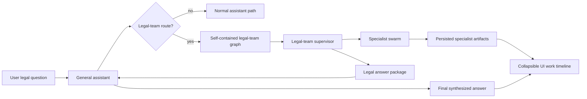
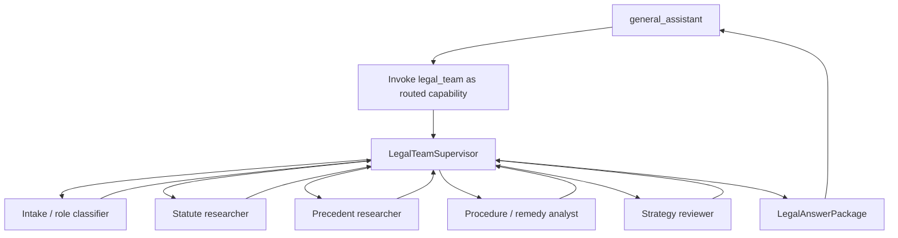
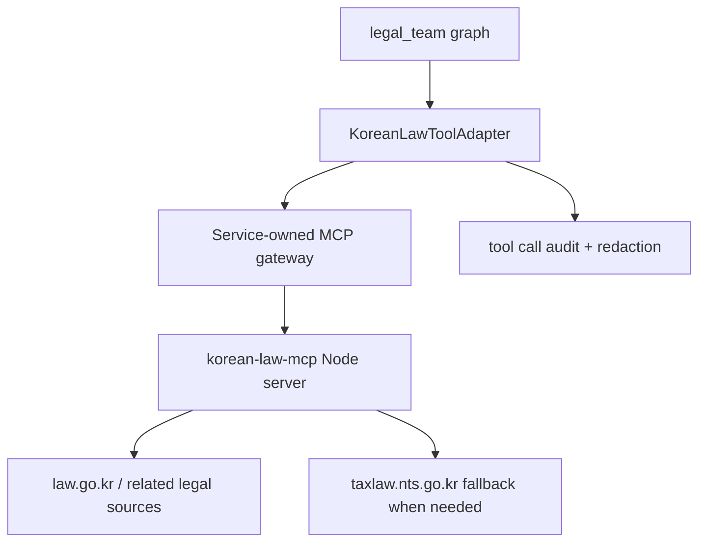

# Legal-team agent swarm idea

This note captures the product and architecture idea for a future Korean-law legal-team agent swarm that can be routed through the general assistant and use [`korean-law-mcp`](https://github.com/chrisryugj/korean-law-mcp) as a service-owned legal research tool boundary.

## Interview outcome

The intended product is not only a legal search helper. The first useful version should help with **situation-specific Korean legal advice** based on the user's described circumstances.

Key decisions from the clarification session:

- The legal-team path should support both legal information and situation-specific legal advice.
- The agent team should infer who it is talking with from the interaction first, then ask clarifying questions only when the answer depends on missing role/context details.
- The first version should not add user-facing legal guardrail language in every response, but the idea and service design must document side effects and risks.
- Filing automation is explicitly out of scope for the first version.
- `korean-law-mcp` should be consumed through a service-owned hosted integration for now, not through per-user MCP keys/config.
- The legal-team graph should use a **self-contained supervisor-swarm pattern**. The general assistant routes to it and synthesizes the final user-facing answer, but it is not the supervisor of the legal specialists.
- Specialist roles and steps may be visible to the user as intermediary work, but the final response should be gated and synthesized by the general assistant.
- Visible specialist work must be persisted as product run artifacts, not treated as transient UI-only progress.

## Product shape

A user asks the general assistant a legally relevant question, for example:

```text
My landlord has not returned my deposit. What can I do under Korean law?
```

The general assistant should recognize that the question needs legal-team handling and route the run into a legal-team graph. After that handoff, the legal-team graph should be internally self-managed by its own supervisor. The legal-team supervisor gathers situation facts, coordinates specialist nodes, researches statutes/cases/administrative materials through the legal MCP boundary, produces sanitized intermediate artifacts, and returns a final package to the general assistant. The general assistant then produces the final answer in one voice.

The important UX shape is **visible work, unified answer**:



## Recommended architecture direction

The cleanest path is a **run-scoped LangGraph legal-team subgraph** plus a **service-owned MCP gateway/tool adapter**. The legal-team subgraph should be self-contained: it owns its internal supervision, specialist sequencing, evidence review, and answer-package preparation.

### 1. Keep general assistant as router and final answer gate, not legal supervisor

Do not let every assistant route directly call legal tools, and do not make `general_assistant` supervise legal specialists. Instead:

1. `general_assistant` classifies the request as legal-team eligible.
2. The conversation service creates a normal run and event timeline.
3. The legal-team graph executes as a routed capability/subgraph with its own supervisor node.
4. The legal-team supervisor coordinates intake, research, review, and handoff inside the legal graph.
5. The legal-team graph returns a compact `LegalAnswerPackage`.
5. `general_assistant` writes the final prose using that package.

This preserves the existing product direction: the general assistant remains the single front door and final answer gate, route labels stay honest, and specialized behavior is added only when an actual graph/tool path exists. The legal-team graph remains independently evolvable because its supervisor, state, role nodes, and MCP tool policy are contained under the legal-team boundary.

Conceptually:



### 2. Model the legal team as role nodes, not hidden chain-of-thought

A future `my_agents/agents/legal_team/` graph can start with explicit role nodes such as:

| Role node | Responsibility | Persisted artifact examples |
| --- | --- | --- |
| Legal-team supervisor | Own legal-team state, select specialist work, merge evidence, and decide when the package is ready | plan summary, selected specialists, completion status |
| Intake / role classifier | Infer user role, dispute type, missing facts, and legal domain | inferred role, confidence, missing-fact questions |
| Statute researcher | Search current and point-in-time statutes | statute citations, article summaries, query terms |
| Precedent researcher | Search cases/decisions and check case status when relevant | case list, holding summaries, validity signals |
| Procedure / remedy analyst | Map facts to possible remedies, deadlines, required documents | action options, deadlines, side effects |
| Strategy reviewer | Identify practical risks, evidence gaps, and alternatives | risk notes, confidence, unresolved assumptions |
| Synthesis handoff | Build compact package for the general assistant | answer outline, citations, caveats, next-step options |

These artifacts are not raw chain-of-thought. They are product-safe work products: tool queries, retrieved citations, summaries, status, and concise decision notes.

### 3. Add a service-owned MCP gateway boundary

`korean-law-mcp` is a Node/MCP package that wraps Korean legal APIs into MCP/CLI tools. Its current repository describes 42 법제처 APIs collapsed into 9 exposed MCP tools, including `legal_research`, `legal_analysis`, statute search/text, decision search/text, annex lookup, and tool discovery/execution. Its package metadata currently lists `korean-law-mcp` version `4.4.1`, MIT license, and Node `>=20.19.0`.

For this project, the cleanest service architecture is not to put the user's `oc` key in frontend config. Use one of these backend-owned shapes:



Recommended first service shape:

- Run `korean-law-mcp` as a controlled backend sidecar or internal service.
- Store `LAW_OC` only in backend secret configuration.
- Expose a Python adapter with typed methods such as `search_statute`, `get_statute_text`, `search_decisions`, `legal_research`, and `legal_analysis`.
- Record tool-call metadata, status, latency, citation IDs, and sanitized summaries in run events.
- Keep raw MCP response retention policy explicit because legal queries may contain sensitive user facts.

Avoid connecting the frontend directly to the public remote MCP URL. The public remote endpoint is useful for experiments, but a product service should own secret custody, quota control, audit, redaction, and failure behavior.

## User-role inference behavior

The legal team should infer context from the interaction first, then clarify only when needed.

Potential first-pass role/context fields:

```text
user_role: individual | company_representative | in_house_legal | attorney | unknown
matter_role: tenant | landlord | employee | employer | creditor | debtor | plaintiff | defendant | buyer | seller | unknown
legal_domain: housing | labor | civil_claim | criminal | administrative | corporate | tax | family | unknown
jurisdiction_context: Korea-first unless user says otherwise
confidence: low | medium | high
missing_facts: string[]
```

If confidence is low or a missing fact materially changes the legal recommendation, the legal team should ask a targeted clarification question before giving a strong recommendation.

This role inference should start as **run-scoped execution state**. Long-term profile memory can be added later only through the existing memory governance direction, not by silently creating durable legal profiles from sensitive facts.

## Persistence and UI contract

Specialist work should be saved as normal product artifacts.

Suggested event categories:

```text
legal_team_started
legal_intake_completed
legal_tool_call_started
legal_tool_call_completed
legal_statute_findings_prepared
legal_precedent_findings_prepared
legal_strategy_review_completed
legal_answer_package_prepared
legal_team_completed
```

Each public event should be safe to render in a collapsible UI timeline. Internal audit can keep richer metadata, but the frontend-facing shape should avoid raw reasoning and sensitive overexposure.

Example public event payload:

```json
{
  "specialist": "statute_researcher",
  "status": "completed",
  "query": "주택임대차보호법 전세보증금 반환",
  "summary": "Found current statute candidates and one procedure-related reference.",
  "citations": [
    {
      "type": "statute",
      "label": "주택임대차보호법",
      "article": "article id or citation text"
    }
  ]
}
```

## Non-goals for first version

- Filing automation.
- Court submission, e-filing, document delivery, or agency submission.
- Frontend ownership in this backend repo.
- Raw chain-of-thought exposure.
- Per-user legal MCP key setup.
- Treating the MCP server as an authorization boundary. Authorization, quotas, event persistence, and redaction should be product-owned.

## Potential blockers for serving this as a service

### Legal/product risk

- Situation-specific legal advice can create reliance risk, especially around litigation strategy, statutory deadlines, criminal exposure, employment termination, housing deposits, money/property loss, or evidence preservation.
- The requested v1 does not add user-facing guardrail language, so the product should at least track this as an explicit risk and preserve evidence/citations for audit.
- If the service is offered commercially, the team should evaluate Korean legal-service regulations, unauthorized-practice-of-law risk, consumer protection language, and whether attorney review is needed for certain categories.

### Data privacy and confidentiality

- Legal questions often include PII, contracts, employment facts, housing details, family facts, criminal allegations, and company-confidential facts.
- Run events must not overexpose sensitive facts in UI or logs.
- Tool calls to a hosted MCP server may send user facts outside the application boundary. A self-hosted sidecar/gateway reduces this risk compared with using a public remote endpoint.

### API key, quota, and abuse control

- A service-owned `LAW_OC` key means the product owns quota, abuse, and revocation risk.
- The gateway needs tenant/user rate limits, tool-level budgets, retries, circuit breakers, and failure messages.
- If legal research gets expensive or slow, the legal graph should summarize and cache source lookups where allowed.

### Runtime/deployment

- `korean-law-mcp` is a Node package while `my-agents` is a Python/FastAPI backend. A sidecar or internal MCP HTTP service is cleaner than embedding Node process management inside the assistant graph.
- Current package metadata requires Node `>=20.19.0`; deployment images and local dev scripts would need to account for that.
- The MCP README documents remote HTTP and local CLI/server usage patterns. Product deployment should pin package versions and define health checks.

### Network, TLS, and external dependency reliability

- The MCP project documents `LAW_API_PROTOCOL` options for law API access and separate TLS/proxy concerns for National Tax Service precedent fallback access.
- Corporate networks, SSL inspection, closed networks, or government-site availability may break Node `fetch()` even when browsers work.
- The service should treat legal-source availability as partial/failing dependency, not as a normal model error.

### Citation quality and answer grounding

- Legal answers should cite statutes/cases/decisions used by the specialists.
- The legal graph should distinguish current law, point-in-time law, historical law, and future-effective law.
- The final answer should not invent citations; if the MCP cannot verify a citation, the legal team should mark it as unverified or omit it.

## Clean implementation path when this becomes active work

This is not an implementation plan for now, but the future path should be incremental:

1. Add a design/spec for `legal_team` as a real routed capability.
2. Add a typed `KoreanLawToolAdapter` interface with fake/offline implementation for tests.
3. Add a service-owned MCP gateway or sidecar spike behind configuration.
4. Create `my_agents/agents/legal_team/` with a small LangGraph supervisor and two or three specialist nodes.
5. Persist public-safe legal-team events in the existing run event stream.
6. Route legal requests from `general_assistant` only when the legal graph is implemented and tested.
7. Add citations and audit coverage before exposing the feature outside local/dev usage.
8. Later, consider HITL/attorney review and long-term legal profile memory as separate milestones.

## Open questions to resolve before implementation

- Which legal domains should v1 prioritize: housing, labor, consumer/civil claims, corporate, tax, criminal, or broad Korean-law coverage?
- Should the final answer be allowed to recommend concrete actions like sending notice, gathering evidence, filing a complaint, or consulting an attorney, and how should side effects be phrased?
- What retention policy should apply to legal-team artifacts and raw MCP responses?
- Should legal-team artifacts be exportable for the user, or only visible in the conversation timeline?
- Should legal-team routes require an opt-in feature flag or admin-only beta gate?

## Source notes

- [`chrisryugj/korean-law-mcp`](https://github.com/chrisryugj/korean-law-mcp) describes a legal MCP/CLI surface over Korean law APIs, with v4.4 consolidating exposed tools into 9 MCP tools.
- The README documents remote HTTP usage with an `oc` API key in the URL and local usage through `LAW_OC` environment configuration.
- The package metadata currently identifies `korean-law-mcp` as version `4.4.1`, MIT licensed, with Node `>=20.19.0`.
