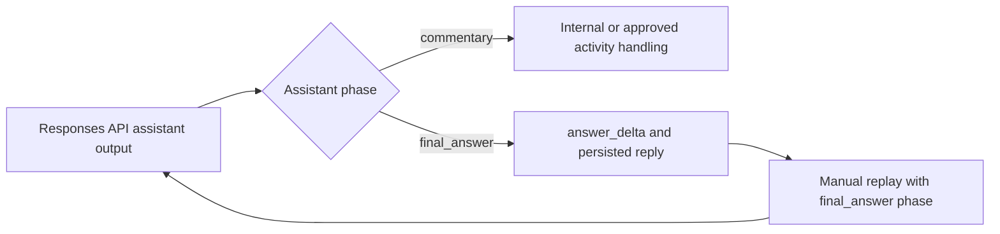

# OpenAI Responses API assistant phase

This note records why the OpenAI Responses API assistant-message `phase` field exists and how
`my-agents` could use it later. It is a design reference, not an implementation commitment. The
authoritative project status is **Deferred** in
[`docs/implementation-tracking.md`](../implementation-tracking.md#deferred-responses-api-assistant-phase-round-tripping).

## Field intent

In the Responses API, `phase` distinguishes two kinds of assistant message:

- `commentary`: an intermediate assistant update, such as a preamble before a tool call;
- `final_answer`: the completed answer for the turn.

The field belongs only on assistant messages. User messages must not receive a phase. OpenAI
documents the field as optional but recommends it for long-running or tool-heavy GPT-5.5 and
GPT-5.4 flows because missing or dropped phases can cause early stopping or make an intermediate
preamble look like the final answer. When prior assistant items are replayed manually, their
original phases should be preserved. `previous_response_id` is usually the simpler provider-state
continuation mechanism because it preserves prior assistant state.

Official reference: [OpenAI reasoning guide — phase parameter](https://developers.openai.com/api/docs/guides/reasoning?api-mode=responses#reasoning-summaries).

## Current product behavior

The ordinary answer provider already uses `ChatOpenAI` with the Responses API and
`output_version="responses/v1"`. The installed LangChain adapter can represent phase values in
Responses API content blocks. The product does not currently preserve or act on them:

- Product DB persists an assistant message as final display text only.
- Recent history is rebuilt as plain `AIMessage(content=...)` and replayed manually.
- Rebuilt assistant messages therefore carry no `phase`.
- `previous_response_id` is not used for ordinary conversation continuation.
- Streaming and final text extraction collect text without filtering `commentary` from
  `final_answer`.

This is an acknowledged provider-compatibility gap. It is not currently a frontend field, public
API promise, Product DB domain concept, or near-term implementation priority.

## Potential use inside `my-agents`

The smallest future integration should preserve the current user experience and treat phase as
provider-boundary metadata:

Recommended product mapping:

1. Send no phase on user messages.
2. Route only `final_answer` text into `answer_delta`, the completed assistant reply, and normal
   transcript persistence.
3. Do not silently reinterpret `commentary` as a reasoning summary, verified agent trace, or final
   answer. It may be ignored initially or mapped to a separately approved activity contract.
4. When manually replaying assistant history, preserve its original phase. Under the current
   persistence invariant, existing Product DB assistant messages represent completed replies and
   can be reconstructed as `final_answer` unless that invariant changes.
5. Keep reasoning summaries, verified `agent_trace`, citations, and assistant phase distinct:
   phase classifies provider message purpose; it does not prove tool execution, expose reasoning,
   or provide evidence.
6. Keep phase internal unless a future UX explicitly needs intermediate assistant commentary. A
   provider compatibility change alone should not require an SSE or frontend contract change.

## Manual replay versus `previous_response_id`

Manual replay remains compatible with Product DB as the visible transcript and audit source of
truth, but it must round-trip phases accurately. It also lets regeneration, replay, source-policy
changes, and bounded recent-history selection remain application-owned.

Adopting `previous_response_id` later may reduce manual provider-state reconstruction, but it is a
separate architecture decision. Before adoption, define provider retention and storage behavior,
conversation/run linkage, regeneration and branching semantics, deletion handling, source-context
changes, failure fallback, and how Product DB remains authoritative. A response ID must remain a
provider continuation pointer, not the product conversation model.

## Adoption triggers

Revisit this note when any of the following becomes true:

- a supported model's official guidance makes phase handling relevant to the active runtime;
- a tool-heavy response emits commentary that is mixed into, or mistaken for, the final answer;
- early stopping or continuation quality is plausibly linked to missing assistant phases;
- the product adds multi-step provider-managed tool loops or displays intermediate assistant text;
- `previous_response_id` becomes an approved conversation-continuation milestone.

## Acceptance requirements if activated

- Payload tests prove user messages omit `phase` and replayed assistant messages retain it.
- Streaming tests prove `commentary` cannot enter `answer_delta` or the persisted final reply by
  accident.
- `final_answer` extraction works for both complete responses and streamed chunks.
- Normal runs, hosted-tool runs, HITL resume, regeneration, replay, refresh, and deterministic
  fallback preserve their existing public contracts.
- Existing assistant rows receive a documented compatibility rule rather than an unverifiable
  retroactive value if the persistence invariant has changed by implementation time.
- Any `previous_response_id` path has explicit provider-retention, deletion, branching, and Product
  DB authority tests.

## Related contracts

- [HTTP streaming and frontend contract](../product-chat-service/en/09-http-streaming-frontend-contract.md)
- [Run reasoning preferences](../product-chat-service/en/26-run-reasoning-preferences.md)
- [Dynamic model-authored reasoning summary contract](../product-chat-service/en/28-dynamic-reasoning-summary-contract.md)
