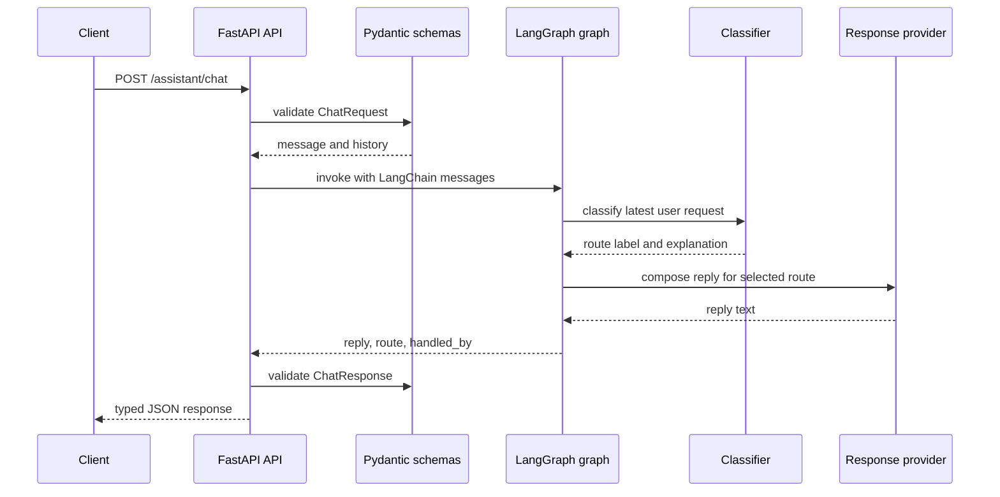
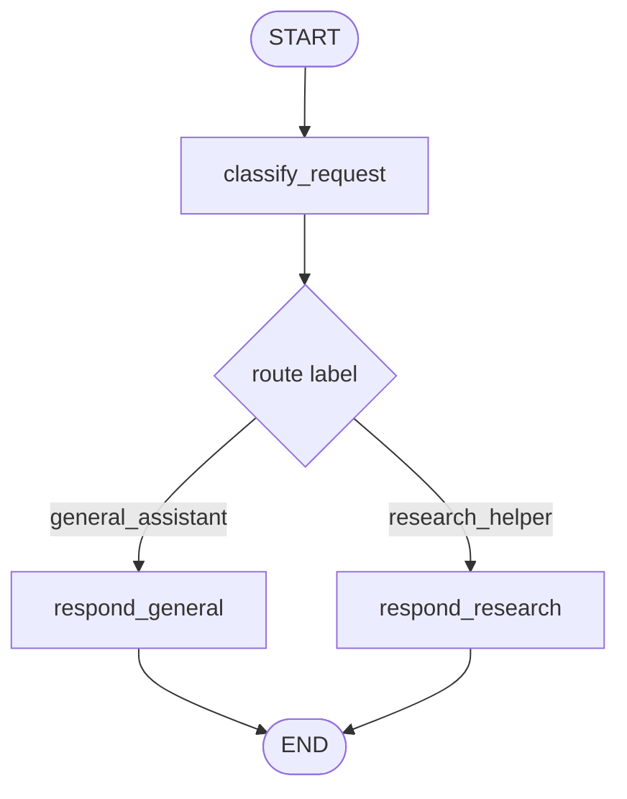

# Current backend walkthrough

This note explains the current `my_agents` implementation from a learner's point of view.

The code may look production-shaped, but the core flow is small:

```text
HTTP request
  -> validate input
  -> classify the message into a route label
  -> choose one response path
  -> compose or stream a reply
  -> return JSON/API output
```

## 1. The files and their jobs

| File | Job | Read this when you want to understand |
| --- | --- | --- |
| `main.py` | Exposes the ASGI app as `app` | how the server starts |
| `my_agents/cli.py` | Terminal chat loop | how to talk to the graph without FastAPI |
| `my_agents/api.py` | FastAPI routes and app factory | HTTP endpoints |
| `my_agents/schemas.py` | Pydantic request/response models | API shapes and validation |
| `my_agents/agents/general_assistant/classifier.py` | Deterministic route classifier | how messages become labels |
| `my_agents/agents/general_assistant/graph.py` | LangGraph workflow | how state moves through nodes |
| `my_agents/agents/general_assistant/responders.py` | OpenAI/deterministic reply providers | how final text is produced |
| `my_agents/settings.py` | Environment configuration | how `.env` controls behavior |
| `tests/` | Behavior contract | what must keep working |

## 2. Request lifecycle

When a client calls:

```bash
curl -X POST http://127.0.0.1:8000/assistant/chat \
  -H 'Content-Type: application/json' \
  -d '{"message":"Help me study LangGraph routing","history":[]}'
```

The app does this:



## 3. FastAPI layer: `api.py`

FastAPI is the HTTP boundary.

Important pieces:

```python
app = FastAPI(...)
```

creates the application.

```python
@app.get("/health")
```

creates a health endpoint.

```python
@assistant_router.post("/chat", response_model=ChatResponse)
```

creates the chat endpoint.

The important idea:

> The API layer should stay thin. It receives HTTP, validates data, calls the graph, and returns JSON.

It should not contain complicated agent logic.

## 3.5. Terminal layer: `cli.py`

`my_agents/cli.py` is a small REPL for talking to the same graph without HTTP.

Run it with:

```bash
uv run python -m my_agents.cli
```

It keeps an in-process list of LangChain messages:

```python
messages.append(HumanMessage(content=user_input))
for event in graph.stream({"messages": messages}, stream_mode=["messages", "updates"]):
    ...
messages.append(AIMessage(content=reply))
```

This is useful for learning because you can interact with the graph directly before adding any frontend.

Important limitation:

> In OpenAI mode the CLI streams token chunks as they arrive. In deterministic mode it still uses the streaming graph path, but prints the final node update because there are no LLM tokens. The CLI history disappears when the process exits. It is not persistent memory.

## 4. Schema layer: `schemas.py`

Schemas define the public API shape.

The main request shape is:

```python
class ChatRequest(BaseModel):
    message: str
    history: list[dict[str, str]] = Field(default_factory=list)
```

This means:

- `message` is required.
- `history` is optional.
- if `history` is omitted, it becomes an empty list.
- history items stay as simple JSON dictionaries at the API boundary:

```json
{"role": "user", "content": "..."}
```

The validators reject blank strings and unsupported roles. This prevents bad input before the graph runs.

Important design choice:

> The public API uses simple JSON, but the graph converts that JSON into LangChain message objects before execution.

The main API response shape is:

```python
class ChatResponse(BaseModel):
    reply: str
    route: RouteDecision
    handled_by: Literal["personal_assistant_graph"]
```

This makes the API response predictable.

## 5. Classifier layer: `agents/general_assistant/classifier.py`

The classifier is intentionally simple.

It checks source/research keywords and returns one of these route labels:

```text
general_assistant
research_helper
```

Example:

```text
"Help me study LangGraph"
  -> general_assistant
```

```text
"Find sources about FastAPI"
  -> research_helper
```

This is not AI yet. That is intentional.

Learning reason:

> A deterministic classifier lets us test the routing architecture before adding more model behavior.

The classifier now accepts LangChain `BaseMessage` history internally, rather than a custom message model.

## 6. LangGraph layer: `agents/general_assistant/graph.py`

LangGraph is the workflow layer.

The current graph has one classify step, one conditional route decision, and one response-composition node:



The graph state is defined around LangGraph/LangChain message conventions:

```python
class AssistantState(TypedDict, total=False):
    messages: Annotated[list[AnyMessage], add_messages]
    route: RouteDecision
    reply: str
    handled_by: str
```

Think of state as a dictionary that moves from node to node.

`messages` is the conversation transcript. The `add_messages` reducer tells LangGraph how to merge message updates instead of blindly replacing them.

At the start:

```python
{
    "messages": [HumanMessage(content="Help me study LangGraph")],
}
```

After classification:

```python
{
    "messages": [HumanMessage(content="Help me study LangGraph")],
    "route": RouteDecision(label="general_assistant", ...),
    "handled_by": "personal_assistant_graph",
}
```

After response composition:

```python
{
    "messages": [HumanMessage(content="Help me study LangGraph")],
    "route": RouteDecision(...),
    "handled_by": "personal_assistant_graph",
    "reply": "Classified as route label ...",
}
```

### Nodes

A LangGraph node is just a Python function.

Example:

```python
def classify_request(state: AssistantState) -> AssistantState:
    route = classify_messages(state.get("messages", []))
    return {"route": route, "handled_by": HANDLED_BY}
```

This node reads from state and returns state updates.

### Conditional edges

This function chooses the next node:

```python
def select_response_node(state: AssistantState) -> str:
    route = state["route"].label
    return {
        "general_assistant": "respond_general",
        "research_helper": "respond_research",
    }[route]
```

In plain English:

> After classification, choose the response node that matches the route label.

## 7. Responder layer: `agents/general_assistant/responders.py`

This file controls how reply text is created.

There are two implementations:

```text
DeterministicResponseProvider
OpenAIResponseProvider
```

### Deterministic mode

Deterministic mode uses templates and no API key:

```text
MY_AGENTS_RESPONSE_MODE=deterministic
```

This is used by tests and offline smoke checks.

Why this matters:

- tests are fast;
- no accidental API cost during verification;
- behavior is predictable;
- you can debug the graph without credentials.

### OpenAI mode

OpenAI mode uses `langchain-openai` and `ChatOpenAI`:

```text
MY_AGENTS_RESPONSE_MODE=openai
OPENAI_API_KEY=...
MY_AGENTS_OPENAI_MODEL=gpt-5.6-sol
```

The provider builds LangChain messages:

```text
SystemMessage: stable instruction
HumanMessage: route label + guidance + current user message
```

Then it streams:

```python
self._chat_model.stream(messages)
```

That is the LLM call. Every chunk is visible to LangGraph's `messages` stream mode and is also
added into one final message for reply persistence and reasoning-summary extraction. This lets the
CLI and conversation SSE surface real model tokens while the node is running and still receive the
final node update.

## 8. Settings layer: `settings.py`

Settings centralize environment variables.

Instead of reading `os.getenv()` in many files, the app uses:

```python
settings = get_settings()
```

Important env vars:

```text
MY_AGENTS_RESPONSE_MODE
OPENAI_API_KEY
MY_AGENTS_OPENAI_MODEL
MY_AGENTS_OPENAI_TIMEOUT_SECONDS
MY_AGENTS_OPENAI_MAX_OUTPUT_TOKENS
MY_AGENTS_OPENAI_REASONING_EFFORT
MY_AGENTS_OPENAI_VERBOSITY
```

The default mode is OpenAI. If the default OpenAI mode runs without an API key, settings validation fails early. Tests set `MY_AGENTS_RESPONSE_MODE=deterministic` so they stay offline.

## 9. Why use a ResponseProvider protocol?

This is the most abstract part.

The protocol says:

```python
class ResponseProvider(Protocol):
    def compose_reply(...) -> str:
        ...
```

Meaning:

> Any object with a `compose_reply` method can be used by the graph.

So the graph does not need to know whether the reply came from:

- a deterministic template;
- OpenAI;
- a fake test model;
- a future provider.

For this project, the only real LLM provider should remain OpenAI, but the seam is still useful for testing.

## 10. Tests as learning map

The tests explain what the app promises.

| Test file | What it protects |
| --- | --- |
| `tests/test_api.py` | HTTP behavior and validation |
| `tests/test_classifier.py` | route-label classification |
| `tests/test_graph.py` | LangGraph compiles and returns expected state |
| `tests/test_responders.py` | deterministic/OpenAI provider seam without real API calls |
| `tests/test_settings.py` | env configuration behavior |

A good study exercise is to open one test, predict what production file it touches, then read that file.

## 11. Recommended study order

Do not start with `responders.py`; it has the most abstraction.

Use this order:

1. `main.py`
2. `my_agents/api.py`
3. `my_agents/schemas.py`
4. `my_agents/agents/general_assistant/classifier.py`
5. `my_agents/agents/general_assistant/graph.py`
6. `tests/test_graph.py`
7. `my_agents/settings.py`
8. `my_agents/agents/general_assistant/responders.py`
9. `tests/test_responders.py`

## 12. Small exercises

### Exercise 1: Add a classifier keyword

Add a keyword to an existing route in `my_agents/agents/general_assistant/classifier.py`, then add a test in `tests/test_classifier.py`.

### Exercise 2: Add a new response guidance sentence

Change one guidance sentence in `my_agents/agents/general_assistant/graph.py`, then update the expected behavior if a test depends on exact wording.

### Exercise 3: Trace one request manually

Run:

```bash
uv run pytest tests/test_graph.py -q
```

Then add temporary `print()` statements inside:

- `classify_request`
- `select_response_node`
- one `respond_*` function

Remove the prints afterward.

### Exercise 4: Compare deterministic vs OpenAI mode

First run deterministic mode:

```bash
MY_AGENTS_RESPONSE_MODE=deterministic uv run uvicorn main:app --reload
```

Later, when ready, run OpenAI mode with a real `.env` file.

## 13. Vocabulary

| Term | Meaning here |
| --- | --- |
| FastAPI | HTTP API framework |
| Pydantic | validation and typed data models |
| LangGraph | workflow/state graph framework |
| State | dictionary-like data passed through graph nodes |
| Node | function that reads state and returns state updates |
| Edge | connection between graph nodes |
| Conditional edge | edge chosen by a function |
| Provider | object responsible for composing final reply text |
| Deterministic | same input gives same output, no LLM call |
| ChatOpenAI | LangChain wrapper for OpenAI chat/model calls |

## 14. Current design principle

The project is intentionally shaped like this:

```text
simple behavior
  + clear boundaries
  + tests
  + room to grow
```

The behavior is still small. The boundaries are there so future features do not become tangled.


## Revision history

- 2026-05-14: Created the initial backend walkthrough for the v0 FastAPI + LangGraph assistant foundation.
- 2026-05-14: Updated after restructuring agent code, adopting LangChain message types, adding CLI chat, enabling CLI streaming, and making OpenAI the default response mode.
- 2026-05-14: Added Mermaid diagrams for the request lifecycle and LangGraph node flow.
- 2026-08-09: Updated the current default OpenAI model to GPT-5.6 Sol.
