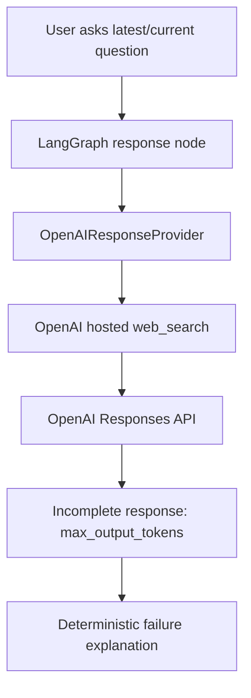
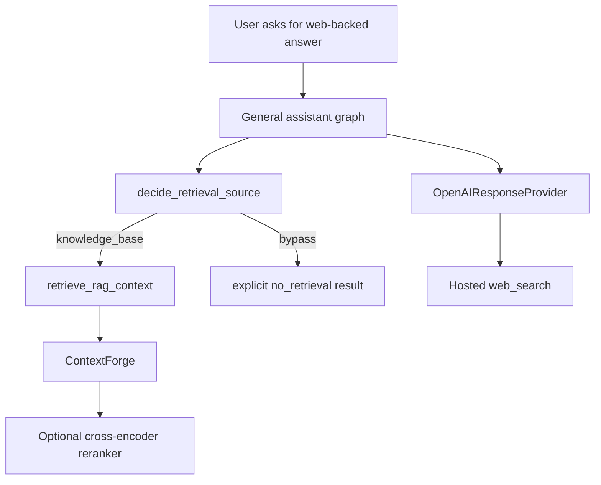
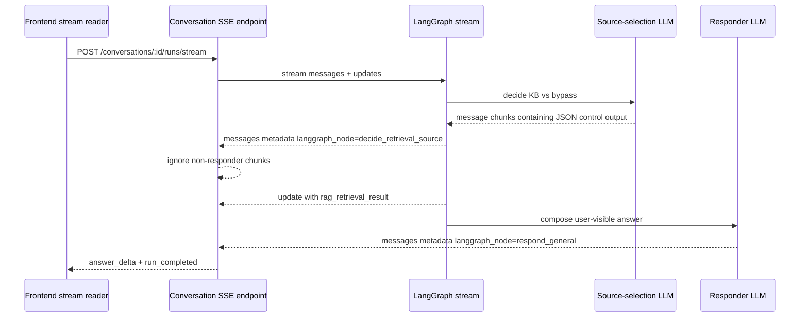

# Debug note: OpenAI web search returned no final text

## Summary

While testing the terminal CLI with OpenAI hosted `web_search`, the graph did not crash after the latest fallback work, but the assistant still failed to produce a useful final answer.

User prompt example:

```text
hey, can you google about latest meeting with Trump and Xi?
```

The assistant returned a deterministic failure message instead of an answer because the OpenAI Responses API response contained tool and reasoning items but no final text message.

## What failed

The raw CLI debug response showed:

```json
{
  "response_metadata": {
    "status": "incomplete",
    "incomplete_details": {
      "reason": "max_output_tokens"
    }
  },
  "usage_metadata": {
    "output_tokens": 300,
    "output_token_details": {
      "reasoning": 300
    }
  }
}
```

The important signal is:

```text
status=incomplete
reason=max_output_tokens
output_tokens=300
reasoning=300
```

This means the model used the full configured output token budget while reasoning and running web search. It did not have enough remaining output budget to produce final answer text.

## Why `ToolNode` was not the fix

This was not a missing LangGraph `ToolNode` issue.



`ToolNode` is needed for local/client-side tools that LangGraph must execute. OpenAI hosted tools such as `web_search` run server-side inside the OpenAI Responses API request. Therefore `responders.py` is still the correct first location for hosted-tool binding.

## Fix applied

We made the failure path deterministic and user-facing instead of letting the CLI/API crash or return a vague extraction error.

The responder now:

1. tries to extract meaningful text from the OpenAI/LangChain response;
2. detects empty text responses;
3. inspects `response_metadata.status` and `response_metadata.incomplete_details`;
4. explains the concrete reason when the response ended because of `max_output_tokens`;
5. in CLI debug mode, appends the raw response object for inspection.

The specific user-facing failure now explains that:

- the OpenAI response ended before producing final text;
- the reason was `max_output_tokens`;
- web search can consume output tokens for reasoning/search before answer generation;
- the user can increase `MY_AGENTS_OPENAI_MAX_OUTPUT_TOKENS` or ask a narrower question.

## Why this matters

For an assistant, a failed model call is still part of the user experience. The agent should not only fail safely; it should explain what happened and what the user or developer can do next.

This establishes a durable behavior pattern:

```text
model returns useful text
  -> return useful text

model returns no useful text but has known failure metadata
  -> return deterministic explanation with concrete reason

CLI debug mode is enabled
  -> include deterministic explanation plus raw response object
```

## Tests added

Tests now cover:

- route-aware web search binding;
- `general_assistant` and `research_helper` web search binding without language-specific app heuristics;
- graph-level source-selection gate for KB retrieval versus bypass;
- extraction from Responses API-style content blocks;
- fallback for tool-call-only responses;
- explicit explanation for `status=incomplete` and `reason=max_output_tokens`;
- CLI debug mode including raw response object.

## Confirmed fix

After reproducing the empty-answer path, increasing the OpenAI output token cap fixed the live web-search response. The project default and `.env.example` now use:

```text
MY_AGENTS_OPENAI_MAX_OUTPUT_TOKENS=1200
```

This is intentionally higher than the original `300` token cap because hosted web search can spend output tokens on reasoning/search before final answer generation.

## 2026-06-22 follow-up: web-search intent, KB bypass, and local reranker timing

A later local log showed a web-intended conversation run opening `/conversations/{id}/runs/stream`, then loading the optional ContextForge cross-encoder model before the assistant reached the hosted `web_search` response path.

Two distinct surfaces were involved:



This exposed two product-shape problems:

1. App-side English keyword hints for `general_assistant` web search missed explicit web requests written in other languages.
2. The graph had no first-class way to honor “do not use saved docs / knowledge base” before entering the RAG path.
3. Eager cross-encoder initialization could add Hugging Face/MPS cold-start latency even when the turn primarily needed hosted web search, not local document reranking.

The fix was to add a graph-level source-selection gate before RAG retrieval. In OpenAI mode the gate can make a thin multilingual LLM decision between `knowledge_base` and `bypass`; deterministic mode keeps an offline fallback for tests. Bypassed turns still emit an explicit `no_retrieval` `RagAgentRetrievalResult`, so conversation APIs, events, and persistence keep one retrieval contract.

We also removed language-specific general-assistant web-search hints and exposed hosted `web_search` for both response routes in OpenAI mode. The provider prompt now tells the model to call the tool only for current, recent, web-backed, source-backed, or externally verifiable requests.

The ContextForge fix was to keep `MY_AGENTS_RERANKER_MODE=cross_encoder` as a configured reranker identity but load the underlying `sentence-transformers` model only when a non-empty candidate list is actually scored. No-retrieval and empty-rerank paths no longer pay the cross-encoder cold-start cost.

## 2026-06-22 follow-up: source-gate LLM chunks broke SSE streaming

The source-selection gate introduced one more streaming-specific bug. LangGraph
`stream_mode=["messages", "updates"]` emits message chunks from every model call inside
the graph, not only the final responder node. That means the LLM gate's compact JSON
decision can appear in the same message stream before RAG retrieval has produced a
`rag_retrieval_result`.

The conversation SSE adapter used to treat every message chunk as assistant answer text.
When the source gate emitted its first JSON token, the stream endpoint saw a delta before
retrieval context existed and failed the run with `run_failed` / `run_error`.



The fix is to filter LangGraph message chunks by `metadata["langgraph_node"]`. Chunks from
`respond_general` and `respond_research` remain visible answer deltas. Chunks from
`decide_retrieval_source` and future routing/control nodes are ignored. Metadata-less test
doubles still pass through for backwards compatibility.

The stream endpoint also now logs redacted run-failure context (`conversation_id`,
`run_id`, error type, and status code) before emitting safe frontend events, so a local
failure is not just a silent Korean "run failed" message.

## Follow-up risk

A higher output cap can increase cost and latency for OpenAI-backed requests. If that becomes a problem, make the cap route-aware instead of dropping the global default back to a value that breaks web-search answers.

## Revision history

- 2026-05-14: Created debug note after OpenAI hosted web search returned an incomplete response with `max_output_tokens` before final answer text.
- 2026-05-14: Confirmed that raising `MY_AGENTS_OPENAI_MAX_OUTPUT_TOKENS` fixed the live web-search response and updated the project default to `1200`.
- 2026-06-22: Added a graph-level source-selection gate for KB retrieval versus bypass, removed language-specific web-search hints for `general_assistant`, and lazy-loaded the optional ContextForge cross-encoder reranker to avoid unrelated cold-start latency.
- 2026-06-22: Filtered LangGraph streamed message chunks so source-gate JSON/control output does not become user-visible SSE answer deltas or fail the run before retrieval context exists.
