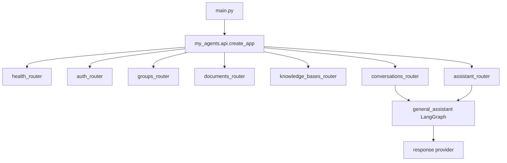

# Service foundation scaffold

This note explains the first scaffold step from a small assistant-router backend toward a portfolio-grade AI service backend.

## Why this scaffold exists

This note records the first scaffold step. Later slices filled in the boundaries with auth, groups, permissions, conversations, knowledge bases, retrieval, citations, and agent events.

The scaffold mattered because it created a modular-monolith shape before feature code arrived.

## Request flow after the API split

The important compatibility rule is that `main.py` and `from my_agents.api import create_app` still work even though `my_agents/api.py` became an API package.

## New boundary modules

| Module | Current purpose | Extension path |
| --- | --- | --- |
| `my_agents.api` | Route assembly and app factory | Versioned APIs and frontend-facing contracts |
| `my_agents.persistence` | SQLAlchemy engine/session bootstrap | Alembic migrations and Postgres/pgvector integration |
| `my_agents.auth` | first-party users, password hashing, sessions, CSRF | OAuth/account recovery/MFA if needed |
| `my_agents.permissions` | document operation enum and authorization service | richer role policies and audit trails |
| `my_agents.users` | package boundary | user profile/repository service |
| `my_agents.groups` | groups, memberships, roles | invitations and organization settings |
| `my_agents.conversations` | server-owned threads/messages/runs/events | streaming, retries, and richer run state |
| `my_agents.knowledge` | KBs, documents, chunks, extraction, retrieval, citations | production parsers, pgvector ranking, graph storage |
| `my_agents.agent_runtime` | deterministic eval fixtures | orchestration/evaluation runtime utilities |

## Dependency decision after the scaffold

The later service slices added SQLAlchemy, psycopg, pgvector package support, argon2-cffi, and email validation once the implementation needed them. Alembic migrations are still deferred; default tests use an offline in-memory SQLite database.

## Settings added

The settings now define the active local persistence/session boundary:

- `MY_AGENTS_DATABASE_URL`
- `MY_AGENTS_TEST_DATABASE_URL`
- `MY_AGENTS_SESSION_COOKIE_NAME`
- `MY_AGENTS_SESSION_COOKIE_SECURE`
- `MY_AGENTS_SESSION_COOKIE_SAMESITE`
- `MY_AGENTS_CSRF_HEADER_NAME`

`MY_AGENTS_TEST_DATABASE_URL` is optional so default tests stay offline and do not require Postgres.

## What remains intentionally thin

- no Alembic migration workflow yet;
- no production file parser yet;
- no production pgvector ranking yet;
- no frontend in this repository.

Those are future portfolio expansion points, not claims of current behavior.

## Small exercise

Trace the v0 health request:

1. Open `main.py`.
2. Follow `create_app()` into `my_agents/api/__init__.py`.
3. Find where `health_router` is included.
4. Confirm the test `test_create_app_still_exposes_health_and_legacy_assistant_routes` proves the route is still available.

## Revision history

- 2026-05-17: Updated after later slices filled in the service boundaries.
- 2026-05-17: Created after adding the service-foundation scaffold and API package split.
