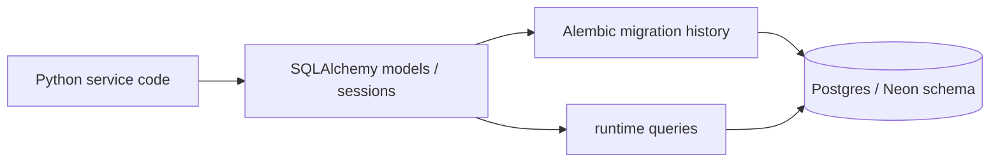
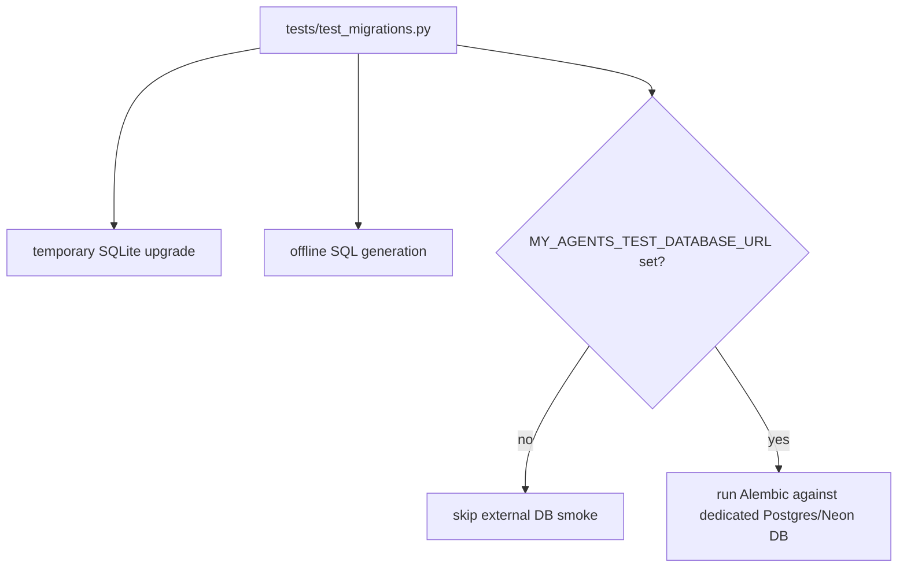

# SQLAlchemy, Postgres, and Alembic

This note explains the database stack in this project from a backend-learning perspective.

## The three layers

| Layer | What it is | In this repo |
| --- | --- | --- |
| SQLAlchemy | Python ORM and database toolkit | Model classes under `my_agents/**/models.py` and the shared `Base` in `my_agents/persistence/database.py` |
| Postgres / Neon | The actual relational database | Configured with `MY_AGENTS_DATABASE_URL`; Neon is managed Postgres |
| Alembic | Migration tool for schema changes | `alembic/env.py` and migration files under `alembic/versions/` |



## Why not just use `create_all`?

`Base.metadata.create_all()` is useful for quick local bootstrapping, but it is not a durable production migration strategy. It does not give a human-readable history of schema decisions, and it can hide whether a deployed database is missing a migration.

This project keeps auto-create only for the default in-memory SQLite path so tests stay fast and credential-free. Postgres/Neon should use:

```bash
uv run alembic upgrade head
```

## Mental model

1. You edit SQLAlchemy models when application code needs new persisted data.
2. You create an Alembic migration that describes how the real database changes.
3. You run the migration against Postgres/Neon before running the service against that database.
4. Tests can still use SQLite for fast behavior checks, but deployment-like confidence comes from migration smoke tests.

## Neon-specific reminder

Neon may show a default query that creates `playing_with_neon`. That table is unrelated to this app. For this project, the schema should come from Alembic migrations.

## How this project tests migrations safely

The default migration smoke test creates a temporary SQLite database, runs Alembic to
`head`, and compares the resulting schema with `Base.metadata`. A second offline smoke
generates SQL without connecting to a database. The optional Postgres/Neon smoke only runs
when `MY_AGENTS_TEST_DATABASE_URL` points at a dedicated test database.



## Small exercise

Answer these before an interview:

1. What is the difference between SQLAlchemy model code and a Postgres table?
2. Why is Alembic better than `create_all` for a deployed service?
3. Why does this project still allow SQLite auto-create for tests?

## Revision history

- 2026-05-17: Created after adding Alembic/Postgres readiness for the portfolio chat service.
