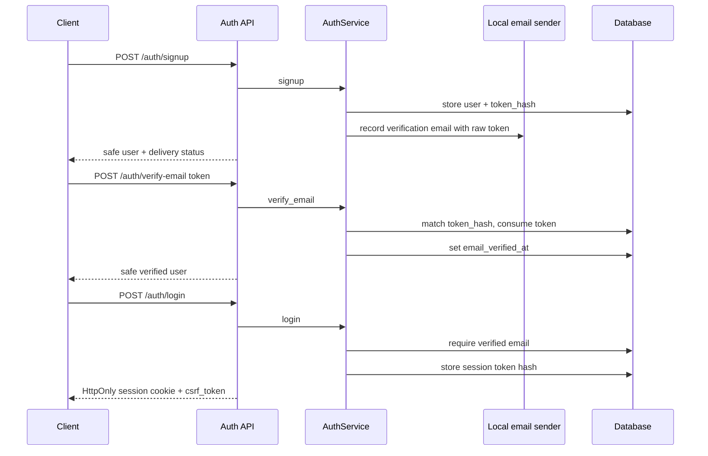
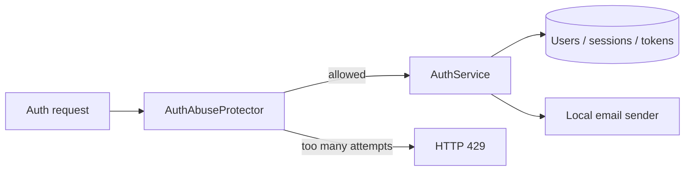

# Auth lifecycle: email verification and password reset tokens

## What changed

The auth flow moved from "signup can immediately login" to a more product-shaped lifecycle:

1. signup creates a user and a one-time email verification token;
2. the local development email sender records that token without requiring a paid email provider;
3. login is blocked until the email is verified;
4. password reset uses the same one-time-token pattern;
5. password reset revokes existing sessions after the password changes.
6. local auth abuse protection limits repeated signup, login, verification-token,
   and password-reset attempts before a real email provider or public guest mode is added.

## Important design idea

The backend stores only token hashes, not raw verification or reset tokens. This is the same safety idea as session-token storage: the raw token is bearer material, so the database should not need to keep it.

## Why local email first

Real signup email may use Resend, AWS SES, Firebase Auth, or another provider later. For this learning/backend milestone, the useful boundary is not the provider. The useful boundary is that auth code asks an `AuthEmailSender` to send verification/reset messages, while tests can use a deterministic local sender.

That keeps tests offline and prevents early provider cost or account setup from blocking backend design.

## Why local rate limiting first

Rate limiting is also a boundary decision. The first useful implementation does not need
Redis, Cloudflare, API Gateway, or a paid email provider. It needs one place where auth
routes ask, "is this action still allowed for this identifier in the current window?"

The current guard is intentionally in-process and replaceable:

- it is good enough for offline tests and single-process portfolio demos;
- it stores digested bucket keys instead of raw emails;
- it protects token guessing by counting invalid verification/reset-token attempts by client;
- it should move to Redis, a gateway, or another shared store before a real multi-worker public deployment.

## What to remember

- Email verification is account lifecycle state, not just an email-sending feature.
- Password reset should avoid account enumeration: the request endpoint returns the same accepted response even if no user exists.
- Reset tokens should be one-time use and expire.
- Changing a password should revoke old sessions.
- Rate limiting should protect both provider-cost endpoints and token-guessing endpoints.
- Guest mode should be treated separately because anonymous quota/rate-limit logic is a different product/security problem.

## Small exercise

Explain why the database stores `token_hash` for auth lifecycle tokens but the local development email sender still sees the raw token.

## Revision history

- 2026-05-18: Created learning log for `Auth lifecycle: email verification and password reset tokens`.
- 2026-05-19: Added local auth abuse-protection boundary and provider-readiness notes.
