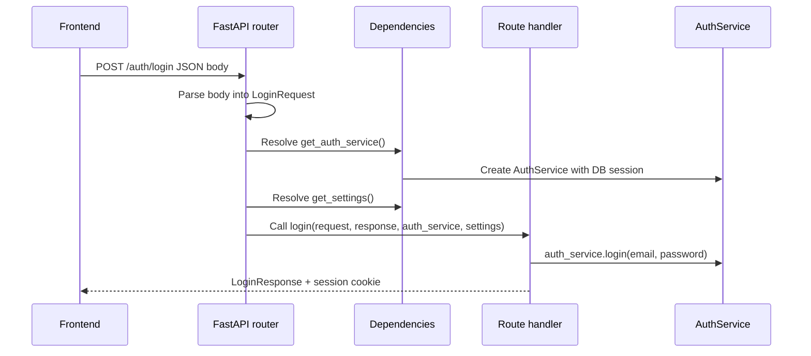

# FastAPI dependencies and Principal with React analogies

FastAPI can feel much easier if you map its backend concepts to familiar React/frontend concepts. The mapping is not exact, but it is useful for reading this codebase.

## Quick analogy table

| Backend concept | Frontend analogy | What to remember |
| --- | --- | --- |
| `Depends(...)` | `useAuthContext()` / context provider lookup | FastAPI resolves it on the server before the route body runs. |
| `Annotated[T, Depends(fn)]` | "value has type `T`, and comes from provider `fn`" | The type is for Python/tooling; `Depends` is FastAPI wiring. |
| `Principal` | `currentUser` / auth context value | A small authenticated request identity, not the full user record. |
| Pydantic schema | Zod schema / TypeScript DTO | Defines request/response shape and validation. |
| Service class | Domain/app service | Owns business rules; routes should stay thin. |
| SQLAlchemy model | Database entity/table mapping | Persistence detail, not the public API shape. |
| API route | Controller/server endpoint | Translates HTTP input/output around the service layer. |

## The two dependency snippets

In a route such as login, this style appears:

```python
auth_service: Annotated[AuthService, Depends(get_auth_service)]
settings: Annotated[Settings, Depends(get_settings)]
```

Read this as:

```text
FastAPI, please call get_auth_service() and pass the AuthService result here.
FastAPI, please call get_settings() and pass the Settings result here.
```

A React-ish mental model would be:

```tsx
const authService = useAuthService()
const settings = useSettings()
```

The important difference is that FastAPI does this on the backend for every request, not in a browser render cycle.

## Request lifecycle



## What `Principal` means

`Principal` lives in `my_agents/auth/contracts.py` and currently contains:

```python
@dataclass(frozen=True)
class Principal:
    user_id: str
    session_id: str
```

It means: "this request has already been authenticated, and this is the user/session identity that other domains may trust."

That makes this route parameter:

```python
principal: Annotated[Principal, Depends(get_current_principal)]
```

similar to frontend code like:

```tsx
const principal = useAuthContext()
```

After FastAPI resolves it, protected routes can scope work with:

```python
principal.user_id
```

For example, conversation, document, group, and knowledge-base endpoints use the principal to ensure data is created for or read by the authenticated user.

## Why not pass the full `UserModel` everywhere?

The full database user row is an implementation detail. It may include fields that most domains do not need, such as email, password hash, or timestamps. Passing a small `Principal` keeps domain boundaries cleaner:

```text
Auth layer owns: cookies, sessions, token hashes, CSRF, login rules.
Other domains receive: user_id/session_id identity only.
```

This helps the rest of the backend avoid caring how authentication works internally.

## Architectural takeaway

When reading a new protected endpoint, look for two categories of parameters:

1. **Client input**: request body/path/query values, usually Pydantic schemas or primitive IDs.
2. **Server-resolved context**: dependencies such as `Principal`, `AuthService`, `Settings`, or database sessions.

That split is the backend version of separating component props from context/hooks in React.

## Small exercise

Open one protected route, such as `my_agents/api/conversations.py`, and find:

1. Which parameter comes from the frontend request?
2. Which parameter comes from `Depends(...)`?
3. Where does it use `principal.user_id` to protect or scope data?

## Revision history

- 2026-05-18: Created learning log for `FastAPI dependencies and Principal with React analogies`.
