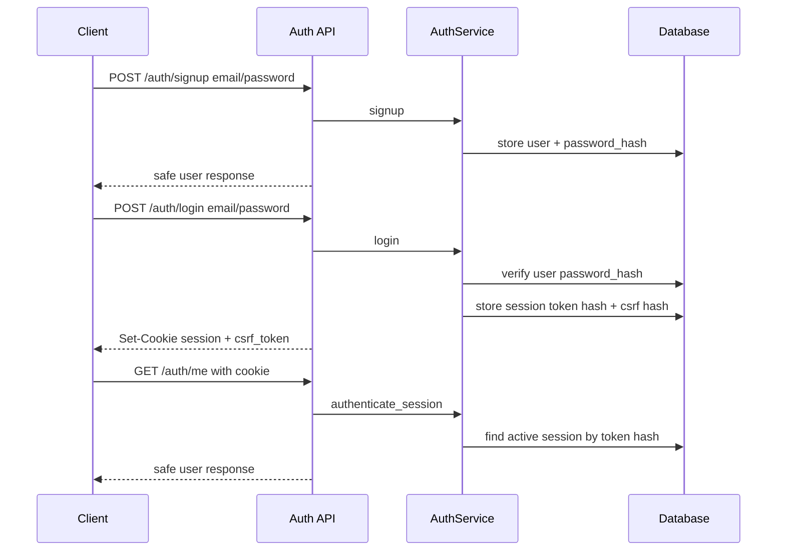

# First-party auth and owned sessions

This note explains the first auth milestone for the portfolio chat service.

## What is implemented now

The backend now owns a minimal first-party auth/session path:

1. `POST /auth/signup` creates a user with an Argon2 password hash.
2. `POST /auth/login` verifies the password and creates a server-side opaque session.
3. The raw session token is sent only as an HttpOnly cookie.
4. The database stores only a SHA-256 digest of the session token.
5. Login also returns a CSRF token for mutating cookie-auth requests.
6. `POST /auth/logout` requires the current session cookie plus the CSRF header and revokes the session.
7. `GET /auth/me` resolves the current `Principal` from the session cookie.

## Flow

## Why store a token hash

A session token is bearer credential material. If the database stored the raw cookie value, a database leak would immediately expose active sessions. Storing a digest means the server can compare presented tokens without keeping the raw token at rest.

This is not a replacement for all production hardening, but it is a better portfolio and learning baseline than storing raw session strings.

## What is intentionally not implemented yet

- password reset;
- email verification;
- MFA/passkeys;
- OAuth account linking;
- account lockout/rate limiting;
- persistent Alembic migration files;
- group/document authorization.

Those are later milestones or explicit non-goals for v1.

## Testing evidence

`tests/test_auth_api.py` covers:

- signup does not return password material;
- login returns a CSRF token and creates an owned session;
- `/auth/me` requires a valid session;
- logout without CSRF fails;
- logout with CSRF revokes the session;
- duplicate signup fails safely;
- invalid login does not create an authenticated session.

## Small exercise

Explain this in an interview:

> I used first-party email/password auth to demonstrate backend ownership, but kept it intentionally narrow. The app stores Argon2 password hashes, stores only session-token digests, revokes sessions server-side, and requires CSRF proof for logout. I would add password reset, email verification, rate limiting, and OAuth later as separate hardening milestones.

## Revision history

- 2026-05-17: Created after implementing minimal first-party auth and owned sessions.
