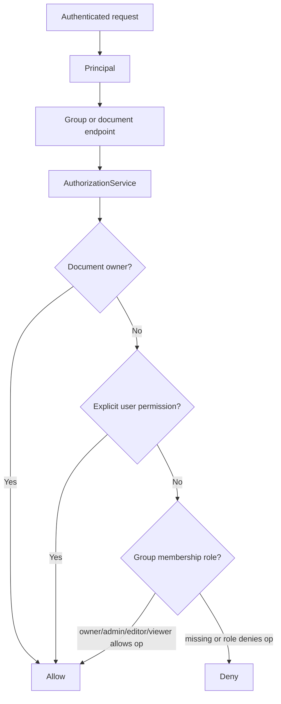

# Groups and document permissions

This note explains the first authorization slice for the portfolio chat service.

## What is implemented now

The backend now has minimal service-owned models and endpoints for:

- groups;
- memberships;
- membership roles;
- documents;
- explicit user document permissions;
- deny-by-default document authorization checks.

This is the permission foundation that the current retrieval service uses before any RAG context enters application memory.

## Permission flow

## Role behavior

| Actor / scope | Read | Write | Manage permissions | Ingest | Retrieve/cite |
| --- | --- | --- | --- | --- | --- |
| Personal owner | Yes | Yes | Yes | Yes | Yes |
| Explicit viewer | Yes | No | No | No | Yes |
| Explicit editor | Yes | Yes | Optional grant | Optional grant | Yes |
| Group owner/admin | Yes | Yes | Yes | Yes | Yes |
| Group editor | Yes | Yes | No | Yes | Yes |
| Group viewer | Yes | No | No | No | Yes |
| Unauthorized user | No | No | No | No | No |

## Why this matters for RAG

The retrieval service must never retrieve global top-k chunks and filter later. It builds authorization into the candidate set before deterministic ranking or graph expansion results enter application memory.

This permission slice gives RAG a concrete API and service contract to call.

## Current limitations

- no organization invitation flow yet;
- no full audit log yet;
- no document-level deny overrides yet;
- no frontend permission UI in this backend repository.

Knowledge ingestion, citation, and graph expansion now exist as later learning notes.

## Testing evidence

`tests/test_permissions_api.py` covers:

- group owners can add members;
- group viewers can read group documents;
- group viewers cannot write group documents;
- outsiders cannot read group documents;
- document owners can grant explicit read access;
- non-managers cannot change group membership.

## Revision history

- 2026-05-17: Updated after retrieval/citation slices started using this permission boundary.
- 2026-05-17: Created after implementing groups, memberships, document permissions, and authorization tests.
