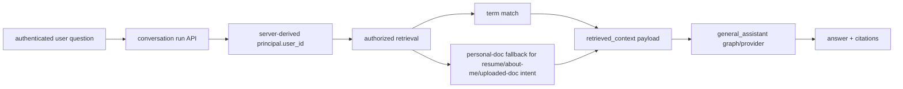

# Resume RAG fallback after broad personal questions

A real portfolio-demo failure exposed a gap in the retrieval pipeline: after uploading a resume, asking a broad question like “tell me about me” did not retrieve the resume because the query did not share enough exact terms with the document chunks.

## Symptom

The assistant replied that it could not fetch the uploaded document unless the user pasted text. That is honest for a generic chat assistant, but it is wrong for this product surface because the product conversation run already has authenticated document storage and permission-aware retrieval.

## Root cause

The previous pipeline had two weaknesses:

1. Retrieval depended on deterministic term overlap only. A broad personal question such as “about me” or “내 이력서” can be semantically about the resume while sharing no useful terms with the resume content.
2. Retrieved chunks were composed around the graph response, but the response provider prompt did not receive a first-class authorized document context payload.

## Fix shape

The server still derives the user identity from the authenticated principal; the frontend must not send or be trusted for `user_id`. When direct matching fails for personal-document intent, the backend falls back to recent chunks that the current user is authorized to read. The graph/provider receives a compact `retrieved_context` payload and is instructed to answer from it rather than claiming it cannot access uploaded documents.

## Rejected fixes

- Trust a client-sent `user_id`: unsafe because a malicious client could request another user's identity.
- Return all documents for every failed query: too noisy and increases accidental context exposure inside the authorized account.
- Add a vector database immediately: useful later, but too much dependency and deployment surface for this V1 portfolio fix.

## Follow-up risks

- Uploaded documents still need ingestion before they have chunks to retrieve.
- The fallback is intent-based, not true semantic search.
- A future production version should add embeddings/reranking and explicit document/knowledge-base scoping for “chat with this file.”

## Revision history

- 2026-05-20: Created learning log for `Resume RAG fallback after broad personal questions`.
