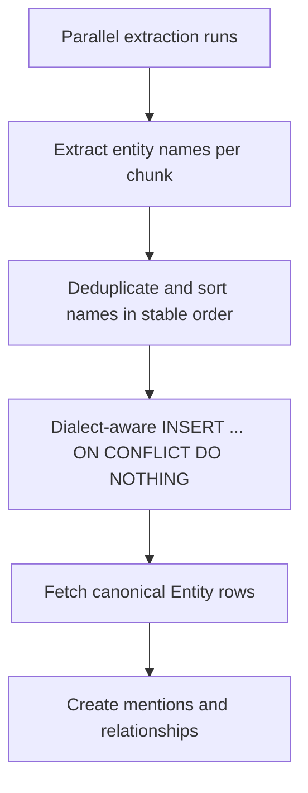

# Parallel ingestion Postgres deadlock

A public-demo multi-file upload test exposed a real concurrency bug after async ingestion landed.
The user uploaded and ingested three files at the same time against local Postgres/pgvector, and one ingestion failed with `psycopg.errors.DeadlockDetected` while inserting extracted entities.

## Symptom

The UI started three upload/ingestion jobs concurrently. The backend had already created async extraction runs, but Postgres raised a deadlock during the ingestion phase. The failure was not caused by pgvector search itself; it happened while canonical entity rows were being inserted during extraction.

## Root cause

Entity extraction stores reusable canonical names in `entities.name`, which has a unique constraint. The original helper followed a simple pattern:

```text
SELECT entity WHERE name = ...
if not found:
  INSERT entity(name)
```

That pattern is fine in single-threaded tests, but concurrent extraction runs can find the same name at the same time. With three documents sharing terms such as `FastAPI`, `LangGraph`, or other repeated names, separate Postgres transactions can try to insert overlapping unique-key values in different orders. That creates a race and can produce unique-conflict retries or a lock cycle/deadlock under load.

The durable lesson: **a unique constraint is not a concurrency strategy by itself**. If multiple workers can create the same logical row, the write path needs a conflict-safe insert and preferably a stable lock order.

## Fix shape

The backend keeps frontend multi-file concurrency enabled and fixes the ingestion write path instead of asking the UI to serialize uploads.



The fix has two parts:

1. Pre-collect unique entity names for the run and create them in deterministic sorted order, so concurrent runs acquire unique-index locks in the same sequence.
2. Use dialect-aware conflict-safe insert for Postgres and SQLite (`ON CONFLICT DO NOTHING`) instead of a plain select-then-insert race.

Regression coverage now includes a parallel async ingestion test with three documents sharing entity names. It verifies that each run reaches `completed` instead of failing when the documents overlap on canonical entity names.

## Rejected fixes

- Serialize all frontend uploads: this hides the backend race, slows the intended multi-file UX, and still leaves server-side callers able to trigger the same bug.
- Remove the unique constraint: canonical entity rows need stable identity and deduplication for mentions/relationships.
- Add Celery/Redis only for this bug: a durable queue may be needed later, but the entity write path must be safe regardless of the queue implementation.

## Follow-up risks

- This fix targets the observed shared-entity insertion lock path. Hosted Postgres should still get a live multi-file smoke before public-demo finalization.
- Richer extraction that creates more graph objects should preserve stable lock ordering for any shared canonical tables.
- Process-restart durability for in-process async ingestion remains a separate production queue concern.

## Revision history

- 2026-05-22: Created after fixing a Postgres `DeadlockDetected` incident from three concurrent upload/ingestion jobs.
