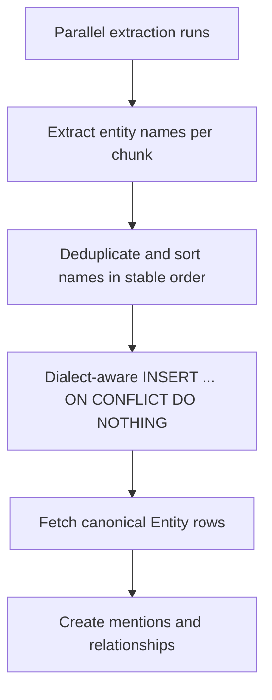

# Parallel ingestion Postgres deadlock

A public-demo multi-file upload test exposed a real concurrency bug after async ingestion landed.
The user uploaded and ingested three files at the same time against local Postgres/pgvector, and one ingestion failed with `psycopg.errors.DeadlockDetected` while inserting extracted entities.

## Symptom

The UI started three upload/ingestion jobs concurrently. The backend had already created async extraction runs, but Postgres raised a deadlock during the ingestion phase. The failure was not caused by pgvector search itself; it happened while canonical entity rows were being inserted during extraction.

## Root cause

Entity extraction stores reusable canonical names in `entities.name`, which has a unique constraint. The original helper followed a simple pattern:

```text
SELECT entity WHERE name = ...
if not found:
  INSERT entity(name)
```

That pattern is fine in single-threaded tests, but concurrent extraction runs can find the same name at the same time. With three documents sharing terms such as `FastAPI`, `LangGraph`, or other repeated names, separate Postgres transactions can try to insert overlapping unique-key values in different orders. That creates a race and can produce unique-conflict retries or a lock cycle/deadlock under load.

The durable lesson: **a unique constraint is not a concurrency strategy by itself**. If multiple workers can create the same logical row, the write path needs a conflict-safe insert and preferably a stable lock order.

## Fix shape

The backend keeps frontend multi-file concurrency enabled and fixes the ingestion write path instead of asking the UI to serialize uploads.



The fix has two parts:

1. Pre-collect unique entity names for the run and create them in deterministic sorted order, so concurrent runs acquire unique-index locks in the same sequence.
2. Use dialect-aware conflict-safe insert for Postgres and SQLite (`ON CONFLICT DO NOTHING`) instead of a plain select-then-insert race.

## How the fix works in code

The important change is that entity creation moved from **per chunk, interleaved with other writes** to **one preflight canonical-entity step per extraction run**.

Before the fix, the ingestion loop effectively did this while processing each chunk:

```text
chunk 1:
  find/create FastAPI
  find/create LangGraph
  write mentions/relationships

chunk 2:
  find/create LangGraph
  find/create FastAPI
  write mentions/relationships
```

When several documents ran in parallel, each transaction could discover the same missing names at nearly the same time. Worse, different documents could encounter the same names in different orders. One run might try `FastAPI -> LangGraph`, while another tries `LangGraph -> FastAPI`. Those two transactions can each hold one unique-index lock while waiting for the other, which is the classic lock-cycle shape.

The fixed flow is:

```text
1. Extract entity names from every chunk first.
2. Build one set of unique names for the whole document/run.
3. Sort the names deterministically.
4. For each sorted name:
     INSERT INTO entities(id, name)
     ON CONFLICT(name) DO NOTHING
5. SELECT the canonical Entity row by name.
6. Process chunks and create EntityMention / EntityRelationship rows by using the
   already-resolved canonical entity IDs.
```

In code, `run_extraction(...)` first builds `entity_names_by_chunk` and then resolves every entity through `_get_or_create_entities(...)` before the chunk loop creates mentions:

```python
entity_names_by_chunk = [_extract_entity_names(content) for content, *_ in chunks]
entity_by_name = self._get_or_create_entities(
    name for names in entity_names_by_chunk for name in names
)
```

`_get_or_create_entities(...)` is intentionally small but important:

```python
unique_names = sorted(set(names), key=lambda value: (value.casefold(), value))
return {name: self._get_or_create_entity(name) for name in unique_names}
```

That sorted order means every concurrent extraction run tries to create shared names in the same order. If three documents all contain `FastAPI`, `LangGraph`, and `Shared Alpha`, all three transactions now attempt the canonical rows in one stable sequence instead of whatever order the terms happened to appear in each document.

Then `_insert_entity_if_missing(...)` uses database-native upsert syntax:

```python
postgresql_insert(EntityModel)
    .values(id=..., name=name)
    .on_conflict_do_nothing(index_elements=[EntityModel.name])
```

This changes the race from:

```text
both transactions SELECT "FastAPI" -> not found
both transactions INSERT "FastAPI"
one blocks/fails/retries in an unsafe interleaving
```

to:

```text
both transactions try INSERT ... ON CONFLICT DO NOTHING
one transaction creates the row
the other transaction treats the duplicate as "nothing to do"
both SELECT the canonical row and continue
```

So there are two separate protections:

- **Stable ordering** reduces the chance of lock cycles across multiple shared names.
- **`ON CONFLICT DO NOTHING`** makes the same-name duplicate insert safe when another transaction wins the race.

After that, mentions and relationships are not trying to create canonical entity rows anymore. They only point at already-resolved entity IDs, so the later chunk loop is simpler and less likely to fight over the `entities.name` unique index.

## Why sorting alone was not enough

Sorting prevents inconsistent lock order, but it does not make duplicate creation safe by itself. Two transactions can still both see that `FastAPI` is missing before either commits. Without `ON CONFLICT DO NOTHING`, one of them still hits a unique constraint conflict or has to rely on fragile retry behavior.

## Why `ON CONFLICT` alone was not enough

`ON CONFLICT DO NOTHING` handles one duplicated name safely, but with many shared names the transactions can still touch unique-index entries in different orders. Stable sorting makes the multi-name case predictable.

The practical lesson is that concurrent canonical-row creation needs both:

```text
deterministic order + conflict-safe insert
```

Regression coverage now includes a parallel async ingestion test with three documents sharing entity names. It verifies that each run reaches `completed` instead of failing when the documents overlap on canonical entity names.

## Rejected fixes

- Serialize all frontend uploads: this hides the backend race, slows the intended multi-file UX, and still leaves server-side callers able to trigger the same bug.
- Remove the unique constraint: canonical entity rows need stable identity and deduplication for mentions/relationships.
- Add Celery/Redis only for this bug: a durable queue may be needed later, but the entity write path must be safe regardless of the queue implementation.

## Follow-up risks

- This fix targets the observed shared-entity insertion lock path. Hosted Postgres should still get a live multi-file smoke before public-demo finalization.
- Richer extraction that creates more graph objects should preserve stable lock ordering for any shared canonical tables.
- Process-restart durability for in-process async ingestion remains a separate production queue concern.

## Revision history

- 2026-06-17: Expanded the fix explanation with the actual pre-collection, stable-sort, `ON CONFLICT DO NOTHING`, and canonical-row fetch sequence.
- 2026-05-22: Created after fixing a Postgres `DeadlockDetected` incident from three concurrent upload/ingestion jobs.
