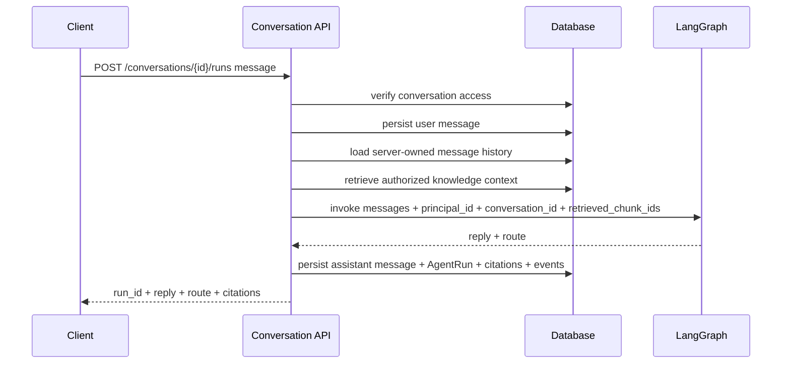

# Server-owned conversations and chat runs

This note explains the move from client-supplied chat history toward server-owned conversation state.

## Why this matters

The legacy `/assistant/chat` endpoint accepts a `history` array from the client. That is useful for v0 smoke tests, but it is not a safe product boundary for a permission-aware knowledge service.

A product chat run should use messages that the backend owns, scopes, and can authorize.

## New run flow

## What is implemented now

- `ConversationModel` stores owner/group scope.
- `MessageModel` stores user and assistant messages.
- `AgentRunModel` stores the first durable run boundary.
- `/conversations/{id}/runs` invokes the existing LangGraph assistant with server-owned history.
- Runs now include permission-aware retrieval context IDs, citations, and redacted events.
- Group conversations are visible to group members.
- Outsiders receive safe denial.

## Legacy boundary

`/assistant/chat` still exists for v0 compatibility and deterministic smoke tests. It should not become the product endpoint for personal/group KB access.

Frontend work should use conversation/run endpoints for product chat.

## Current limitations

- no streaming transport yet;
- no run failure table details beyond the basic status field;
- no LangGraph checkpointer yet;
- no background job queue for long-running ingestion or agent work yet.

Retrieval, citations, and redacted events now exist as later learning notes.

## Testing evidence

`tests/test_conversations_api.py` verifies:

- run endpoint uses persisted server-owned history;
- graph invocation receives `principal_id` and `conversation_id`;
- group members can read group conversations;
- outsiders cannot read group conversations;
- legacy `/assistant/chat` does not return product run fields.

## Revision history

- 2026-05-17: Updated after adding citations and redacted run events.
- 2026-05-17: Created after adding server-owned conversations and product run endpoint.
