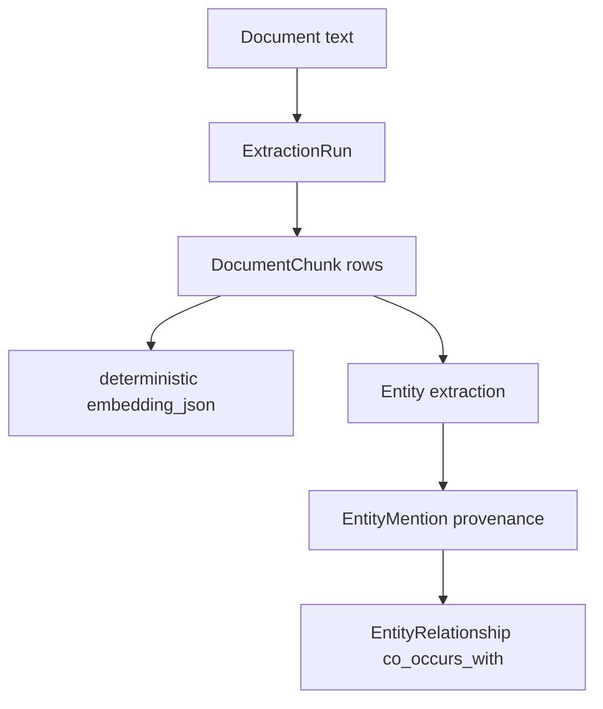

# Knowledge ingestion and deterministic extraction

This note explains the first thin knowledge-ingestion slice.

## What is implemented now

A user can create a personal or group knowledge base, attach a document to it, and run deterministic ingestion over the document's stored text.

The ingestion pass creates:

- chunks;
- deterministic embedding fixtures;
- extraction run records;
- entities;
- entity mentions;
- co-occurrence relationships between adjacent extracted entities;
- provenance back to document chunks.

## Ingestion flow

## Why deterministic extraction

The project must keep tests offline and credential-free. Deterministic extraction lets the service prove the data lifecycle before adding OpenAI-based extraction or production document parsing.

This is a scaffold for portfolio-visible architecture, not a claim of production extraction quality.

## Current limitations

- no file upload parser yet;
- no PDF/docx ingestion yet;
- no OpenAI extraction yet;
- no production vector similarity ranking yet.

Thin permission-aware RAG and graph expansion now live in the next learning note.

## Testing evidence

`tests/test_knowledge_ingestion.py` verifies:

- personal KB creation;
- group KB membership enforcement;
- document attachment to a KB;
- ingestion creates chunks, entities, relationships, and extraction-run summaries;
- outsiders cannot create group KBs for groups they do not belong to.

## Revision history

- 2026-05-17: Updated limitations after adding thin permission-aware RAG in the next slice.
- 2026-05-17: Created after adding thin end-to-end knowledge-base ingestion and deterministic extraction.
