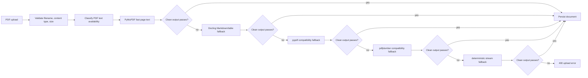

# PDF Upload Extraction Pipeline and NUL Byte Failures

This note captures why the PDF upload bug happened and how the new ingestion boundary should be reasoned about.

## Symptom

A Korean PDF upload reached `documents.content` with raw extraction artifacts, including PostgreSQL-unsafe NUL bytes (`0x00`) and repeated `ko-KR`/font metadata. PostgreSQL rejected the insert with:

```text
PostgreSQL text fields cannot contain NUL (0x00) bytes
```

The visible API symptom was a `500 Internal Server Error` from the upload endpoint.

## Root cause

The earlier parser had a useful fallback for tiny/simple PDF streams, but it treated fallback text as trusted once a literal stream was decoded. That meant malformed font/encoding artifacts could pass through to persistence.

PDF extraction needs a pipeline, not a single parser call:



## Fix / mitigation

- Added `pdfplumber` as the first approved PDF-specific dependency for this milestone.
- Added user-approved PyMuPDF as the fast primary text extractor.
- Added user-approved Docling as the structured primary fallback for Markdown/table extraction.
- Made Docling accelerator, OCR, timeout, and thread count configurable through `MY_AGENTS_DOCLING_*` settings, with safe local defaults of CPU, OCR off, 30 seconds, and 4 threads after Apple MPS crashed on Torch float64 positional embeddings.
- Kept `pypdf`, `pdfplumber`, and deterministic literal/FlateDecode fallback as compatibility layers for tiny tests and simple fixture PDFs.
- Added a shared cleanup and validation gate before persistence:
  - replace NUL bytes before DB insertion;
  - remove unsafe control characters;
  - remove repeated locale metadata such as `ko-KR` when it dominates output;
  - reject likely encoding garbage, excessive whitespace, repeated character artifacts, and empty output.
- Unsupported/garbled PDFs now fail as controlled `400` upload errors instead of DB `500`s.
- Docling image placeholders such as `<!-- image -->` and bullet-only lines are stripped before validation so image-heavy PDFs cannot create low-signal chunks that make the assistant answer from hallucinated general knowledge.
- Added a Tesseract OCR fallback after Docling for image-heavy PDFs; the Elice PDF produced about 3.3k OCR characters and 35 chunks with `kor+eng --psm 6` in the local experiment.

## Rejected fixes

- **Only strip NUL bytes before insert**: prevents one database error but still stores garbage into RAG.
- **Use PyMuPDF without documenting license tradeoff**: PyMuPDF is now user-approved for this milestone, but future agents must remember the AGPL/commercial licensing concern.
- **Rely only on Docling/OCR**: Docling is now a structured fallback, but request-time OCR/layout-heavy extraction remains too expensive to treat as the only path.

## Follow-up risks

- Docling includes OCR/layout capabilities, but OCR is disabled in the request-time upload path until there is a background queue and timeout/progress contract.
- Complex multi-column/table-heavy files should improve through Docling, but may still fail quality gates or produce imperfect reading order.
- PyMuPDF's AGPL/commercial licensing should be revisited before any proprietary distribution decision.
- If PDF volume grows, extraction should move from request-time sync work into a background queue with timeouts and metrics.

## Revision history

- 2026-05-23: Created learning log for `PDF Upload Extraction Pipeline and NUL Byte Failures`.
- 2026-05-23: Updated pipeline notes after adding PyMuPDF as the fast primary extractor and Docling as the structured primary fallback.
- 2026-05-23: Documented the configurable Docling accelerator mitigation for Apple MPS float64 failures.
- 2026-05-23: Added the Elice frontend engineer PDF diagnosis: image-heavy PDFs that only yield Docling placeholders must be rejected until OCR produces meaningful text.
- 2026-05-23: Added Tesseract OCR as the configurable image-heavy PDF fallback path.
