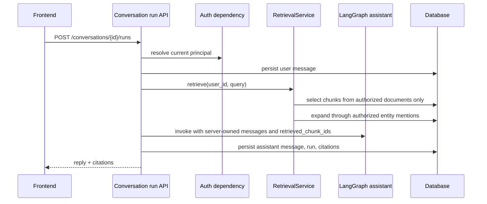
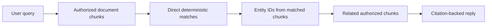

# Permission-aware RAG and citation-backed answers

This note explains the first thin RAG slice for the portfolio chat service.

## What is implemented now

A product chat run can now answer with context from ingested personal or group documents.
The important rule is simple: retrieval starts from the user's authorized documents, not
from the entire knowledge corpus.

The current implementation is intentionally deterministic so tests stay offline:

- direct retrieval uses term matching over authorized chunks;
- graph expansion uses extracted entity mentions to add related authorized chunks;
- citations are stored against the `AgentRunModel`;
- the response payload returns citation IDs, document IDs, chunk IDs, and snippets.

## Request flow

## Why permission filtering happens first

RAG systems can leak data if they retrieve globally and filter later. Even if the final
answer hides unauthorized text, intermediate rankings, graph edges, tool traces, or model
context can expose private information.

This project uses a safer order:

The graph expansion step also stays inside the authorized row set. This means a private
chunk can never become a citation or model context for an outsider just because it shares
an entity with an authorized chunk.

## Current limitations

- Retrieval scoring is a deterministic fixture, not pgvector ranking.
- The reply composition is a thin service-layer scaffold, not a polished answer synthesis prompt.
- Citations include snippets but not character offsets in the API response yet.
- Streaming is not implemented yet; structured run events are covered in the next note.
- The legacy `/assistant/chat` endpoint still exists for smoke checks and does not own product KB access.

These constraints are acceptable for this portfolio stage because they make the security
boundary testable before adding more impressive retrieval infrastructure.

## Testing evidence

`tests/test_permission_aware_rag.py` verifies:

- an owner receives citations and authorized context from an ingested private document;
- an outsider asking the same question receives no private citations or private reply text;
- graph expansion adds a related authorized chunk that shares an extracted entity with the direct match;
- the graph receives only retrieved chunk IDs, not raw unauthorized document text.

## Revision history

- 2026-05-17: Updated limitations after adding structured run events in the next slice.
- 2026-05-17: Created after adding thin permission-aware retrieval, graph expansion, and citations.
