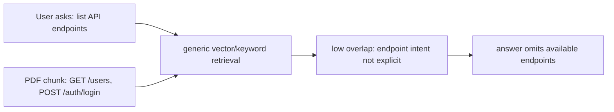

# Structured retrieval gap: API docs without “endpoint list” wording

This note records a retrieval-quality lesson from the Dedicated RAG Agent discussion. The failure mode is important because it marks the difference between a demo RAG pipeline and a production-level document assistant.

## Symptom

A user uploads an API document as a PDF. The document is parsed, ingested, chunked, embedded, and made available through the normal knowledge-base retrieval flow.

Later, the user asks:

```text
What API endpoints are listed in this document?
```

The answer may miss the endpoint list even though the PDF contains endpoint-looking rows or lines such as:

```text
GET /users
POST /auth/login
PATCH /projects/{id}
DELETE /sessions/{id}
```

The document may never literally say:

```text
These are available endpoints.
```

So vector/keyword retrieval can under-retrieve the right chunks because the user's wording and the document's wording do not overlap enough.

## Root cause

This is not just a PDF parser bug. It is a **structured intent mismatch**.

The user is asking an enumeration question over a document structure:

- list endpoints;
- list environment variables;
- list commands;
- list config options;
- list error codes;
- list database tables.

Generic retrieval treats the query as semantic similarity over prose chunks. But an API reference often encodes meaning through layout and symbols instead of explanatory language. The endpoint identity is carried by `GET`, `POST`, and `/path` patterns, not by paragraphs saying “endpoint.”



## Why this matters

A demo RAG system can look useful when the user asks questions that share vocabulary with the document. A production-level RAG system must also handle questions that ask for implicit structure.

The product should not require a PDF to contain perfect headings like “Available API Endpoints” before it can answer a normal user question about endpoints.

## Better solution shape

The future Dedicated RAG Agent should combine three capabilities.

### 1. Ingestion-time structured extraction

During ingestion, detect domain-shaped entities and store them with provenance:

```json
{
  "type": "api_endpoint",
  "method": "POST",
  "path": "/auth/login",
  "summary": "Authenticate a user and create a session.",
  "source_document_id": "...",
  "source_chunk_id": "...",
  "source_page": 12,
  "confidence": "pattern+layout"
}
```

For API docs, extraction should look for:

- HTTP methods: `GET`, `POST`, `PUT`, `PATCH`, `DELETE`;
- path patterns: `/v1/users`, `/projects/{project_id}`;
- OpenAPI-like tables;
- request/response sections;
- endpoint headings and nearby descriptions.

The same pattern generalizes to config keys, CLI commands, metrics, errors, and database schema references.

### 2. Query-time intent routing

The RAG agent should classify the user's retrieval intent before running search.

```text
semantic_question | document_overview | structured_enumeration | comparison | source_lookup
```

For “list API endpoints,” the route should become `structured_enumeration`, and the retrieval plan should query extracted `api_endpoint` entities instead of relying only on vector similarity.

### 3. Structured answer contract

The answer should be able to render a table with source metadata:

| Method | Path | Summary | Source |
| --- | --- | --- | --- |
| `POST` | `/auth/login` | Create a login session | PDF p. 12 |
| `GET` | `/users/me` | Return current user | PDF p. 13 |

The response should also say when confidence is low or when endpoints were inferred from patterns rather than explicit OpenAPI schema.

## Current codebase implication

The current code already has pieces of the future solution:

- document ingestion and chunking;
- entity and relationship tables;
- permission-aware retrieval;
- citations and source page metadata;
- debug logging for retrieved and injected chunks.

But the current retrieval path does not yet have a first-class model for structured document entities such as API endpoints. It can retrieve chunks, but it does not understand that a chunk is an endpoint list.

## Follow-up risks

- Pattern extraction can create false positives from code examples or prose.
- PDF table extraction may split method/path/description across chunks.
- Endpoint enumeration must still honor knowledge-base permissions and group source policy.
- Structured extraction should not replace semantic retrieval; it should be another retrieval plan available to the RAG agent.

## Revision history

- 2026-05-24: Created note from Dedicated RAG Agent discussion about API endpoint enumeration failures.
