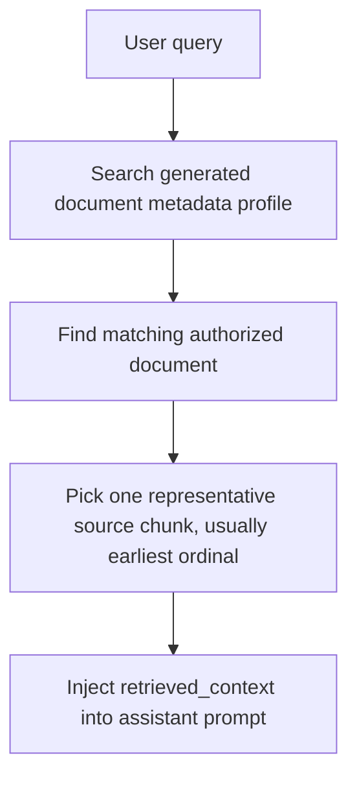
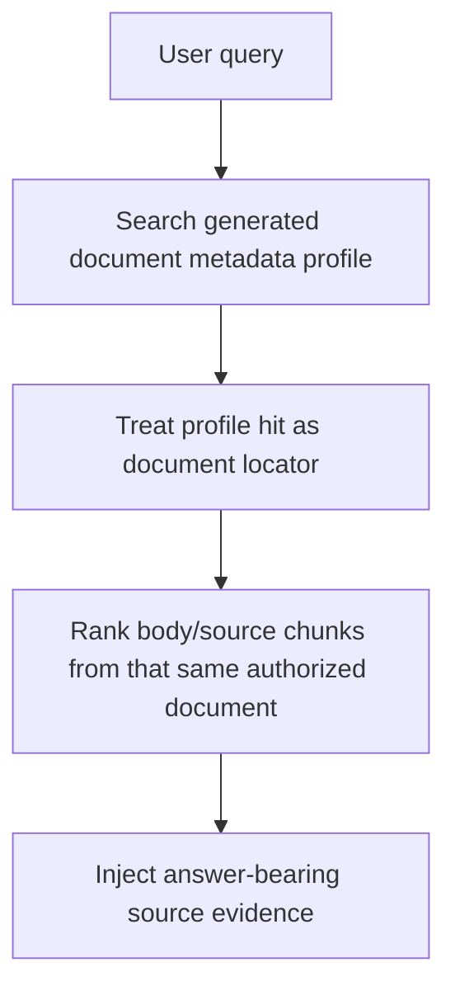

# Debug note: Metadata-profile hits must expand into body evidence

A system knowledge-base retrieval incident exposed a subtle RAG failure mode: retrieval had found and injected authorized context, but the injected chunks did not contain the answer-bearing facts the assistant needed.

## Symptom

A user asked a question like:

> Who created my-agents and what stack does it use?

The retrieval debug event showed that context was not missing:

- `retrieval_route`: `retrieval_optional`
- `answer_mode`: `mixed`
- `document_scope`: `unknown`
- `retrieved_chunk_count`: non-zero
- `injected_chunk_count`: non-zero

The injected list included relevant system-KB documents, but they were weakly represented:

- a `document_metadata_profile` hit for a project-facts document only injected the title/header-like chunk;
- a Korean system-knowledge chunk contained the creator fact;
- the stack facts were buried deeper and were not visible in the selected snippets;
- unrelated LangGraph learning notes ranked above or around the project-facts evidence.

The assistant therefore behaved as if the system knowledge base had not aligned with the answer, even though retrieval and injection had technically happened.

## Root cause

The problem was not authorization, prompt injection, or a missing KB. It was the handoff between document-level discovery and chunk-level evidence.

Before the fix, generated metadata-profile retrieval worked like this:



That satisfied the letter of "ground generated metadata in original source chunks," but it did not satisfy the product need: the chosen original chunk could be only a title, heading, or other weak representative chunk.

The correct mental model is:



Generated metadata should decide which document deserves attention. It should not decide the final cited text, and it should not be considered enough evidence by itself.

## Why this looked similar to earlier filename metadata issues

A previous failure happened when users referred to an uploaded file by a visible filename such as `NCT06159946_Prot_000`, while that string did not appear in the extracted PDF/text body. The fix made document `title` and `source_filename` participate in retrieval as `document_metadata` candidates.

This incident was adjacent but different:

| Failure family | What matched | What was missing |
| --- | --- | --- |
| Filename/title metadata gap | `title` or `source_filename` matched the user's reference | The filename was absent from body text |
| Metadata-profile body-evidence gap | generated profile found the right document | The injected source chunk was a header/weak representative, not the buried fact |

Both cases teach the same RAG rule: metadata is a locator, not the final evidence.

## Fix shape

The fix changed metadata-profile retrieval to:

1. score matching generated profiles as before;
2. group authorized chunks by matched document;
3. rank source chunks from that document by body/evidence signal;
4. return up to a small bounded number of body/source chunks;
5. preserve existing semantic and graph-expansion provenance when duplicate chunks overlap.

Important boundaries stayed unchanged:

- only authorized KB/document chunks are considered;
- generated profile text is not cited as source evidence;
- semantic vector and graph-expansion source labels are not globally overwritten by `document_metadata_profile`.

## Rejected fixes

- **Treat generated metadata profile text as final evidence.** Rejected because final answers and citations must be grounded in uploaded/source document text, not generated summaries or keywords.
- **Globally prioritize `document_metadata_profile` above semantic retrieval.** Rejected because it masked existing semantic and graph-expansion provenance in tests.
- **Return every chunk from a matched document.** Rejected because it would add noise and could crowd out more precise authorized evidence.
- **Assume prompt wording alone would fix it.** Rejected because the assistant cannot answer from body facts that were never injected.

## Tests and verification added

The regression test `test_metadata_profile_match_injects_body_chunks_not_only_heading` proves that a metadata-profile match contributes body/source chunks rather than only a heading-like chunk.

The completed verification for the fix included:

```bash
uv run pytest tests/test_permission_aware_rag.py tests/test_system_knowledge_base_user_type.py tests/test_context_forge_reranking.py -q
uv run pytest -q
uv run ruff check . --no-cache
uv run ruff format --check .
```

## Future debugging checklist

When system or uploaded knowledge seems ignored, inspect the retrieval event before changing prompts:

1. Was context retrieved and injected at all?
2. Which KB IDs and document IDs appeared?
3. Are top chunks from the expected document, or noisy neighboring documents?
4. If `document_metadata_profile` appears, did it inject body evidence or only title/header text?
5. Are answer-bearing facts present in the final `injected_context` snippets?
6. Did duplicate-source fusion preserve important provenance such as `semantic_vector` or `graph_expansion`?

If the answer-bearing text is absent from `injected_context`, the fix belongs in retrieval, candidate fusion, or packing. If the answer-bearing text is present but the model ignores it, then inspect provider prompt instructions and context formatting.

## Follow-up risks

- Body-chunk ranking remains heuristic. It is intentionally bounded and lightweight, not a full cross-encoder or LLM reranker.
- Broad unscoped queries can still retrieve noisy but authorized neighboring documents.
- Small system-KB facts should be authored so the answer-bearing fact and useful aliases appear in retrievable body text, not only in metadata.

## Revision history

- 2026-06-14: Created learning log for `Metadata-profile retrieval must inject body evidence`.
