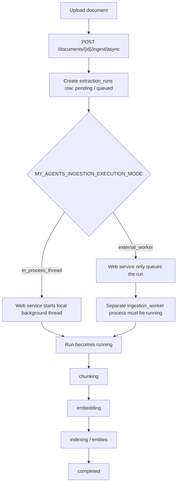

# Production async ingestion queued without a worker

## Short version

The production upload path was not broken. The frontend polling path was not broken either.
The production service was configured to use queued ingestion with an external worker, but no
long-running worker process was actually running. Because of that, new extraction runs stayed in
`pending` / `queued` forever until I manually started the worker locally against the production
database.

The incident looked confusing because every visible HTTP request was healthy:

- file upload returned `201 Created`;
- `POST /ingest/async` returned `202 Accepted`;
- polling `GET /extraction-runs/{run_id}` returned `200 OK` quickly;
- the uploaded document existed in Neon;
- root/system-knowledge permissions checked out.

The missing piece was not an API response. It was a missing process.

## The important mental model

Async ingestion has two separate responsibilities:

1. The web API creates an `extraction_runs` row and returns it to the client.
2. An ingestion executor claims that queued row and mutates it through the real ingestion lifecycle.

The executor depends on `MY_AGENTS_INGESTION_EXECUTION_MODE`:



So `pending` / `queued` is not automatically an error. It is the expected first state. It becomes
a problem only when the state never changes and `started_at` stays `null`.

## What happened

Production had an environment shape like this, redacted to the non-secret parts that mattered:

```env
MY_AGENTS_INGESTION_EXECUTION_MODE=external_worker
MY_AGENTS_INGESTION_WORKER_POLL_INTERVAL_SECONDS=2
MY_AGENTS_INGESTION_WORKER_BATCH_SIZE=1
MY_AGENTS_DOCUMENT_UPLOAD_CONCURRENCY=5
MY_AGENTS_DATABASE_URL=<present, production Neon URL redacted>
```

With `external_worker`, the FastAPI app intentionally does not run ingestion work inside the web
request process. The API enqueues the extraction run and returns. That is good for keeping the web
service responsive, but it creates a deployment requirement: a separate worker process must be
alive and connected to the same database.

I had configured the app as if that worker existed, but I had not actually deployed or run the
worker as a persistent service. On Render, the proper separate Background Worker shape was not
available to me without an upgraded plan, so production had a queue with no consumer.

The browser kept seeing a valid extraction run like this:

```json
{
  "status": "pending",
  "stage": "queued",
  "progress_percent": 0,
  "chunk_count": 0,
  "entity_count": 0,
  "relationship_count": 0,
  "error": null,
  "started_at": null,
  "completed_at": null
}
```

The backend logs also looked deceptively healthy because polling was healthy:

```text
GET /knowledge-bases/.../documents/.../extraction-runs/... HTTP/1.1 200 OK
```

Those logs proved the API could read the row. They did not prove that ingestion was executing.

## Why I was confused

### 1. I mixed up "the run row exists" with "the run is being processed"

The frontend could fetch the extraction run, and the database contained the uploaded document. My
first instinct was therefore: "the backend accepted this, so something must be wrong with the UI
not receiving the latest result."

That was the wrong inference. In queued architectures, successfully reading a queued job is only
evidence that enqueueing worked. It says nothing about whether a worker has claimed the job.

The key field was `started_at`. It stayed `null`, which means no executor had claimed the run.

### 2. The first reproduction happened in the system knowledge base path

I first noticed this while uploading to a system knowledge base. That made the problem look like a
special system-knowledge authorization bug. I checked whether the user was root and whether system
knowledge management permission was active, and those checks passed.

That path was a distraction. The same symptom happened on a regular knowledge base as well. Once it
reproduced outside system knowledge, the issue stopped looking like permissions and started looking
like shared ingestion infrastructure.

### 3. A transient `404` made the path-bound endpoints look suspicious

During the system-knowledge test I also saw a `404` for an extraction-runs request. Since the route
is nested under knowledge base and document IDs, a mismatch in any path segment can correctly return
`404` as a safe "not found" response. That made me suspect the frontend might be polling the wrong
path or crossing system/personal knowledge-base boundaries.

That suspicion was reasonable to check, but it was not the durable failure. Subsequent polling used
the right run/document IDs and returned `200`; the payload simply remained queued.

### 4. The production logs were too quiet

The request logs were dominated by fast polling requests. They had no ingestion-stage logs such as
chunking, embedding, or completed status updates. I initially interpreted "no obvious error" as
"maybe the frontend missed the update."

The better interpretation was: the ingestion executor never ran, so there was nothing to log.

### 5. The earlier in-process incident biased the fix direction

The previous hosted lesson was that in-process async ingestion could make the web process
unresponsive. The fix for that incident was to add `external_worker` mode. I then enabled the new
mode in production, but I had not internalized that enabling external-worker mode is only half of
the deployment. The other half is supervising the worker process.

This is the core beginner mistake: I changed the execution mode but did not deploy the executor
that mode requires.

## What proved the real cause

I manually started the ingestion worker with the same production environment loaded:

```bash
uv run python -m my_agents.ingestion_worker --log-level INFO
```

The worker immediately initialized the production database connection, started its polling loop,
and claimed the stuck run:

```text
ingestion_worker.started poll_interval_seconds=2.0 batch_size=1
ingestion_worker.claimed run_id=<run-id>
knowledge_ingestion.start ... source_type=markdown parser=utf8_markdown_v1
knowledge_ingestion.chunked ... chunk_count=134
HTTP Request: POST https://api.openai.com/v1/embeddings "HTTP/1.1 200 OK"
knowledge_ingestion.embedded ... embedding_count=134 provider=openai model=text-embedding-3-small
```

That was the decisive evidence. The run did not need a frontend fix. It needed a worker.

## Correct diagnosis checklist for this failure shape

When ingestion polling stays stuck, inspect the run state before assuming frontend cache, auth, or
route problems.

### If the response stays like this

```json
{
  "status": "pending",
  "stage": "queued",
  "started_at": null,
  "completed_at": null,
  "error": null
}
```

ask: "who is supposed to claim this run?"

### Interpret by execution mode

| Execution mode | Expected executor | What queued forever usually means |
| --- | --- | --- |
| `in_process_thread` | FastAPI web process starts a background thread | Thread did not start, web process crashed, or request/session dispatch failed |
| `external_worker` | Separate `python -m my_agents.ingestion_worker` process | Worker is not running, not connected to the same DB, or cannot claim rows |

### Useful commands

Drain queued runs once:

```bash
uv run python -m my_agents.ingestion_worker --once --batch-size 20 --log-level INFO
```

Run the worker continuously:

```bash
uv run python -m my_agents.ingestion_worker --log-level INFO
```

If a separate worker service is unavailable, use the temporary single-process shape:

```env
MY_AGENTS_INGESTION_EXECUTION_MODE=in_process_thread
MY_AGENTS_DOCUMENT_UPLOAD_CONCURRENCY=1
```

That fallback trades isolation for simplicity. It can keep demos working without a paid background
worker service, but ingestion can again compete with normal web requests. Use small documents and
low upload concurrency until there is a real worker service.

## Rejected explanations

### "The system knowledge base path is broken"

Rejected because the same stuck state reproduced in a regular knowledge base, and root/system
knowledge permission checks were valid.

### "The frontend is not receiving the completed result"

Rejected because the backend response itself was still `pending` / `queued` with `started_at=null`.
The frontend was accurately rendering the stale state it received.

### "The API polling endpoint is failing"

Rejected because repeated polling returned `200 OK` quickly. The endpoint could read the extraction
run; no worker was mutating that run.

### "The upload failed"

Rejected because the document row existed and async ingestion created an extraction run. Upload and
enqueue worked.

## Follow-up risk

The temporary no-worker configuration should not be treated as a production-grade queue. It is a
small-demo compromise. A durable deployment still needs one of these:

1. a real external worker process supervised by the hosting platform;
2. a different queue/worker provider;
3. a deliberate product decision that ingestion is small enough to run in-process for now.

The important thing is that the environment must match the deployment shape. `external_worker`
without a worker is a queue with no consumer.

## Revision history

- 2026-06-22: Created learning log for `Production async ingestion queued without a worker`.
