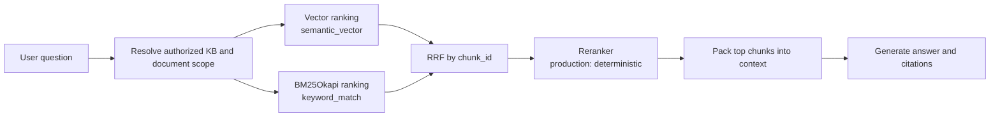
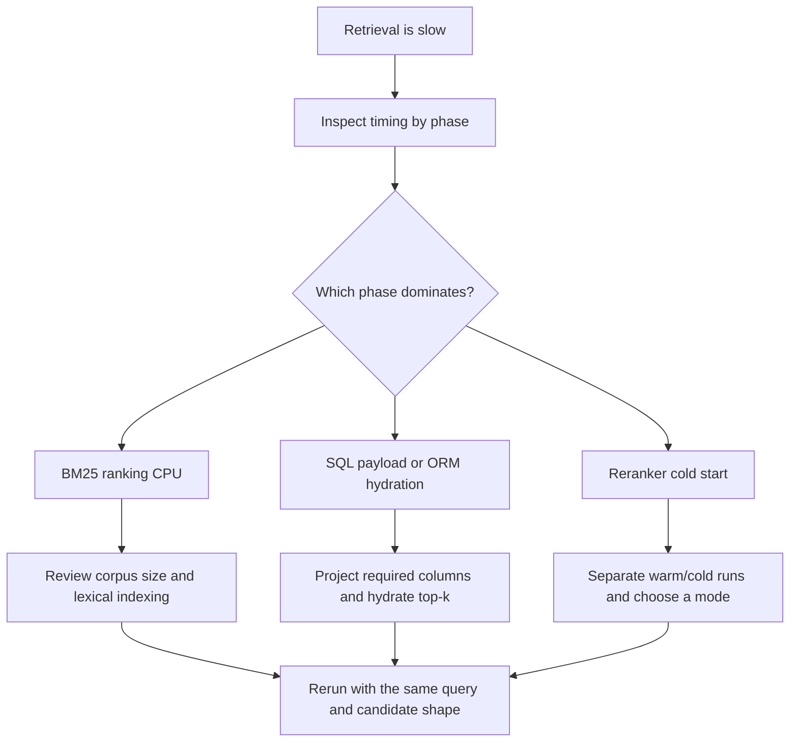

# Hybrid retrieval with BM25, vector search, and RRF

## What I learned

RAG retrieval does not have to rely on a single scoring system.

- **Vector search** is strong at finding chunks whose meaning resembles the question.
- **BM25** is strong at finding exact lexical matches such as words, codes, and names that actually appear in a document.
- **Hybrid retrieval** creates independent result lists from both search methods and then combines them.
- **Reciprocal Rank Fusion (RRF)** combines results using their ranks instead of trying to normalize scores that use incompatible units.

BM25 did not replace vector search in this change. The two retrievers compensate for different failure modes.

| Search method | What it finds well | What it may miss |
| --- | --- | --- |
| Vector search | Explanations with similar meaning but different wording | Product codes, proper nouns, and rare exact-match strings |
| BM25 | Exact terms, repeated rare words, and identifier codes | Synonyms, paraphrased questions, and contextual similarity |
| Hybrid + RRF | Results found by either method, with extra support for results found by both | Both methods can fail together if the corpus or authorization scope is wrong |

## Why `my-agents` was ready for hybrid retrieval

This feature did not require a new storage model. Document ingestion already kept the following information together at the chunk level:

```text
DocumentChunk
├─ id              -> stable chunk_id
├─ document_id     -> relationship to the source document
├─ ordinal         -> position inside the document
├─ content         -> raw chunk text used by BM25
└─ embedding       -> chunk embedding used by vector search
```

That meant the necessary foundations were already present:

1. **A shared identity existed.** BM25 and vector results could be merged by `chunk_id`.
2. **Both search representations existed.** Raw text and an embedding were associated with the same chunk.
3. **Authorization was already applied before retrieval.** Only knowledge bases, documents, and chunks readable by the user become part of either search path.
4. **ContextForge already had a fusion stage.** There was a clear place for RRF between candidate gathering and reranking.
5. **Source labels and timing instrumentation already existed.** Sources such as `semantic_vector` and `keyword_match` and their latency could be observed independently.

Hybrid retrieval could therefore be added without a database migration. The change read existing data through a new ranking path and connected it to the existing candidate pipeline instead of introducing new columns or tables.

## Implemented retrieval flow



### 1. Create independent rankings

`CandidateScouts` requests vector candidates and BM25 candidates separately.

- The vector path produces the `semantic_vector` source.
- The BM25 path produces the `keyword_match` source.
- Each path has its own top-k limit and internal score.

This independence matters because cosine similarity and BM25 scores do not use the same unit. Adding the raw numbers directly could make one retriever dominate simply because its score range or distribution is larger.

### 2. Run BM25 over authorized chunk text

The current implementation builds a request-local `BM25Okapi` corpus from a projection of the chunks the user is authorized to read. Its tokenizer handles English letters, numbers, and Korean text case-insensitively.

BM25 mainly considers:

- whether a query term appears in a chunk;
- how frequently the term appears in that chunk;
- how rare the term is across the corpus;
- document-length normalization, which prevents long documents from winning only through repetition.

As a result, a chunk containing an unusual code or rare term can receive a stronger lexical signal than a chunk containing only common words.

### 3. Fuse ranks instead of raw scores

The current RRF rank constant is `k = 60`. A chunk receives the following contribution from each retrieval source:

```text
RRF contribution = 1 / (60 + rank)
```

When the same `chunk_id` appears in both vector and BM25 rankings, the contributions are added:

```text
final RRF score(chunk)
= vector rank contribution
+ BM25 rank contribution
+ contributions from other retrieval sources
```

For example, if a chunk ranks second in vector search and third in BM25:

```text
1 / (60 + 2) + 1 / (60 + 3)
```

This allows a chunk supported by both retrievers to outrank a result supported by only one. The most important implementation rule is to merge by **chunk identity**, not by rank position.

## The problem in the first implementation

Hybrid retrieval behaved correctly, but the first production-like timing was extremely slow.

| Phase | Initial measurement |
| --- | ---: |
| Total | 31,778 ms |
| Candidate gathering | 31,417 ms |
| BM25 corpus query | 14,232 ms |
| BM25 calculation | 103 ms |
| Metadata-profile matched chunk SQL | 12,327 ms |
| Related-entity chunk SQL | 3,315 ms |

The key clue was that the BM25 calculation itself took only about 103 ms. The bottleneck was not the `rank-bm25` algorithm. It was how data was loaded from the database to build the corpus.

### The inefficient first approach

The initial implementation loaded the authorized chunk corpus as full ORM model rows. BM25 needed only chunk text and identity, but the joined rows also included heavy data:

- every chunk's `embedding_json`;
- repeated copies of the full `documents.content` value for each joined chunk;
- additional ORM model payload that BM25 did not use.

This exposed an important distinction: **implementing a feature without a database migration does not mean that reusing an existing query will be inexpensive**. The storage model was sufficient, but the retrieval query shape still had to be optimized for BM25.

## How the problem was solved

### 1. Replace full rows with a lightweight BM25 projection

The BM25 corpus query was reduced to the values required for ranking:

```text
chunk_id
 document_id
 ordinal
 chunk content
```

It no longer loads `embedding_json` or full document content during corpus ranking.

### 2. Hydrate only the top-k results

After BM25 ranks the authorized corpus, only the ORM rows corresponding to the top chunk IDs are loaded. Even during this hydration step, unused embeddings and full-document content remain deferred.

```text
Authorized lightweight corpus
        ↓
BM25 ranking
        ↓
Top-k chunk IDs
        ↓
Hydrate only top-k candidate rows
```

### 3. Inspect adjacent retrieval queries

The timing trace also showed that metadata-profile and graph-expansion queries were loading unused large columns. Instead of fixing only the new BM25 query, the candidate-gathering path was reviewed for unnecessary `embedding_json` and `documents.content` payloads and those fields were deferred where unused.

The same retrieval shape was preserved while candidate-gathering latency dropped substantially.

| Phase | Initial | Optimized warm run |
| --- | ---: | ---: |
| Total | 31,778 ms | 2,522 ms |
| Candidate gathering | 31,417 ms | 1,104 ms |
| BM25 corpus + rank + hydration | 14,335 ms | 138 ms |
| Raw candidates | 80 | 80 |
| Fused candidates | 52 | 52 |
| Reranked candidates | 40 | 40 |
| Injected chunks | 12 | 12 |

The unchanged candidate counts matter. The speedup did not come from lowering top-k limits and sacrificing retrieval coverage. It came from removing unnecessary database transfer and ORM hydration while keeping the same candidate budget.

## What the cross-encoder timing taught me

One post-optimization measurement showed about 11.4 seconds of cross-encoder reranking. A later request in the same server process, without a restart, took about 1.38 seconds.

This showed why performance analysis must distinguish a **process-scoped model cache and cold start** from conversation state.

- Starting a new conversation does not unload a model already cached by the same server worker.
- Restarting the server process may require the cross-encoder model to load again.
- Warm and cold conditions must therefore be recorded when comparing measurements.

The current production deployment uses the recommended **deterministic reranker mode**. The cross-encoder measurements are diagnostic comparisons for the optional cross-encoder mode, not the production default. Production does not pay the cross-encoder model-loading cost.

## The performance-debugging sequence I learned



Removing BM25 or lowering candidate limits immediately would have sacrificed retrieval quality while missing the actual bottleneck. Phase-level timing supported a better sequence:

1. Find the slow phase.
2. Separate computation time from data-access time inside that phase.
3. Remove the largest unnecessary cost.
4. Measure again with the same query, authorization scope, and candidate shape.
5. Confirm that retrieval coverage was preserved, not just latency.

## Current tradeoff and future extension point

The current BM25 implementation uses a request-local, in-memory corpus, so it does not require a database migration or dedicated search index. At the current authorized-corpus size, this is practical and easy to introduce or roll back.

If the number of documents and chunks grows substantially, reading and tokenizing every authorized chunk on each request may become expensive again. At that point, measurements should be used to compare options such as:

- PostgreSQL full-text search with a GIN index;
- a precomputed lexical search index;
- per-knowledge-base BM25 corpora or caches;
- storing token statistics during ingestion.

Those changes are not justified yet. The current BM25 path takes about 138 ms, so corpus growth and latency budgets should demonstrate the need before the system adopts the extra complexity of a dedicated index.

## Sentences to remember

> Vector search finds meaning, BM25 finds words, and RRF combines ranks without comparing incompatible raw scores.

The more important implementation lesson is:

> A schema can make a feature possible without making every query shape efficient.

## Related verification

The behavior is protected by tests that confirm:

- vector and lexical rankings are gathered independently;
- a chunk found by both vector search and BM25 is promoted by RRF;
- RRF merges by `chunk_id` instead of rank position;
- BM25 returns only authorized exact matches;
- repeated rare terms influence BM25 ranking;
- BM25 SQL projections omit embeddings and full-document content.

Full implementation validation:

```text
465 passed, 1 skipped
ruff check: passed
ruff format --check: passed
git diff --check: passed
```

## Revision history

- 2026-07-24: Created the learning log for hybrid retrieval with BM25, vector search, and RRF.
- 2026-07-24: Rewrote the note in English to match the other learning notes.
