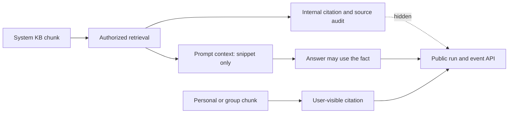

# Ambient System Knowledge and User-Visible Provenance

## Symptom

A normal chat user could not list or manage a system knowledge base, but a successful conversation run still returned its citation. The response exposed the system knowledge-base ID, document ID, chunk ID, filename, page, and snippet.

## Root cause

Authorization and presentation were treated as the same boundary. The chunk was correctly authorized for ambient answer generation, so the generic citation serializer treated it like an ordinary personal or group source.

A second leak path existed before serialization: the provider prompt received system provenance fields. Even if structured citations were filtered later, the model could repeat those fields in prose.

## Rejected fixes

- **Exclude system chunks from retrieval:** this would remove the intended ambient knowledge behavior.
- **Delete system citation rows:** this would destroy useful internal provenance and auditability.
- **Hide only the frontend citation card:** the same data would remain visible in the network response and replay endpoints.
- **Filter only the immediate run response:** refetched run details and persisted event payloads would still disclose the source.

## Fix

1. Keep system chunks in retrieval and answer composition.
2. Reduce their provider context to snippet text only; omit title, KB/document/chunk IDs, filename, page, and retrieval-source metadata.
3. Tell the provider not to infer or reveal omitted provenance.
4. Keep citation rows and retrieval snapshots internally.
5. Filter system citations at the backend public-serialization boundary for both immediate and replayed run responses.
6. Remove the ambient system knowledge-base count from public run, summary, event, and OpenAPI contracts.
7. Compute public citation/trace counts from visible personal/group citations only.

## Tests

Regression coverage proves that:

- system facts still reach the assistant graph;
- system-only runs return no public citations;
- mixed runs keep personal citations and hide system citations;
- refetched run details and event payloads remain redacted;
- internal system citation rows still exist;
- provider prompts contain the fact but not system provenance.

## Follow-up risks

This is provenance hiding, not information-flow prevention. The model is expected to answer with facts learned from system knowledge, so system KBs must never contain secrets or information that users are not allowed to learn.

A future admin-only audit endpoint may expose internal system provenance, but it must use a separate privileged response contract rather than weakening the user-facing serializer.

## Revision history

- 2026-08-12: Created learning log for `Ambient System Knowledge and User-Visible Provenance`.
