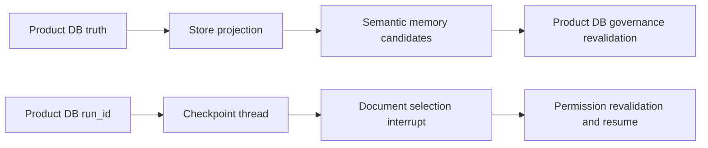

# LangGraph Checkpointer와 Store의 역할 분리

## 핵심 구분

LangGraph persistence는 하나의 저장소 기능이 아니라 서로 다른 두 문제를 풉니다.

| 구성요소 | 범위 | 이 프로젝트에서의 역할 |
| --- | --- | --- |
| Product DB | product lifecycle | transcript, run, citation, permission, consent, audit의 source of truth |
| Checkpointer | 한 run의 graph execution | document selection에서 멈추고 같은 run을 재개하는 임시 state |
| Store | 여러 run 사이의 application data | active memory를 의미 기반으로 찾는 rebuildable projection |

## 왜 conversation_id가 아니라 run_id인가

`conversation_id`를 checkpoint thread로 사용하면 Product DB에 이미 있는 transcript가 graph state에
다시 누적됩니다. 두 저장소가 서로 다른 history를 가지기 쉽고 checkpoint 크기도 계속 증가합니다.
`run_id`를 쓰면 checkpoint는 한 번의 실행을 재개하는 데 필요한 state에만 머뭅니다.

## Interrupt의 중요한 실행 규칙

`interrupt()`가 있던 node는 resume할 때 함수 처음부터 다시 실행됩니다. 따라서 interrupt 앞에는
insert, 외부 API 요청, artifact 생성 같은 비멱등 side effect를 두지 않습니다. 이번 document
selection node는 checkpoint된 option을 보여 주고 선택 ID를 받기만 하며, 실제 retrieval은 다음
node에서 현재 권한을 다시 확인한 뒤 실행합니다.

## Store reconciliation

Store는 canonical memory database가 아닙니다. Product DB의 active, non-sensitive, non-stale row만
namespace/key/hash가 안정적인 Store item으로 투영합니다. Recall은 Store가 찾은 memory ID를 Product
DB에서 다시 검증합니다. 따라서 Store deletion이 잠시 실패해도 stale/deleted memory가 prompt에
들어가지는 않습니다. Dry-run reconciliation은 missing/stale/orphan count를 비교하고 `--apply`가
idempotent upsert/delete로 drift를 수리합니다.

## 운영상 한계

Checkpointer는 background worker가 아닙니다. 기다리는 run을 process restart 뒤에 재개할 수는 있지만,
죽은 process의 실행을 스스로 예약하거나 OpenAI 호출을 exactly-once로 만들지는 않습니다. 완료, 실패,
취소된 run의 checkpoint는 즉시 삭제하고 waiting run만 제한 시간 동안 보관합니다.

## Revision history

- 2026-08-17: PostgresSaver, PostgresStore projection, document-selection HITL 도입 내용을 최초 정리.
