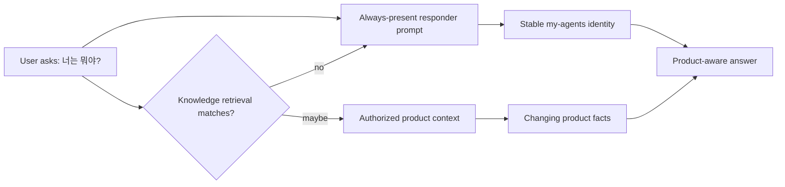

# Product identity belongs in the always-present responder prompt

## Symptom

In production, a user asked the assistant about itself and received an answer that described `my-agents` as a separate third-party project. The answer could also expose the internal Vercel deployment alias instead of the canonical product domain.

## Root cause

The response provider's always-present system prompt described only implementation infrastructure: a backend-only FastAPI and LangGraph component. It did not establish that the assistant runs *inside* the `my-agents` product.

System knowledge could not reliably repair this behavior. Retrieval is query-dependent, so a short identity question such as `너는 뭐야?` may not retrieve a relevant chunk. Even when a product document is retrieved, the model can reasonably interpret it as reference material about another project.

The durable separation is:

- **System prompt:** stable identity, canonical domain, language behavior, and behavioral boundaries.
- **Retrieved context:** product details that can change, including features, supported formats, and authorship facts.

## Rejected fixes

- **Rely only on the system knowledge base:** rejected because retrieval is not guaranteed for short identity questions and retrieved documents may look third-party.
- **Add product identity to retrieval or metadata-enrichment prompts:** rejected because those prompts serve internal classification/enrichment tasks; product persona would bias structured outputs.
- **Hardcode all product capabilities in the system prompt:** rejected because capabilities change and would make the prompt stale.
- **Use a `vercel.app` URL:** rejected because it is an internal deployment alias, not the canonical public product identity.

## Fix

Only `my_agents/agents/general_assistant/responders.py` receives the stable product identity:

- the assistant is inside `my-agents`;
- the canonical URL is `https://my-agents.dev`;
- references such as "this service", "here", and "this app" refer to `my-agents`;
- changing product facts must come from provided authorized context rather than guesses;
- citations may use only user-visible source details;
- Korean is primary, while the assistant still matches the user's language;
- the existing route-metadata and no-fake-specialist boundary remains intact.

The classifier and metadata-enrichment system prompts are intentionally unchanged.

## Verification

A focused offline response-provider test inspects the first `SystemMessage` and asserts the stable identity, canonical domain, context-grounding rule, language rule, and specialist boundary. It also asserts that the obsolete `backend-only` identity and `vercel.app` alias are absent.

The repository-level URL audit found the Vercel alias only in a dated production smoke-evidence document. It is retained there as historical evidence, not active runtime copy, email copy, or current setup guidance.

## Follow-up risks

- Prompt assertions prove the provider input, not the exact prose a probabilistic model will produce. A production identity smoke test should be run after deployment.
- The canonical domain is intentionally stable prompt identity. If the public product domain changes, update the prompt and its regression test together.
- Product-context retrieval quality still determines how accurately changing feature questions are answered.

## Revision history

- 2026-08-12: Created learning log for `Product identity belongs in the always-present responder prompt`.
