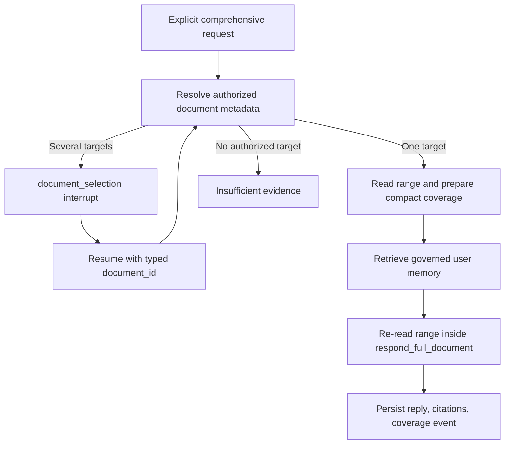

# Full-document retrieval: coverage, authorization, and checkpoint safety

Ranked retrieval and full-document retrieval solve different problems.

- Semantic/vector and keyword search answer: “Which passages are most relevant?”
- Full-document retrieval answers: “Did the agent inspect every part of the requested
  document?”

A few excellent chunks may still miss a requirement in an unrelated section. Conversely,
injecting an entire file for every question is slower, more expensive, and harder to secure.
The implementation therefore keeps ranked retrieval as the default and adds an explicit
comprehensive-document path.

## 0. Tool choice is model judgment; execution is application authority

The RAG Agent now has one deliberately narrow model-backed responsibility. After the General
Assistant decides that private knowledge is relevant, fixed `gpt-5.6-luna` in standard mode
with low reasoning effort chooses one typed operation:

- `search_authorized_chunks` for focused facts, sections, and ordinary summaries;
- `read_authorized_document_comprehensively` for explicit or clearly implied exhaustive work.

This is not permission delegation. Luna receives the user task and bounded recent conversation,
but does not receive trusted document IDs or raw full-document text during tool selection. The
backend still resolves the target, revalidates owner/group/explicit-document access, excludes
ambient system knowledge, enforces character limits, and owns HITL. The final answer remains a
Sol response-provider responsibility.

The reasoning setting is fixed rather than inherited from the user. `low` is the initial balance
for multilingual nuance and negation without turning a two-tool decision into a deep reasoning
task. Deterministic mode stays offline, and invalid tool output or provider failure falls back to
the same composed semantic rule. This makes the natural Korean regression request—named document
+ `빠짐없이` + review/summarize task—comprehensive without treating a generic “explain everything”
request as a document read.

## 1. Intent is part of the safety boundary

The graph enters this path only when both conditions are true:

1. the source-selection gate chose `knowledge_base`;
2. the prompt contains both a completeness hint and a document task.

Examples that activate it include “review the entire document and identify every
requirement” and “문서 전체를 빠짐없이 검토해줘.” “Summarize this document” stays on the
normal ranked-retrieval path. A weak semantic/BM25 result does not silently escalate to a
full read.

This explicit gate matters because comprehensive reading has a larger context and latency
cost. It also makes the product promise honest: the response can claim whole-document
coverage only when the graph deliberately took the coverage path.

## 2. The graph resolves identity before loading text



Resolution works from metadata first. It accepts the exact selected/replayed document, the
only eligible document, or one unique normalized title/source-filename match. If several
documents remain, it reuses the existing versioned `document_selection` interaction. The
resume answer is authorized again before reading any body text.

“Eligible” is deliberately narrower than ordinary ambient retrieval. It includes currently
authorized user-controllable personal/group documents, including explicit document read
grants, within the selected KB scope. System KBs and their documents are excluded from
automatic targets and selection options, even though ambient system knowledge can still
support normal answers.

## 3. Complete and partial are different claims

The service reads `DocumentModel.content`, which is normalized extracted text rather than
the original PDF/DOCX bytes. A read result uses a half-open character range:

```text
[start_offset, end_offset)
```

With default settings:

- `total_chars <= 24_000` reads the whole current text and reports `mode=complete`;
- a larger document reads `[0, 12_000)` and reports `mode=partial`;
- the service calculates an internal canonical-decimal next cursor but does not expose it
  in the V1 public response.

The public `document_coverage` contains document identity, title/source filename,
start/end offsets, and total characters. Citations come only from authorized chunks that
overlap the range. A partial response receives a deterministic Korean or English notice
before the generated answer, so it cannot pretend to be a complete review.

The limits are characters, not model tokens. They provide deterministic application bounds,
but they do not predict provider token usage exactly.

## 4. Why the body is read twice

`prepare_full_document_read` first checks that authorized text and valid overlapping chunk
provenance exist. It then places only compact metadata, IDs, and coverage in graph state and
clears `retrieved_context`.

`respond_full_document` revalidates authorization and reads the same range again immediately
before composition. The raw range is passed as a local response-provider override and is
never returned as node state. LangSmith tracing is disabled around that provider call.

This design keeps four persistence/diagnostic boundaries distinct:

| Boundary | What it keeps | What it excludes |
| --- | --- | --- |
| LangGraph checkpoint | selected document ID, coverage, citation IDs, internal cursor | normalized document body |
| Product DB event | `full_document_read` mode, document metadata, offsets, total chars, latency | body and internal cursor |
| Application full-body log path | compact graph/retrieval metadata | full-body provider override |
| Provider tracing | disabled for this response call | body-bearing trace |

Existing opt-in DEBUG retrieval logging can still show its normal bounded 240-character
citation-chunk previews. That is not the full-body override and should not be confused with
storing an entire document.

## 5. Provenance is checked against the current revision

Offsets belong to the current normalized `DocumentModel.content`; they are not permanent
coordinates in the original upload. The service verifies that overlapping chunks have valid
offsets and still match the current content. It also rechecks the prepared start/end/total
values before composing.

This avoids confidently citing stale chunks, but it is not document versioning. There is no
durable content revision or hash in the coverage contract yet. If body/chunk provenance has
drifted, if more than 100 chunks overlap one read, or if the document becomes unavailable,
the graph returns insufficient evidence instead of producing an uncited comprehensive
answer.

## 6. Streaming and replay preserve the honest claim

Full-document provider tokens are buffered. For a partial read, the backend first prepends
the deterministic coverage notice and only then emits `answer_delta`; concatenated deltas
equal `run_completed.reply`. A typed `full_document_read` event is emitted before
`answer_composed`, and run detail reconstructs `document_coverage` from that safe event.

Replay reads the original `full_document_read` event and preselects that exact document. If
the target was deleted or authorization was revoked, replay warns that the source is
unavailable and does not substitute another document that happens to be accessible later.
This is replay fidelity: regenerate from the same source boundary or disclose that it cannot
be reproduced.

## 7. What remains for true large-document coverage

The current large-document path is intentionally one bounded first range. It does not yet:

- loop through every continuation cursor;
- keep a range-by-range coverage ledger and intermediate summaries;
- synthesize those summaries into a final whole-document result;
- estimate provider-aware token budgets;
- bind coverage offsets to a durable document revision/hash.

Those steps are the next milestone. Until they exist, `partial` is a meaningful product
contract, not a temporary implementation detail that the UI or responder may hide.

## Revision history

- 2026-08-24: Created after implementing the explicit-intent bounded full-document retrieval path; updated when that semantic gate became baseline behavior and when Luna-backed typed retrieval-tool selection replaced literal phrases as the OpenAI-mode decision boundary.
