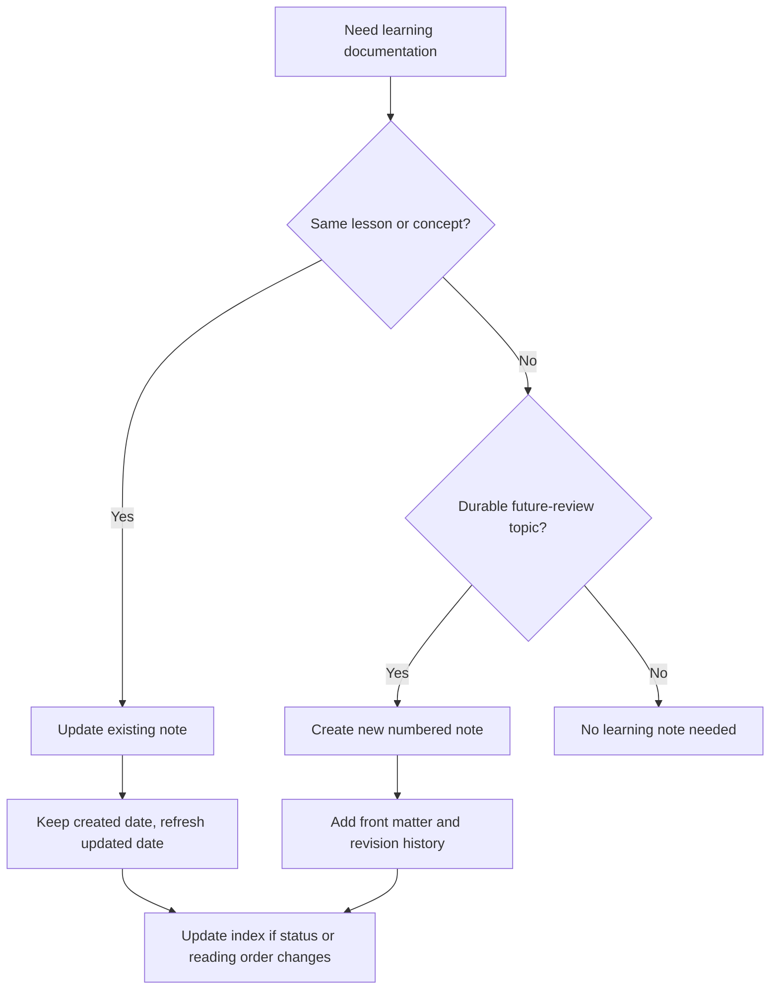

# Learning notes

These notes explain the backend from a learner's point of view. They are also a durable review trail for future maintenance.

Start here:

1. [Current backend walkthrough](./01-current-backend-walkthrough.md)
2. [Debug note: OpenAI web search returned no final text](./02-debug-openai-web-search-empty-response.md)
3. [SQLAlchemy, Postgres, and Alembic](./03-sqlalchemy-postgres-alembic.md)
4. [FastAPI dependencies and Principal with React analogies](./04-fastapi-dependencies-and-principal-with-react-analogies.md)

This directory is the owner's learning path archive. The root numbered notes are personal learning logs. Focused learning tracks can live in subfolders, such as [`agent-lab/`](./agent-lab/). Project architecture docs that are not primarily learning logs live outside this directory, for example [`docs/portfolio-chat-service/`](../portfolio-chat-service/).
4. [Auth lifecycle: email verification and password reset tokens](./04-auth-lifecycle-email-verification-and-password-reset-tokens.md)

## Learning-doc workflow



### When to update an existing file

Update an existing learning note when the change is about the same concept or learning path, for example:

- correcting outdated code paths, commands, or diagrams;
- adding a small explanation to an existing section;
- revising an implementation walkthrough after a refactor;
- adding a new exercise for the same topic.

If the reader would naturally ask, "Is this still the same lesson?", prefer updating the existing file.

### When to create a new file

Create a new learning note when the change introduces a new durable learning topic, for example:

- a new agent folder or graph with its own lifecycle;
- a new architectural concept such as memory, tools, streaming, evaluation, or persistence;
- a new integration that deserves its own setup/debugging guide;
- a decision record that future review should find independently;
- an explanation that would make an existing note too long or unfocused.

If the reader would naturally ask, "Where is the separate lesson for this topic?", create a new file.

### File naming

Use numbered reading-order filenames:

```text
NN-short-topic-slug.md
```

Examples:

```text
01-current-backend-walkthrough.md
02-cli-streaming.md
03-langgraph-memory.md
```

Rules:

- `NN` is the recommended reading order, not the creation date.
- Use lowercase kebab-case for the slug.
- Prefer adding a new number at the end over renumbering old files.
- If a file is replaced, keep the old file unless it is actively harmful; mark it superseded instead.


### Automated personal-log helper

When the owner explicitly wants to save a personal learning log, prefer the helper:

```bash
uv run python scripts/learning_log.py \
  --title "Python syntax catch-up: *, Iterable, and **" \
  --body-file /tmp/learning-note.md \
  --topic python \
  --related-code my_agents/agents/general_assistant/responders.py
```

The helper creates the next numbered personal note, adds front matter and revision history,
and updates this index. Use subfolders for focused learning tracks when a note set should stay separate from the root numbered sequence.

### Required front matter

Every learning note, except this index file, should start with YAML-style front matter:

```markdown
---
created: YYYY-MM-DD
updated: YYYY-MM-DD
status: active
topics:
  - langgraph
related_code:
  - my_agents/agents/general_assistant/graph.py
---
```

Field meanings:

- `created`: the date the note was first added. Treat this as immutable.
- `updated`: the date of the latest meaningful content update.
- `status`: `draft`, `active`, `superseded`, or `archived`.
- `topics`: stable search keywords.
- `related_code`: repo paths that the note explains.
- Optional `superseded_by`: path to the replacement note when status is `superseded`.

Use the current date in `YYYY-MM-DD` format. For example, today is `2026-05-17`.

### Revision history

Every learning note should end with a short revision history:

```markdown
## Revision history

- 2026-05-14: Created initial walkthrough for the v0 backend.
- 2026-05-14: Updated after adding CLI streaming.
```

Keep it brief. It is not a git log replacement; it is a human-readable learning timeline.

### How to confirm when a file was created

Use both sources:

1. Human-facing source: the note's `created` front matter.
2. Git source of truth:

```bash
git log --follow --diff-filter=A --format='%h %cs %s' -- docs/learning/01-current-backend-walkthrough.md
```

If these disagree, trust git for repository history and fix the front matter in the next documentation update.


### Debug/fix log workflow

When debugging reveals a durable lesson, create or update a learning note that records:

- the user-visible symptom;
- the failing command, prompt, or response shape when safe to include;
- the root cause or best current hypothesis;
- why rejected fixes were not the right fix;
- the code change that fixed or mitigated it;
- the tests or checks added;
- future follow-up risks.

Create a new debug note when the failure teaches a reusable agent, LangGraph, OpenAI, tooling, or workflow lesson. Update an existing note when it is the same failure family.

### Maintenance checklist

When changing `docs/learning/`:

- Update this index when adding, superseding, or archiving a note.
- Keep `created` unchanged.
- Update `updated` when content meaningfully changes.
- Add a revision-history bullet for meaningful changes.
- Keep explanations code-linked and honest about current behavior versus future intent.
- Do not use learning notes as a substitute for tests, README updates, or API docs.
