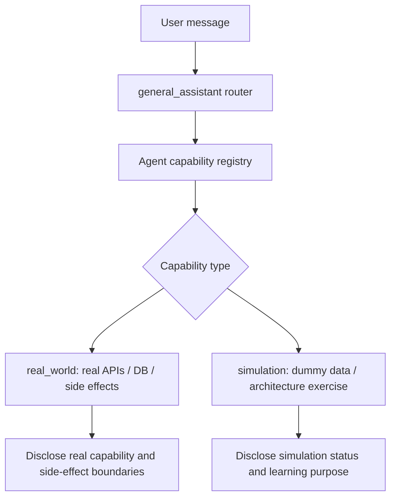

# Agent capability model: real-world agents vs simulated agents

## Concept

This project will support two broad kinds of agent implementations:

1. **Real-world agents**
   - Designed to provide real user value.
   - May call real external APIs, databases, or services.
   - Need stronger safety, auth, secrets, logging, rate limits, and tests around side effects.

2. **Simulated agents**
   - Designed mainly for learning, experimentation, and architecture testing.
   - Usually rely on dummy data, fixtures, toy tools, or bounded synthetic workflows.
   - May use real-looking data, but the purpose is not production usefulness.
   - Useful for trying ReAct, swarm/team routing, orchestration, reflection loops, evaluators, memory patterns, and tool-use protocols.

The `general_assistant` should be able to disclose whether a route points to a real capability or a simulation capability. It should not imply that a simulation agent is production-grade or useful in the real world.

## Why this distinction matters

Route labels alone are not enough. A future route such as `research_helper` could mean either:

- a real agent that calls web search, stores citations, and returns useful sourced answers; or
- a simulation agent that demonstrates a research workflow over fixture documents.

Both are valid learning milestones, but they have different product meaning.



## Recommended metadata

Every concrete agent or agent-team should eventually declare metadata like:

```python
class AgentCapability(BaseModel):
    name: str
    route_label: RouteLabel
    mode: Literal["real_world", "simulation"]
    purpose: str
    tools: list[str]
    data_sources: list[str]
    side_effects: list[str]
    maturity: Literal["toy", "prototype", "product", "production_candidate"]
```

Minimum fields for the next milestone:

| Field | Meaning |
| --- | --- |
| `name` | Stable implementation name. |
| `route_label` | Which router label can use it. |
| `mode` | `real_world` or `simulation`. |
| `purpose` | User-facing explanation. |
| `tools` | Tool names or `[]`. |
| `side_effects` | External writes/calls/charges, or `[]`. |
| `maturity` | Honest implementation maturity. |

## General assistant behavior

The general assistant should:

- know which capabilities are real and which are simulated;
- mention simulation status when relevant;
- avoid claiming production usefulness for simulated agents;
- avoid claiming real external work unless a real-world agent/tool actually ran;
- make route decisions separately from capability maturity;
- preserve deterministic/offline tests for both real and simulated capabilities.

Example wording:

```text
This request maps to the `research_helper` route. In the current build, that capability is a simulation used to test ReAct-style planning over fixture data, so it should not be treated as live research.
```

Or:

```text
This request maps to the `research_helper` route. This route is backed by a real-world web-search tool, so it may call external APIs and should include citations when possible.
```

## Safety implications

Real-world agents need stricter controls:

- auth and user/workspace ownership;
- API key handling;
- rate limits and cost caps;
- idempotency for writes;
- audit logs for side effects;
- explicit confirmation for destructive actions;
- integration tests with mocks;
- clear fallback when credentials are missing.

Simulated agents need honesty controls:

- clearly label dummy or fixture data;
- do not expose simulated results as real facts;
- avoid external side effects by default;
- keep toy architectures isolated from production routes;
- document what architecture pattern is being tested.

## Implementation direction

Do not immediately split the whole graph into many agents just because the taxonomy exists.

Recommended next steps:

1. Add an `AgentCapability` metadata module.
2. Register the current `general_assistant` route as a real but limited capability, or as the root router foundation.
3. Register future experimental agents with `mode="simulation"` by default.
4. Teach response guidance to include capability mode/maturity where relevant.
5. Add tests that prevent simulation agents from claiming real-world usefulness.
6. Only add real-world mode when tools, data, and side-effect boundaries are implemented and tested.

## Decision

Use explicit capability metadata to separate **routing** from **reality level**.

```text
route label        = what kind of request this is
capability mode    = whether the backing implementation is real-world or simulated
maturity           = how reliable/product-ready it is
```

This lets the project support both product capabilities and learning-oriented agent architecture experiments without confusing users or future maintainers.

## Revision history

- 2026-05-15: Created learning log for `Agent capability model: real-world agents vs simulated agents`.
- 2026-05-15: Implemented `AgentCapability` registry and connected capability metadata to the general assistant graph/provider path.
