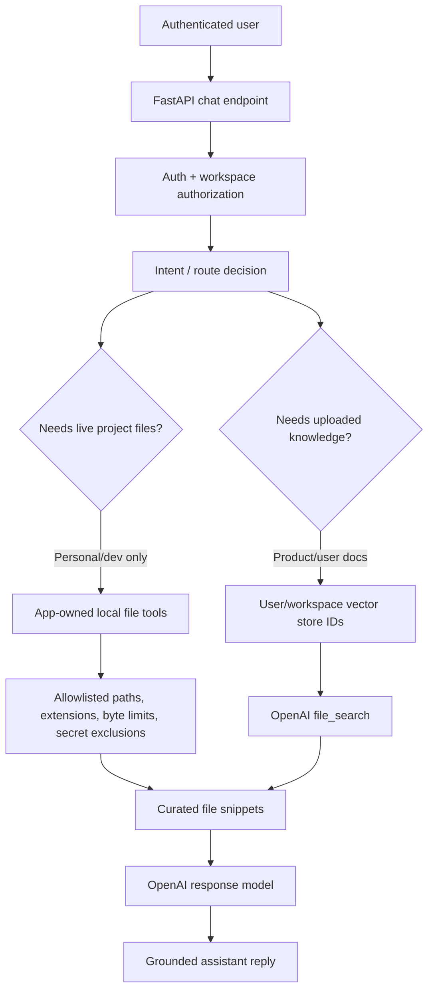

# Architecture decision: local filesystem tools vs OpenAI file search

## Decision

Use a **two-lane retrieval architecture** instead of treating OpenAI `file_search` as a live filesystem browser.

1. **Local project/repo exploration lane**
   - Use app-owned local tools for reading or searching files on the server filesystem.
   - Keep this lane disabled or admin-only in any future hosted product.
   - Scope it with strict allowlists, max file sizes, extension filters, path normalization, and secret-file exclusions.

2. **User/product knowledge-base lane**
   - Use OpenAI `file_search` with vector stores for user-uploaded documents, product docs, notes, PDFs, and durable knowledge bases.
   - Treat vector stores as tenant/user-scoped resources when the product adds auth and personalized services.
   - Store vector store IDs in app-owned user/workspace records; do not hardcode them globally except for local experiments.

In short:

```text
Live local files / repo code       -> app-owned local tools
Uploaded durable user knowledge    -> OpenAI file_search + vector stores
```

## Why this decision

OpenAI `file_search` is a hosted retrieval tool over files that have already been uploaded and indexed. It is not designed to browse arbitrary local paths at request time.

The official docs describe file search as retrieving from a knowledge base of previously uploaded files via semantic and keyword search. They also state that, before using it with the Responses API, a knowledge base must be set up in a vector store and files must be uploaded to it.

The retrieval docs explain why: vector stores are the searchable indices. When a file is added, it is chunked, embedded, and indexed so semantic search can retrieve relevant chunks later.

That makes vector stores appropriate for durable knowledge retrieval, but awkward for live filesystem exploration because local files can change, contain secrets, and require product-specific authorization rules.

## Product-shaped architecture



## Personal-use phase

For the current repo, prefer this sequence:

1. Keep existing web search behavior unchanged.
2. Add a local-only file inspection tool for selected repo paths if the assistant needs to answer codebase questions.
3. Add OpenAI file search later for uploaded notes/docs, not for reading the repo live.
4. Keep deterministic tests by mocking any tool boundaries.

A safe local file tool should:

- only read under configured project roots;
- reject absolute paths outside the allowlist;
- reject `..` traversal after path resolution;
- skip `.env`, keys, credentials, caches, virtualenvs, `.git`, and build artifacts;
- cap bytes per file and total bytes per request;
- return snippets, not arbitrary huge files;
- log enough metadata for debugging without logging secret contents.

## Future product phase

When adding auth and personalized services:

- model user/workspace ownership before attaching tools;
- store vector store IDs per user, workspace, or organization;
- add document ingestion jobs that upload files and update vector stores asynchronously;
- keep raw uploaded files and derived vector indexes governed by retention/deletion policy;
- expose product knowledge search through authorization-aware service methods, not directly through request payloads;
- never let a user provide an arbitrary vector store ID unless the app verifies ownership.

A likely product data shape:

```text
User
  -> Workspace
      -> Document
      -> KnowledgeBase
          -> openai_vector_store_id
```

## Why not only OpenAI file search?

OpenAI file search is useful, but using it as the only retrieval path would create these problems:

- live repo changes require re-uploading/re-indexing before answers are fresh;
- secret filtering must happen before upload, not after retrieval;
- product authorization still needs app-owned user/workspace checks;
- vector store costs and lifecycle need retention management;
- codebase exploration often needs exact grep/path behavior, not only semantic similarity.

## Why not only local tools?

Local tools are useful for the developer's own machine, but they are risky as product features unless heavily scoped. A hosted product should not expose server filesystem reads to normal users. For customer documents, vector-store-backed retrieval is safer and more product-shaped because it searches an intentionally uploaded knowledge base rather than a live runtime filesystem.

## Recommended next milestone

Do **not** add OpenAI file search directly to `general_assistant` as a global always-on tool yet.

Instead, implement the next milestone as:

1. Add a `knowledge_base` design seam in settings and responder/tool selection.
2. Support configured vector store IDs only when explicitly enabled.
3. Add tests proving file search is not bound unless configured.
4. Separately design a local repo inspection tool for personal/dev use.
5. Add auth/workspace ownership before making vector store IDs user-specific.

This keeps the personal assistant useful now while avoiding a product architecture that would later need to be unwound.

## Decision summary

| Need | Recommended mechanism | Product posture |
| --- | --- | --- |
| Search uploaded docs/PDFs/notes | OpenAI `file_search` + vector stores | Good product path |
| Explore current local repo files | App-owned local filesystem tools | Personal/admin-only path |
| Multi-user personalized document search | Per-user/workspace vector stores | Requires auth + ownership checks |
| Arbitrary server filesystem browsing | Do not expose | Unsafe product path |

## Revision history

- 2026-05-15: Created learning log for `Architecture decision: local filesystem tools vs OpenAI file search`.
